### 1 前言说明
#### 1.1 软件介绍
Qt自定义控件是一套纯QtWidget代码编写的自定义控件大全组件，简称quc，是一套和qwt类似的自定义控件插件。不仅控件数量远超qwt以及其他第三方的控件组件，每个控件都有独立的使用demo并且注释详细，非常适合初学者和进阶者。

#### 1.2 目录说明
| 目录     | 说明                                                         |
| :------- | :----------------------------------------------------------- |
| demo     | 目录为单个控件对应的完整的项目，可以独立使用，每个控件demo下都对应一个项目。 |
| designer | 目录为自定义控件的完整源码，默认插件形式，也可改成动态库形式，pro文件中有对应说明。 |
| examples | 目录为整体的示例，通过按钮打开具体控件的示例，依赖于生成好的quc动态库文件。 |

#### 1.3 功能特点
1. 超过196个精美控件并持续不断迭代更新升级，种类超多，控件类型极其丰富。
2. 涵盖了各种仪表盘、进度条、进度球、指南针、曲线图、标尺、温度计、导航条、导航栏，flatui、高亮按钮、滑动选择器、农历、广告轮播、饼状图、环形图、时间轴、拓展控件、增强控件等。
3. 每个类都是独立的一个.h头文件和.cpp实现文件组成，零耦合，不依赖其他文件，方便单个控件独立出来以源码形式集成到项目中，方便直观。
4. 控件数量远超其他第三方控件库比如qwt集成的控件数量，使用方式也比其简单友好零耦合。
5. 支持任意Qt版本，亲测Qt4.6到Qt6.2的所有版本，全部纯Qt编写，QWidget+QPainter绘制。
6. 支持任意编译器，包括但不限于mingw、msvc、gcc、clang等编译器。
7. 支持任意操作系统，包括但不限于windows、linux、mac、android、uos、银河麒麟、各种国产linux、嵌入式linux、树莓派、香橙派、全志H3等。
8. 支持编译生成设计师插件，可直接集成到QtCreator的控件栏中，和自带的控件一样使用，大部分效果只要设置几个属性即可，极为方便。
9. 支持编译生成独立的非插件形式的动态库文件，体积小，比如嵌入式linux不支持designer只需要动态库的形式。
10. 每个控件都有一个单独的完整的使用demo，方便参考学习单个控件使用，非常适合初学者。
11. 提供一个所有控件使用的集成的example，方便快速查看所有控件的效果。
12. 支持直接源码集成到example的方式，方便编译到安卓，for web套件等。
13. 支持编译成wasm文件，直接网页运行，可以在谷歌、火狐、edge等浏览器运行，原生性能。
14. 每个控件的源代码都有详细中文注释，都按照统一设计规范编写，方便学习自定义控件的编写。
15. 每个控件都内置默认配色，demo对应的配色都非常精美。
16. 部分控件提供多种样式风格选择，多种指示器样式选择。
17. 所有控件自适应布局和窗体拉伸变化，自动缩放。
18. 配套额外的自定义控件属性设计器，类似组态设计器，纯中文属性名称，支持拖曳设计，所见即所得，支持导入导出xml格式。
19. 集成fontawesome图形字体+阿里巴巴iconfont收藏的几百个图形字体，享受图形字体带来的乐趣。
20. 所有控件最后生成一个dll动态库文件，可以直接集成到qtcreator中拖曳设计使用。
21. 控件源码全部分门别类存放，pri模块形式集成，提供控件对照表快速查找对应控件和说明。

#### 1.4 编码规范
##### 1.4.1 设计规范
1. 所有命名均为首字母小写，例如setValue；
2. 私有变量及函数不建议使用下划线；
3. 设置用set开头，获取值用get开头；
4. 公共方法和公有槽都要注释，私有的变量和方法建议注释。
5. 方法及变量类似的含义的，可以靠在一起分组，不同分组间空一行。
6. 所有公共方法，函数体超过一行的在头文件中只声明，实现文件中写具体方法。
7. void类型的公共方法全部改为公共槽。

##### 1.4.2 代码格式

| 类别          | 说明                                        |
| :------------ | :------------------------------------------ |
| Q_PROPERTY    | 属性定义，用于生成属性。                    |
| public        | 枚举类型、构造函数、析构函数等。            |
| protected     | 重写的方法，例如paintEvent、eventFilter等。 |
| private       | 私有变量。                                  |
| private slots | 私有槽函数。                                |
| public        | 公共方法。                                  |
| public slots  | 公有槽函数。                                |
| signal        | 信号。                                      |

```c++
#ifndef COLORBUTTON_H
#define COLORBUTTON_H

/**
 * 多样式超级按钮控件 作者:feiyangqingyun(QQ:517216493) 2017-9-24
 * 1. 可设置圆角角度,边框宽度
 * 2. 可设置角标和正文文字内容/字体/对齐方式/颜色
 * 3. 可设置边框颜色,正常颜色,按下颜色
 * 4. 可设置背景图片
 * 5. 可设置按钮颜色模式
 */

#include <QWidget>

#ifdef quc
class Q_DECL_EXPORT ColorButton : public QWidget
#else
class ColorButton : public QWidget
#endif

{
    Q_OBJECT
    Q_ENUMS(ColorMode)
    Q_ENUMS(TextAlign)
    Q_PROPERTY(int borderRadius READ getBorderRadius WRITE setBorderRadius)
    Q_PROPERTY(int borderWidth READ getBorderWidth WRITE setBorderWidth)
    Q_PROPERTY(QColor borderColor READ getBorderColor WRITE setBorderColor)

    Q_PROPERTY(bool showSuperText READ getShowSuperText WRITE setShowSuperText)
    Q_PROPERTY(QString superText READ getSuperText WRITE setSuperText)
    Q_PROPERTY(QFont superTextFont READ getSuperTextFont WRITE setSuperTextFont)
    Q_PROPERTY(TextAlign superTextAlign READ getSuperTextAlign WRITE setSuperTextAlign)
    Q_PROPERTY(QColor superTextColor READ getSuperTextColor WRITE setSuperTextColor)

    Q_PROPERTY(QString text READ getText WRITE setText)
    Q_PROPERTY(QFont textFont READ getTextFont WRITE setTextFont)
    Q_PROPERTY(TextAlign textAlign READ getTextAlign WRITE setTextAlign)
    Q_PROPERTY(QColor textColor READ getTextColor WRITE setTextColor)

    Q_PROPERTY(QColor normalColor READ getNormalColor WRITE setNormalColor)
    Q_PROPERTY(QColor pressedColor READ getPressedColor WRITE setPressedColor)

    Q_PROPERTY(bool canMove READ getCanMove WRITE setCanMove)
    Q_PROPERTY(QPixmap bgImage READ getBgImage WRITE setBgImage)
    Q_PROPERTY(ColorMode colorMode READ getColorMode WRITE setColorMode)

public:
    enum ColorMode {
        ColorMode_Normal = 0,       //松开按下两种颜色
        ColorMode_Replace = 1,      //按下松开颜色上下交替
        ColorMode_Shade = 2         //按下松开颜色渐变交替
    };

    enum TextAlign {
        TextAlign_Top_Left = 0,     //顶部左侧
        TextAlign_Top_Center = 1,   //顶部居中
        TextAlign_Top_Right = 2,    //顶部右侧
        TextAlign_Center_Left = 3,  //中间左侧
        TextAlign_Center_Center = 4,//中间居中
        TextAlign_Center_Right = 5, //中间右侧
        TextAlign_Bottom_Left = 6,  //底部左侧
        TextAlign_Bottom_Center = 7,//底部居中
        TextAlign_Bottom_Right = 8  //底部右侧
    };

    explicit ColorButton(QWidget *parent = 0);

protected:
    void mousePressEvent(QMouseEvent *);

protected:
    bool eventFilter(QObject *watched, QEvent *event);
    void paintEvent(QPaintEvent *);
    void drawBg(QPainter *painter);
    void drawText(QPainter *painter);

private:
    int borderRadius;           //圆角半径
    int borderWidth;            //边框宽度
    QColor borderColor;         //边框颜色

    bool showSuperText;         //显示角标
    QString superText;          //角标文字
    QFont superTextFont;        //角标文字字体
    TextAlign superTextAlign;   //角标文字对齐方式
    QColor superTextColor;      //角标文字颜色

    QString text;               //文字
    QFont textFont;             //文字字体
    TextAlign textAlign;        //文字对齐方式
    QColor textColor;           //文字颜色

    QColor normalColor;         //正常颜色
    QColor pressedColor;        //按下颜色

    bool canMove;               //是否能移动
    QPixmap bgImage;            //背景图片
    ColorMode colorMode;        //背景色模式

    bool isPressed;             //是否按下

public:
    int getBorderRadius()       const;
    int getBorderWidth()        const;
    QColor getBorderColor()     const;

    bool getShowSuperText()     const;
    QString getSuperText()      const;
    QFont getSuperTextFont()    const;
    TextAlign getSuperTextAlign()const;
    QColor getSuperTextColor()  const;

    QString getText()           const;
    QFont getTextFont()         const;
    TextAlign getTextAlign()    const;
    QColor getTextColor()       const;

    QColor getNormalColor()     const;
    QColor getPressedColor()    const;

    bool getCanMove()           const;
    QPixmap getBgImage()        const;
    ColorMode getColorMode()    const;

    QSize sizeHint()            const;
    QSize minimumSizeHint()     const;

public Q_SLOTS:
    //设置边框圆角角度
    void setBorderRadius(int borderRadius);
    //设置边框宽度
    void setBorderWidth(int borderWidth);
    //设置边框颜色
    void setBorderColor(const QColor &borderColor);

    //设置是否显示角标
    void setShowSuperText(bool showSuperText);
    //设置角标文字
    void setSuperText(const QString &superText);
    //设置角标文字字体
    void setSuperTextFont(const QFont &superTextFont);
    //设置角标文字对齐方式
    void setSuperTextAlign(const TextAlign &superTextAlign);
    //设置角标文字颜色
    void setSuperTextColor(const QColor &superTextColor);

    //设置文字
    void setText(const QString &text);
    //设置文字字体
    void setTextFont(const QFont &textFont);
    //设置文字对齐方式
    void setTextAlign(const TextAlign &textAlign);
    //设置文字颜色
    void setTextColor(const QColor &textColor);

    //设置正常颜色
    void setNormalColor(const QColor &normalColor);
    //设置按下颜色
    void setPressedColor(const QColor &pressedColor);

    //设置是否可以移动
    void setCanMove(bool canMove);
    //设置背景图片
    void setBgImage(const QPixmap &bgImage);
    //设置颜色模式
    void setColorMode(const ColorMode &colorMode);

Q_SIGNALS:
    void clicked();
};

#endif // COLORBUTTON_H
```

##### 1.4.3 精美颜色

| 颜色     | 颜色值                                                     |
| :------- | :--------------------------------------------------------- |
| 淡绿色   | #28C0C6                                                    |
| 天蓝色   | 100, 184, 255   52, 152, 219  33, 183, 232   103, 202, 223 |
| 淡红色   | 255, 107, 107   231, 76, 60   245, 102, 118  249, 126, 129 |
| 淡绿色   | 24, 189, 155    26, 188, 156  1, 174, 103    131, 211, 182 |
| 褐黑色   | 97, 117, 118    52, 73, 94                                 |
| 淡背景色 | 211, 236, 255  199, 229, 255                               |

​	

#### 1.5 使用说明
1. 编译后quc动态库(quc.dll、libquc.so)和examples.exe可执行文件生成在源码下的bin目录。demo下的单个控件的使用示例生成文件放在demo文件夹下的bin目录。
2. 运行效果建议双击examples.exe看整体的效果。
3. 源码建议从demo目录下单个单个控件学习。
4. 建议直接打开quc.pro进行编译所有项目，如果只希望编译examples，记得要先编译designer再编译examples，因为examples依赖designer生成的动态库。
5. 如果是msvc编译器，可能会在编译过程中中断，比如先编译好designer后生成了动态库文件，但是接着自动编译examples会提示错误，此时只需要再次单击编译即可。
6. 如果想集成到qtcreator中，记得编译release版本，先确定对应qtcreator版本所用的qt版本和编译器版本(特别需要注意位数，creator默认是32位的)是否一致，必须一致才能保证集成成功，Qt集成开发环境安装的Qtcreator默认是msvc编译器编译的，这点务必注意，如果你用的是mingw编译器，肯定不能集成到Qtcreator中。将quc.dll或者libquc.so放到QtCreator\bin\plugins\designer目录即可。如果是集成的qtcreator则对应目录为Qt5.7.1\Tools\QtCreator\bin\plugins\designer。linux上集成的qtcreator则对应目录为/opt/Qt5.10.1/Tools/QtCreator/lib/Qt/plugins/designer，强烈不建议初学者进行此步尝试，需要很多年功力才行。
7. 如果想直接把拖过去进行开发编译，默认肯定会报错，因为找不到插件和头文件，你需要参照sdkdemo的写法进行，无非就是将你用到的插件和对应控件的头文件复制到项目目录下引用即可（这不是说本控件有这个要求，任何第三方的动态库形式的c++库，都是这种模式，都需要手动指定头文件路径和依赖库的路径，并不仅限于Qt，这是编程常识）。当然如果为了偷懒你可以将所有的控件的头文件复制过来也没有问题。
8. 一般来说用QtCreator的插件形式进行开发，你需要编译两套动态库，一套是QtCreator的，一套是对应构建套件的，都需要用对应的Qt版本+编译器版本+位数完全一致编译才行。QtCreator对应的动态库是为了集成到设计师中方便拖曳设计使用，而构建套件对应的库是为了编译使用，两者不可混淆，当然也有可能你的构建套件刚好和你的QtCreator版本完全一致，这样就只要一套。
9. 如果只是学习控件如何写，designer\plugin目录下的源码文件可以不用看，都是用于生成控件组需要的文件。
10. 如果对在designer中能看到控件而在qtcreator中看不到的疑问，可以参考配套的这篇文章：https://blog.csdn.net/feiyangqingyun/article/details/53667460
11. 整个项目代码量比较大，编译过程比较耗时，如果是mingw编译器建议开启多线程编译，配置高的电脑一般在3分钟左右，配置差的一般在半个小时左右才能编译完成。
12. 如果在代码中看到#pragma execution_character_set("utf-8")，这个是用来防止MSVC编译器乱码的，如果不使用MSVC编译器则可以移除。
13. 部分控件使用了图形字体，图形字体文件也已经内置到控件中，如果想要更换成其他图标，可以参照图形字体对照表。
14. 如果觉得编译时间过长，可以打开quc.pro将demo那行注释掉，demo中的子项目特别多，需要编译很久。
15. 有些linux系统比如新支点系统或者树莓派的本地系统，很可能是阉割过的Qt版本，可能没有svg、designer、webengine等模块。
16. 如果选择用vs进行编译，建议分开编译，比如先打开demo.pro 编译，然后打开designer.pro编译，最后打开examples.pro编译，由于文件数量比较多可能vs导入pro文件比较慢，请耐心等待。
17. 默认designer编译生成的是插件形式的动态库，可以集成到Qt设计师中，如果想要生成不带插件形式的动态库，则将designer.pro文件中的 DEFINES += plugin 注释即可。一般嵌入式开发板上不需要插件而是直接使用常规的动态库。
18. 自定义控件也支持样式表设置，比如Q_PROPERTY设置的属性都可以，举例 setStyleSheet("NavListView{qproperty-lineColor:#FF0000;}")
19. 如果在linux系统上比如树莓派编译提示 Unknown module(s) in QT:designer 则表示环境没有designer模块，需要手动安装下。
apt-get install libqt5designer5
apt-get install qttools5-dev 

#### 1.6 特别说明
1. **郑重声明：未经本人许可不可将本项目源码扩散，如有发现本人将追究法律责任，谢谢配合。**
2. 控件对照表中的控件名称和描述可能和实际的会有极小出入，时间上来不及更新，实际的数量肯定》=对照表。

3. 标题栏统计的控件数量》左侧导航栏显示的数量，因为有部分控件是合并在一起作为一个demo演示的。

   | 说明                        | 类名                                                         |
   | :-------------------------- | :----------------------------------------------------------- |
   | 滑动选择器合并了3个         | tumblerdate、tumblertime、tumblerdatetime                    |
   | 颜色下拉框合并了2个         | combobox、colorcombobox                                      |
   | 动画图片按钮合并了2个       | animationbutton1、animationbutton2                           |
   | 自定义农历面板控件合并了2个 | lunarcalendaritem、lunarcalendarwidget                       |
   | 手机通讯录集成了多个        | 字母导航TelLetter、按钮导航TelButton、自定义滚动条ScrollBar、通讯录面板TelPanel |

#### 1.7 版本说明

**V20210531**
1. 全部支持Qt6，做了大量的代码兼容和调整。

**V20210425**
1. 重大版本改进，example目录的窗体全部从demo目录取，这样就只要管理一套demo代码就行。
2. 所有控件和demo都分类分目录存储，方便统一管理。
3. 新增飞控套件。
4. 新增分页导航控件。

**V20191010**
1. 修正生成插件debug版本自动加上字母d。
2. 所有控件头文件全部改成了支持编译成不带插件的动态库，这样方便支持嵌入式linux。
3. 大部分类增加了对Qt6的支持，所有类还没全部搞定。
4. 修复百分比显示的控件，最小值为负数时候的BUG，精确计算方法是 (value - minValue) / (maxValue - minValue) * 100.0 。
5. demo目录，designer目录等全部分类存放。
6. 新增custom目录用于存放高级自绘控件。
7. 将combobox控件改成了xcombobox。

**V20191001**
1. 新增通用拖动类
2. 新增无边框窗体类
3. 新增可输入仪表盘
4. 新增探探雷达控件
5. 新增水波效果控件
6. 自定义环形图增加透明度属性
7. 新增圆弧进度条控件
8. 新增光晕日历控件。
9. 新增提示进度条控件
10. 新增光晕进度条控件
11. 新增光晕时钟控件
12. 修正所有setRange的控件，当前值小于最小值和大于最大值定位不准确的BUG。
13. 对多个控件增加默认初始元素值，以便设计的时候直接可以看到效果。

**V20190915**
1. 新增代码生成器工具，用于生成控件的插件文件。
2. 新增可编辑仪表盘控件。
3. 修正个别控件在linux上Qt4版本编译出问题的BUG。
4. 修复部分控件在Qt4.6编译通不过的BUG，在XP上亲测。
5. 修复setScaleMajor和setScaleMinor不能为0的BUG。
6. 修正gaugespeed控件当圆环比例超过100时候的BUG。

**V20190825**
1. 新增饼图控件。
2. 新增环形图控件。
3. 属性设计器新增选择插件文件功能，可以选择自己写的插件。
4. 属性设计器去除pro中无关的依赖，使得可以独立编译运行。
5. 属性设计器修正修改坐标位置和尺寸，控件不会改变的BUG。
6. 属性设计器增加英文属性自动转换映射成中文属性。

**V20190331**
1. 新增GIF录屏控件。
2. 新增自定义多边形控件。
3. 新增自定义摇杆控件。
4. 新增X系列控件，比如xslider+xlistwidget等。

**V20180915**
1. 新增了描点跟随窗体控件。
2. 新增超级图片轮播控件。
3. 新增蚂蚁线控件。
4. 新增云台仪表盘控件。
5. 新增导航按钮组控件。
6. 新增流式布局控件。
7. 新增Qt自带demo中的控件。
8. 修正部分BUG。
9. 纠正图形字体重复加载的BUG，先判断是否存在该字体，存在则不加载。

**V20180815**
1. 重新分组分类。
2. 修正头文件注释文字最小化写成最大化的错误。
3. 树状导航控件新增父节点子节点前景色背景色设置和各种牛逼的功能，超级强大。
4. 新增定制控件PLM仪表盘。
5. 头文件移动到include目录。
6. 整体demo导航主界面重写。
7. 新增平铺背景控件。
8. 新增魔法水滴控件。
9. 新增鱼儿游动demo。
10. 所有仪表盘等控件demo设置默认值88。
11. 新增多彩仪表盘控件。
12. 将Qt4时代的demo中的矢量图等控件整合成一个frmdemo,修改代码以便支持Qt5。

**V20180715**
1. 新增魔法鱼控件。
2. 新增魔法老鼠控件。
3. 新增防区设备控件。
4. 去除所有flatui引用，使得耦合度低，目前只剩flatui和wkslider保留了对flatui的引用。
5. 修正部分BUG。

**V20180520**
1. 将所有单例模式改为智能指针，自动释放资源。

**V20171220**
1. sin cos标准函数全部改为qSin qCos。
2. 水波进度增加反向波浪属性。
3. 滑动选择器增加单击识别。
4. 新增气泡提示滑动条控件。
5. 新增导航按钮控件。
6. 新增飞机姿态仪表盘控件。

**V20171205**
1. 增加农历控件。
2. 修正绘制圆角BUG。
3. 改进demo为代码设置属性，之前为设计师设计。
4. 矫正指南针仪表盘数字偏移。
5. 将部分drawText改为drawValue，描述更准确。
6. 修正部分BUG。

**V20171121**
1. 完善部分控件源码。
2. 完善部分控件使用demo。
3. 增加迷你仪表盘控件。

**V20171119**
1. 字体相关设置全部改为按照像素设置。这样可以适应各种分辨率。
2. 修正部分BUG。
3. 增加部分控件。

**V20171020**
1. 增加面板元素控件。
2. 增加颜色按钮面板、颜色选取面板、颜色滑块面板三个控件。

**V20171015**
1. 改进百分比进度条算法，增加边框突出选项，使之更完美。

**V20170910**
1. 新增声音数据波形显示控件。
2. 新增样式颜色选择控件。
3. 波浪控件新增圆柱风格。

**V20170822**
1. 增加水波进度球控件。
2. 调整所有字体设置，所有负数范围值设置。
3. 新增范围选择条控件。

**V20170811**
1. 增加IP地址控件。
2. 增加日期时间滑动选择器控件。

### 2 SDK使用
#### 2.1 前提说明
提供给只有动态库文件的使用者，如果是已经购买源码则请忽略本节。

#### 2.2 版本说明
1. sdk分带日期的目录，建议用新版本。
2. 其他文件夹为对应日期的版本，而且同时提供了debug和release的动态库。
3. 头文件请使用对应文件夹下的头文件，因为控件一直在升级完善。
4. 强烈推荐使用最新版，目前共163个控件。
5. 理论上小版本向上向下兼容的，比如5.12.3的dll可以放到5.12.0中使用。

#### 2.3 目录说明
1. sdk目录下的include文件为控件对应的头文件。
2. sdk目录为各个Qt版本对应的动态库文件。
3. sdkdemo目录为演示如何调用动态库文件。
4. snap目录为各个控件的运行效果图，一直更新。

#### 2.4 使用说明
1. 第一步：前提是qt版本、编译器类型、编译器版本、编译器位数必须完全一致。
2. 第二步：找到qt安装目录的库所在的bin目录，同级有个plugins文件夹，plugins文件夹下有个designer目录，将对应插件文件例如 quc_5_7_0_msvc2013_32.dll 放到此目录即可。
3. 第三步：双击bin目录下的designer.exe，打开提供的demo.ui，即可看到效果。或者新建个空白UI然后从左边的控件栏里面拖动过去。
4. 如果想集成到qtcreator中，则必须保证你下载的库版本必须和你的qtcreator所用的qt版本+编译器+位数完全一致才行，很可能集成安装包中的qtcreator版本是上一个qt版本编译的，这样是无法集成进去的，推荐用qt5.12.3这个集成安装包，如果你是msvc编译器那是可以顺利集成进去的。
5. windows系统上Qt Designer设计师动态库存放的地址一般是 C:\Qt\Qt5.15.2\5.15.2\mingw81_64\plugins\designer，Qt Creator动态库存放的地址一般是 C:\Qt\Qt5.15.2\Tools\QtCreator\bin\plugins\designer。
6. linux系统上Qt Designer设计师动态库存放的地址一般是 /home/liu/Qt/Qt5.14.0/5.14.0/gcc_64/plugins/designer，Qt Creator动态库存放的地址一般是 /home/liu/Qt/Qt5.14.0/Tools/QtCreator/lib/Qt/plugins/designer。
7. mac系统上Qt Designer设计师动态库存放的地址一般是 /Users/liu/Qt/5.15.2/clang_64/plugins/designer，Qt Creator动态库存放的地址一般是 /Users/liu/Qt/Qt Creator.app/Contents/PlugIns/designer。
8. 非官方使用图文教程 [https://blog.csdn.net/u014779536/article/details/106923566](https://blog.csdn.net/u014779536/article/details/106923566)

#### 2.5 特别说明
1. **动态库和对应的头文件会一直更新完善修复BUG，由于作者精力有限，不保证所有的插件都是最新的，只保证qt_5_7_0_mingw530_32这个版本永远是最新的正确的，为什么选择这个版本，因为5.7.0是最后一个支持XP的版本。谢谢信任和理解。**
2. **务必记得要集成到QtCreator就必须和QtCreator的版本保持一致，要编译项目成功就必须和你使用的构建套件的版本保持一致，比如安装的5.12.3的qt集成开发环境，你需要拷贝qt_5_12_3_msvc2017_32.zip这个下面的dll到对应的目录，而如果你使用的是5.12.3+mingw32编译器的话，在编译sdkdemo的时候需要拷贝qt_5_12_3_mingw730_32.zip这个下面的dll到sdkdemo目录下同文件替换dll，切记qt和qtcreator是两个东西，不一样，一个creator可以加载多个不同的qt构建套件。千万别把QtCreator的dll拷贝到sdkdemo目录。**

### 3 使用说明
#### 3.0 特别提示
每个控件都是两个独立的 .h .cpp 文件组成，头文件公开的公共接口函数都有详细的中文说明，建议核心关心这个中文说明即可，有部分函数使用不明确可以参考使用示例。

#### 3.1 表盘控件-gauge
##### 3.1.1 汽车仪表盘-gaugecar
**运行效果**
 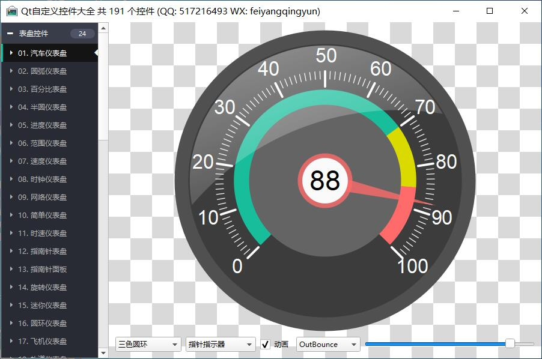

**功能特点**
1. 可设置范围值，支持负数值。
2. 可设置精确度，最大支持小数点后3位。
3. 可设置大刻度数量，小刻度数量。
4. 可设置开始旋转角度，结束旋转角度。
5. 可设置外圆背景、内圆背景、饼圆三种颜色、刻度尺颜色、文字颜色。
6. 自适应窗体拉伸、刻度尺、文字自动缩放。
7. 可自由拓展各种渐变色、各圆的半径。
8. 三色圆环按照比例设置范围角度、用户可以自由设置三色占用比例。
9. 圆环样式可选择三色圆环、当前圆环。
10. 指示器样式可选择圆形指示器、指针指示器、圆角指针指示器、三角形指示器。
11. 可设置中间圆的宽度，以便使用更大数值。

**公共接口**
```cpp
public Q_SLOTS:
    //设置范围值
    void setRange(double minValue, double maxValue);
    void setRange(int minValue, int maxValue);

    //设置最大最小值
    void setMinValue(double minValue);
    void setMaxValue(double maxValue);

    //设置目标值
    void setValue(double value);
    void setValue(int value);

    //设置精确度
    void setPrecision(int precision);

    //设置主刻度数量
    void setScaleMajor(int scaleMajor);
    //设置小刻度数量
    void setScaleMinor(int scaleMinor);
    //设置开始旋转角度
    void setStartAngle(int startAngle);
    //设置结束旋转角度
    void setEndAngle(int endAngle);

    //设置外圆背景颜色
    void setOuterCircleColor(const QColor &outerCircleColor);
    //设置内圆背景颜色
    void setInnerCircleColor(const QColor &innerCircleColor);

    //设置饼圆三种颜色
    void setPieColorStart(const QColor &pieColorStart);
    void setPieColorMid(const QColor &pieColorMid);
    void setPieColorEnd(const QColor &pieColorEnd);

    //设置覆盖圆背景颜色
    void setCoverCircleColor(const QColor &coverCircleColor);
    //设置刻度尺颜色
    void setScaleColor(const QColor &scaleColor);
    //设置指针颜色
    void setPointerColor(const QColor &pointerColor);
    //设置中心圆颜色
    void setCenterCircleColor(const QColor &centerCircleColor);
    //设置文本颜色
    void setTextColor(const QColor &textColor);

    //设置是否显示遮罩层
    void setShowOverlay(bool showOverlay);
    //设置遮罩层颜色
    void setOverlayColor(const QColor &overlayColor);

    //设置中间圆宽度
    void setCircleWidth(int circleWidth);
    //设置饼图样式
    void setPieStyle(const PieStyle &pieStyle);
    //设置指针样式
    void setPointerStyle(const PointerStyle &pointerStyle);

Q_SIGNALS:
    void valueChanged(int value);
```

**使用示例**
```cpp
#pragma execution_character_set("utf-8")

#include "frmgaugecar.h"
#include "ui_frmgaugecar.h"
#include "gaugecar.h"
#include "qpropertyanimation.h"
#include "qvariantanimation.h"
#include "qmetaobject.h"
#include "qdebug.h"

frmGaugeCar::frmGaugeCar(QWidget *parent) : QWidget(parent), ui(new Ui::frmGaugeCar)
{
    ui->setupUi(this);
    this->initForm();
}

frmGaugeCar::~frmGaugeCar()
{
    delete ui;
}

void frmGaugeCar::initForm()
{
    //定时属性动画
    animation = new QPropertyAnimation(ui->gaugeCar, "value");
    animation->setDuration(800);

    //拿到所有动画类型
    QMetaObject metaObject = QEasingCurve::staticMetaObject;
    QMetaEnum metaEnum = metaObject.enumerator(metaObject.indexOfEnumerator("Type"));
    int count = QEasingCurve::NCurveTypes - 1;
    for (int i = 0; i < count; ++i) {
        ui->cboxAnimationType->addItem(metaEnum.key(i));
    }

    //设置默认的动画效果
    ui->cboxAnimationType->setCurrentIndex(ui->cboxAnimationType->findText("OutBounce"));

    ui->horizontalSlider->setValue(88);
    //ui->gaugeCar->setCircleWidth(30);
    ui->ckAnimation->setChecked(true);
    ui->cboxPointerStyle->setCurrentIndex(1);
}

void frmGaugeCar::on_cboxPieStyle_currentIndexChanged(int index)
{
    ui->gaugeCar->setPieStyle((GaugeCar::PieStyle)index);
}

void frmGaugeCar::on_cboxPointerStyle_currentIndexChanged(int index)
{
    ui->gaugeCar->setPointerStyle((GaugeCar::PointerStyle)index);
}

void frmGaugeCar::on_horizontalSlider_valueChanged(int value)
{
    //如果开启了动画则启动属性动画机制
    if (ui->ckAnimation->isChecked()) {
        animation->stop();
        animation->setStartValue(ui->gaugeCar->getValue());
        animation->setEndValue(value);
        animation->start();
    } else {
        ui->gaugeCar->setValue(value);
    }
}

void frmGaugeCar::on_cboxAnimationType_currentIndexChanged(int index)
{
    animation->setEasingCurve((QEasingCurve::Type)index);
}
```

##### 3.1.2 圆弧仪表盘-gaugearc
**运行效果**
 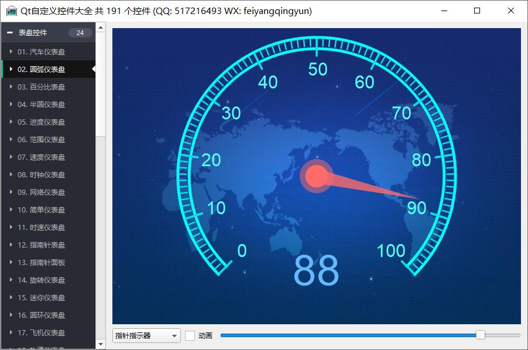

**功能特点**
1. 可设置范围值，支持负数值。
2. 可设置精确度，最大支持小数点后3位。
3. 可设置大刻度数量、小刻度数量。
4. 可设置开始旋转角度、结束旋转角度。
5. 可设置是否启用动画效果以及动画效果每次移动的步长。
6. 可设置外圆背景、内圆背景、饼圆三种颜色、刻度尺颜色、文字颜色。
7. 自适应窗体拉伸、刻度尺、文字自动缩放。
8. 可自由拓展各种渐变色，各圆的半径。
9. 指示器样式可选择圆形指示器、指针指示器、圆角指针指示器、三角形指示器。

**公共接口**
```cpp
public Q_SLOTS:
    //设置范围值
    void setRange(double minValue, double maxValue);
    void setRange(int minValue, int maxValue);

    //设置最大最小值
    void setMinValue(double minValue);
    void setMaxValue(double maxValue);

    //设置目标值
    void setValue(double value);
    void setValue(int value);

    //设置精确度
    void setPrecision(int precision);

    //设置主刻度数量
    void setScaleMajor(int scaleMajor);
    //设置小刻度数量
    void setScaleMinor(int scaleMinor);
    //设置开始旋转角度
    void setStartAngle(int startAngle);
    //设置结束旋转角度
    void setEndAngle(int endAngle);

    //设置是否启用动画显示
    void setAnimation(bool animation);
    //设置动画显示的步长
    void setAnimationStep(double animationStep);

    //设置圆弧颜色
    void setArcColor(const QColor &arcColor);
    //设置刻度尺颜色
    void setScaleColor(const QColor &scaleColor);
    //设置刻度值颜色
    void setScaleNumColor(const QColor &scaleNumColor);
    //设置指针颜色
    void setPointerColor(const QColor &pointerColor);
    //设置文本颜色
    void setTextColor(const QColor &textColor);

    //设置指针样式
    void setPointerStyle(const PointerStyle &pointerStyle);

Q_SIGNALS:
    void valueChanged(int value);
```

**使用示例**
```cpp
#pragma execution_character_set("utf-8")

#include "frmgaugearc.h"
#include "ui_frmgaugearc.h"
#include "gaugearc.h"

frmGaugeArc::frmGaugeArc(QWidget *parent) : QWidget(parent), ui(new Ui::frmGaugeArc)
{
    ui->setupUi(this);
    this->initForm();
}

frmGaugeArc::~frmGaugeArc()
{
    delete ui;
}

void frmGaugeArc::initForm()
{
    //设置背景图片
    ui->widget->setStyleSheet("QWidget#widget{border-image: url(:/image/bg1.jpg);}");

    //设置圆弧颜色
    ui->gaugeArc->setArcColor(QColor(0, 255, 255));
    //设置刻度尺颜色
    ui->gaugeArc->setScaleColor(QColor("#00E5EE"));
    //设置刻度尺值颜色
    ui->gaugeArc->setScaleNumColor(QColor(85, 255, 255));
    //绑定滑块拉动值改变触发圆弧表盘值改变
    connect(ui->horizontalSlider, SIGNAL(valueChanged(int)), ui->gaugeArc, SLOT(setValue(int)));

    ui->horizontalSlider->setValue(88);
    ui->ckAnimation->setChecked(false);
    ui->cboxPointerStyle->setCurrentIndex(1);
}

void frmGaugeArc::on_cboxPointerStyle_currentIndexChanged(int index)
{
    //设置指针样式
    ui->gaugeArc->setPointerStyle((GaugeArc::PointerStyle)index);
}

void frmGaugeArc::on_ckAnimation_stateChanged(int arg1)
{
    ui->gaugeArc->setAnimation(arg1 != 0);
}
```

##### 3.1.3 百分比表盘-gaugepercent
**运行效果**
 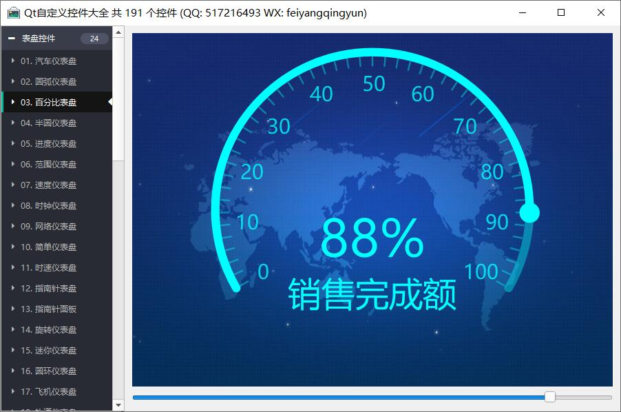

**功能特点**
1. 可设置范围值，支持负数值。
2. 可设置精确度，最大支持小数点后3位。
3. 可设置大刻度数量、小刻度数量。
4. 可设置开始旋转角度、结束旋转角度。
5. 可设置仪表盘的标题。
6. 可设置外圆背景、内圆背景、饼圆三种颜色、刻度尺颜色、文字颜色。
7. 自适应窗体拉伸、刻度尺、文字自动缩放。
8. 可自由拓展各种渐变色、各圆的半径。
9. 可设置百分比模式，自动计算值换算成百分比。

**公共接口**
```cpp
public Q_SLOTS:
    //设置范围值
    void setRange(double minValue, double maxValue);
    void setRange(int minValue, int maxValue);

    //设置最大最小值
    void setMinValue(double minValue);
    void setMaxValue(double maxValue);

    //设置目标值
    void setValue(double value);
    void setValue(int value);

    //设置精确度
    void setPrecision(int precision);

    //设置主刻度数量
    void setScaleMajor(int scaleMajor);
    //设置小刻度数量
    void setScaleMinor(int scaleMinor);
    //设置开始旋转角度
    void setStartAngle(int startAngle);
    //设置结束旋转角度
    void setEndAngle(int endAngle);

    //设置圆弧颜色
    void setArcColor(const QColor &arcColor);
    //设置刻度尺颜色
    void setScaleColor(const QColor &scaleColor);
    //设置刻度值颜色
    void setScaleNumColor(const QColor &scaleNumColor);
    //设置文本颜色
    void setTextColor(const QColor &textColor);
    //设置标题颜色
    void setTitleColor(const QColor &titleColor);
    //设置基准颜色
    void setBaseColor(const QColor &baseColor);
    //设置背景颜色
    void setBgColor(const QColor &bgColor);

    //设置百分比模式
    void setPercent(bool percent);
    //设置标题
    void setTitle(const QString &title);

Q_SIGNALS:
    void valueChanged(int value);
```

**使用示例**
```cpp
#pragma execution_character_set("utf-8")

#include "frmgaugepercent.h"
#include "ui_frmgaugepercent.h"

frmGaugePercent::frmGaugePercent(QWidget *parent) : QWidget(parent), ui(new Ui::frmGaugePercent)
{
    ui->setupUi(this);
    this->initForm();
}

frmGaugePercent::~frmGaugePercent()
{
    delete ui;
}

void frmGaugePercent::initForm()
{
    ui->widget->setStyleSheet("QWidget#widget{border-image: url(:/image/bg1.jpg);}");

    QColor color = QColor(0, 255, 255);
    ui->gaugePercent->setBaseColor(color);
    ui->gaugePercent->setTitle("销售完成额");

    connect(ui->horizontalSlider, SIGNAL(valueChanged(int)), ui->gaugePercent, SLOT(setValue(int)));
    ui->horizontalSlider->setValue(88);
}
```

##### 3.1.4 半圆仪表盘-gaugecircle
**运行效果**
 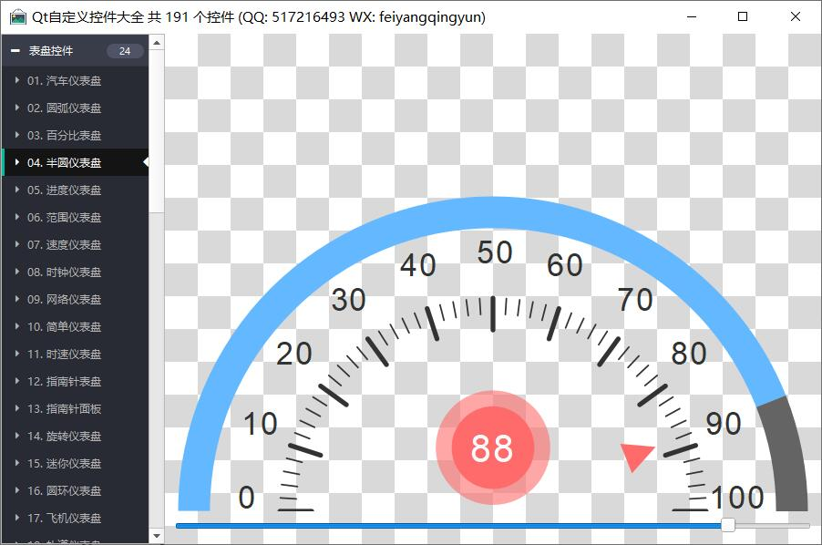

**功能特点**
1. 可设置范围值，支持负数值。
2. 可设置大刻度数量、小刻度数量。
3. 可设置开始旋转角度、结束旋转角度。
4. 可设置是否启用动画效果以及动画效果每次移动的步长。
5. 自适应窗体拉伸、刻度尺、文字自动缩放。
6. 可自由拓展各种渐变色，各圆的半径。
7. 指示器样式可选择圆形指示器、指针指示器、圆角指针指示器、三角形指示器。
8. 可设置当前值进度颜色、剩余值进度颜色。
9. 背景透明，可自由设置背景图片。

**公共接口**
```cpp
public Q_SLOTS:
    //设置范围值
    void setRange(double minValue, double maxValue);

    //设置最大最小值
    void setMinValue(double minValue);
    void setMaxValue(double maxValue);

    //设置目标值
    void setValue(double value);
    void setValue(int value);

    //设置主刻度数量
    void setScaleMajor(int scaleMajor);
    //设置小刻度数量
    void setScaleMinor(int scaleMinor);
    //设置开始旋转角度
    void setStartAngle(int startAngle);
    //设置结束旋转角度
    void setEndAngle(int endAngle);

    //设置是否启用动画显示
    void setAnimation(bool animation);
    //设置动画显示的步长
    void setAnimationStep(double animationStep);

    //设置当前值颜色
    void setUsedColor(const QColor &usedColor);
    //设置剩余值颜色
    void setFreeColor(const QColor &freeColor);

    //设置刻度尺颜色
    void setScaleColor(const QColor &scaleColor);
    //设置指针颜色
    void setPointerColor(const QColor &pointerColor);
    //设置文本颜色
    void setTextColor(const QColor &textColor);
    //设置标题颜色
    void setTitleColor(const QColor &titleColor);

    //设置是否显示遮罩层
    void setShowOverlay(bool showOverlay);
    //设置遮罩层颜色
    void setOverlayColor(const QColor &overlayColor);

    //设置指针样式
    void setPointerStyle(const PointerStyle &pointerStyle);

Q_SIGNALS:
    void valueChanged(double value);
```

**使用示例**
```cpp
#pragma execution_character_set("utf-8")

#include "frmgaugecircle.h"
#include "ui_frmgaugecircle.h"

frmGaugeCircle::frmGaugeCircle(QWidget *parent) : QWidget(parent), ui(new Ui::frmGaugeCircle)
{
    ui->setupUi(this);
    this->initForm();
}

frmGaugeCircle::~frmGaugeCircle()
{
    delete ui;
}

void frmGaugeCircle::initForm()
{
    //ui->gaugeCircle->setRange(-200, 200);
    connect(ui->horizontalSlider, SIGNAL(valueChanged(int)), ui->gaugeCircle, SLOT(setValue(int)));
    ui->horizontalSlider->setValue(88);
}
```

##### 3.1.5 进度仪表盘-gaugeprogress
**运行效果**
 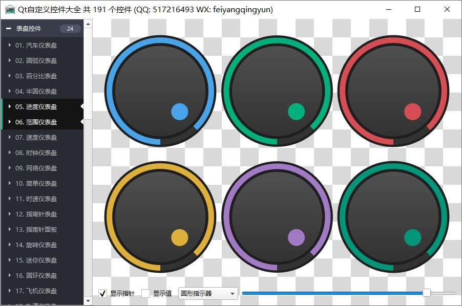

**功能特点**
1. 支持指示器样式选择圆形指示器、指针指示器、圆角指针指示器、三角形指示器。
2. 支持鼠标按下旋转改变值。
3. 支持负数范围值。
4. 支持设置当前值及范围值。
5. 支持设置起始旋转角度、结束旋转角度。
6. 支持设置背景色、进度颜色、中间圆渐变颜色。
7. 随窗体拉伸自动变化。
8. 支持鼠标进入和离开动画效果。
9. 可设置是否显示当前值。
10. 可设置是否显示指示器。

**公共接口**
```cpp
public Q_SLOTS:
    //设置范围值
    void setRange(double minValue, double maxValue);
    void setRange(int minValue, int maxValue);

    //设置最大最小值
    void setMinValue(double minValue);
    void setMaxValue(double maxValue);

    //设置目标值
    void setValue(double value);
    void setValue(int value);

    //设置精确度
    void setPrecision(int precision);

    //设置开始旋转角度
    void setStartAngle(int startAngle);
    //设置结束旋转角度
    void setEndAngle(int endAngle);

    //设置背景色
    void setBgColor(const QColor &bgColor);

    //设置进度颜色
    void setProgressColor(const QColor &progressColor);
    void setProgressBgColor(const QColor &progressBgColor);

    //设置中间圆颜色
    void setCircleColorStart(const QColor &circleColorStart);
    void setCircleColorEnd(const QColor &circleColorEnd);

    //设置文本颜色
    void setTextColor(const QColor &textColor);

    //设置是否显示指示器
    void setShowPointer(bool showPointer);
    //设置是否显示当前值
    void setShowValue(bool showValue);
    //设置指针样式
    void setPointerStyle(const PointerStyle &pointerStyle);

Q_SIGNALS:
    void valueChanged(int value);
```

**使用示例**
```cpp
#pragma execution_character_set("utf-8")

#include "frmgaugeprogress.h"
#include "ui_frmgaugeprogress.h"

frmGaugeProgress::frmGaugeProgress(QWidget *parent) : QWidget(parent), ui(new Ui::frmGaugeProgress)
{
    ui->setupUi(this);
    this->initForm();
}

frmGaugeProgress::~frmGaugeProgress()
{
    delete ui;
}

void frmGaugeProgress::initForm()
{
    ui->ckShowPointer->setChecked(true);
    gauges << ui->gaugeProgress1 << ui->gaugeProgress2 << ui->gaugeProgress3 << ui->gaugeProgress4 << ui->gaugeProgress5 << ui->gaugeProgress6;

    QList<QColor> colors;
    colors << "#47A4E9" << "#00B17D" << "#D64D54" << "#DEAF39" << "#A279C5" << "#009679";

    int count = gauges.count();
    for (int i = 0; i < count; i++) {
        gauges.at(i)->setProgressColor(colors.at(i));
        connect(ui->horizontalSlider, SIGNAL(valueChanged(int)), gauges.at(i), SLOT(setValue(int)));
    }

    ui->horizontalSlider->setValue(88);
}

void frmGaugeProgress::on_ckShowPointer_stateChanged(int arg1)
{
    bool check = (arg1 != 0);
    int count = gauges.count();
    for (int i = 0; i < count; i++) {
        gauges.at(i)->setShowPointer(check);
    }
}

void frmGaugeProgress::on_ckShowValue_stateChanged(int arg1)
{
    bool check = (arg1 != 0);
    int count = gauges.count();
    for (int i = 0; i < count; i++) {
        gauges.at(i)->setShowValue(check);
    }
}

void frmGaugeProgress::on_cboxPointerStyle_currentIndexChanged(int index)
{
    GaugeProgress::PointerStyle style = (GaugeProgress::PointerStyle)index;
    int count = gauges.count();
    for (int i = 0; i < count; i++) {
        gauges.at(i)->setPointerStyle(style);
    }
}
```

##### 3.1.6 范围仪表盘-gaugerange
**运行效果**
 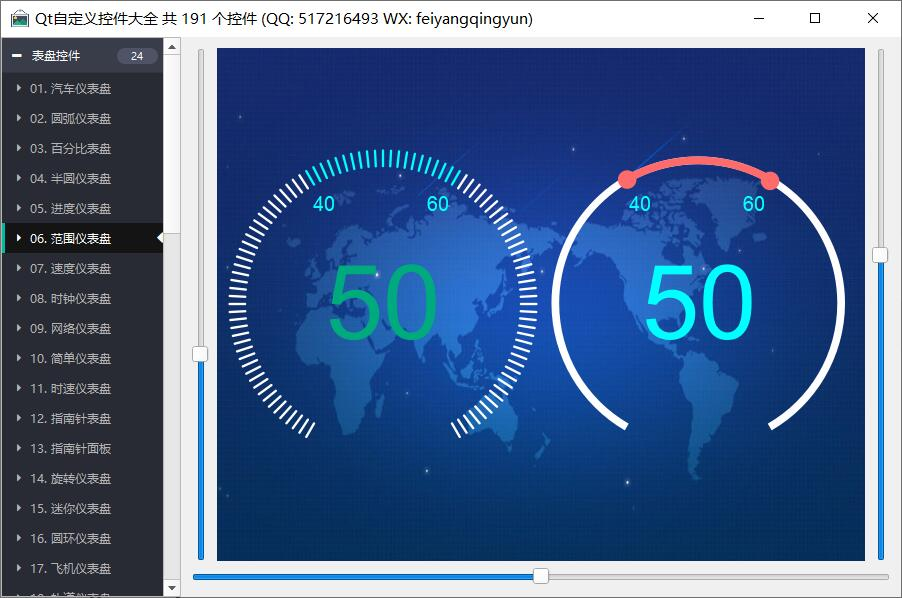

**功能特点**
1. 可设置范围值，支持负数值。
2. 可设置当前范围值。
3. 可设置开始旋转角度、结束旋转角度。
4. 可设置范围值颜色、范围值外颜色、文字颜色。
5. 自适应窗体拉伸、刻度尺、文字自动缩放。
6. 可设置多种范围样式。

**公共接口**
```cpp
public Q_SLOTS:
    //设置最大最小值
    void setMinValue(int minValue);
    void setMaxValue(int maxValue);
    void setRange(int minValue, int maxValue);

    //设置当前值
    void setValue(int value);

    //设置当前左右范围值
    void setLeftValue(int leftValue);
    void setRightValue(int rightValue);
    void setLeftRightRange(int leftValue, int rightValue);

    //设置刻度数量
    void setScaleMajor(int scaleMajor);
    //设置开始旋转角度
    void setStartAngle(int startAngle);
    //设置结束旋转角度
    void setEndAngle(int endAngle);
    //设置单位
    void setUnit(const QString &unit);

    //设置刻度值颜色
    void setUsedColor(const QColor &usedColor);
    //设置指针颜色
    void setFreeColor(const QColor &freeColor);
    //设置文本颜色
    void setTextColor(const QColor &textColor);
    //设置文本颜色
    void setRangeTextColor(const QColor &rangeTextColor);

    //设置范围值风格
    void setRangeStyle(const RangeStyle &rangeStyle);

Q_SIGNALS:
    void valueChanged(int leftValue, int rightValue);
```

**使用示例**
```cpp
#pragma execution_character_set("utf-8")

#include "frmgaugerange.h"
#include "ui_frmgaugerange.h"

frmGaugeRange::frmGaugeRange(QWidget *parent) : QWidget(parent), ui(new Ui::frmGaugeRange)
{
    ui->setupUi(this);
    this->initForm();
}

frmGaugeRange::~frmGaugeRange()
{
    delete ui;
}

void frmGaugeRange::initForm()
{
    ui->widget->setStyleSheet("QWidget#widget{border-image: url(:/image/bg1.jpg);}");

    ui->gaugeRange1->setUsedColor(QColor(0, 255, 255));
    ui->gaugeRange1->setFreeColor(QColor(255, 255, 255));
    ui->gaugeRange1->setTextColor(QColor(0, 170, 127));
    ui->gaugeRange1->setRangeTextColor(QColor(0, 255, 255));

    ui->gaugeRange2->setUsedColor(QColor(255, 107, 107));
    ui->gaugeRange2->setFreeColor(QColor(255, 255, 255));
    ui->gaugeRange2->setTextColor(QColor(0, 255, 255));
    ui->gaugeRange2->setRangeTextColor(QColor(0, 255, 255));
    ui->gaugeRange2->setRangeStyle(GaugeRange::RangeStyle_Circle);

    connect(ui->horizontalSlider, SIGNAL(valueChanged(int)), ui->gaugeRange1, SLOT(setValue(int)));
    connect(ui->horizontalSlider, SIGNAL(valueChanged(int)), ui->gaugeRange2, SLOT(setValue(int)));
    connect(ui->horizontalSlider1, SIGNAL(valueChanged(int)), ui->gaugeRange1, SLOT(setLeftValue(int)));
    connect(ui->horizontalSlider1, SIGNAL(valueChanged(int)), ui->gaugeRange2, SLOT(setLeftValue(int)));
    connect(ui->horizontalSlider2, SIGNAL(valueChanged(int)), ui->gaugeRange1, SLOT(setRightValue(int)));
    connect(ui->horizontalSlider2, SIGNAL(valueChanged(int)), ui->gaugeRange2, SLOT(setRightValue(int)));

    ui->horizontalSlider->setRange(0, 100);
    ui->horizontalSlider1->setRange(0, 100);
    ui->horizontalSlider2->setRange(0, 100);

    ui->horizontalSlider->setValue(50);
    ui->horizontalSlider1->setValue(40);
    ui->horizontalSlider2->setValue(60);
}
```

##### 3.1.7 速度仪表盘-gaugespeed
**运行效果**
 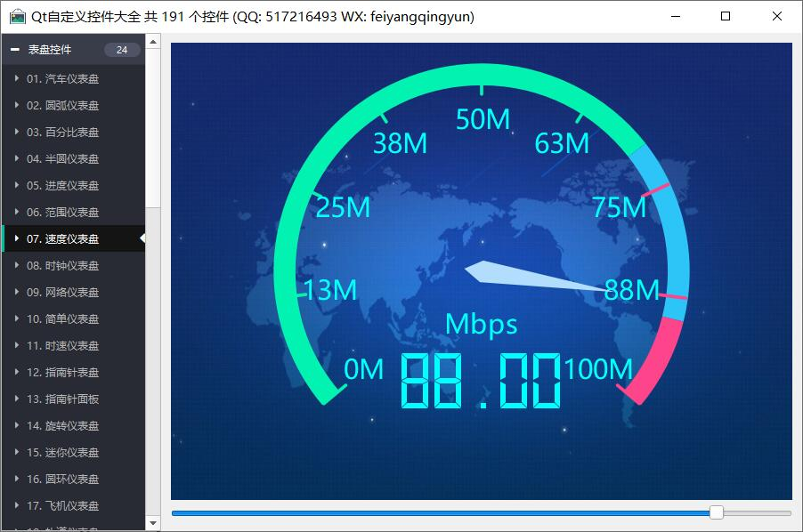

**功能特点**
1. 可设置范围值,支持负数值
2. 可设置精确度,最大支持小数点后3位
3. 可设置大刻度数量/小刻度数量
4. 可设置开始旋转角度/结束旋转角度
5. 可设置是否启用动画效果以及动画效果时长和类型
6. 可设置三色圆环占比例
7. 自适应窗体拉伸,刻度尺和文字自动缩放
8. 可设置单位以及描述文字
9. 可设置数码管的长度

**公共接口**
```cpp
public Q_SLOTS:
    //设置范围值
    void setRange(double minValue, double maxValue);
    void setRange(int minValue, int maxValue);

    //设置最大最小值
    void setMinValue(double minValue);
    void setMaxValue(double maxValue);

    //设置目标值
    void setValue(double value);
    void setValue(int value);
    void setAnimationValue(double value);

    //设置精确度
    void setPrecision(int precision);
    //设置数码管的长度
    void setDigitCount(int digitCount);

    //设置主刻度数量
    void setScaleMajor(int scaleMajor);
    //设置小刻度数量
    void setScaleMinor(int scaleMinor);
    //设置开始旋转角度
    void setStartAngle(int startAngle);
    //设置结束旋转角度
    void setEndAngle(int endAngle);

    //设置是否启用动画+动画时长+动画类型
    void setAnimation(bool animation);
    void setAnimationDuration(int animationDuration);
    void setAnimationType(const QEasingCurve &animationType);

    //设置饼圆宽度
    void setRingWidth(int ringWidth);

    //设置三个圆环所占比例
    void setRingPercentStart(int ringPercentStart);
    void setRingPercentMid(int ringPercentMid);
    void setRingPercentEnd(int ringPercentEnd);

    //设置三个圆环颜色
    void setRingColorStart(const QColor &ringColorStart);
    void setRingColorMid(const QColor &ringColorMid);
    void setRingColorEnd(const QColor &ringColorEnd);

    //设置指针颜色
    void setPointerColor(const QColor &pointerColor);
    //设置背景颜色
    void setBgColor(const QColor &bgColor);
    //设置文本颜色
    void setTextColor(const QColor &textColor);
    //设置单位
    void setUnit(const QString &unit);
    //设置中间描述文字
    void setText(const QString &text);

Q_SIGNALS:
    void valueChanged(int value);
```

**使用示例**
```cpp
#pragma execution_character_set("utf-8")

#include "frmgaugespeed.h"
#include "ui_frmgaugespeed.h"

frmGaugeSpeed::frmGaugeSpeed(QWidget *parent) : QWidget(parent), ui(new Ui::frmGaugeSpeed)
{
    ui->setupUi(this);
    this->initForm();
}

frmGaugeSpeed::~frmGaugeSpeed()
{
    delete ui;
}

void frmGaugeSpeed::initForm()
{
    ui->widget->setStyleSheet("QWidget#widget{border-image: url(:/image/bg1.jpg);}");

    ui->gaugeSpeed->setRingPercentStart(70);
    ui->gaugeSpeed->setRingPercentMid(20);
    ui->gaugeSpeed->setRingPercentEnd(10);
    ui->gaugeSpeed->setAnimation(true);

    //ui->gaugeSpeed->setAnimationType(QEasingCurve::OutBounce);
    ui->gaugeSpeed->setTextColor(QColor(0, 255, 255));
    connect(ui->horizontalSlider, SIGNAL(valueChanged(int)), ui->gaugeSpeed, SLOT(setValue(int)));
    ui->horizontalSlider->setValue(88);
}
```

##### 3.1.8 时钟仪表盘-gaugeclock
**运行效果**
 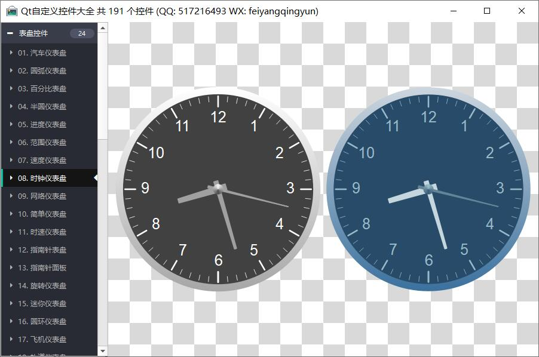

**功能特点**
1. 可设置边框颜色。
2. 可设置前景色背景色。
3. 可设置时钟分钟秒钟指针颜色。
4. 可设置刷新间隔。
5. 鼠标右键可设置四种效果普通效果、弹簧效果、连续效果、隐藏效果。
6. 增加设置系统时间公共槽函数，支持任意操作系统。

**公共接口**
```cpp
public Q_SLOTS:
    //设置秒针走动样式
    void setSecondStyle(const SecondStyle &secondStyle);
    //设置系统时间
    void setSystemDateTime(const QString &year, const QString &month, const QString &day,
                           const QString &hour, const QString &min, const QString &sec);

    //设置外边框渐变颜色
    void setCrownColorStart(const QColor &crownColorStart);
    void setCrownColorEnd(const QColor &crownColorEnd);

    //设置前景色
    void setForeground(const QColor &foreground);
    //设备背景色
    void setBackground(const QColor &background);

    //设置时钟指针颜色
    void setPointerHourColor(const QColor &pointerHourColor);
    //设置分钟指针颜色
    void setPointerMinColor(const QColor &pointerMinColor);
    //设置秒钟指针颜色
    void setPointerSecColor(const QColor &pointerSecColor);
```

**使用示例**
```cpp
#pragma execution_character_set("utf-8")

#include "frmgaugeclock.h"
#include "ui_frmgaugeclock.h"

frmGaugeClock::frmGaugeClock(QWidget *parent) : QWidget(parent), ui(new Ui::frmGaugeClock)
{
    ui->setupUi(this);
    this->initForm();
}

frmGaugeClock::~frmGaugeClock()
{
    delete ui;
}

void frmGaugeClock::initForm()
{
    ui->gaugeClock2->setCrownColorStart(QColor(205, 214, 223));
    ui->gaugeClock2->setCrownColorEnd(QColor(39, 75, 105).lighter(150));
    ui->gaugeClock2->setForeground(QColor(151, 186, 202));
    ui->gaugeClock2->setBackground(QColor(39, 75, 105));
    ui->gaugeClock2->setPointerHourColor(QColor(197, 214, 222));
    ui->gaugeClock2->setPointerMinColor(QColor(197, 214, 222));
    ui->gaugeClock2->setPointerSecColor(QColor(99, 133, 152));
    ui->gaugeClock2->setSecondStyle(GaugeClock::SecondStyle_Spring);
}
```

##### 3.1.9 网络仪表盘-gaugenet
**运行效果**
 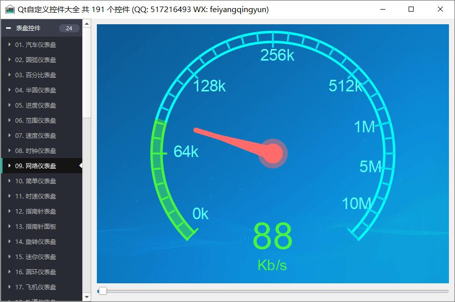

**功能特点**
1. 可设置范围值，支持负数值。
2. 可设置精确度，最大支持小数点后3位。
3. 可设置大刻度数量、小刻度数量。
4. 可设置开始旋转角度、结束旋转角度。
5. 可设置是否启用动画效果以及动画效果每次移动的步长。
6. 可设置外圆背景、内圆背景、饼圆三种颜色、刻度尺颜色、文字颜色。
7. 自适应窗体拉伸、刻度尺、文字自动缩放。
8. 可自由拓展各种渐变色、各圆的半径。
9. 指示器样式可选择圆形指示器、指针指示器、圆角指针指示器、三角形指示器。
10. 刻度尺进度样式选择跟随值进度、跟随时间进度。

**公共接口**
```cpp
public Q_SLOTS:
    //设置范围值
    void setRange(double minValue, double maxValue);
    void setRange(int minValue, int maxValue);

    //设置最大最小值
    void setMinValue(double minValue);
    void setMaxValue(double maxValue);

    //设置目标值
    void setValue(double value);
    void setValue(int value);

    //设置精确度
    void setPrecision(int precision);

    //设置主刻度数量
    void setScaleMajor(int scaleMajor);
    //设置小刻度数量
    void setScaleMinor(int scaleMinor);
    //设置开始旋转角度
    void setStartAngle(int startAngle);
    //设置结束旋转角度
    void setEndAngle(int endAngle);

    //设置是否启用动画显示
    void setAnimation(bool animation);
    //设置动画显示的步长
    void setAnimationStep(double animationStep);

    //设置圆弧颜色
    void setArcColor(const QColor &arcColor);
    //设置刻度尺颜色
    void setScaleColor(const QColor &scaleColor);
    //设置刻度值颜色
    void setScaleNumColor(const QColor &scaleNumColor);
    //设置指针颜色
    void setPointerColor(const QColor &pointerColor);
    //设置文本颜色
    void setTextColor(const QColor &textColor);

    //设置指针样式
    void setPointerStyle(const PointerStyle &pointerStyle);
    //设置刻度进度样式
    void setScaleStyle(const ScaleStyle &scaleStyle);

    //设置总秒数
    void setSeconds(int seconds);
    //设置进度更新间隔
    void setInterval(int interval);

    //启动和停止时间进度更新
    void start();
    void stop();

Q_SIGNALS:
    void valueChanged(int value);
```

**使用示例**
```cpp
#pragma execution_character_set("utf-8")

#include "frmgaugenet.h"
#include "ui_frmgaugenet.h"

frmGaugeNet::frmGaugeNet(QWidget *parent) : QWidget(parent), ui(new Ui::frmGaugeNet)
{
    ui->setupUi(this);
    this->initForm();
}

frmGaugeNet::~frmGaugeNet()
{
    delete ui;
}

void frmGaugeNet::initForm()
{
    ui->widget->setStyleSheet("QWidget#widget{border-image: url(:/image/bg2.png);}");

    ui->gaugeNet->setArcColor(QColor(0, 255, 255));
    ui->gaugeNet->setScaleColor(QColor("#00E5EE"));
    ui->gaugeNet->setScaleNumColor(QColor(85, 255, 255));
    connect(ui->horizontalSlider, SIGNAL(valueChanged(int)), ui->gaugeNet, SLOT(setValue(int)));
    ui->horizontalSlider->setValue(88);
}
```

##### 3.1.10 简单仪表盘-gaugesimple
**运行效果**
 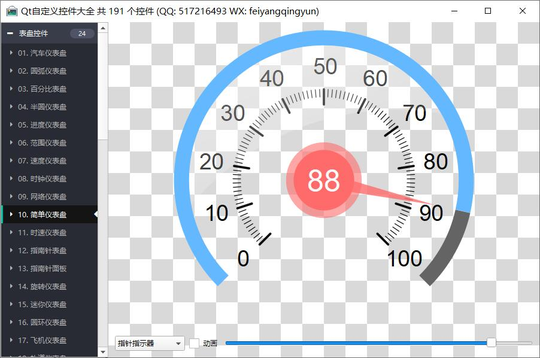

**功能特点**
1. 可设置范围值，支持负数值。
2. 可设置大刻度数量、小刻度数量。
3. 可设置开始旋转角度、结束旋转角度。
4. 可设置是否启用动画效果以及动画效果每次移动的步长。
5. 自适应窗体拉伸、刻度尺、文字自动缩放。
6. 可自由拓展各种渐变色，各圆的半径。
7. 指示器样式可选择圆形指示器、指针指示器、圆角指针指示器、三角形指示器。
8. 可设置当前值进度颜色和剩余值进度颜色。
9. 背景透明，可自由设置背景图片。
10. 可设置用户设定值、目标值。

**公共接口**
```cpp
public Q_SLOTS:
    //设置范围值
    void setRange(double minValue, double maxValue);

    //设置最大最小值
    void setMinValue(double minValue);
    void setMaxValue(double maxValue);

    //设置目标值
    void setValue(double value);
    void setValue(int value);

    //设置主刻度数量
    void setScaleMajor(int scaleMajor);
    //设置小刻度数量
    void setScaleMinor(int scaleMinor);
    //设置开始旋转角度
    void setStartAngle(int startAngle);
    //设置结束旋转角度
    void setEndAngle(int endAngle);

    //设置是否启用动画显示
    void setAnimation(bool animation);
    //设置动画显示的步长
    void setAnimationStep(double animationStep);

    //设置是否显示用户设定值
    void setShowUserValue(bool showUserValue);

    //设置用户值
    void setUserValue(double userValue);
    void setUserValue(int userValue);

    //设置用户设定值颜色
    void setUserValueColor(const QColor &userValueColor);

    //设置当前值颜色
    void setUsedColor(const QColor &usedColor);
    //设置剩余值颜色
    void setFreeColor(const QColor &freeColor);

    //设置刻度尺颜色
    void setScaleColor(const QColor &scaleColor);
    //设置指针颜色
    void setPointerColor(const QColor &pointerColor);
    //设置文本颜色
    void setTextColor(const QColor &textColor);
    //设置标题颜色
    void setTitleColor(const QColor &titleColor);

    //设置标题
    void setTitle(const QString &title);

    //设置是否显示遮罩层
    void setShowOverlay(bool showOverlay);
    //设置遮罩层颜色
    void setOverlayColor(const QColor &overlayColor);

    //设置指针样式
    void setPointerStyle(const PointerStyle &pointerStyle);

Q_SIGNALS:
    void valueChanged(double value);
```

**使用示例**
```cpp
#pragma execution_character_set("utf-8")

#include "frmgaugesimple.h"
#include "ui_frmgaugesimple.h"
#include "gaugesimple.h"

frmGaugeSimple::frmGaugeSimple(QWidget *parent) : QWidget(parent), ui(new Ui::frmGaugeSimple)
{
    ui->setupUi(this);
    this->initForm();
}

frmGaugeSimple::~frmGaugeSimple()
{
    delete ui;
}

void frmGaugeSimple::initForm()
{
    connect(ui->horizontalSlider, SIGNAL(valueChanged(int)), ui->gaugeSimple, SLOT(setValue(int)));
    ui->horizontalSlider->setValue(88);
    ui->gaugeSimple->setAnimation(false);
    ui->cboxPointerStyle->setCurrentIndex(1);
}

void frmGaugeSimple::on_cboxPointerStyle_currentIndexChanged(int index)
{
    ui->gaugeSimple->setPointerStyle((GaugeSimple::PointerStyle)index);
}

void frmGaugeSimple::on_ckAnimation_stateChanged(int arg1)
{
    ui->gaugeSimple->setAnimation(arg1 != 0);
}
```

##### 3.1.11 时速仪表盘-gaugewatch
**运行效果**
 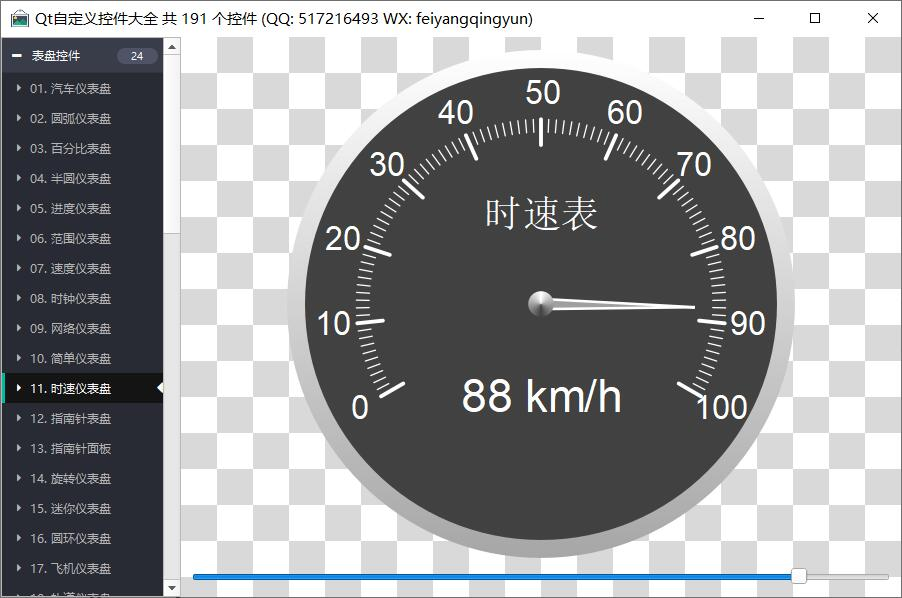

**功能特点**
1. 可设置各种颜色。
2. 可启用动画效果显示。
3. 可设置起始旋转角度及结束旋转角度。
4. 可设置单位和标题。
5. 可设置大刻度数量和小刻度数量。
6. 增加一些完整性校验及改进部分算法。

**公共接口**
```cpp
public Q_SLOTS:
    //设置范围值
    void setRange(double minValue, double maxValue);
    void setRange(int minValue, int maxValue);

    //设置最大最小值
    void setMinValue(double minValue);
    void setMaxValue(double maxValue);

    //设置目标值
    void setValue(double value);
    void setValue(int value);

    //设置精确度
    void setPrecision(int precision);
    //设置单位
    void setUnit(const QString &unit);
    //设置标题
    void setTitle(const QString &title);

    //设置主刻度数量
    void setScaleMajor(int scaleMajor);
    //设置小刻度数量
    void setScaleMinor(int scaleMinor);
    //设置开始旋转角度
    void setStartAngle(int startAngle);
    //设置结束旋转角度
    void setEndAngle(int endAngle);

    //设置是否启用动画显示
    void setAnimation(bool animation);
    //设置动画显示的步长
    void setAnimationStep(double animationStep);

    //设置外边框渐变颜色
    void setCrownColorStart(const QColor &crownColorStart);
    void setCrownColorEnd(const QColor &crownColorEnd);

    //设置前景色
    void setForeground(const QColor &foreground);
    //设备背景色
    void setBackground(const QColor &background);
    //设置指针颜色
    void setPointerColor(const QColor &pointerColor);

Q_SIGNALS:
    void valueChanged(int value);
```

**使用示例**
```cpp
#pragma execution_character_set("utf-8")

#include "frmgaugewatch.h"
#include "ui_frmgaugewatch.h"

frmGaugeWatch::frmGaugeWatch(QWidget *parent) : QWidget(parent), ui(new Ui::frmGaugeWatch)
{
    ui->setupUi(this);
    this->initForm();
}

frmGaugeWatch::~frmGaugeWatch()
{
    delete ui;
}

void frmGaugeWatch::initForm()
{
    connect(ui->horizontalSlider, SIGNAL(valueChanged(int)), ui->gaugeWatch, SLOT(setValue(int)));
    ui->horizontalSlider->setValue(88);
}
```

##### 3.1.12 指南针表盘-gaugecompass
**运行效果**
 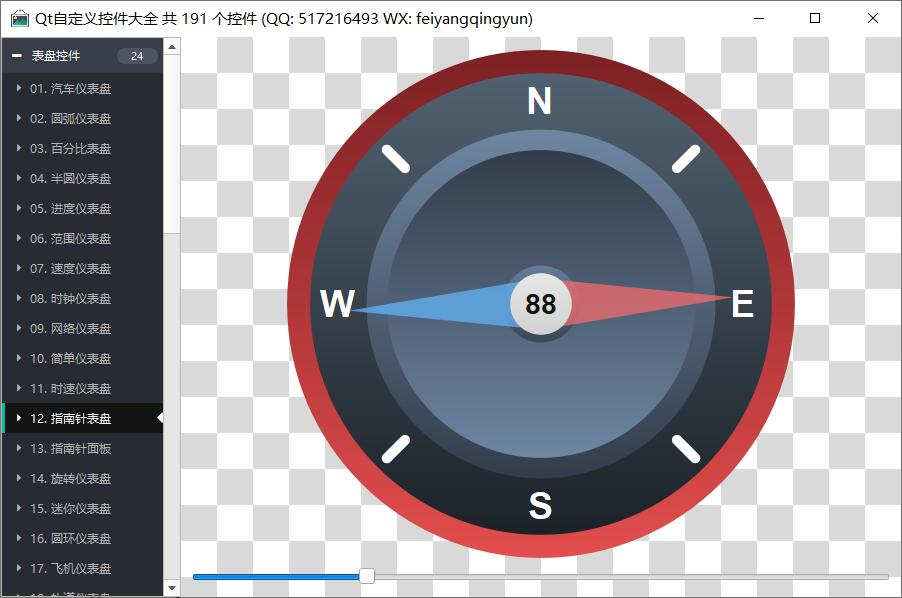

**功能特点**
1. 可设置当前度数。
2. 可设置精确度。
3. 可设置是否启用动画及步长。
4. 可设置边框渐变颜色。
5. 可设置背景渐变颜色。
6. 可设置加深和明亮颜色。
7. 可设置指南指北指针颜色。
8. 可设置中心点渐变颜色。

**公共接口**
```cpp
public Q_SLOTS:
    //设置目标值
    void setValue(double value);
    void setValue(int value);

    //设置精确度
    void setPrecision(int precision);

    //设置是否启用动画显示
    void setAnimation(bool animation);
    //设置动画显示的步长
    void setAnimationStep(double animationStep);

    //设置外边框渐变颜色
    void setCrownColorStart(const QColor &crownColorStart);
    void setCrownColorEnd(const QColor &crownColorEnd);

    //设置背景渐变颜色
    void setBgColorStart(const QColor &bgColorStart);
    void setBgColorEnd(const QColor &bgColorEnd);

    //设置加深和明亮颜色
    void setDarkColor(const QColor &darkColor);
    void setLightColor(const QColor &lightColor);

    //设置前景色
    void setForeground(const QColor &foreground);
    //设置文本颜色
    void setTextColor(const QColor &textColor);

    //设置指针颜色
    void setNorthPointerColor(const QColor &northPointerColor);
    void setSouthPointerColor(const QColor &southPointerColor);

    //设置中心圆颜色
    void setCenterColorStart(const QColor &centerColorStart);
    void setCenterColorEnd(const QColor &centerColorEnd);

Q_SIGNALS:
    void valueChanged(int value);
```

**使用示例**
```cpp
#pragma execution_character_set("utf-8")

#include "frmgaugecompass.h"
#include "ui_frmgaugecompass.h"

frmGaugeCompass::frmGaugeCompass(QWidget *parent) : QWidget(parent), ui(new Ui::frmGaugeCompass)
{
    ui->setupUi(this);
    this->initForm();
}

frmGaugeCompass::~frmGaugeCompass()
{
    delete ui;
}

void frmGaugeCompass::initForm()
{
    connect(ui->horizontalSlider, SIGNAL(valueChanged(int)), ui->gaugeCompass, SLOT(setValue(int)));
    ui->horizontalSlider->setValue(88);
}
```

##### 3.1.13 指南针面板-gaugecompasspan
**运行效果**
 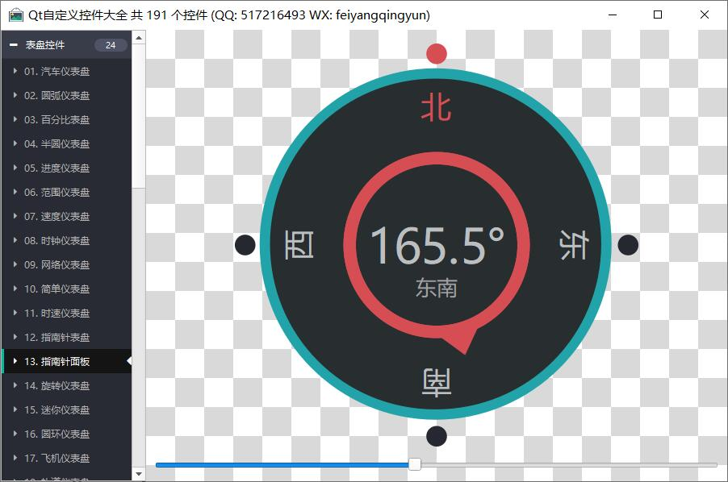

**功能特点**
1. 可设置当前度数、精确度。
2. 可设置背景颜色、文字颜色。
3. 可设置边框颜色、边框宽度。
4. 可设置正北点颜色。
5. 可设置其他方向点颜色。
6. 可设置指针颜色。
7. 自动计算方位变显示。

**公共接口**
```cpp
public Q_SLOTS:
    //设置值
    void setValue(double value);
    //设置精确度-小数点后几位
    void setPrecision(int precision);

    //设置背景色
    void setBgColor(const QColor &bgColor);
    //设置文字颜色
    void setTextColor(const QColor &textColor);
    //设置外边框颜色
    void setBorderColor(const QColor &borderColor);
    //设置外边框宽度
    void setBorderWidth(int borderWidth);

    //设置正北点颜色
    void setNorthDotColor(const QColor &northDotColor);
    //设置其它方向点颜色
    void setOtherDotColor(const QColor &otherDotColor);
    //设置指针颜色
    void setPointerColor(const QColor &pointerColor);

Q_SIGNALS:
    void valueChanged(double value);
```

**使用示例**
```cpp
#pragma execution_character_set("utf-8")

#include "frmgaugecompasspan.h"
#include "ui_frmgaugecompasspan.h"

frmGaugeCompassPan::frmGaugeCompassPan(QWidget *parent) : QWidget(parent), ui(new Ui::frmGaugeCompassPan)
{
    ui->setupUi(this);
    this->initForm();
}

frmGaugeCompassPan::~frmGaugeCompassPan()
{
    delete ui;
}

void frmGaugeCompassPan::initForm()
{
    precision = 1;
    ui->gaugecompasspan->setPrecision(precision);
    if (precision == 1) {
        ui->horizontalSlider->setRange(0, 3600);
        ui->horizontalSlider->setValue(1655);
    } else {
        ui->horizontalSlider->setRange(0, 360);
        ui->horizontalSlider->setValue(165);
    }
}

void frmGaugeCompassPan::on_horizontalSlider_valueChanged(int value)
{
    double v = (double)value;
    if (precision == 1) {
        v = v / 10;
    }

    ui->gaugecompasspan->setValue(v);
}
```

##### 3.1.14 旋转仪表盘-gaugedial
**运行效果**
 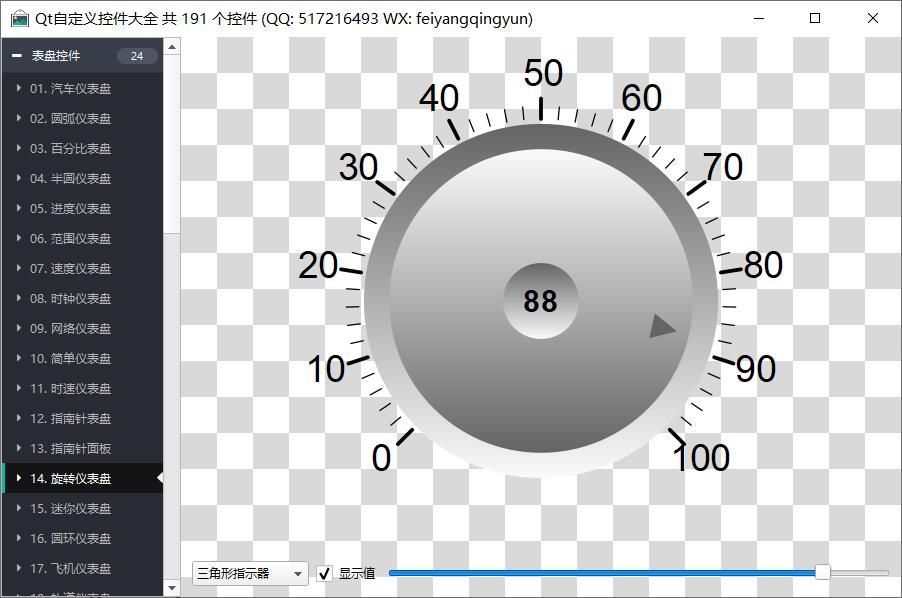

**功能特点**
1. 支持指示器样式选择圆形指示器、指针指示器、圆角指针指示器、三角形指示器。
2. 支持鼠标按下旋转改变值。
3. 支持负数刻度值。
4. 支持设置当前值及范围值。
5. 支持左右旋转角度设置。
6. 支持设置大刻度数量和小刻度数量。
7. 支持设置各种颜色。
8. 字号随窗体拉伸自动变化。
9. 可设置是否显示当前值。

**公共接口**
```cpp
public Q_SLOTS:
    //设置范围值
    void setRange(double minValue, double maxValue);
    void setRange(int minValue, int maxValue);

    //设置最大最小值
    void setMinValue(double minValue);
    void setMaxValue(double maxValue);

    //设置目标值
    void setValue(double value);
    void setValue(int value);

    //设置精确度
    void setPrecision(int precision);

    //设置主刻度数量
    void setScaleMajor(int scaleMajor);
    //设置小刻度数量
    void setScaleMinor(int scaleMinor);
    //设置开始旋转角度
    void setStartAngle(int startAngle);
    //设置结束旋转角度
    void setEndAngle(int endAngle);

    //设置颜色
    void setDarkColor(const QColor &darkColor);
    void setLightColor(const QColor &lightColor);

    //设置文本颜色
    void setTextColor(const QColor &textColor);

    //设置是否显示当前值
    void setShowValue(bool showValue);
    //设置指针样式
    void setPointerStyle(const PointerStyle &pointerStyle);

Q_SIGNALS:
    void valueChanged(int value);
```

**使用示例**
```cpp
#pragma execution_character_set("utf-8")

#include "frmgaugedial.h"
#include "ui_frmgaugedial.h"
#include "gaugedial.h"

frmGaugeDial::frmGaugeDial(QWidget *parent) : QWidget(parent), ui(new Ui::frmGaugeDial)
{
    ui->setupUi(this);
    this->initForm();
}

frmGaugeDial::~frmGaugeDial()
{
    delete ui;
}

void frmGaugeDial::initForm()
{
    connect(ui->horizontalSlider, SIGNAL(valueChanged(int)), ui->gaugeDial, SLOT(setValue(int)));
    connect(ui->gaugeDial, SIGNAL(valueChanged(int)), ui->horizontalSlider, SLOT(setValue(int)));
    ui->horizontalSlider->setValue(88);
    ui->ckShowValue->setChecked(true);
    ui->cboxPointerStyle->setCurrentIndex(3);
}

void frmGaugeDial::on_cboxPointerStyle_currentIndexChanged(int index)
{
    ui->gaugeDial->setPointerStyle((GaugeDial::PointerStyle)index);
}

void frmGaugeDial::on_ckShowValue_stateChanged(int arg1)
{
    ui->gaugeDial->setShowValue(arg1 != 0);
}
```

##### 3.1.15 迷你仪表盘-gaugemini
**运行效果**
 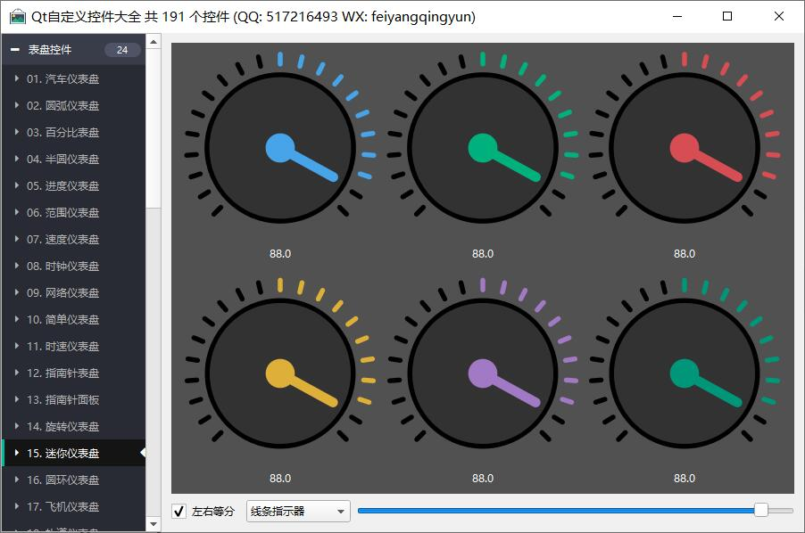

**功能特点**
1. 支持指示器样式选择线条指示器、指针指示器、圆角指针指示器、三角形指示器。
2. 支持鼠标按下旋转改变值。
3. 支持负数刻度值。
4. 支持设置当前值及范围值。
5. 支持左右旋转角度设置。
6. 支持设置刻度数量。
7. 支持设置边框颜色、背景颜色、文本颜色、进度颜色。
8. 支持设置是否等分显示左右值。

**公共接口**
```cpp
public Q_SLOTS:
    //设置范围值
    void setRange(double minValue, double maxValue);
    void setRange(int minValue, int maxValue);

    //设置最大最小值
    void setMinValue(double minValue);
    void setMaxValue(double maxValue);

    //设置目标值
    void setValue(double value);
    void setValue(int value);

    //设置精确度
    void setPrecision(int precision);

    //设置刻度数量
    void setStep(int step);
    //设置开始旋转角度
    void setStartAngle(int startAngle);
    //设置结束旋转角度
    void setEndAngle(int endAngle);

    //设置边框颜色
    void setBorderColor(const QColor &borderColor);
    //设置背景颜色
    void setBgColor(const QColor &bgColor);
    //设置文本颜色
    void setTextColor(const QColor &textColor);
    //设置进度颜色
    void setPercentColor(const QColor &percentColor);

    //设置是否对半等分范围值
    void setDoublePercent(bool doublePercent);
    //设置是否显示当前值
    void setShowValue(bool showValue);
    //设置指针样式
    void setPointerStyle(const PointerStyle &pointerStyle);

Q_SIGNALS:
    void valueChanged(double value);
```

**使用示例**
```cpp
#pragma execution_character_set("utf-8")

#include "frmgaugemini.h"
#include "ui_frmgaugemini.h"

frmGaugeMini::frmGaugeMini(QWidget *parent) : QWidget(parent), ui(new Ui::frmGaugeMini)
{
    ui->setupUi(this);
    this->initForm();
}

frmGaugeMini::~frmGaugeMini()
{
    delete ui;
}

void frmGaugeMini::initForm()
{
    ui->ckDouble->setChecked(true);
    ui->widget->setStyleSheet("QWidget#widget{background:#515151;}QLabel{color:#FFFFFF;}");

    gauges << ui->gaugeMini1 << ui->gaugeMini2 << ui->gaugeMini3 << ui->gaugeMini4 << ui->gaugeMini5 << ui->gaugeMini6;
    labs << ui->labValue1 << ui->labValue2 << ui->labValue3 << ui->labValue4 << ui->labValue5 << ui->labValue6;

    QList<QColor> colors;
    colors << "#47A4E9" << "#00B17D" << "#D64D54" << "#DEAF39" << "#A279C5" << "#009679";

    int count = gauges.count();
    for (int i = 0; i < count; i++) {
        gauges.at(i)->setPercentColor(colors.at(i));
        labs.at(i)->setText("0.0");
        connect(gauges.at(i), SIGNAL(valueChanged(double)), this, SLOT(valueChanged(double)));
        connect(ui->horizontalSlider, SIGNAL(valueChanged(int)), gauges.at(i), SLOT(setValue(int)));
    }

    ui->horizontalSlider->setValue(88);
}

void frmGaugeMini::valueChanged(double value)
{
    GaugeMini *gauge = (GaugeMini *)sender();
    int index = gauges.indexOf(gauge);
    labs.at(index)->setText(QString::number(value, 'f', 1));
}

void frmGaugeMini::on_ckDouble_stateChanged(int arg1)
{
    bool check = (arg1 != 0);
    int count = gauges.count();
    for (int i = 0; i < count; i++) {
        gauges.at(i)->setDoublePercent(check);
    }
}

void frmGaugeMini::on_cboxPointerStyle_currentIndexChanged(int index)
{
    GaugeMini::PointerStyle style = (GaugeMini::PointerStyle)index;
    int count = gauges.count();
    for (int i = 0; i < count; i++) {
        gauges.at(i)->setPointerStyle(style);
    }
}
```

##### 3.1.16 圆环仪表盘-gaugeround
**运行效果**
 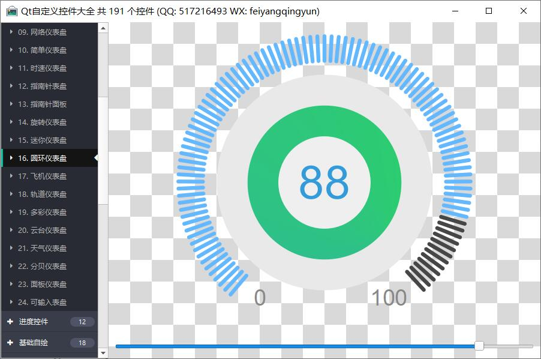

**功能特点**
1. 可设置已使用、未使用百分比颜色。
2. 可设置目标值背景色。
3. 可设置外边框背景色。
4. 可设置中央圆环背景色。
5. 可设置旋转角度。
6. 支持任意大小自动缩放。

**公共接口**
```cpp
public Q_SLOTS:
    //设置范围值
    void setRange(double minValue, double maxValue);
    void setRange(int minValue, int maxValue);

    //设置最大最小值
    void setMinValue(double minValue);
    void setMaxValue(double maxValue);

    //设置目标值
    void setValue(double value);
    void setValue(int value);

    //设置旋转角度
    void setAngle(double angle);

    //设置小数点后几位
    void setPrecision(int precision);

    //设置文字后面的单位
    void setUnit(const QString &unit);

    //设置已使用百分比颜色
    void setUsedColor(const QColor &usedColor);
    //设置未使用百分比颜色
    void setFreeColor(const QColor &freeColor);

    //设置范围值文字颜色
    void setRangeTextColor(const QColor &rangeTextColor);
    //设置目标值文字颜色
    void setValueTextColor(const QColor &valueTextColor);

    //设置目标值背景色
    void setValueBgColor(const QColor &valueBgColor);
    //设置外边框背景色
    void setOutBgColor(const QColor &outBgColor);

    //设置中央圆环背景色
    void setCenterBgColorStart(const QColor &centerBgColorStart);
    void setCenterBgColorEnd(const QColor &centerBgColorEnd);

Q_SIGNALS:
    void valueChanged(int value);
```

**使用示例**
```cpp
#pragma execution_character_set("utf-8")

#include "frmgaugeround.h"
#include "ui_frmgaugeround.h"

frmGaugeRound::frmGaugeRound(QWidget *parent) : QWidget(parent), ui(new Ui::frmGaugeRound)
{
    ui->setupUi(this);
    this->initForm();
}

frmGaugeRound::~frmGaugeRound()
{
    delete ui;
}

void frmGaugeRound::initForm()
{
    connect(ui->horizontalSlider, SIGNAL(valueChanged(int)), ui->gaugeRound, SLOT(setValue(int)));
    ui->horizontalSlider->setValue(88);
}
```

##### 3.1.17 飞机仪表盘-gaugeplane
**运行效果**
 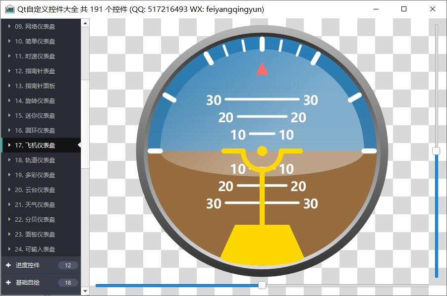

**功能特点**
1. 可设置外边框渐变颜色。
2. 可设置里边框渐变颜色。
3. 可设置主背景颜色、遮罩层颜色、刻度尺颜色。
4. 可设置线条颜色、文字颜色、指针颜色、遥感句柄颜色。
5. 可设置旋转角度。
6. 可设置滚动值。

**公共接口**
```cpp
public Q_SLOTS:
    //设置外边框渐变颜色
    void setBorderOutColorStart(const QColor &borderOutColorStart);
    void setBorderOutColorEnd(const QColor &borderOutColorEnd);

    //设置里边框渐变颜色
    void setBorderInColorStart(const QColor &borderInColorStart);
    void setBorderInColorEnd(const QColor &borderInColorEnd);

    //设置背景色
    void setBgColor(const QColor &bgColor);

    //设置姿态仪背景
    void setPlaneColor(const QColor &planeColor);

    //设置遮罩层颜色
    void setGlassColor(const QColor &glassColor);

    //设置刻度尺颜色
    void setScaleColor(const QColor &scaleColor);

    //设置线条颜色
    void setLineColor(const QColor &lineColor);

    //设置文字颜色
    void setTextColor(const QColor &textColor);

    //设置指针颜色
    void setPointerColor(const QColor &pointerColor);

    //设置手柄颜色
    void setHandleColor(const QColor &handleColor);

    //设置旋转角度值
    void setDegValue(int degValue);
    //设置前进旋转值
    void setRollValue(int rollValue);

Q_SIGNALS:
    void degChanged(int degValue);
    void rollChanged(int rollValue);
```

**使用示例**
```cpp
#pragma execution_character_set("utf-8")

#include "frmgaugeplane.h"
#include "ui_frmgaugeplane.h"

frmGaugePlane::frmGaugePlane(QWidget *parent) : QWidget(parent), ui(new Ui::frmGaugePlane)
{
    ui->setupUi(this);
}

frmGaugePlane::~frmGaugePlane()
{
    delete ui;
}

void frmGaugePlane::on_horizontalSlider_valueChanged(int value)
{
    ui->gaugePlane->setDegValue(value);
}

void frmGaugePlane::on_verticalSlider_valueChanged(int value)
{
    ui->gaugePlane->setRollValue(value);
}
```

##### 3.1.18 轨道仪表盘-gaugelpm
**运行效果**
 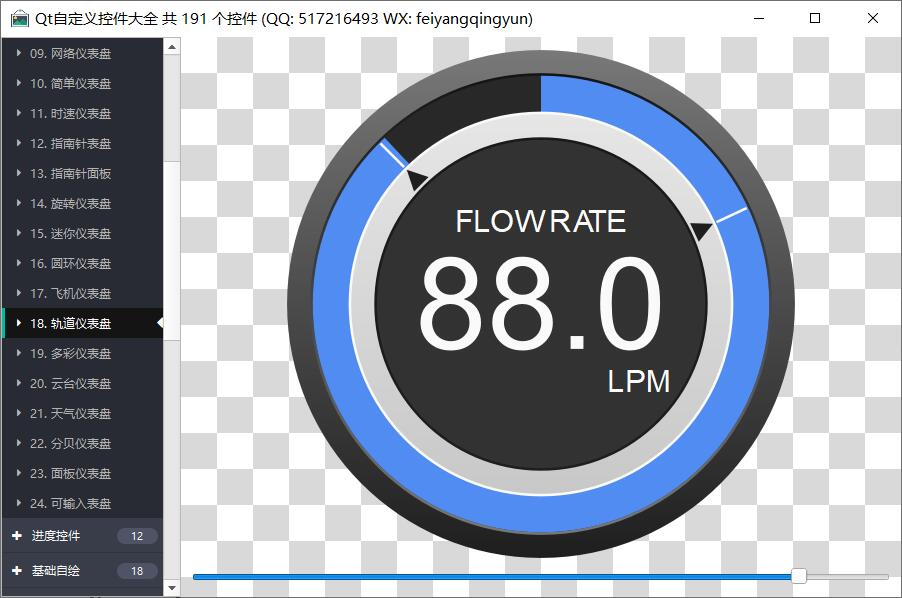

**功能特点**
1. 可设置范围值，支持负数值。
2. 可设置背景颜色。
3. 可设置进度颜色。
4. 可设置文字颜色。
5. 可设置标题文字。
6. 可设置单位文字。

**公共接口**
```cpp
public Q_SLOTS:
    //设置范围值
    void setRange(double minValue, double maxValue);
    void setRange(int minValue, int maxValue);

    //设置最大最小值
    void setMinValue(double minValue);
    void setMaxValue(double maxValue);

    //设置目标值
    void setValue(double value);
    void setValue(int value);

    //设置标题+单位
    void setTitle(const QString &title);
    void setUnit(const QString &unit);

    //设置背景颜色
    void setBgColor(const QColor &bgColor);
    //设置进度颜色
    void setPercentColor(const QColor &percentColor);
    //设置文字颜色
    void setTextColor(const QColor &textColor);

Q_SIGNALS:
    void valueChanged(int value);
    void clicked();
```

**使用示例**
```cpp
#pragma execution_character_set("utf-8")

#include "frmgaugelpm.h"
#include "ui_frmgaugelpm.h"

frmGaugeLpm::frmGaugeLpm(QWidget *parent) : QWidget(parent), ui(new Ui::frmGaugeLpm)
{
    ui->setupUi(this);
    this->initForm();
}

frmGaugeLpm::~frmGaugeLpm()
{
    delete ui;
}

void frmGaugeLpm::initForm()
{
    connect(ui->horizontalSlider, SIGNAL(valueChanged(int)), ui->gaugeLpm, SLOT(setValue(int)));
    ui->horizontalSlider->setRange(0, 100);
    ui->horizontalSlider->setValue(88);
}
```

##### 3.1.19 多彩仪表盘-gaugecolor
**运行效果**
 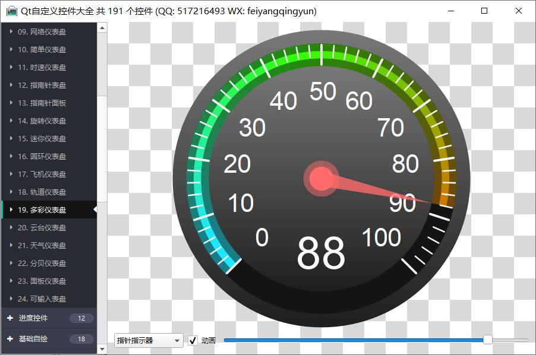

**功能特点**
1. 可设置范围值，支持负数值。
2. 可设置精确度，最大支持小数点后3位。
3. 可设置大刻度数量、小刻度数量。
4. 可设置开始旋转角度、结束旋转角度。
5. 可设置是否启用动画效果以及动画效果每次移动的步长。
6. 可设置外圆背景、内圆背景、进度三种颜色、刻度尺颜色、文字颜色。
7. 自适应窗体拉伸、刻度尺、文字自动缩放。
8. 可自由拓展各种渐变色，各圆的半径。
9. 指示器样式可选择圆形指示器、指针指示器、圆角指针指示器、三角形指示器。

**公共接口**
```cpp
public Q_SLOTS:
    //设置范围值
    void setRange(double minValue, double maxValue);
    void setRange(int minValue, int maxValue);

    //设置最大最小值
    void setMinValue(double minValue);
    void setMaxValue(double maxValue);

    //设置目标值
    void setValue(double value);
    void setValue(int value);

    //设置精确度
    void setPrecision(int precision);

    //设置主刻度数量
    void setScaleMajor(int scaleMajor);
    //设置小刻度数量
    void setScaleMinor(int scaleMinor);
    //设置开始旋转角度
    void setStartAngle(int startAngle);
    //设置结束旋转角度
    void setEndAngle(int endAngle);

    //设置是否启用动画显示
    void setAnimation(bool animation);
    //设置动画显示的步长
    void setAnimationStep(double animationStep);

    //设置边框颜色1
    void setBorderColor1(const QColor &borderColor1);
    //设置边框颜色2
    void setBorderColor2(const QColor &borderColor2);
    //设置进度颜色1
    void setPercentColor1(const QColor &percentColor1);
    //设置进度颜色2
    void setPercentColor2(const QColor &percentColor2);
    //设置进度颜色3
    void setPercentColor3(const QColor &percentColor3);

    //设置圆弧颜色
    void setBgColor(const QColor &bgColor);
    //设置刻度尺颜色
    void setScaleColor(const QColor &scaleColor);
    //设置刻度值颜色
    void setScaleNumColor(const QColor &scaleNumColor);
    //设置指针颜色
    void setPointerColor(const QColor &pointerColor);
    //设置文本颜色
    void setTextColor(const QColor &textColor);

    //设置指针样式
    void setPointerStyle(const PointerStyle &pointerStyle);

Q_SIGNALS:
    void valueChanged(int value);
```

**使用示例**
```cpp
#pragma execution_character_set("utf-8")

#include "frmgaugecolor.h"
#include "ui_frmgaugecolor.h"
#include "gaugecolor.h"

frmGaugeColor::frmGaugeColor(QWidget *parent) : QWidget(parent), ui(new Ui::frmGaugeColor)
{
    ui->setupUi(this);
    this->initForm();
}

frmGaugeColor::~frmGaugeColor()
{
    delete ui;
}

void frmGaugeColor::initForm()
{
    //设置范围值
    //ui->gaugeColor->setRange(-100, 100);
    //关联滑块值改变信号自动设置仪表盘的值
    connect(ui->horizontalSlider, SIGNAL(valueChanged(int)), ui->gaugeColor, SLOT(setValue(int)));
    //设置滑块初始值
    ui->horizontalSlider->setValue(88);
    //默认选中动画效果
    ui->ckAnimation->setChecked(true);
    //指针类型
    ui->cboxPointerStyle->setCurrentIndex(1);
}

void frmGaugeColor::on_cboxPointerStyle_currentIndexChanged(int index)
{
    //指针类型下拉框值切换后自动设置仪表盘对应的指针类型
    ui->gaugeColor->setPointerStyle((GaugeColor::PointerStyle)index);
}

void frmGaugeColor::on_ckAnimation_stateChanged(int arg1)
{
    //启用和禁用动画效果
    ui->gaugeColor->setAnimation(arg1 != 0);
}
```

##### 3.1.20 云台仪表盘-gaugecloud
**运行效果**
 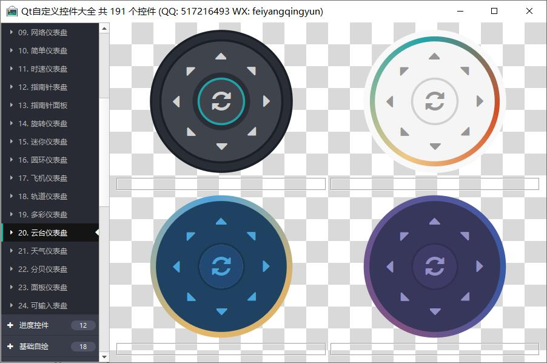

**功能特点**
1. 可设置背景颜色。
2. 可设置基准颜色。
3. 可设置边框颜色。
4. 可设置文本颜色。
5. 可识别每个角度及中间鼠标按下并发出信号。
6. 可设置八个角的图标和中间图标，随便换。
7. 内置4种云台风格黑色、白色、蓝色、紫色。
8. 支持拓展鼠标进入离开时的切换。
9. 精准识别内圆区域鼠标按下，而不是圆的矩形区域。
10. 支持长按连续触发，支持设定延时间隔和执行间隔。

**公共接口**
```cpp
public Q_SLOTS:
    //设置背景颜色
    void setBgColor(const QColor &bgColor);
    //设置基准颜色
    void setBaseColor(const QColor &baseColor);
    //设置圆弧颜色
    void setArcColor(const QColor &arcColor);
    //设置边框颜色
    void setBorderColor(const QColor &borderColor);
    //设置文本颜色
    void setTextColor(const QColor &textColor);
    //设置悬停文本颜色
    void setEnterColor(const QColor &enterColor);
    //设置按下文本颜色
    void setPressColor(const QColor &pressColor);

    //设置八个角图标
    void setIconText(const QString &iconText);
    //设置中间图标
    void setCenterText(const QString &centerText);
    //设置云台样式
    void setCloudStyle(const CloudStyle &cloudStyle);

    //设置是否启用长按重复执行
    void setAutoRepeat(bool autoRepeat);
    //设置延时执行长按时间
    void setAutoRepeatDelay(int autoRepeatDelay);
    //设置长按重复执行间隔
    void setAutoRepeatInterval(int autoRepeatInterval);

Q_SIGNALS:
    //鼠标按下的区域,共9个,从0-8依次表示底部/左下角/左侧/左上角/顶部/右上角/右侧/右下角/中间
    void mousePressed(int position, const QString &strPosition);
    //鼠标松开
    void mouseReleased(int position, const QString &strPosition);
```

**使用示例**
```cpp
#pragma execution_character_set("utf-8")

#include "frmgaugecloud.h"
#include "ui_frmgaugecloud.h"
#include "gaugecloud.h"
#include "qdebug.h"

frmGaugeCloud::frmGaugeCloud(QWidget *parent) : QWidget(parent), ui(new Ui::frmGaugeCloud)
{
    ui->setupUi(this);
    this->initForm();
}

frmGaugeCloud::~frmGaugeCloud()
{
    delete ui;
}

void frmGaugeCloud::initForm()
{
    connect(ui->gaugeCloud1, SIGNAL(mousePressed(int, QString)), this, SLOT(mousePressed(int, QString)));
    connect(ui->gaugeCloud2, SIGNAL(mousePressed(int, QString)), this, SLOT(mousePressed(int, QString)));
    connect(ui->gaugeCloud3, SIGNAL(mousePressed(int, QString)), this, SLOT(mousePressed(int, QString)));
    connect(ui->gaugeCloud4, SIGNAL(mousePressed(int, QString)), this, SLOT(mousePressed(int, QString)));

    connect(ui->gaugeCloud1, SIGNAL(mouseReleased(int, QString)), this, SLOT(mouseReleased(int, QString)));
    connect(ui->gaugeCloud2, SIGNAL(mouseReleased(int, QString)), this, SLOT(mouseReleased(int, QString)));
    connect(ui->gaugeCloud3, SIGNAL(mouseReleased(int, QString)), this, SLOT(mouseReleased(int, QString)));
    connect(ui->gaugeCloud4, SIGNAL(mouseReleased(int, QString)), this, SLOT(mouseReleased(int, QString)));

    ui->gaugeCloud2->setCloudStyle(GaugeCloud::CloudStyle_White);
    ui->gaugeCloud3->setCloudStyle(GaugeCloud::CloudStyle_Blue);
    ui->gaugeCloud4->setCloudStyle(GaugeCloud::CloudStyle_Purple);
}

void frmGaugeCloud::mousePressed(int position, const QString &strPosition)
{
    GaugeCloud *gaugeClound = (GaugeCloud *)sender();
    QString text = QString("当前按下了: %1 %2").arg(position).arg(strPosition);
    if (gaugeClound == ui->gaugeCloud1) {
        ui->labPosition1->setText(text);
    } else if (gaugeClound == ui->gaugeCloud2) {
        ui->labPosition2->setText(text);
    } else if (gaugeClound == ui->gaugeCloud3) {
        ui->labPosition3->setText(text);
    } else if (gaugeClound == ui->gaugeCloud4) {
        ui->labPosition4->setText(text);
    }

    qDebug() << "mousePressed" << position << strPosition;
}

void frmGaugeCloud::mouseReleased(int position, const QString &strPosition)
{
    qDebug() << "mouseReleased" << position << strPosition;
}
```

##### 3.1.21 天气仪表盘-gaugeweather
**运行效果**
 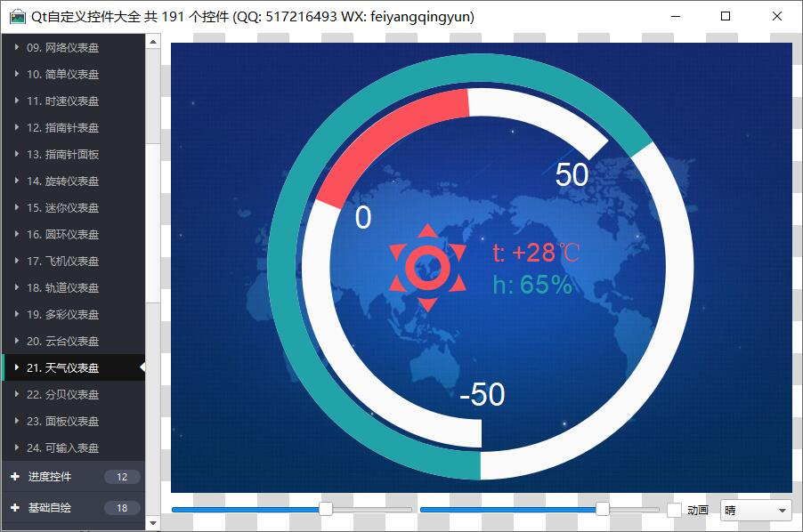

**功能特点**
1. 可设置两种值，比如温度、湿度。
2. 可设置两种值的背景颜色、文字颜色。
3. 可设置零度值左侧右侧两种颜色。
4. 可设置圆的起始角度和结束角度。
5. 可设置10种天气，晴天、雨天、阴天、大风等。
6. 可设置各种其他颜色。
7. 科设置是否启用动画显示进度以及动画步长。

**公共接口**
```cpp
public Q_SLOTS:
    //设置天气类型
    void setWeatherType(const WeatherType &weatherType);

    //设置范围值
    void setOuterRange(double minValue, double maxValue);
    //设置外环最大最小值
    void setOuterMinValue(double value);
    void setOuterMaxValue(double value);
    //设置外环值
    void setOuterValue(double value);

    //设置小数点
    void setPrecision(int precision);
    //设置外环开始旋转角度
    void setOuterStartAngle(int startAngle);
    //设置外环结束旋转角度
    void setOuterEndAngle(int endAngle);

    //设置外环背景色
    void setOuterRingBgColor(const QColor &color);
    //设置外环进度色
    void setOuterRingColor(const QColor &color);

    //设置内环范围值
    void setInnerRange(double minValue, double maxValue);
    //设置内环最大最小值
    void setInnerMinValue(double value);
    void setInnerMaxValue(double value);
    //设置内环值
    void setInnerValue(double value);

    //设置内环开始旋转角度
    void setInnerStartAngle(int startAngle);
    //设置内环结束旋转角度
    void setInnerEndAngle(int endAngle);

    //设置内环各种颜色
    void setInnerRingBgColor(const QColor &color);
    void setInnerNegativeColor(const QColor &color);
    void setInnerPositiveColor(const QColor &color);

    //设置内环刻度尺间隔
    void setInnerScaleMajor(int value);
    void setInnerScaleMinor(int value);
    //设置内环刻度尺颜色
    void setInnerScaleColor(const QColor &color);
    void setInnerScaleNumColor(const QColor &color);

    //设置中心图标颜色
    void setCenterPixMapNegativeColor(const QColor &color);
    void setCenterPixMapPositiveColor(const QColor &color);

    //设置外环内环文本颜色
    void setOuterValueTextColor(const QColor &color);
    void setInnerNegativeValueTextColor(const QColor &color);
    void setInnerPositiveValueTextColor(const QColor &color);

    //设置是否启用动画显示
    void setAnimation(bool animation);
    //设置动画显示的步长
    void setAnimationStep(double animationStep);

Q_SIGNALS:
    void valueChanged(double value);
```

**使用示例**
```cpp
#include "frmgaugeweather.h"
#include "ui_frmgaugeweather.h"

frmGaugeWeather::frmGaugeWeather(QWidget *parent) : QWidget(parent), ui(new Ui::frmGaugeWeather)
{
    ui->setupUi(this);
    this->initForm();
}

frmGaugeWeather::~frmGaugeWeather()
{
    delete ui;
}

void frmGaugeWeather::initForm()
{
    ui->widget->setStyleSheet("QWidget#widget{border-image: url(:/image/bg1.jpg);}");
    ui->horizontalSlider1->setValue(65);
    ui->horizontalSlider2->setValue(28);
    //ui->gaugeWeather->setPrecision(1);
    //ui->gaugeWeather->setOuterValue(32.6);
}

void frmGaugeWeather::on_horizontalSlider1_valueChanged(int value)
{
    ui->gaugeWeather->setOuterValue(value);
}

void frmGaugeWeather::on_horizontalSlider2_valueChanged(int value)
{
    ui->gaugeWeather->setInnerValue(value);
}

void frmGaugeWeather::on_comboBox_currentIndexChanged(int index)
{
    GaugeWeather::WeatherType type = (GaugeWeather::WeatherType)index;
    ui->gaugeWeather->setWeatherType(type);
}

void frmGaugeWeather::on_ckAnimation_stateChanged(int arg1)
{
    ui->gaugeWeather->setAnimation(arg1 != 0);
}
```

##### 3.1.22 分贝仪表盘-gaugedecibel
**运行效果**
 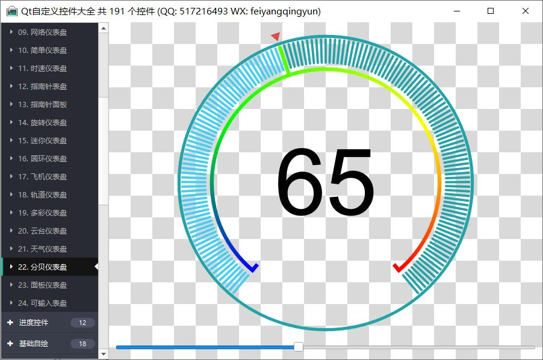

**功能特点**
1. 可设置当前度数。
2. 可设置背景颜色、文字颜色。
3. 可设置边框颜色、边框宽度。
4. 可设置渐变内环颜色集合。
5. 可设置启动动画和动画步长。

**公共接口**
```cpp
public Q_SLOTS:
    //设置外环最大最小值
    void setValue(double value);
    void setMinValue(double value);
    void setMaxValue(double value);
    void setRange(double minValue, double maxValue);

    //设置是否启用动画显示
    void setAnimation(bool animation);
    //设置动画显示的步长
    void setAnimationStep(int animationStep);

    //设置背景颜色+文字颜色+进度颜色+三角形颜色
    void setBgColor(const QColor &color);
    void setTextColor(const QColor &color);
    void setUsedColor(const QColor &color);
    void setTriangleColor(const QColor &color);

Q_SIGNALS:
    void valueChanged(double value);
```

**使用示例**
```cpp
#include "frmgaugedecibel.h"
#include "ui_frmgaugedecibel.h"

frmGaugeDecibel::frmGaugeDecibel(QWidget *parent) : QWidget(parent), ui(new Ui::frmGaugeDecibel)
{
    ui->setupUi(this);
    this->initForm();
}

frmGaugeDecibel::~frmGaugeDecibel()
{
    delete ui;
}

void frmGaugeDecibel::initForm()
{
    ui->horizontalSlider->setValue(65);
}

void frmGaugeDecibel::on_horizontalSlider_valueChanged(int value)
{
    ui->gaugeDecibel->setValue(value);
}
```

##### 3.1.23 面板仪表盘-gaugepanel
**运行效果**
 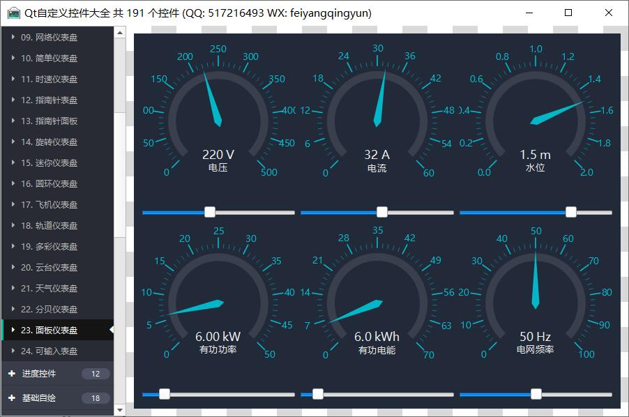

**功能特点**
1. 可设置范围值，支持负数值。
2. 可设置精确度、刻度尺精确度、最大支持小数点后3位。
3. 可设置大刻度数量、小刻度数量。
4. 可设置开始旋转角度、结束旋转角度。
5. 可设置是否启用动画效果以及动画效果每次移动的步长。
6. 可设置刻度颜色、文字颜色、圆环的宽度和颜色。
7. 自适应窗体拉伸、刻度尺、文字自动缩放。
8. 可设置单位以及仪表盘名称。

**公共接口**
```cpp
public Q_SLOTS:
    //设置范围值
    void setRange(double minValue, double maxValue);
    void setRange(int minValue, int maxValue);

    //设置最大最小值
    void setMinValue(double minValue);
    void setMaxValue(double maxValue);

    //设置目标值
    void setValue(double value);
    void setValue(int value);

    //设置精确度
    void setPrecision(int precision);
    //设置刻度尺精确度
    void setScalePrecision(int scalePrecision);

    //设置主刻度数量
    void setScaleMajor(int scaleMajor);
    //设置小刻度数量
    void setScaleMinor(int scaleMinor);
    //设置开始旋转角度
    void setStartAngle(int startAngle);
    //设置结束旋转角度
    void setEndAngle(int endAngle);

    //设置是否启用动画显示
    void setAnimation(bool animation);
    //设置动画显示的步长
    void setAnimationStep(double animationStep);

    //设置圆环宽度+颜色
    void setRingWidth(int ringWidth);
    void setRingColor(const QColor &ringColor);

    //设置刻度颜色
    void setScaleColor(const QColor &scaleColor);
    //设置指针颜色
    void setPointerColor(const QColor &pointerColor);
    //设置背景颜色
    void setBgColor(const QColor &bgColor);
    //设置文本颜色
    void setTextColor(const QColor &textColor);
    //设置单位
    void setUnit(const QString &unit);
    //设置中间描述文字
    void setText(const QString &text);

Q_SIGNALS:
    void valueChanged(int value);
```

**使用示例**
```cpp
#pragma execution_character_set("utf-8")

#include "frmgaugepanel.h"
#include "ui_frmgaugepanel.h"
#include "qdebug.h"

frmGaugePanel::frmGaugePanel(QWidget *parent) : QWidget(parent), ui(new Ui::frmGaugePanel)
{
    ui->setupUi(this);
    this->initForm();
}

frmGaugePanel::~frmGaugePanel()
{
    delete ui;
}

void frmGaugePanel::initForm()
{
#if 0
    ui->horizontalSlider1->setVisible(false);
    ui->horizontalSlider2->setVisible(false);
    ui->horizontalSlider3->setVisible(false);
    ui->horizontalSlider4->setVisible(false);
    ui->horizontalSlider5->setVisible(false);
    ui->horizontalSlider6->setVisible(false);
#endif

    //通过设置样式来设置颜色,另类的方法,也可以直接调用函数设置
    QStringList list;
    list.append("#widget{background:#222939;}");
    list.append("GaugePanel{qproperty-ringColor:#393F4D;qproperty-scaleColor:#03B7C9;"
                "qproperty-pointerColor:#03B7C9;qproperty-textColor:#EEEEEE;}");
    ui->widget->setStyleSheet(list.join(""));

    //设置单位
    ui->gaugePanel1->setUnit("V");
    ui->gaugePanel2->setUnit("A");
    ui->gaugePanel3->setUnit("m");
    ui->gaugePanel4->setUnit("kW");
    ui->gaugePanel5->setUnit("kWh");
    ui->gaugePanel6->setUnit("Hz");

    //设置名称
    ui->gaugePanel1->setText("电压");
    ui->gaugePanel2->setText("电流");
    ui->gaugePanel3->setText("水位");
    ui->gaugePanel4->setText("有功功率");
    ui->gaugePanel5->setText("有功电能");
    ui->gaugePanel6->setText("电网频率");

    //设置小数点
    ui->gaugePanel3->setPrecision(1);
    ui->gaugePanel4->setPrecision(2);
    ui->gaugePanel5->setPrecision(1);
    ui->gaugePanel3->setScalePrecision(1);

    //设置启用动画
    ui->gaugePanel4->setAnimation(true);
    ui->gaugePanel5->setAnimation(true);
    ui->gaugePanel5->setAnimationStep(0.2);

    //设置范围值
    ui->gaugePanel1->setRange(0, 500);
    ui->gaugePanel2->setRange(0, 60);
    ui->gaugePanel3->setRange(0, 2);
    ui->gaugePanel4->setRange(0, 50);
    ui->gaugePanel5->setRange(0, 70);
    ui->gaugePanel6->setRange(0, 100);

    ui->horizontalSlider1->setRange(0, 500);
    ui->horizontalSlider2->setRange(0, 60);
    ui->horizontalSlider3->setRange(0, 200);
    ui->horizontalSlider4->setRange(0, 50);
    ui->horizontalSlider5->setRange(0, 70);
    ui->horizontalSlider6->setRange(0, 100);

    //绑定滑块
    connect(ui->horizontalSlider1, SIGNAL(valueChanged(int)), ui->gaugePanel1, SLOT(setValue(int)));
    connect(ui->horizontalSlider2, SIGNAL(valueChanged(int)), ui->gaugePanel2, SLOT(setValue(int)));
    //connect(ui->horizontalSlider3, SIGNAL(valueChanged(int)), ui->gaugePanel3, SLOT(setValue(int)));
    connect(ui->horizontalSlider4, SIGNAL(valueChanged(int)), ui->gaugePanel4, SLOT(setValue(int)));
    connect(ui->horizontalSlider5, SIGNAL(valueChanged(int)), ui->gaugePanel5, SLOT(setValue(int)));
    connect(ui->horizontalSlider6, SIGNAL(valueChanged(int)), ui->gaugePanel6, SLOT(setValue(int)));

    //设置初始值
    ui->horizontalSlider1->setValue(220);
    ui->horizontalSlider2->setValue(32);
    ui->horizontalSlider3->setValue(150);
    ui->horizontalSlider4->setValue(6.34);
    ui->horizontalSlider5->setValue(6.28);
    ui->horizontalSlider6->setValue(50);
}

void frmGaugePanel::on_horizontalSlider3_valueChanged(int value)
{
    double v = (double)value / 100;
    ui->gaugePanel3->setValue(v);
}
```

##### 3.1.24 可输入表盘-gaugeedit
**运行效果**
 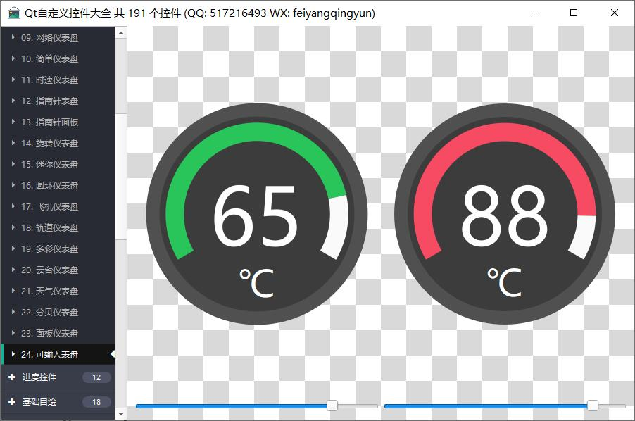

**功能特点**
1. 可设置范围值，支持负数值。
2. 可设置开始旋转角度、结束旋转角度。
3. 可设置是否启用动画效果以及动画效果每次移动的步长。
4. 可设置外圆背景、内圆背景、进度颜色、空余颜色、文字颜色。
5. 自适应窗体拉伸、文字自动缩放。
6. 支持tab及鼠标按下切换焦点。
7. 支持直接输入值立即应用。
8. 获取焦点控件自动变大。
9. 支持键盘上下键步长为1修改值。
10. 支持上下翻页键步长为10修改值。
11. 支持鼠标滚轮步长为1修改值。
12. 限定只能输入数字，支持小数位。
13. 数字大小自适应控件宽度变大变小。

**公共接口**
```cpp
public Q_SLOTS:
    //设置范围值
    void setRange(double minValue, double maxValue);
    void setRange(int minValue, int maxValue);

    //设置最大最小值
    void setMinValue(double minValue);
    void setMaxValue(double maxValue);

    //设置目标值
    void setValue(double value);
    void setValue(int value);

    //设置单位
    void setUnit(const QString &unit);

    //设置开始旋转角度
    void setStartAngle(int startAngle);
    //设置结束旋转角度
    void setEndAngle(int endAngle);

    //设置是否启用动画显示
    void setAnimation(bool animation);
    //设置动画显示的步长
    void setAnimationStep(double animationStep);

    //设置外圆背景颜色
    void setOuterCircleColor(const QColor &outerCircleColor);
    //设置内圆背景颜色
    void setInnerCircleColor(const QColor &innerCircleColor);
    //设置中心圆颜色
    void setCenterCircleColor(const QColor &centerCircleColor);
    //设置进度颜色
    void setUsedColor(const QColor &usedColor);
    //设置空余颜色
    void setFreeColor(const QColor &freeColor);
    //设置文本颜色
    void setTextColor(const QColor &textColor);

Q_SIGNALS:
    void valueChanged(double value);
    void valueChanged(int value);
```

**使用示例**
```cpp
#pragma execution_character_set("utf-8")

#include "frmgaugeedit.h"
#include "ui_frmgaugeedit.h"
#include "gaugeedit.h"

frmGaugeEdit::frmGaugeEdit(QWidget *parent) : QWidget(parent), ui(new Ui::frmGaugeEdit)
{
    ui->setupUi(this);
    this->initForm();
}

frmGaugeEdit::~frmGaugeEdit()
{
    delete ui;
}

void frmGaugeEdit::initForm()
{
    connect(ui->horizontalSlider1, SIGNAL(valueChanged(int)), ui->gaugeEdit1, SLOT(setValue(int)));
    connect(ui->horizontalSlider2, SIGNAL(valueChanged(int)), ui->gaugeEdit2, SLOT(setValue(int)));
    connect(ui->gaugeEdit1, SIGNAL(valueChanged(int)), ui->horizontalSlider1, SLOT(setValue(int)));
    connect(ui->gaugeEdit2, SIGNAL(valueChanged(int)), ui->horizontalSlider2, SLOT(setValue(int)));

    ui->gaugeEdit1->setUsedColor(QColor(41, 197, 90));
    ui->gaugeEdit2->setUsedColor(QColor(247, 74, 99));

    ui->gaugeEdit1->setRange(-100, 100);
    ui->gaugeEdit2->setRange(0, 100);
    ui->horizontalSlider1->setRange(-100, 100);
    ui->horizontalSlider2->setRange(0, 100);

    ui->horizontalSlider1->setFocus();
    ui->horizontalSlider2->setFocus();
    ui->horizontalSlider1->setValue(65);
    ui->horizontalSlider2->setValue(88);
}
```

#### 3.2 进度控件-progress
##### 3.2.1 水波进度条-progresswater
**运行效果**
 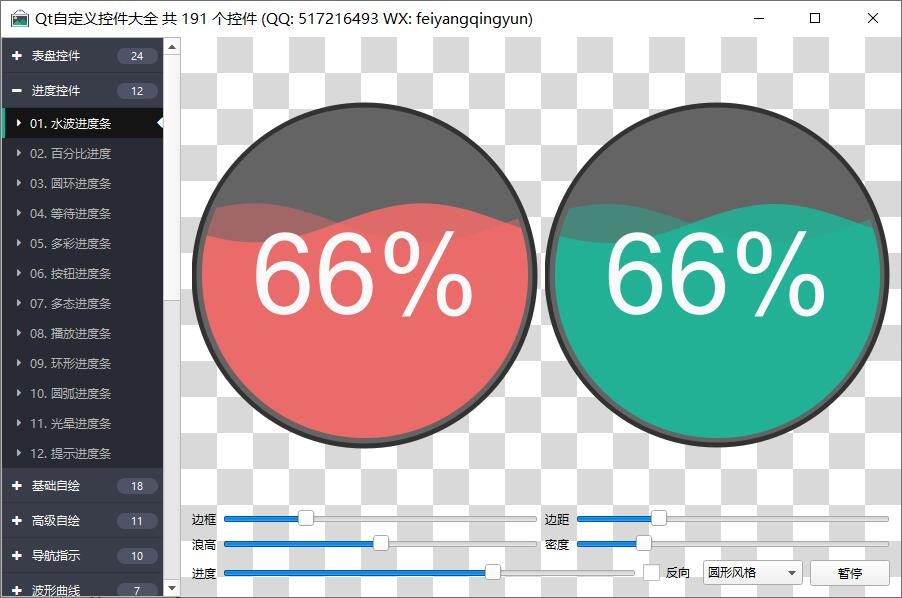

**功能特点**
1. 可设置范围值，支持负数值。
2. 可设置水波密度，密度越大浪越多。
3. 可设置水波高度，高度越大越浪。
4. 可设置边框宽度和边框边距。
5. 可设置是否显示进度值。
6. 可设置进度值是否为百分比格式。
7. 可设置背景颜色、边框颜色、当前进度颜色、文字颜色。
8. 可设置两条波浪是否反着走，类似迅雷进度球风格。
9. 提供槽函数启动和停止浪。
10. 提供四种样式风格选择矩形风格、圆形风格、椭圆风格、圆柱风格。

**公共接口**
```cpp
public Q_SLOTS:
    //设置范围值
    void setRange(int minValue, int maxValue);

    //设置最大最小值
    void setMinValue(int minValue);
    void setMaxValue(int maxValue);

    //设置目标值
    void setValue(int value);

    //设置边框宽度+边框间距+水波高度+水波密度
    void setBorderWidth(double borderWidth);
    void setBorderPadding(double borderPadding);
    void setWaterHeight(double waterHeight);
    void setWaterDensity(double waterDensity);

    //设置是否显示值
    void setShowValue(bool showValue);
    //设置是否显示百分比
    void setShowPercent(bool showPercent);
    //设置波浪是否反向走
    void setReverse(bool reverse);

    //设置边框颜色
    void setBorderColor(const QColor &borderColor);
    //设置背景颜色
    void setBgColor(const QColor &bgColor);
    //设置进度颜色
    void setUsedColor(const QColor &usedColor);
    //设置文本颜色
    void setTextColor(const QColor &textColor);

    //设置进度样式风格
    void setPercentStyle(const PercentStyle &percentStyle);

    //启动和停止波浪
    void start();
    void stop();

Q_SIGNALS:
    void valueChanged(int value);
```

**使用示例**
```cpp
#pragma execution_character_set("utf-8")

#include "frmprogresswater.h"
#include "ui_frmprogresswater.h"
#include "progresswater.h"

frmProgressWater::frmProgressWater(QWidget *parent) : QWidget(parent), ui(new Ui::frmProgressWater)
{
    ui->setupUi(this);
    this->initForm();
}

frmProgressWater::~frmProgressWater()
{
    delete ui;
}

void frmProgressWater::initForm()
{
    ui->progressWater1->setUsedColor(QColor(255, 107, 107));
    ui->progressWater2->setUsedColor(QColor(24, 189, 155));

    connect(ui->sliderValue, SIGNAL(valueChanged(int)), ui->progressWater1, SLOT(setValue(int)));
    connect(ui->sliderValue, SIGNAL(valueChanged(int)), ui->progressWater2, SLOT(setValue(int)));

    ui->sliderValue->setValue(66);
    ui->sliderBorderWidth->setValue(5);
    ui->sliderBorderPadding->setValue(5);
    ui->sliderWaterHeight->setValue(5);
    ui->sliderWaterDensity->setValue(2);
    ui->cboxPercentStyle->setCurrentIndex(1);
}

void frmProgressWater::on_sliderBorderWidth_valueChanged(int value)
{
    double v = (double)value;
    ui->progressWater1->setBorderWidth(v);
    ui->progressWater2->setBorderWidth(v);
}

void frmProgressWater::on_sliderBorderPadding_valueChanged(int value)
{
    double v = (double)value;
    ui->progressWater1->setBorderPadding(v);
    ui->progressWater2->setBorderPadding(v);
}

void frmProgressWater::on_sliderWaterHeight_valueChanged(int value)
{
    double v = (double)value / 100;
    ui->progressWater1->setWaterHeight(v);
    ui->progressWater2->setWaterHeight(v);
}

void frmProgressWater::on_sliderWaterDensity_valueChanged(int value)
{
    double v = (double)value;
    ui->progressWater1->setWaterDensity(v);
    ui->progressWater2->setWaterDensity(v);
}

void frmProgressWater::on_ckReverse_stateChanged(int arg1)
{
    bool reverse = (arg1 != 0);
    ui->progressWater1->setReverse(reverse);
    ui->progressWater2->setReverse(reverse);
}

void frmProgressWater::on_cboxPercentStyle_currentIndexChanged(const QString &arg1)
{
    if (arg1 == "矩形风格") {
        ui->progressWater1->setPercentStyle(ProgressWater::PercentStyle_Rect);
        ui->progressWater2->setPercentStyle(ProgressWater::PercentStyle_Rect);
    } else if (arg1 == "圆形风格") {
        ui->progressWater1->setPercentStyle(ProgressWater::PercentStyle_Circle);
        ui->progressWater2->setPercentStyle(ProgressWater::PercentStyle_Circle);
    } else if (arg1 == "椭圆风格") {
        ui->progressWater1->setPercentStyle(ProgressWater::PercentStyle_Ellipse);
        ui->progressWater2->setPercentStyle(ProgressWater::PercentStyle_Ellipse);
    } else if (arg1 == "圆柱风格") {
        ui->progressWater1->setPercentStyle(ProgressWater::PercentStyle_Cylinder);
        ui->progressWater2->setPercentStyle(ProgressWater::PercentStyle_Cylinder);
    }
}

void frmProgressWater::on_btnPause_clicked()
{
    if (ui->btnPause->text() == "暂停") {
        ui->progressWater1->stop();
        ui->progressWater2->stop();
        ui->btnPause->setText("启动");
    } else {
        ui->progressWater1->start();
        ui->progressWater2->start();
        ui->btnPause->setText("暂停");
    }
}
```

##### 3.2.2 百分比进度-progresspercent
**运行效果**
 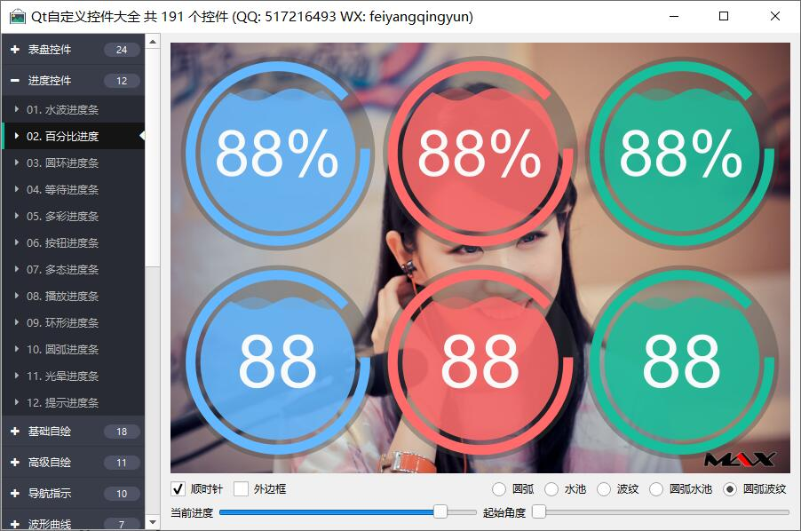

**功能特点**
1. 可设置范围值，支持负数值。
2. 可设置起始点度数。
3. 可设置顺时针逆时针。
4. 可设置进度条或者线条宽度。
5. 可设置是否显示百分比。
6. 可设置是否同时显示剩余进度条。
7. 可设置是否显示进度前面的小圆。
8. 可设置边框是否突出。
9. 可设置当前进度颜色、剩余进度颜色、文字颜色、中间圆颜色。
10. 提供五种样式风格选择圆弧风格、水池风格、波纹风格、圆弧水池风格、圆弧波纹风格。

**公共接口**
```cpp
public Q_SLOTS:
    //设置范围值
    void setRange(int minValue, int maxValue);

    //设置最大最小值
    void setMinValue(int minValue);
    void setMaxValue(int maxValue);

    //设置目标值
    void setValue(int value);

    //设置最小值位置
    void setNullPosition(int nullPosition);
    //设置边框宽度
    void setBorderWidth(int borderWidth);

    //设置水波高度
    void setWaterHeight(double waterHeight);
    //设置水波密度
    void setWaterDensity(double waterDensity);

    //设置是否显示百分比
    void setShowPercent(bool showPercent);
    //设置是否显示剩余进度
    void setShowFree(bool showFree);
    //设置是否显示小圆
    void setShowSmallCircle(bool showSmallCircle);
    //设置进度旋转方向 顺时针或者逆时针
    void setClockWise(bool clockWise);
    //设置边框是否突出
    void setBorderOut(bool borderOut);

    //设置已使用百分比颜色
    void setUsedColor(const QColor &usedColor);
    //设置未使用百分比颜色
    void setFreeColor(const QColor &freeColor);
    //设置圆颜色
    void setCircleColor(const QColor &circleColor);
    //设置文本颜色
    void setTextColor(const QColor &textColor);

    //设置进度样式风格
    void setPercentStyle(const PercentStyle &percentStyle);

Q_SIGNALS:
    void valueChanged(int value);
```

**使用示例**
```cpp
#pragma execution_character_set("utf-8")

#include "frmprogresspercent.h"
#include "ui_frmprogresspercent.h"
#include "progresspercent.h"

frmProgressPercent::frmProgressPercent(QWidget *parent) : QWidget(parent), ui(new Ui::frmProgressPercent)
{
    ui->setupUi(this);
    this->initForm();
}

frmProgressPercent::~frmProgressPercent()
{
    delete ui;
}

void frmProgressPercent::initForm()
{
    bars << ui->progressPercent1 << ui->progressPercent2 << ui->progressPercent3
         << ui->progressPercent4 << ui->progressPercent5 << ui->progressPercent6;

    ui->progressPercent2->setUsedColor(QColor(255, 107, 107));
    ui->progressPercent3->setUsedColor(QColor(24, 189, 155));
    ui->progressPercent5->setUsedColor(QColor(255, 107, 107));
    ui->progressPercent6->setUsedColor(QColor(24, 189, 155));

    ui->progressPercent4->setShowPercent(false);
    ui->progressPercent5->setShowPercent(false);
    ui->progressPercent6->setShowPercent(false);

    connect(ui->rbtnArc, SIGNAL(clicked(bool)), this, SLOT(rbtnClick()));
    connect(ui->rbtnPolo, SIGNAL(clicked(bool)), this, SLOT(rbtnClick()));
    connect(ui->rbtnWave, SIGNAL(clicked(bool)), this, SLOT(rbtnClick()));
    connect(ui->rbtnArcPolo, SIGNAL(clicked(bool)), this, SLOT(rbtnClick()));
    connect(ui->rbtnArcWave, SIGNAL(clicked(bool)), this, SLOT(rbtnClick()));

    QColor circleColor(70, 70, 70, 100);
    foreach (ProgressPercent *bar, bars) {
        bar->setCircleColor(circleColor);
        connect(ui->horizontalSlider1, SIGNAL(valueChanged(int)), bar, SLOT(setValue(int)));
        connect(ui->horizontalSlider2, SIGNAL(valueChanged(int)), bar, SLOT(setNullPosition(int)));
    }

    ui->rbtnArcWave->click();
    ui->horizontalSlider1->setValue(88);
}

void frmProgressPercent::rbtnClick()
{
    QRadioButton *rbtn = (QRadioButton *)sender();
    QString text = rbtn->text();

    if (text == "圆弧") {
        foreach (ProgressPercent *bar, bars) {
            bar->setPercentStyle(ProgressPercent::PercentStyle_Arc);
        }
    } else if (text == "水池") {
        foreach (ProgressPercent *bar, bars) {
            bar->setPercentStyle(ProgressPercent::PercentStyle_Polo);
        }
    } else if (text == "波纹") {
        foreach (ProgressPercent *bar, bars) {
            bar->setPercentStyle(ProgressPercent::PercentStyle_Wave);
        }
    } else if (text == "圆弧水池") {
        foreach (ProgressPercent *bar, bars) {
            bar->setPercentStyle(ProgressPercent::PercentStyle_Arc_Polo);
        }
    } else if (text == "圆弧波纹") {
        foreach (ProgressPercent *bar, bars) {
            bar->setPercentStyle(ProgressPercent::PercentStyle_Arc_Wave);
        }
    }
}

void frmProgressPercent::on_ckClockWise_stateChanged(int arg1)
{
    bool ok = (arg1 != 0);
    foreach (ProgressPercent *bar, bars) {
        bar->setClockWise(ok);
    }
}

void frmProgressPercent::on_ckBorderOut_stateChanged(int arg1)
{
    bool ok = (arg1 != 0);
    foreach (ProgressPercent *bar, bars) {
        bar->setBorderOut(ok);
    }
}
```

##### 3.2.3 圆环进度条-progressround
**运行效果**
 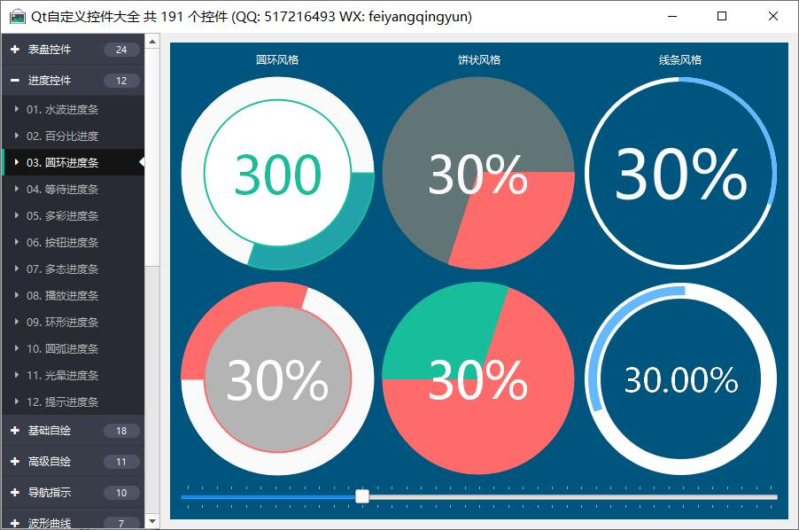

**功能特点**
1. 支持三种风格样式 圆环风格、饼状风格、线条风格。
2. 自动居中绘制显示。
3. 可设置顺时针逆时针走向。
4. 可设置起始进度位置。
5. 可设置范围值。
6. 可设置各种颜色。
7. 可设置当前值。
8. 可设置整个部件的背景。
9. 可设置未填充进度区域的背景。
10. 可设置文本显示所在的中间圆环的背景。
11. 可设置未填充区域的前景色、边框色。
12. 可设置填充进度条区域的背景色。
13. 可设置在中心显示的文本色。

**公共接口**
```cpp
public Q_SLOTS:
    //设置各种颜色
    void setBgColor(const QColor &bgColor);
    void setTextColor(const QColor &textColor);
    void setBaseColor(const QColor &baseColor);
    void setInnerBgColor(const QColor &innerBgColor);
    void setBorderColor(const QColor &borderColor);
    void setProgressColor(const QColor &progressColor);

    //设置范围值
    void setRange(double minValue, double maxValue);
    void setRange(int minValue, int maxValue);

    //设置最大最小值
    void setMinValue(double minValue);
    void setMaxValue(double maxValue);

    //设置目标值
    void setValue(double value);
    void setValue(int value);

    //设置精确度,小数点后几位
    void setPrecision(int precision);

    //设置最小值位置
    void setNullPosition(double nullPosition);
    //设置外边框宽度
    void setOutlinePenWidth(double outlinePenWidth);
    //设置数据文本宽度
    void setDataPenWidth(double dataPenWidth);

    //设置样式
    void setBarStyle(const BarStyle &barStyle);
    //设置格式
    void setFormat(const QString &format);

    //设置进度旋转方向
    void setClockWise(bool clockWise);
    //设置颜色集合
    void setGradientData(const QGradientStops &gradientData);
```

**使用示例**
```cpp
#pragma execution_character_set("utf-8")

#include "frmprogressround.h"
#include "ui_frmprogressround.h"
#include "progressround.h"

frmProgressRound::frmProgressRound(QWidget *parent) : QWidget(parent), ui(new Ui::frmProgressRound)
{
    ui->setupUi(this);
    this->initForm();
}

frmProgressRound::~frmProgressRound()
{
    delete ui;
}

void frmProgressRound::initForm()
{
    //默认样式+值格式+圆环颜色
    ui->progressRound1->setBgColor(QColor(0, 85, 127));
    ui->progressRound1->setTextColor(QColor(24, 189, 155));
    ui->progressRound1->setBaseColor(QColor(250, 250, 250));
    ui->progressRound1->setInnerBgColor(QColor(255, 255, 255));
    ui->progressRound1->setBorderColor(QColor(24, 189, 155));

    ui->progressRound1->setFormat("%v");
    ui->progressRound1->setPrecision(0);
    ui->progressRound1->setNullPosition(0);
    connectToSlider(ui->progressRound1);

    //饼状图+背景色+起始位置
    ui->progressRound2->setBgColor(QColor(0, 85, 127));
    ui->progressRound2->setTextColor(QColor(250, 250, 250));
    ui->progressRound2->setBaseColor(QColor(97, 117, 118));
    ui->progressRound2->setProgressColor(QColor(255, 107, 107));
    ui->progressRound2->setBorderColor(QColor(255, 107, 107));

    ui->progressRound2->setNullPosition(0);
    ui->progressRound2->setBarStyle(ProgressRound::BarStyle_Pie);
    connectToSlider(ui->progressRound2);

    //线状图+线颜色
    ui->progressRound3->setBgColor(QColor(0, 85, 127));
    ui->progressRound3->setTextColor(QColor(250, 250, 250));
    ui->progressRound3->setBaseColor(QColor(255, 255, 255));
    ui->progressRound3->setProgressColor(QColor(100, 184, 255));

    ui->progressRound3->setBarStyle(ProgressRound::BarStyle_Line);
    ui->progressRound3->setOutlinePenWidth(5);
    ui->progressRound3->setDataPenWidth(5);
    connectToSlider(ui->progressRound3);

    //默认样式+自定义颜色组合
    ui->progressRound4->setBgColor(QColor(0, 85, 127));
    ui->progressRound4->setTextColor(QColor(255, 255, 255));
    ui->progressRound4->setBaseColor(QColor(250, 250, 250));
    ui->progressRound4->setInnerBgColor(QColor(180, 180, 180));
    ui->progressRound4->setProgressColor(QColor(255, 107, 107));
    ui->progressRound4->setBorderColor(QColor(255, 107, 107));

    ui->progressRound4->setNullPosition(180);
    ui->progressRound4->setPrecision(0);

    QGradientStops gradientPoints4;
    gradientPoints4 << QGradientStop(0, QColor(254, 64, 64)) << QGradientStop(0.5, QColor(255, 127, 36)) << QGradientStop(1, QColor(238, 238, 0));
    ui->progressRound4->setGradientData(gradientPoints4);
    connectToSlider(ui->progressRound4);

    //饼图样式+自定义颜色组合
    ui->progressRound5->setBgColor(QColor(0, 85, 127));
    ui->progressRound5->setTextColor(QColor(255, 255, 255));
    ui->progressRound5->setBaseColor(QColor(255, 107, 107));
    ui->progressRound5->setInnerBgColor(QColor(180, 180, 180));
    ui->progressRound5->setProgressColor(QColor(24, 189, 155));
    ui->progressRound5->setBorderColor(QColor(24, 189, 155));

    ui->progressRound5->setNullPosition(180);
    ui->progressRound5->setBarStyle(ProgressRound::BarStyle_Pie);
    connectToSlider(ui->progressRound5);

    //线状样式+自定义边框宽度
    ui->progressRound6->setBgColor(QColor(0, 85, 127));
    ui->progressRound6->setTextColor(QColor(250, 250, 250));
    ui->progressRound6->setBaseColor(QColor(255, 255, 255));
    ui->progressRound6->setProgressColor(QColor(100, 184, 255));

    ui->progressRound6->setPrecision(2);
    ui->progressRound6->setBarStyle(ProgressRound::BarStyle_Line);
    ui->progressRound6->setOutlinePenWidth(18);
    ui->progressRound6->setDataPenWidth(10);
    ui->progressRound6->setClockWise(false);
    connectToSlider(ui->progressRound6);
}

void frmProgressRound::connectToSlider(ProgressRound *bar)
{
    bar->setRange(ui->slider->minimum(), ui->slider->maximum());
    bar->setValue(ui->slider->value());
    connect(ui->slider, SIGNAL(valueChanged(int)), bar, SLOT(setValue(int)));
}
```

##### 3.2.4 等待进度条-progresswait
**运行效果**
 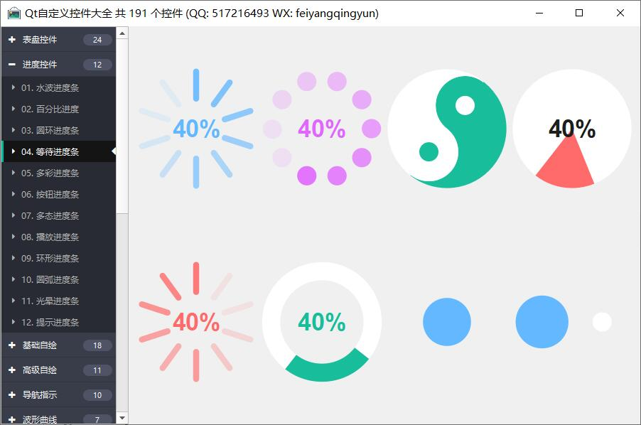

**功能特点**
1. 支持多种等待样式风格 圆弧状风格、旋转圆风格、三角圆弧、线条风格、圆环风格。
2. 可设置范围值和当前值。
3. 可设置前景色背景色。
4. 可设置顺时针逆时针旋转。
5. 支持任意大小缩放。
6. 支持设置旋转速度间隔。

**公共接口**
```cpp
public Q_SLOTS:
    //设置顺时针逆时针旋转
    void setClockWise(bool clockWise);
    //设置是否显示百分比
    void setShowPercent(bool showPercent);
    //设置当前值
    void setCurrentValue(int currentValue);
    //设置最大值
    void setMaxValue(int maxValue);
    //设置旋转速度间隔
    void setInterval(int interval);

    //设置样式
    void setBarStyle(const BarStyle &barStyle);
    //设置前景色
    void setBackground(const QColor &background);
    //设置前景色
    void setForeground(const QColor &foreground);
    //设置文字颜色
    void setTextColor(const QColor &textColor);
```

**使用示例**
```cpp
#pragma execution_character_set("utf-8")

#include "frmprogresswait.h"
#include "ui_frmprogresswait.h"

frmProgressWait::frmProgressWait(QWidget *parent) : QWidget(parent), ui(new Ui::frmProgressWait)
{
    ui->setupUi(this);
    this->initForm();
}

frmProgressWait::~frmProgressWait()
{
    delete ui;
}

void frmProgressWait::initForm()
{
    ui->progressWait1->setShowPercent(true);
    ui->progressWait2->setShowPercent(true);
    ui->progressWait3->setShowPercent(false);
    ui->progressWait4->setShowPercent(true);
    ui->progressWait5->setShowPercent(true);
    ui->progressWait6->setShowPercent(true);
    ui->progressWait7->setShowPercent(false);
    ui->progressWait8->setShowPercent(false);

    ui->progressWait1->setBarStyle(ProgressWait::BarStyle_Line);

    ui->progressWait2->setForeground(QColor(225, 102, 255));
    ui->progressWait2->setTextColor(QColor(225, 102, 255));
    ui->progressWait2->setBarStyle(ProgressWait::BarStyle_RoundCircle);

    ui->progressWait3->setForeground(QColor(24, 189, 155));
    ui->progressWait3->setBarStyle(ProgressWait::BarStyle_Arc);

    ui->progressWait4->setForeground(QColor(255, 107, 107));
    ui->progressWait4->setTextColor(QColor(30, 30, 30));
    ui->progressWait4->setBarStyle(ProgressWait::BarStyle_Pie);

    ui->progressWait5->setClockWise(false);
    ui->progressWait5->setForeground(QColor(255, 107, 107));
    ui->progressWait5->setTextColor(QColor(255, 107, 107));
    ui->progressWait5->setBarStyle(ProgressWait::BarStyle_Line);

    ui->progressWait6->setForeground(QColor(24, 189, 155));
    ui->progressWait6->setTextColor(QColor(24, 189, 155));
    ui->progressWait6->setBarStyle(ProgressWait::BarStyle_Ring);

    ui->progressWait7->setBarStyle(ProgressWait::BarStyle_SingleCircle);
    ui->progressWait8->setBarStyle(ProgressWait::BarStyle_DoubleCircle);
}
```

##### 3.2.5 多彩进度条-progresscolor
**运行效果**
 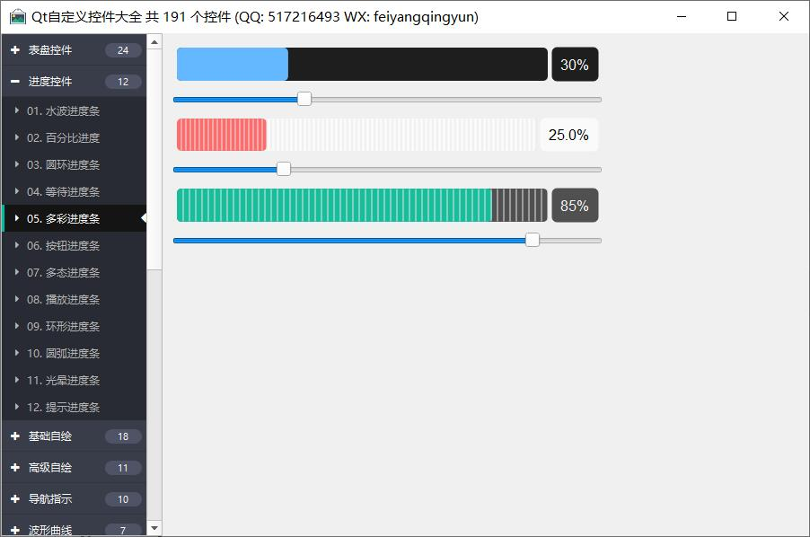

**功能特点**
1. 可设置精确度、步长、圆角角度。
2. 可设置范围值和当前值。
3. 可设置前景色背景色等各种颜色。

**公共接口**
```cpp
public Q_SLOTS:
    //设置范围值
    void setRange(double minValue, double maxValue);
    void setRange(int minValue, int maxValue);

    //设置最大最小值
    void setMinValue(double minValue);
    void setMaxValue(double maxValue);

    //设置目标值
    void setValue(double value);
    void setValue(int value);

    //设置精确度
    void setPrecision(int precision);

    //设置步长
    void setStep(int step);
    //设置间距
    void setSpace(int space);
    //设置圆角角度
    void setRadius(int radius);

    //设置背景颜色
    void setBgColorStart(const QColor &bgColorStart);
    void setBgColorEnd(const QColor &bgColorEnd);

    //设置线条颜色
    void setLineColor(QColor lineColor);
    //设置文本颜色
    void setTextColor(QColor textColor);
    //设置进度颜色
    void setBarBgColor(QColor barBgColor);
    void setBarColor(QColor barColor);

Q_SIGNALS:
    void valueChanged(double value);
```

**使用示例**
```cpp
#pragma execution_character_set("utf-8")

#include "frmprogresscolor.h"
#include "ui_frmprogresscolor.h"

frmProgressColor::frmProgressColor(QWidget *parent) : QWidget(parent), ui(new Ui::frmProgressColor)
{
    ui->setupUi(this);
    this->initForm();
}

frmProgressColor::~frmProgressColor()
{
    delete ui;
}

void frmProgressColor::initForm()
{
    ui->progressColor1->setTextColor(QColor(250, 250, 250));
    ui->progressColor1->setBarBgColor(QColor(30, 30, 30));

    ui->progressColor2->setBarColor(QColor(255, 107, 107));
    ui->progressColor2->setPrecision(1);
    ui->progressColor2->setStep(5);

    ui->progressColor3->setTextColor(QColor(250, 250, 250));
    ui->progressColor3->setBarBgColor(QColor(80, 80, 80));
    ui->progressColor3->setBarColor(QColor(24, 189, 155));
    ui->progressColor3->setStep(7);

    connect(ui->horizontalSlider1, SIGNAL(valueChanged(int)), ui->progressColor1, SLOT(setValue(int)));
    connect(ui->horizontalSlider2, SIGNAL(valueChanged(int)), ui->progressColor2, SLOT(setValue(int)));
    connect(ui->horizontalSlider3, SIGNAL(valueChanged(int)), ui->progressColor3, SLOT(setValue(int)));

    ui->progressColor1->setRange(0, 100);
    ui->progressColor2->setRange(0, 200);
    ui->progressColor3->setRange(-100, 100);

    ui->horizontalSlider1->setRange(0, 100);
    ui->horizontalSlider2->setRange(0, 200);
    ui->horizontalSlider3->setRange(-100, 100);

    ui->horizontalSlider1->setValue(30);
    ui->horizontalSlider2->setValue(50);
    ui->horizontalSlider3->setValue(70);
}
```

##### 3.2.6 按钮进度条-progressbutton
**运行效果**
 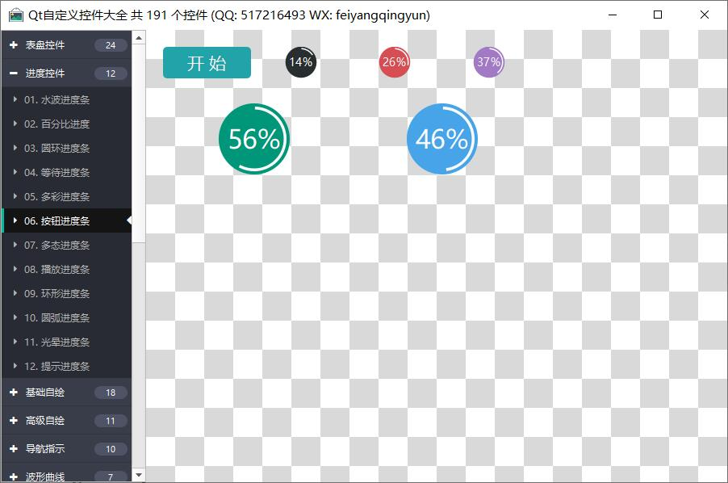

**功能特点**
1. 可设置进度线条宽度、颜色。
2. 可设置边框宽度、颜色。
3. 可设置圆角角度、背景颜色。

**公共接口**
```cpp
public Q_SLOTS:
    //设置线条宽度+颜色
    void setLineWidth(int lineWidth);
    void setLineColor(const QColor &lineColor);

    //设置边框宽度+颜色
    void setBorderWidth(int borderWidth);
    void setBorderColor(const QColor &borderColor);

    //设置圆角角度+背景颜色
    void setBorderRadius(int borderRadius);
    void setBgColor(const QColor &bgColor);

Q_SIGNALS:
    void valueChanged(int value);
```

**使用示例**
```cpp
#pragma execution_character_set("utf-8")

#include "frmprogressbutton.h"
#include "ui_frmprogressbutton.h"

frmProgressButton::frmProgressButton(QWidget *parent) : QWidget(parent), ui(new Ui::frmProgressButton)
{
    ui->setupUi(this);
    this->initForm();
}

frmProgressButton::~frmProgressButton()
{
    delete ui;
}

void frmProgressButton::initForm()
{
    ui->progressButton2->setBgColor(QColor(40, 45, 48));
    ui->progressButton3->setBgColor(QColor(214, 77, 84));
    ui->progressButton4->setBgColor(QColor(162, 121, 197));
    ui->progressButton5->setBgColor(QColor(0, 150, 121));
    ui->progressButton6->setBgColor(QColor(71, 164, 233));
}
```

##### 3.2.7 多态进度条-progressthree
**运行效果**
 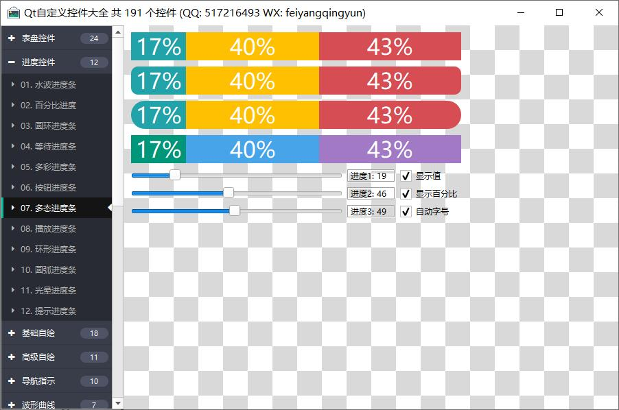

**功能特点**
1. 可设置三种状态不同的值。
2. 可设置三种状态不同的颜色。
3. 可设置圆角角度。
4. 可设置启用自动圆角。
5. 可设置边框宽度、颜色。
6. 可设置是否显示值或者百分比。
7. 可设置字体自适应大小。
8. 可设置背景颜色、文字颜色。
9. 精准计算圆角角度，解决了QSS中border-radius当进度小于圆角角度出现方形的BUG。

**公共接口**
```cpp
public Q_SLOTS:
    //设置三个值
    void setValue1(int value1);
    void setValue2(int value2);
    void setValue3(int value3);

    //设置三个颜色
    void setColor1(const QColor &color1);
    void setColor2(const QColor &color2);
    void setColor3(const QColor &color3);

    //设置圆角+自动圆角
    void setRadius(int radius);
    void setAutoRadius(bool autoRadius);

    //设置显示值+显示百分比+自动字体大小
    void setShowValue(bool showValue);
    void setShowPercent(bool showPercent);
    void setAutoFont(bool autoFont);

    //设置边框宽度+颜色
    void setBorderWidth(double borderWidth);
    void setBorderColor(const QColor &borderColor);

    //设置背景颜色+文字颜色
    void setBgColor(const QColor &bgColor);
    void setTextColor(const QColor &textColor);
```

**使用示例**
```cpp
#pragma execution_character_set("utf-8")

#include "frmprogressthree.h"
#include "ui_frmprogressthree.h"

frmProgressThree::frmProgressThree(QWidget *parent) : QWidget(parent), ui(new Ui::frmProgressThree)
{
    ui->setupUi(this);
    this->initForm();
}

frmProgressThree::~frmProgressThree()
{
    delete ui;
}

void frmProgressThree::initForm()
{
    ui->progressThree2->setRadius(10);
    ui->progressThree3->setAutoRadius(true);

    ui->progressThree4->setColor1(QColor(0, 150, 121));
    ui->progressThree4->setColor2(QColor(71, 164, 233));
    ui->progressThree4->setColor3(QColor(162, 121, 197));
}

void frmProgressThree::on_horizontalSlider1_valueChanged(int value)
{
    ui->progressThree1->setValue1(value);
    ui->progressThree2->setValue1(value);
    ui->progressThree3->setValue1(value);
    ui->progressThree4->setValue1(value);
    ui->labValue1->setText(QString("进度1: %1").arg(value));
}

void frmProgressThree::on_horizontalSlider2_valueChanged(int value)
{
    ui->progressThree1->setValue2(value);
    ui->progressThree2->setValue2(value);
    ui->progressThree3->setValue2(value);
    ui->progressThree4->setValue2(value);
    ui->labValue2->setText(QString("进度2: %1").arg(value));
}

void frmProgressThree::on_horizontalSlider3_valueChanged(int value)
{
    ui->progressThree1->setValue3(value);
    ui->progressThree2->setValue3(value);
    ui->progressThree3->setValue3(value);
    ui->progressThree4->setValue3(value);
    ui->labValue3->setText(QString("进度3: %1").arg(value));
}

void frmProgressThree::on_ckShowValue_stateChanged(int arg1)
{
    bool ok = (arg1 != 0);
    ui->progressThree1->setShowValue(ok);
    ui->progressThree2->setShowValue(ok);
    ui->progressThree3->setShowValue(ok);
    ui->progressThree4->setShowValue(ok);
}

void frmProgressThree::on_ckShowPercent_stateChanged(int arg1)
{
    bool ok = (arg1 != 0);
    ui->progressThree1->setShowPercent(ok);
    ui->progressThree2->setShowPercent(ok);
    ui->progressThree3->setShowPercent(ok);
    ui->progressThree4->setShowPercent(ok);
}

void frmProgressThree::on_ckAutoFont_stateChanged(int arg1)
{
    bool ok = (arg1 != 0);
    ui->progressThree1->setAutoFont(ok);
    ui->progressThree2->setAutoFont(ok);
    ui->progressThree3->setAutoFont(ok);
    ui->progressThree4->setAutoFont(ok);
}
```

##### 3.2.8 播放进度条-progressplay
**运行效果**
 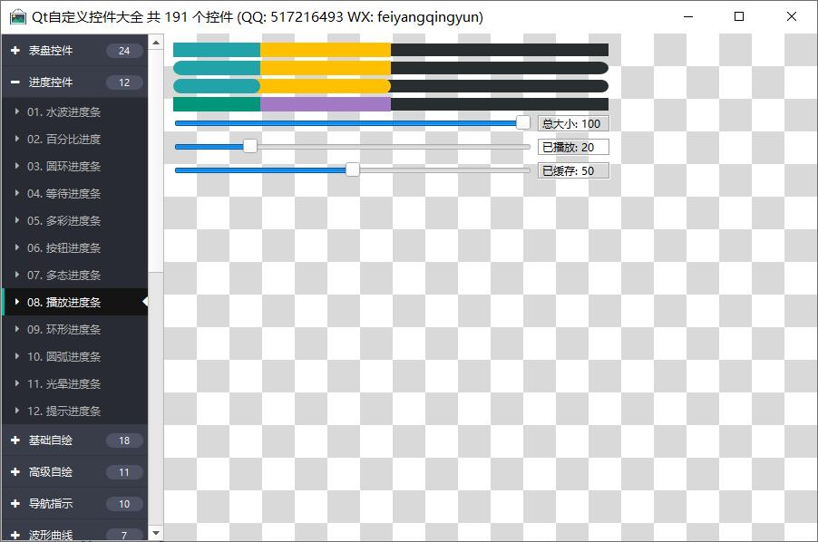

**功能特点**
1. 可设置总大小、缓存大小、已播放不同的值。
2. 可设置总大小、缓存大小、已播放不同的颜色。
3. 可设置圆角角度。
4. 可设置启用自动圆角。
5. 可设置边框宽度、颜色。
6. 可设置背景颜色、文字颜色。
7. 可直接单击定位，发送信号。
8. 可设置启用进度圆角角度。
9. 精准计算圆角角度，解决了QSS中border-radius当进度小于圆角角度出现方形的BUG。

**公共接口**
```cpp
public Q_SLOTS:
    //设置 总大小+缓存大小+已播放 值
    void setValueAll(int valueAll);
    void setValuePlay(int valuePlay);
    void setValueLoad(int valueLoad);

    //设置 缓存大小+已播放 颜色
    void setColorPlay(const QColor &colorPlay);
    void setColorLoad(const QColor &colorLoad);

    //设置背景颜色+文字颜色
    void setBgColor(const QColor &bgColor);
    void setTextColor(const QColor &textColor);

    //设置圆角+自动圆角+是否显示进度圆角角度
    void setRadius(int radius);
    void setAutoRadius(bool autoRadius);
    void setShowProgressRadius(bool showProgressRadius);

    //设置边框宽度+颜色
    void setBorderWidth(double borderWidth);
    void setBorderColor(const QColor &borderColor);
```

**使用示例**
```cpp
#pragma execution_character_set("utf-8")

#include "frmprogressplay.h"
#include "ui_frmprogressplay.h"

frmProgressPlay::frmProgressPlay(QWidget *parent) : QWidget(parent), ui(new Ui::frmProgressPlay)
{
    ui->setupUi(this);
    this->initForm();
}

frmProgressPlay::~frmProgressPlay()
{
    delete ui;
}

void frmProgressPlay::initForm()
{
    ui->progressPlay2->setRadius(10);
    ui->progressPlay3->setAutoRadius(true);
    //ui->progressPlay2->setShowProgressRadius(true);
    ui->progressPlay3->setShowProgressRadius(true);

    ui->progressPlay4->setColorPlay(QColor(0, 150, 121));
    ui->progressPlay4->setColorLoad(QColor(162, 121, 197));
}

void frmProgressPlay::on_horizontalSlider1_valueChanged(int value)
{
    ui->progressPlay1->setValueAll(value);
    ui->progressPlay2->setValueAll(value);
    ui->progressPlay3->setValueAll(value);
    ui->progressPlay4->setValueAll(value);
    ui->labValueAll->setText(QString("总大小: %1").arg(value));
}

void frmProgressPlay::on_horizontalSlider2_valueChanged(int value)
{
    ui->progressPlay1->setValuePlay(value);
    ui->progressPlay2->setValuePlay(value);
    ui->progressPlay3->setValuePlay(value);
    ui->progressPlay4->setValuePlay(value);
    ui->labValuePlay->setText(QString("已播放: %1").arg(value));
}

void frmProgressPlay::on_horizontalSlider3_valueChanged(int value)
{
    ui->progressPlay1->setValueLoad(value);
    ui->progressPlay2->setValueLoad(value);
    ui->progressPlay3->setValueLoad(value);
    ui->progressPlay4->setValueLoad(value);
    ui->labValueLoad->setText(QString("已缓存: %1").arg(value));
}
```

##### 3.2.9 环形进度条-progressring
**运行效果**
 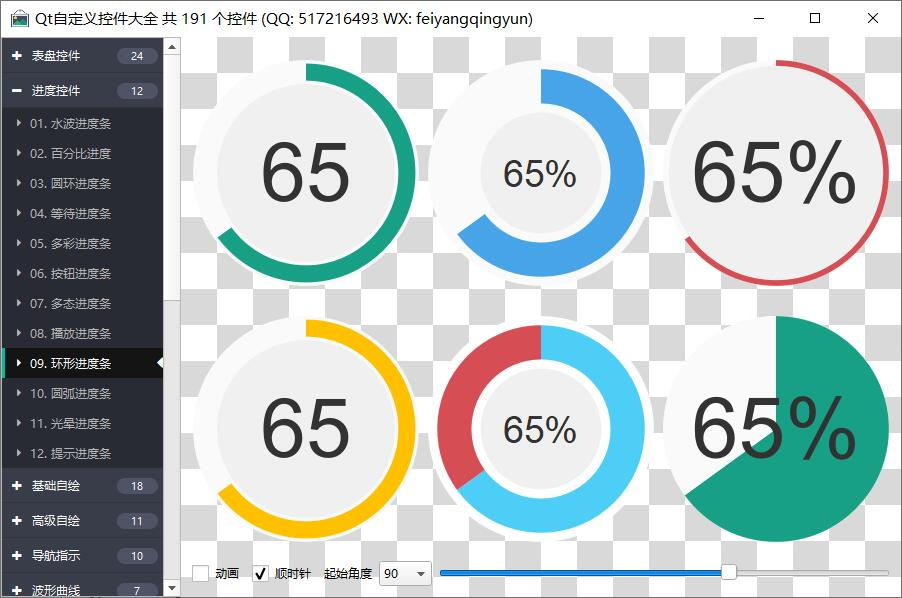

**功能特点**
1. 可设置范围值，支持负数值。
2. 可设置精确度，最大支持小数点后3位。
3. 可设置起始角度。
4. 可设置三种值、三种颜色，启用自动检测值后绘制不同的颜色。
5. 可设置是否启用动画效果以及动画效果每次移动的步长。
6. 可设置背景颜色、文字颜色、进度颜色、中间圆颜色。
7. 可设置值警戒报警比较模式 0-不比较、1-最大值报警、2-最小值报警。
8. 可设置显示的值是百分比。
9. 可设置圆环与背景之间的距离即间距。
10. 可设置圆环的宽度。
11. 可设置圆环背景颜色，形成两种颜色差。
12. 可设置顺时针逆时针转。
13. 可设置中间圆是否扣掉透明。
14. 可设置直接显示的文字优先显示。
15. 自适应窗体拉伸，刻度尺和文字自动缩放。

**公共接口**
```cpp
public Q_SLOTS:
    //设置范围值
    void setRange(double minValue, double maxValue);
    void setRange(int minValue, int maxValue);

    //设置最大最小值
    void setMinValue(double minValue);
    void setMaxValue(double maxValue);

    //设置目标值
    void setValue(double value);
    void setValue(int value);

    //设置精确度
    void setPrecision(int precision);
    //设置显示的文字
    void setText(const QString &text);

    //设置中间部分是否扣掉成透明
    void setClipCenter(bool clipCenter);
    //设置顺时针逆时针转
    void setClockWise(bool clockWise);
    //设置显示百分比
    void setShowPercent(bool showPercent);

    //设置启动自动检验
    void setAlarmMode(int alarmMode);
    //设置起始角度
    void setStartAngle(int startAngle);
    //设置圆环间距
    void setRingPadding(int ringPadding);
    //设置圆环宽度
    void setRingWidth(int ringWidth);

    //设置是否启用动画显示
    void setAnimation(bool animation);
    //设置动画显示的步长
    void setAnimationStep(double animationStep);

    //设置背景颜色
    void setBgColor(const QColor &bgColor);
    //设置文本颜色
    void setTextColor(const QColor &textColor);
    //设置圆环进度颜色
    void setRingColor(const QColor &ringColor);
    //设置圆环背景颜色
    void setRingBgColor(const QColor &ringBgColor);
    //设置中心圆颜色
    void setCircleColor(const QColor &circleColor);

    //设置三种值
    void setRingValue1(int ringValue1);
    void setRingValue2(int ringValue2);
    void setRingValue3(int ringValue3);

    //设置三种颜色
    void setRingColor1(const QColor &ringColor1);
    void setRingColor2(const QColor &ringColor2);
    void setRingColor3(const QColor &ringColor3);

Q_SIGNALS:
    void valueChanged(int value);
```

**使用示例**
```cpp
#pragma execution_character_set("utf-8")

#include "frmprogressring.h"
#include "ui_frmprogressring.h"

frmProgressRing::frmProgressRing(QWidget *parent) : QWidget(parent), ui(new Ui::frmProgressRing)
{
    ui->setupUi(this);
    this->initForm();
}

frmProgressRing::~frmProgressRing()
{
    delete ui;
}

void frmProgressRing::initForm()
{
    ui->progressRing2->setRingColor(QColor(71, 164, 233));
    ui->progressRing2->setShowPercent(true);
    ui->progressRing2->setRingPadding(8);
    ui->progressRing2->setRingWidth(30);

    ui->progressRing3->setRingColor(QColor(214, 77, 84));
    ui->progressRing3->setShowPercent(true);
    ui->progressRing3->setRingPadding(0);
    ui->progressRing3->setRingWidth(5);

    ui->progressRing4->setAlarmMode(1);
    ui->progressRing4->setStartAngle(90);

    ui->progressRing5->setBgColor(QColor(255, 255, 255));
    ui->progressRing5->setRingColor(QColor(77, 206, 247));
    ui->progressRing5->setRingBgColor(QColor(214, 77, 84));
    ui->progressRing5->setShowPercent(true);
    ui->progressRing5->setRingPadding(8);
    ui->progressRing5->setRingWidth(30);

    ui->progressRing6->setCircleColor(QColor(0, 0, 0, 0));
    ui->progressRing6->setShowPercent(true);
    ui->progressRing6->setRingPadding(0);
    ui->progressRing6->setRingWidth(5);

    connect(ui->horizontalSlider, SIGNAL(valueChanged(int)), ui->progressRing1, SLOT(setValue(int)));
    connect(ui->horizontalSlider, SIGNAL(valueChanged(int)), ui->progressRing2, SLOT(setValue(int)));
    connect(ui->horizontalSlider, SIGNAL(valueChanged(int)), ui->progressRing3, SLOT(setValue(int)));
    connect(ui->horizontalSlider, SIGNAL(valueChanged(int)), ui->progressRing4, SLOT(setValue(int)));
    connect(ui->horizontalSlider, SIGNAL(valueChanged(int)), ui->progressRing5, SLOT(setValue(int)));
    connect(ui->horizontalSlider, SIGNAL(valueChanged(int)), ui->progressRing6, SLOT(setValue(int)));

    ui->horizontalSlider->setValue(65);
    ui->cboxStartAngle->setCurrentIndex(2);
}

void frmProgressRing::on_ckAnimation_stateChanged(int arg1)
{
    bool ok = (arg1 != 0);
    ui->progressRing1->setAnimation(ok);
    ui->progressRing2->setAnimation(ok);
    ui->progressRing3->setAnimation(ok);
    ui->progressRing4->setAnimation(ok);
    ui->progressRing5->setAnimation(ok);
    ui->progressRing6->setAnimation(ok);
}

void frmProgressRing::on_ckClockWise_stateChanged(int arg1)
{
    bool ok = (arg1 != 0);
    ui->progressRing1->setClockWise(ok);
    ui->progressRing2->setClockWise(ok);
    ui->progressRing3->setClockWise(ok);
    ui->progressRing4->setClockWise(ok);
    ui->progressRing5->setClockWise(ok);
    ui->progressRing6->setClockWise(ok);
}

void frmProgressRing::on_cboxStartAngle_currentIndexChanged(const QString &arg1)
{
    int startAngle = arg1.toInt();
    ui->progressRing1->setStartAngle(startAngle);
    ui->progressRing2->setStartAngle(startAngle);
    ui->progressRing3->setStartAngle(startAngle);
    ui->progressRing4->setStartAngle(startAngle);
    ui->progressRing5->setStartAngle(startAngle);
    ui->progressRing6->setStartAngle(startAngle);
}
```

##### 3.2.10 圆弧进度条-progressarc
**运行效果**
 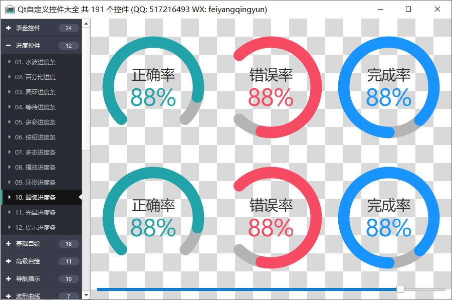

**功能特点**
1. 可设置范围值，支持负数值。
2. 可设置精确度，最大支持小数点后3位。
3. 可设置圆弧宽度。
4. 可设置开始旋转角度、结束旋转角度。
5. 可设置仪表盘的标题。
6. 可设置背景颜色、进度颜色、值颜色、文字颜色。
7. 自适应窗体拉伸，文字自动缩放。
8. 可自由拓展各种渐变色。
9. 可设置百分比模式，自动计算值换算成百分比。

**公共接口**
```cpp
public Q_SLOTS:
    //设置范围值
    void setRange(double minValue, double maxValue);
    void setRange(int minValue, int maxValue);

    //设置最大最小值
    void setMinValue(double minValue);
    void setMaxValue(double maxValue);

    //设置目标值
    void setValue(double value);
    void setValue(int value);

    //设置精确度
    void setPrecision(int precision);

    //设置开始旋转角度
    void setStartAngle(int startAngle);
    //设置结束旋转角度
    void setEndAngle(int endAngle);

    //设置圆弧颜色
    void setArcColor(const QColor &arcColor);
    //设置文本颜色
    void setTextColor(const QColor &textColor);
    //设置标题颜色
    void setTitleColor(const QColor &titleColor);
    //设置基准颜色
    void setBaseColor(const QColor &baseColor);
    //设置背景颜色
    void setBgColor(const QColor &bgColor);

    //设置百分比模式
    void setPercent(bool percent);
    //设置圆弧宽度
    void setArcWidth(int arcWidth);
    //设置标题
    void setTitle(const QString &title);

Q_SIGNALS:
    void valueChanged(int value);
```

**使用示例**
```cpp
#pragma execution_character_set("utf-8")

#include "frmprogressarc.h"
#include "ui_frmprogressarc.h"

frmProgressArc::frmProgressArc(QWidget *parent) : QWidget(parent), ui(new Ui::frmProgressArc)
{
    ui->setupUi(this);
    this->initForm();
}

frmProgressArc::~frmProgressArc()
{
    delete ui;
}

void frmProgressArc::initForm()
{
    //ui->progressArc1->setArcColor(QColor(41, 197, 90));
    ui->progressArc2->setArcColor(QColor(247, 74, 99));
    ui->progressArc3->setArcColor(QColor(25, 148, 255));
    //ui->progressArc4->setArcColor(QColor(41, 197, 90));
    ui->progressArc5->setArcColor(QColor(247, 74, 99));
    ui->progressArc6->setArcColor(QColor(25, 148, 255));

    //ui->progressArc1->setTextColor(QColor(41, 197, 90));
    ui->progressArc2->setTextColor(QColor(247, 74, 99));
    ui->progressArc3->setTextColor(QColor(25, 148, 255));
    //ui->progressArc4->setTextColor(QColor(41, 197, 90));
    ui->progressArc5->setTextColor(QColor(247, 74, 99));
    ui->progressArc6->setTextColor(QColor(25, 148, 255));

    ui->progressArc2->setStartAngle(135);
    ui->progressArc2->setEndAngle(-45);
    ui->progressArc5->setStartAngle(135);
    ui->progressArc5->setEndAngle(-45);

    ui->progressArc3->setStartAngle(0);
    ui->progressArc3->setEndAngle(0);
    ui->progressArc6->setStartAngle(0);
    ui->progressArc6->setEndAngle(0);

    ui->progressArc2->setTitle("错误率");
    ui->progressArc5->setTitle("错误率");
    ui->progressArc3->setTitle("完成率");
    ui->progressArc6->setTitle("完成率");

    connect(ui->horizontalSlider, SIGNAL(valueChanged(int)), ui->progressArc1, SLOT(setValue(int)));
    connect(ui->horizontalSlider, SIGNAL(valueChanged(int)), ui->progressArc2, SLOT(setValue(int)));
    connect(ui->horizontalSlider, SIGNAL(valueChanged(int)), ui->progressArc3, SLOT(setValue(int)));
    connect(ui->horizontalSlider, SIGNAL(valueChanged(int)), ui->progressArc4, SLOT(setValue(int)));
    connect(ui->horizontalSlider, SIGNAL(valueChanged(int)), ui->progressArc5, SLOT(setValue(int)));
    connect(ui->horizontalSlider, SIGNAL(valueChanged(int)), ui->progressArc6, SLOT(setValue(int)));
    ui->horizontalSlider->setValue(88);
}
```

##### 3.2.11 光晕进度条-progressshadow
**运行效果**
 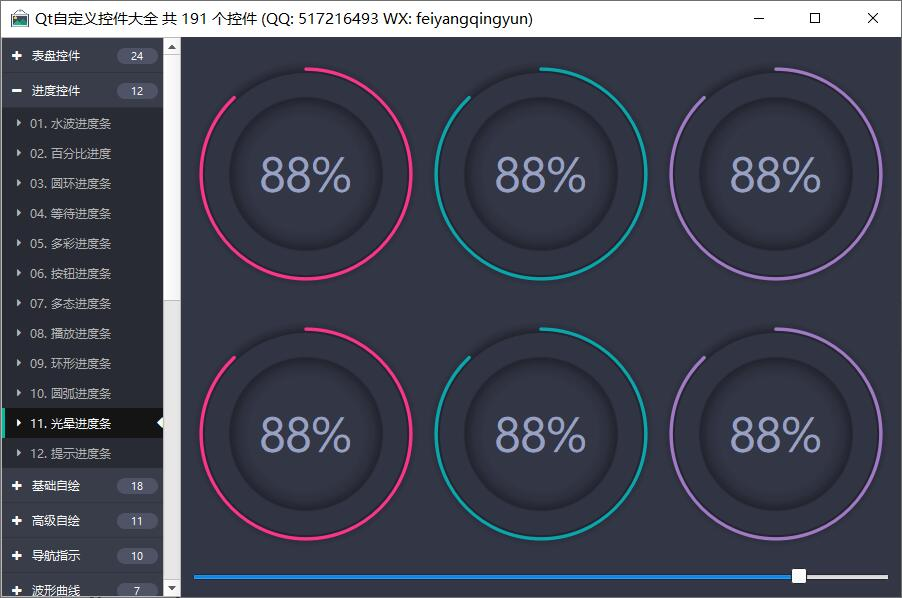

**功能特点**

1. 可设置最大值、最小值、范围值、当前值。
2. 可设置精确度，小数点后几位。
3. 可设置最小值起始角度。
4. 可设置是否百分比显示值。
5. 可设置光晕阴影颜色。
6. 可设置进度颜色。
7. 可设置进度背景颜色。
8. 可设置文字颜色。
9. 采用动画机制产生进度效果。

**公共接口**
```cpp
public Q_SLOTS:
    //设置范围值
    void setRange(double minValue, double maxValue);
    void setRange(int minValue, int maxValue);

    //设置最大最小值
    void setMinValue(double minValue);
    void setMaxValue(double maxValue);

    //设置目标值
    void setValue(double value);
    void setValue(int value);

    //设置精确度
    void setPrecision(int precision);
    //设置最小值位置
    void setNullPosition(int nullPosition);
    //设置百分比显示
    void setPercent(bool percent);

    //设置光晕颜色+进度颜色+背景颜色+文字颜色
    void setShadowColor(const QColor &shadowColor);
    void setProgressColor(const QColor &progressColor);
    void setBgColor(const QColor &bgColor);
    void setTextColor(const QColor &textColor);

Q_SIGNALS:
    void valueChanged(double value);
```

**使用示例**
```cpp
#pragma execution_character_set("utf-8")

#include "frmprogressshadow.h"
#include "ui_frmprogressshadow.h"
#include "qpalette.h"

frmProgressShadow::frmProgressShadow(QWidget *parent) : QWidget(parent), ui(new Ui::frmProgressShadow)
{
    ui->setupUi(this);
    this->initForm();
}

frmProgressShadow::~frmProgressShadow()
{
    delete ui;
}

void frmProgressShadow::initForm()
{
    QPalette palette = this->palette();
    palette.setBrush(QPalette::Window, QColor("#333645"));
    this->setPalette(palette);
    this->setAutoFillBackground(true);

    ui->progressShadow2->setProgressColor(QColor("#0BA6AC"));
    ui->progressShadow3->setProgressColor(QColor("#A279C5"));
    ui->progressShadow5->setProgressColor(QColor("#0BA6AC"));
    ui->progressShadow6->setProgressColor(QColor("#A279C5"));

    connect(ui->horizontalSlider, SIGNAL(valueChanged(int)), ui->progressShadow1, SLOT(setValue(int)));
    connect(ui->horizontalSlider, SIGNAL(valueChanged(int)), ui->progressShadow2, SLOT(setValue(int)));
    connect(ui->horizontalSlider, SIGNAL(valueChanged(int)), ui->progressShadow3, SLOT(setValue(int)));
    connect(ui->horizontalSlider, SIGNAL(valueChanged(int)), ui->progressShadow4, SLOT(setValue(int)));
    connect(ui->horizontalSlider, SIGNAL(valueChanged(int)), ui->progressShadow5, SLOT(setValue(int)));
    connect(ui->horizontalSlider, SIGNAL(valueChanged(int)), ui->progressShadow6, SLOT(setValue(int)));
    ui->horizontalSlider->setValue(88);
}
```

##### 3.2.12 提示进度条-progresstip
**运行效果**
 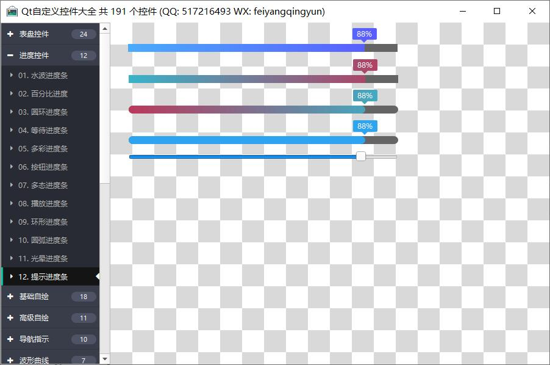

**功能特点**
1. 可设置最小值、最大值、范围值、当前值。
2. 可设置是否百分比显示。
3. 可设置边距，流出空隙防止提示信息跑到外面。
4. 可设置进度的颜色，可以是渐变画刷。
5. 可设置背景颜色、文字颜色、提示背景。
6. 可设置圆角角度。
7. 如果设置了进度画刷则提示背景也采用该画刷。

**公共接口**
```cpp
public Q_SLOTS:
    //设置范围值
    void setRange(double minValue, double maxValue);
    void setRange(int minValue, int maxValue);

    //设置最大最小值
    void setMinValue(double minValue);
    void setMaxValue(double maxValue);

    //设置目标值
    void setValue(double value);
    void setValue(int value);

    //设置百分比显示
    void setPercent(bool percent);
    //设置边距
    void setPadding(int padding);
    //设置圆角角度
    void setRadius(int radius);

    //设置进度画刷+进度颜色+背景颜色+提示背景+文字颜色
    void setValueBrush(const QBrush &valueBrush);
    void setValueColor(const QColor &valueColor);
    void setBgColor(const QColor &bgColor);
    void setTipColor(const QColor &tipColor);
    void setTextColor(const QColor &textColor);

Q_SIGNALS:
    void valueChanged(double value);
```

**使用示例**
```cpp
#pragma execution_character_set("utf-8")

#include "frmprogresstip.h"
#include "ui_frmprogresstip.h"
#include "qbrush.h"

frmProgressTip::frmProgressTip(QWidget *parent) : QWidget(parent), ui(new Ui::frmProgressTip)
{
    ui->setupUi(this);
    this->initForm();
}

frmProgressTip::~frmProgressTip()
{
    delete ui;
}

void frmProgressTip::initForm()
{
    QLinearGradient brush(0, 0, ui->progressTip1->width(), 0);

    brush.setColorAt(0, "#49AFFB");
    brush.setColorAt(1, "#5D51FF");
    ui->progressTip1->setValueBrush(brush);

    brush.setColorAt(0, "#32B9CF");
    brush.setColorAt(1, "#C13256");
    ui->progressTip2->setValueBrush(brush);

    brush.setColorAt(0, "#C13256");
    brush.setColorAt(1, "#32B9CF");
    ui->progressTip3->setValueBrush(brush);

    ui->progressTip3->setRadius(7);
    ui->progressTip4->setRadius(7);
    ui->progressTip3->setValueColor("#FA358A");
    ui->progressTip4->setValueColor("#2EA3EF");
    ui->progressTip3->setTipColor("#FA358A");
    ui->progressTip4->setTipColor("#2EA3EF");

    connect(ui->horizontalSlider, SIGNAL(valueChanged(int)), ui->progressTip1, SLOT(setValue(int)));
    connect(ui->horizontalSlider, SIGNAL(valueChanged(int)), ui->progressTip2, SLOT(setValue(int)));
    connect(ui->horizontalSlider, SIGNAL(valueChanged(int)), ui->progressTip3, SLOT(setValue(int)));
    connect(ui->horizontalSlider, SIGNAL(valueChanged(int)), ui->progressTip4, SLOT(setValue(int)));
    ui->horizontalSlider->setValue(88);
}
```

#### 3.3 基础自绘-painter
##### 3.3.1 自绘电池-battery
**运行效果**
 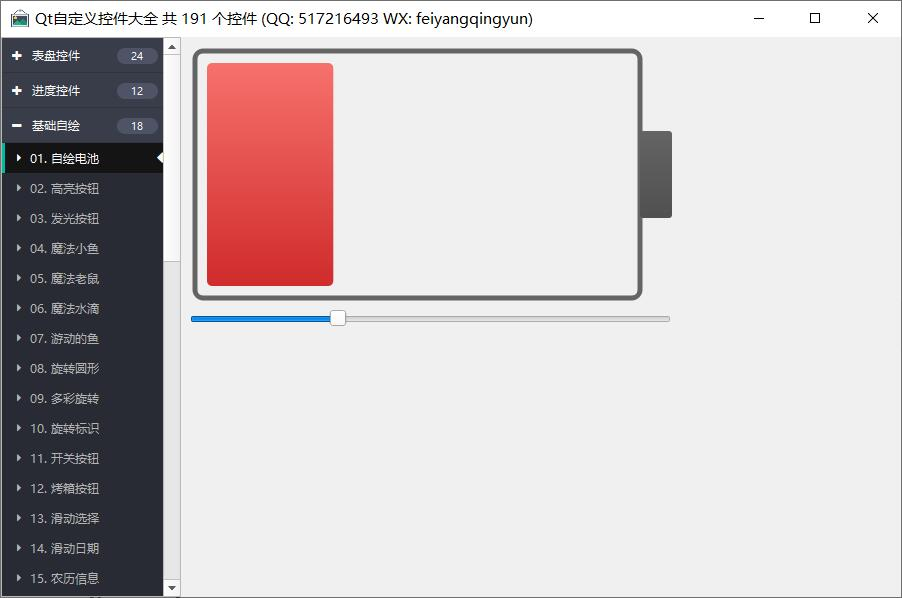

**功能特点**
1. 可设置电池电量，动态切换电池电量变化。
2. 可设置电池电量警戒值。
3. 可设置电池电量正常颜色和报警颜色。
4. 可设置边框渐变颜色。
5. 可设置电量变化时每次移动的步长。
6. 可设置边框圆角角度、背景进度圆角角度、头部圆角角度。

**公共接口**
```cpp
public Q_SLOTS:
    //设置范围值
    void setRange(double minValue, double maxValue);
    void setRange(int minValue, int maxValue);

    //设置最大最小值
    void setMinValue(double minValue);
    void setMaxValue(double maxValue);

    //设置电池电量值
    void setValue(double value);
    void setValue(int value);

    //设置电池电量警戒值
    void setAlarmValue(double alarmValue);
    void setAlarmValue(int alarmValue);

    //设置步长
    void setStep(double step);
    void setStep(int step);

    //设置边框粗细
    void setBorderWidth(int borderWidth);
    //设置边框圆角角度
    void setBorderRadius(int borderRadius);
    //设置背景圆角角度
    void setBgRadius(int bgRadius);
    //设置头部圆角角度
    void setHeadRadius(int headRadius);

    //设置边框渐变颜色
    void setBorderColorStart(const QColor &borderColorStart);
    void setBorderColorEnd(const QColor &borderColorEnd);

    //设置电池电量报警时的渐变颜色
    void setAlarmColorStart(const QColor &alarmColorStart);
    void setAlarmColorEnd(const QColor &alarmColorEnd);

    //设置电池电量正常时的渐变颜色
    void setNormalColorStart(const QColor &normalColorStart);
    void setNormalColorEnd(const QColor &normalColorEnd);

Q_SIGNALS:
    void valueChanged(double value);
```

**使用示例**
```cpp
#pragma execution_character_set("utf-8")

#include "frmbattery.h"
#include "ui_frmbattery.h"

frmBattery::frmBattery(QWidget *parent) : QWidget(parent), ui(new Ui::frmBattery)
{
    ui->setupUi(this);
    this->initForm();
}

frmBattery::~frmBattery()
{
    delete ui;
}

void frmBattery::initForm()
{
    connect(ui->horizontalSlider, SIGNAL(valueChanged(int)), ui->battery, SLOT(setValue(int)));
    ui->horizontalSlider->setValue(30);
}
```

##### 3.3.2 高亮按钮-lightbutton
**运行效果**
 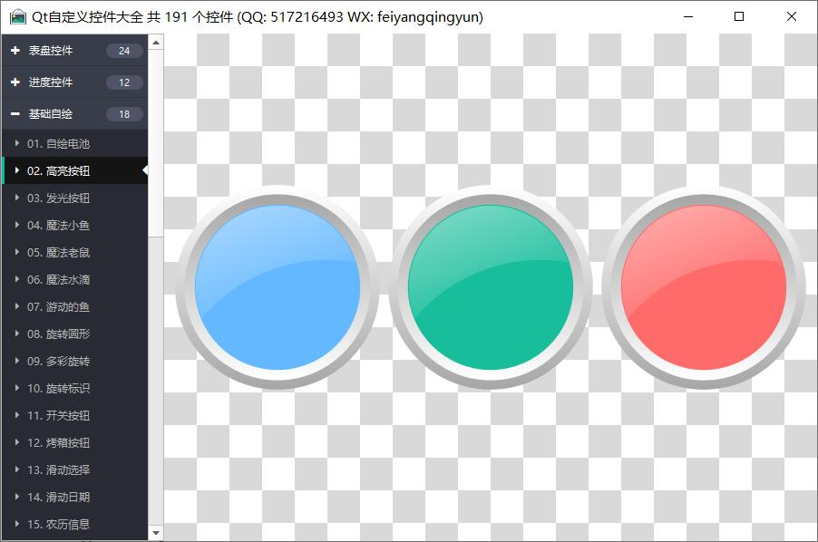

**功能特点**
1. 可设置文本，居中显示。
2. 可设置文本颜色。
3. 可设置外边框渐变颜色。
4. 可设置里边框渐变颜色。
5. 可设置背景色。
6. 可直接调用内置的设置 绿色、红色、黄色、黑色、蓝色 等公有槽函数。
7. 可设置是否在容器中可移动，当成一个对象使用。
8. 可设置是否显示矩形。
9. 可设置报警颜色、非报警颜色。
10. 可控制启动报警和停止报警，报警时闪烁。

**公共接口**
```cpp
public Q_SLOTS:
    //设置文本
    void setText(const QString &text);
    //设置文本颜色
    void setTextColor(const QColor &textColor);

    //设置报警颜色+正常颜色
    void setAlarmColor(const QColor &alarmColor);
    void setNormalColor(const QColor &normalColor);

    //设置外边框渐变颜色
    void setBorderOutColorStart(const QColor &borderOutColorStart);
    void setBorderOutColorEnd(const QColor &borderOutColorEnd);

    //设置里边框渐变颜色
    void setBorderInColorStart(const QColor &borderInColorStart);
    void setBorderInColorEnd(const QColor &borderInColorEnd);

    //设置背景色
    void setBgColor(const QColor &bgColor);

    //设置是否可移动
    void setCanMove(bool canMove);
    //设置是否显示矩形
    void setShowRect(bool showRect);
    //设置是否显示遮罩层
    void setShowOverlay(bool showOverlay);
    //设置遮罩层颜色
    void setOverlayColor(const QColor &overlayColor);

    //设置为绿色
    void setGreen();
    //设置为红色
    void setRed();
    //设置为黄色
    void setYellow();
    //设置为黑色
    void setBlack();
    //设置为灰色
    void setGray();
    //设置为蓝色
    void setBlue();
    //设置为淡蓝色
    void setLightBlue();
    //设置为淡红色
    void setLightRed();
    //设置为淡绿色
    void setLightGreen();

    //设置报警闪烁
    void startAlarm();
    void stopAlarm();
    void alarm();
```

**使用示例**
```cpp
#pragma execution_character_set("utf-8")

#include "frmlightbutton.h"
#include "ui_frmlightbutton.h"
#include "qdatetime.h"
#include "qtimer.h"

frmLightButton::frmLightButton(QWidget *parent) : QWidget(parent), ui(new Ui::frmLightButton)
{
    ui->setupUi(this);
    this->initForm();
}

frmLightButton::~frmLightButton()
{
    delete ui;
}

void frmLightButton::initForm()
{
    ui->lightButton2->setBgColor(QColor(255, 107, 107));
    ui->lightButton3->setBgColor(QColor(24, 189, 155));

    type = 0;

    QTimer *timer = new QTimer(this);
    timer->setInterval(1000);
    connect(timer, SIGNAL(timeout()), this, SLOT(updateValue()));
    timer->start();
    updateValue();

    //以下方法启动报警
    //ui->lightButton1->setAlarmColor(QColor(255, 0, 0));
    //ui->lightButton1->setNormalColor(QColor(0, 0, 0));
    //ui->lightButton1->startAlarm();
}

void frmLightButton::updateValue()
{
    if (type == 0) {
        ui->lightButton1->setLightGreen();
        ui->lightButton2->setLightRed();
        ui->lightButton3->setLightBlue();
        type = 1;
    } else if (type == 1) {
        ui->lightButton1->setLightBlue();
        ui->lightButton2->setLightGreen();
        ui->lightButton3->setLightRed();
        type = 2;
    } else if (type == 2) {
        ui->lightButton1->setLightRed();
        ui->lightButton2->setLightBlue();
        ui->lightButton3->setLightGreen();
        type = 0;
    }
}
```

##### 3.3.3 发光按钮-lightpoint
**运行效果**
 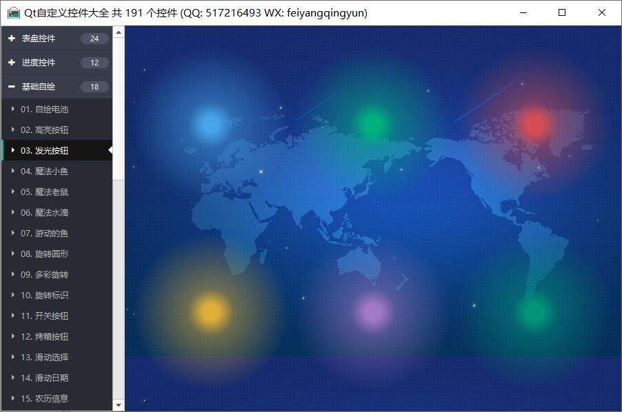

**功能特点**
1. 可设置呼吸间隔。
2. 可设置颜色透明渐变步长。
3. 可设置背景颜色。

**公共接口**
```cpp
public Q_SLOTS:
    //设置颜色透明渐变步长
    void setStep(int step);

    //设置定时器间隔
    void setInterval(int interval);

    //设置背景颜色
    void setBgColor(const QColor &bgColor);
```

**使用示例**
```cpp
#include "frmlightpoint.h"
#include "ui_frmlightpoint.h"

frmLightPoint::frmLightPoint(QWidget *parent) : QWidget(parent), ui(new Ui::frmLightPoint)
{
    ui->setupUi(this);
    this->initForm();
}

frmLightPoint::~frmLightPoint()
{
    delete ui;
}

void frmLightPoint::initForm()
{
    ui->widget->setStyleSheet("QWidget#widget{background:url(:/image/bg1.jpg);}");
    widgets << ui->lightPoint1 << ui->lightPoint2 << ui->lightPoint3 << ui->lightPoint4 << ui->lightPoint5 << ui->lightPoint6;

    QList<QColor> colors;
    colors << "#47A4E9" << "#00B17D" << "#D64D54" << "#DEAF39" << "#A279C5" << "#009679";

    int count = widgets.count();
    for (int i = 0; i < count; i++) {
        //widgets.at(i)->setVisible(false);
        widgets.at(i)->setBgColor(colors.at(i));
    }

    //ui->lightPoint1->setVisible(true);
}
```

##### 3.3.4 魔法小鱼-magicfish
**运行效果**
 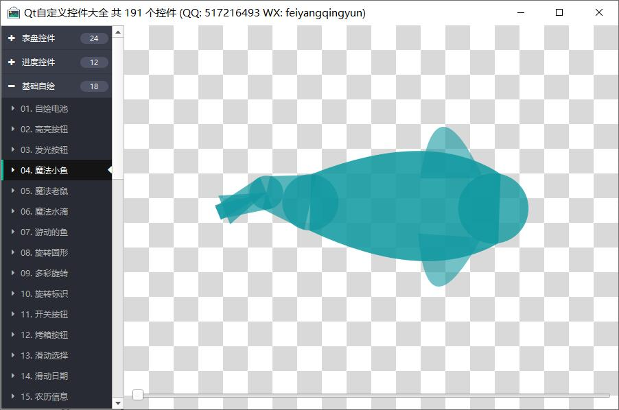

**功能特点**
1. 可设置鱼头、鱼身、鱼鳍、鱼尾的颜色。
2. 可设置鱼头、鱼身、鱼鳍、鱼尾的比例。
3. 可设置基准颜色，作为所有统一颜色。
4. 可设置鱼鳍是否摆动。
5. 可设置鱼的停留位置旋转角度。

**公共接口**
```cpp
public slots:
    //设置鱼头颜色
    void setHeadColor(const QColor &headColor);
    //设置鱼身颜色
    void setBodyColor(const QColor &bodyColor);
    //设置鱼鳍颜色
    void setFinColor(const QColor &finColor);
    //设置鱼尾颜色
    void setTailColor(const QColor &tailColor);
    //设置基准颜色
    void setBaseColor(const QColor &baseColor);

    //设置鱼鳍是否摆动
    void setFinMove(bool finMove);
    //设置游动的速度
    void setSpeed(int speed);
    //设置滑动的幅度
    void setWave(double wave);

    //设置当前旋转的角度
    void setCurrentAngle(double currentAngle);
    void setCurrentAngle(int currentAngle);

    //设置头部的长度
    void setHeadLen(int headLen);
```

**使用示例**
```cpp
#pragma execution_character_set("utf-8")

#include "frmmagicfish.h"
#include "ui_frmmagicfish.h"

frmMagicFish::frmMagicFish(QWidget *parent) : QWidget(parent), ui(new Ui::frmMagicFish)
{
    ui->setupUi(this);
    this->initForm();
}

frmMagicFish::~frmMagicFish()
{
    delete ui;
}

void frmMagicFish::initForm()
{
    ui->magicFish->setBaseColor(QColor(15, 152, 160));
    ui->horizontalSlider->setRange(0, 360);
    connect(ui->horizontalSlider, SIGNAL(valueChanged(int)), ui->magicFish, SLOT(setCurrentAngle(int)));
}
```

##### 3.3.5 魔法老鼠-magicmouse
**运行效果**
 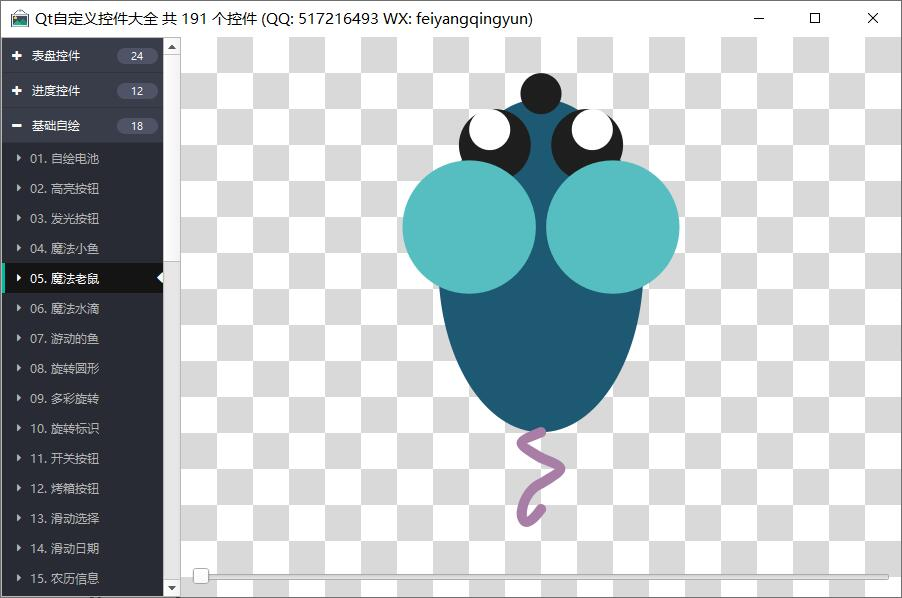

**功能特点**
1. 可设置身体、眼睛、眼珠、鼻子、尾巴的颜色。
2. 可设置停留位置旋转角度。

**公共接口**
```cpp
public Q_SLOTS:
    //设置旋转角度
    void setAngle(int angle);
    //设置身体颜色
    void setBodyColor(const QColor &bodyColor);
    //设置眼睛颜色
    void setEyeColor(const QColor &eyeColor);
    //设置眼珠颜色
    void setEyeballColor(const QColor &eyeballColor);
    //设置鼻子颜色
    void setNoseColor(const QColor &noseColor);
    //设置耳朵颜色
    void setEarColor(const QColor &earColor);
    //设置尾巴颜色
    void setTailColor(const QColor &tailColor);
```

**使用示例**
```cpp
#pragma execution_character_set("utf-8")

#include "frmmagicmouse.h"
#include "ui_frmmagicmouse.h"

frmMagicMouse::frmMagicMouse(QWidget *parent) : QWidget(parent), ui(new Ui::frmMagicMouse)
{
    ui->setupUi(this);
    this->initForm();
}

frmMagicMouse::~frmMagicMouse()
{
    delete ui;
}

void frmMagicMouse::initForm()
{
    ui->horizontalSlider->setRange(0, 360);
    connect(ui->horizontalSlider, SIGNAL(valueChanged(int)), ui->magicMouse, SLOT(setAngle(int)));
}
```

##### 3.3.6 魔法水滴-magicpool
**运行效果**
 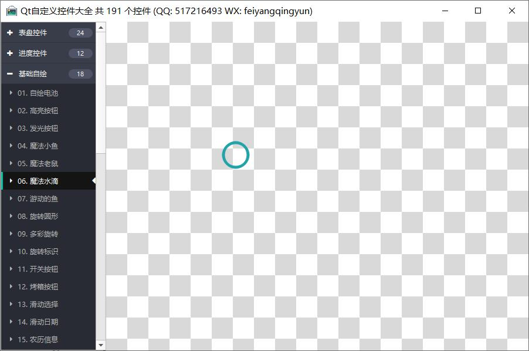

**功能特点**
1. 可设置最大半径。
2. 可设置边框大小、边框颜色。
3. 可设置背景颜色。

**公共接口**
```cpp
public Q_SLOTS:
    //设置最大半径
    void setMaxRadius(int maxRadius);
    //设置边框宽度
    void setBorderWidth(int borderWidth);
    //设置边框颜色
    void setBorderColor(const QColor &borderColor);
    //设置背景颜色
    void setBgColor(const QColor &bgColor);
```

**使用示例**
```cpp
#include "frmmagicpool.h"
#include "ui_frmmagicpool.h"

frmMagicPool::frmMagicPool(QWidget *parent) : QWidget(parent), ui(new Ui::frmMagicPool)
{
    ui->setupUi(this);
}

frmMagicPool::~frmMagicPool()
{
    delete ui;
}
```

##### 3.3.7 游动的鱼-magicpoolfish
**运行效果**
 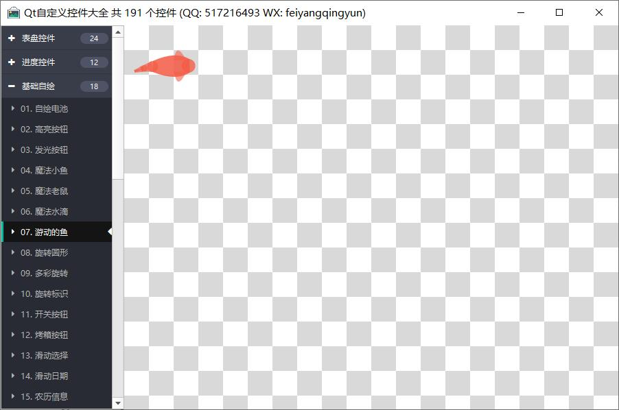

**使用示例**
```cpp
#include "frmmagicpoolfish.h"
#include "ui_frmmagicpoolfish.h"
#include "magicfish.h"
#include "qpainterpath.h"
#include "qevent.h"
#include "qmath.h"
#include "qtimer.h"
#include "qcolor.h"
#include "qdebug.h"

frmMagicPoolFish::frmMagicPoolFish(QWidget *parent) : QWidget(parent), ui(new Ui::frmMagicPoolFish)
{
    ui->setupUi(this);
    this->initForm();
}

frmMagicPoolFish::~frmMagicPoolFish()
{
    if (timerMove->isActive()) {
        timerMove->stop();
    }

    delete ui;
}

bool frmMagicPoolFish::eventFilter(QObject *watched, QEvent *event)
{
    if (watched == ui->magicPool) {
        if (event->type() == QEvent::MouseButtonPress) {
            QMouseEvent *mouseEvent = static_cast<QMouseEvent *>(event);
            posPress = mouseEvent->pos();
            moveStep = 0.0;

            QPointF fish_middle = fish->geometry().center();
            QPointF fish_head = fish->geometry().topLeft() + fish->getHeadPos();

            double angle = calcAngle(fish_middle, fish_head, posPress);
            double delta = calcAngle(fish_middle, fish_middle + QPointF(1, 0), fish_head);

            QPointF c = calcPoint(fish_middle, 17 * fish->getHeadLen(), angle / 2 + delta);
            QPointF p(fish->width() / 2, fish->height() / 2);

            path = QPainterPath();
            path.moveTo(this->fish->geometry().topLeft());
            path.cubicTo(fish_head - p, c - p, this->posPress - p);

            fish->setFinMove(true);
            fish->setWave(2.5);
            timerMove->start();

            //随机更新颜色
            static QStringList colors = QColor::colorNames();
            QString color = colors.at(rand() % colors.count());
            fish->setBaseColor(color);
            ui->magicPool->setBorderColor(color);
        }
    }

    return QWidget::eventFilter(watched, event);
}

double frmMagicPoolFish::getLength(const QPointF &pos1, const QPointF &pos2)
{
    return qSqrt((pos1.x() - pos2.x()) * (pos1.x() - pos2.x()) + (pos1.y() - pos2.y()) * (pos1.y() - pos2.y()));
}

double frmMagicPoolFish::calcAngle(const QPointF &center, const QPointF &head, const QPointF &touch)
{
    double offset = (head.x() - center.x()) * (touch.x() - center.x()) + (head.y() - center.y()) * (touch.y() - center.y());
    double cos = (offset) / qSqrt((head.x() - center.x()) * (head.x() - center.x()) + (head.y() - center.y()) * (head.y() - center.y())) /
                 qSqrt((touch.x() - center.x()) * (touch.x() - center.x()) + (touch.y() - center.y()) * (touch.y() - center.y()));
    double angle = qRadiansToDegrees(qAcos(cos));

    double direction = (center.x() - touch.x()) * (head.y() - touch.y()) - (center.y() - touch.y()) * (head.x() - touch.x());
    if (direction == 0) {
        return (offset >= 0 ? 0 : 180);
    } else {
        return (direction > 0 ? -angle : angle);
    }
}

QPointF frmMagicPoolFish::calcPoint(const QPointF &pos, double length, double angle)
{
    double x = qCos(qDegreesToRadians(angle)) * length;
    double y = qSin(qDegreesToRadians(angle - 180)) * length;
    return QPointF(pos + QPointF(x, y));
}

double frmMagicPoolFish::qDegreesToRadians(double degrees)
{
    return degrees * double(M_PI / 180);
}

double frmMagicPoolFish::qRadiansToDegrees(double radians)
{
    return radians * double(180 / M_PI);
}

void frmMagicPoolFish::initForm()
{
    ui->magicPool->installEventFilter(this);

    //实例化小鱼作为鼠标跟踪对象
    fish = new MagicFish(ui->magicPool);
    fish->setFixedSize(100, 100);

    //启动定时器移动对象
    timerMove = new QTimer(this);
    timerMove->setInterval(20);
    connect(timerMove, SIGNAL(timeout()), this, SLOT(updateMove()));
}

void frmMagicPoolFish::updateMove()
{
    //更新小鱼的坐标,产生游动效果
    double tmp = 0.00;
    if (moveStep >= 0.85) {
        tmp = qSin(qDegreesToRadians(moveStep * 180)) * 0.02;
        fish->setFinMove(false);
        fish->setWave(1.0);
    } else {
        tmp = 0.015 + qCos(qDegreesToRadians(moveStep * 90)) * 0.02;
        fish->setWave(1.0 / (moveStep + 0.1));
    }

    moveStep += tmp;
    if (moveStep >= 1.0 || (1 - moveStep) <= 0.003) {
        moveStep = 0.0;
        path = QPainterPath();
        timerMove->stop();
    } else {
        QPointF p = path.pointAtPercent(moveStep);
        double angle = path.angleAtPercent(moveStep);
        fish->setCurrentAngle(angle);
        fish->move(p.x(), p.y());
    }
}
```

##### 3.3.8 旋转圆形-roundcircle
**运行效果**
 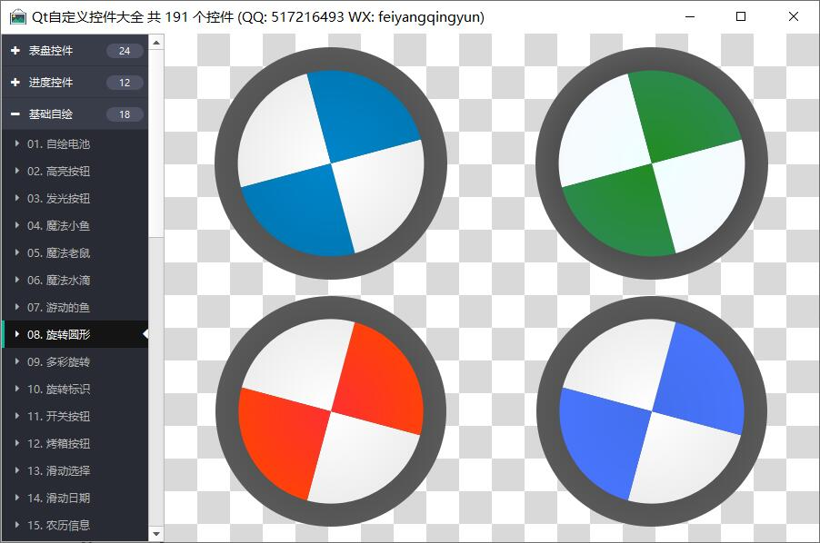

**功能特点**
1. 可设置步长。
2. 可设置各种颜色。
3. 可设置顺时针逆时针旋转。

**公共接口**
```cpp
public Q_SLOTS:
    //设置旋转的步长
    void setStep(int step);
    //设置进度旋转方向
    void setClockWise(bool clockWise);

    //设置背景渐变色
    void setBgColorStart(const QColor &bgColorStart);
    void setBgColorEnd(const QColor &bgColorEnd);

    //设备饼状圆形交替渐变色
    void setPieColor1Start(const QColor &pieColor1Start);
    void setPieColor1End(const QColor &pieColor1End);
    void setPieColor2Start(const QColor &pieColor2Start);
    void setPieColor2End(const QColor &pieColor2End);
```

**使用示例**
```cpp
#pragma execution_character_set("utf-8")

#include "frmroundcircle.h"
#include "ui_frmroundcircle.h"

frmRoundCircle::frmRoundCircle(QWidget *parent) : QWidget(parent), ui(new Ui::frmRoundCircle)
{
    ui->setupUi(this);
    this->initForm();
}

frmRoundCircle::~frmRoundCircle()
{
    delete ui;
}

void frmRoundCircle::initForm()
{
    ui->roundCircle2->setBgColorStart(QColor(31, 31, 31));
    ui->roundCircle2->setBgColorEnd(QColor(91, 91, 91));
    ui->roundCircle2->setPieColor1Start(QColor(34, 139, 34));
    ui->roundCircle2->setPieColor1End(QColor(46, 138, 87));
    ui->roundCircle2->setPieColor2Start(QColor(240, 255, 255));
    ui->roundCircle2->setPieColor2End(QColor(248, 249, 254));

    ui->roundCircle3->setClockWise(false);
    ui->roundCircle3->setPieColor1Start(QColor(254, 48, 48));
    ui->roundCircle3->setPieColor1End(QColor(255, 69, 0));

    ui->roundCircle4->setClockWise(false);
    ui->roundCircle4->setPieColor1Start(QColor(67, 110, 238));
    ui->roundCircle4->setPieColor1End(QColor(72, 118, 255));
}
```

##### 3.3.9 多彩旋转-roundwidget
**运行效果**
 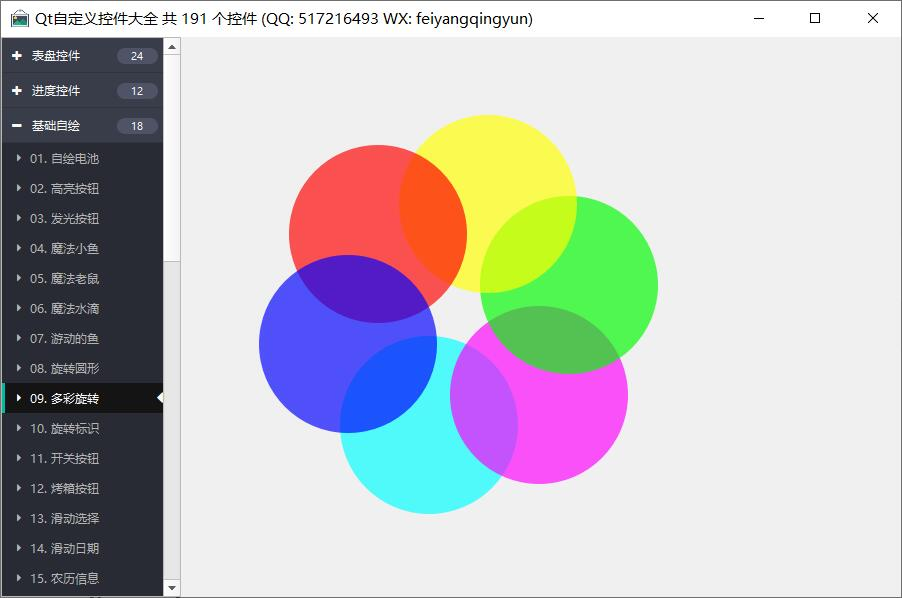

**完整源码**
```cpp
#ifndef ROUNDWIDGET_H
#define ROUNDWIDGET_H

/**
 * 旋转圆窗体 作者:feiyangqingyun(QQ:517216493) 2016-11-22
 */

#include <QWidget>
#include <QHash>

#ifdef quc
class Q_DECL_EXPORT RoundWidget : public QWidget
#else
class RoundWidget : public QWidget
#endif

{
    Q_OBJECT
public:
    explicit RoundWidget(QWidget *parent = 0);
    ~RoundWidget();

protected:
    void resizeEvent(QResizeEvent *);
    void showEvent(QShowEvent *);

private:
    QHash<int, QWidget *> widgets;
    QWidget *w1;
    QWidget *w2;
    QWidget *w3;
    QWidget *w4;
    QWidget *w5;
    QWidget *w6;

    QTimer *timer;

    int radius;
    int circle;
    int offset;

private slots:
    void initWidget();
    void updateValue();

public:
    QSize sizeHint()                const;
    QSize minimumSizeHint()         const;
};

#endif // ROUNDWIDGET_H

#pragma execution_character_set("utf-8")

#include "roundwidget.h"
#include "qtimer.h"
#include "qmath.h"
#include "qdebug.h"

RoundWidget::RoundWidget(QWidget *parent) : QWidget(parent)
{
    radius = 0;
    circle = 0;
    offset = 0;

    w1 = new QWidget(this);
    w2 = new QWidget(this);
    w3 = new QWidget(this);
    w4 = new QWidget(this);
    w5 = new QWidget(this);
    w6 = new QWidget(this);

    widgets.insert(0, w1);
    widgets.insert(1, w2);
    widgets.insert(2, w3);
    widgets.insert(3, w4);
    widgets.insert(4, w5);
    widgets.insert(5, w6);

    //生成6个widget圆
    initWidget();

    //初始化定时器
    timer = new QTimer(this);
    timer->setInterval(10);
    connect(timer, SIGNAL(timeout()), this, SLOT(updateValue()));
    timer->start();
}

RoundWidget::~RoundWidget()
{
    if (timer->isActive()) {
        timer->stop();
    }
}

void RoundWidget::resizeEvent(QResizeEvent *)
{
    int side = qMin(width(), height());
    radius = (double)side / 6;
    initWidget();
}

void RoundWidget::showEvent(QShowEvent *)
{
    resizeEvent(NULL);
}

void RoundWidget::initWidget()
{
    int width = radius * 2;
    int height = radius * 2;

    QString qss1 = QString("QWidget{background-color:rgba(0,255,255,170);border-radius:%1px}").arg(radius);

    w1->setStyleSheet(qss1);
    w1->setGeometry((170 / 40)*radius, (110 / 40)*radius, width, height);

    QString qss2 = QString("QWidget{background-color:rgba(255,0,255,170);border-radius:%1px}").arg(radius);
    w2->setStyleSheet(qss2);
    w2->setGeometry((150 / 40)*radius, (140 / 40)*radius, width, height);

    QString qss3 = QString("QWidget{background-color:rgba(0,250,0,170);border-radius:%1px}").arg(radius);
    w3->setStyleSheet(qss3);
    w3->setGeometry((100 / 40)*radius, (150 / 40)*radius, width, height);

    QString qss4 = QString("QWidget{background-color:rgba(255,255,0,170);border-radius:%1px}").arg(radius);
    w4->setStyleSheet(qss4);
    w4->setGeometry((70 / 40)*radius, (110 / 40)*radius, width, height);

    QString qss5 = QString("QWidget{background-color:rgba(255,0,0,170);border-radius:%1px}").arg(radius);
    w5->setStyleSheet(qss5);
    w5->setGeometry((90 / 40)*radius, (70 / 40)*radius, width, height);

    QString qss6 = QString("QWidget{background-color:rgba(0,0,255,170);border-radius:%1px}").arg(radius);
    w6->setStyleSheet(qss6);
    w6->setGeometry((150 / 40)*radius, (70 / 40)*radius, width, height);
}

void RoundWidget::updateValue()
{
    circle = circle >= 359 ? 0 : (circle + 3) ;
    offset = offset >= 300 ? -300 : (offset + 6);
    int value = radius + qAbs(offset) / 10;

    for (int i = 0; i < 6; i++) {
        int initX = (110 / 40) * radius + value * qSin(circle * (M_PI / 180) + (double)i * (M_PI / 3));
        int initY = (110 / 40) * radius + value * qCos(circle * (M_PI / 180) + (double)i * (M_PI / 3));
        widgets.value(i)->move(initX, initY);
    }
}

QSize RoundWidget::sizeHint() const
{
    return QSize(300, 300);
}

QSize RoundWidget::minimumSizeHint() const
{
    return QSize(50, 50);
}
```

##### 3.3.10 旋转图形-roundlogo
**运行效果**
 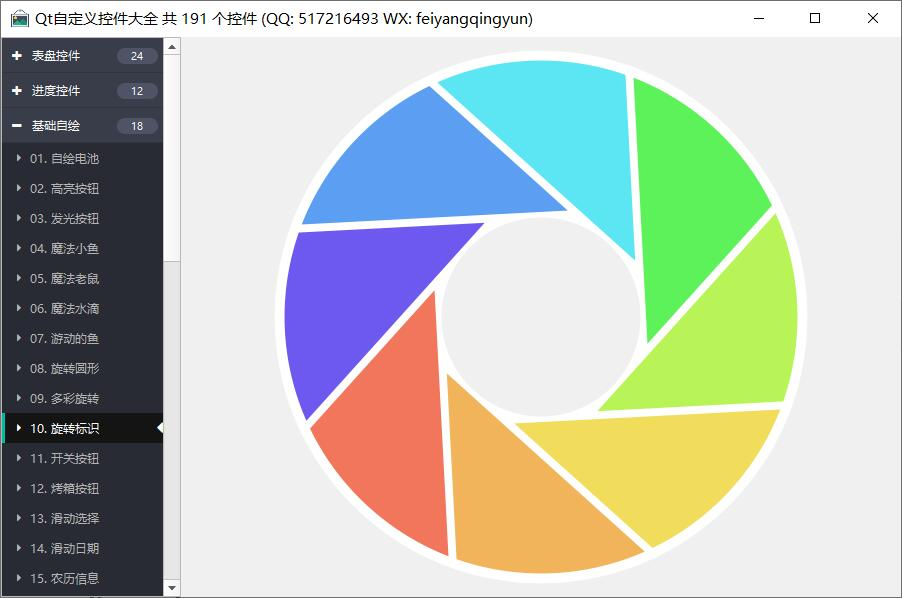

**功能特点**
1. 可设置旋转速度。
2. 可设置背景颜色。
3. 可设置logo的子颜色。
4. 可设置花瓣个数。
5. 可设置圆形间距。

**公共接口**
```cpp
public Q_SLOTS:
    //设置速度
    void setSpeed(int speed);

    //设置颜色
    void setBgColor(const QColor &bgColor);
    void setColors(const QList<QColor> &colors);

    //启动+停止旋转
    void start();
    void stop();
```

**使用示例**
```cpp
#pragma execution_character_set("utf-8")

#include "frmroundlogo.h"
#include "ui_frmroundlogo.h"

frmRoundLogo::frmRoundLogo(QWidget *parent) : QWidget(parent), ui(new Ui::frmRoundLogo)
{
    ui->setupUi(this);
    this->initForm();
}

frmRoundLogo::~frmRoundLogo()
{
    delete ui;
}

void frmRoundLogo::initForm()
{

}
```

##### 3.3.11 开关按钮-switchbutton
**运行效果**
 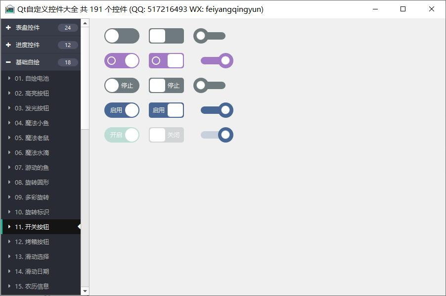

**功能特点**
1. 可设置开关按钮的样式 圆角矩形、内圆形、外圆形。
2. 可设置选中和未选中时的背景颜色。
3. 可设置选中和未选中时的滑块颜色。
4. 可设置显示的文本。
5. 可设置滑块离背景的间隔。
6. 可设置圆角角度。
7. 可设置是否显示动画过渡效果。

**公共接口**
```cpp
public Q_SLOTS:
    //设置间隔
    void setSpace(int space);
    //设置圆角角度
    void setRectRadius(int rectRadius);
    //设置是否选中
    void setChecked(bool checked);
    //设置是否显示文字
    void setShowText(bool showText);
    //设置是否显示小圆
    void setShowCircle(bool showCircle);
    //设置是否动画过渡
    void setAnimation(bool animation);

    //设置风格样式
    void setButtonStyle(const ButtonStyle &buttonStyle);

    //设置背景颜色
    void setBgColorOff(const QColor &bgColorOff);
    void setBgColorOn(const QColor &bgColorOn);

    //设置滑块颜色
    void setSliderColorOff(const QColor &sliderColorOff);
    void setSliderColorOn(const QColor &sliderColorOn);

    //设置文字颜色
    void setTextColorOff(const QColor &textColorOff);
    void setTextColorOn(const QColor &textColorOn);

    //设置文字
    void setTextOff(const QString &textOff);
    void setTextOn(const QString &textOn);

Q_SIGNALS:
    void checkedChanged(bool checked);
```

**使用示例**
```cpp
#pragma execution_character_set("utf-8")

#include "frmswitchbutton.h"
#include "ui_frmswitchbutton.h"
#include "switchbutton.h"
#include "qdebug.h"

#define color1 QColor(34, 163, 169)
#define color2 QColor(162, 121, 197)
#define color3 QColor(255, 107, 107)
#define color4 QColor(72, 103, 149)

frmSwitchButton::frmSwitchButton(QWidget *parent) : QWidget(parent), ui(new Ui::frmSwitchButton)
{
    ui->setupUi(this);
    this->initForm();
}

frmSwitchButton::~frmSwitchButton()
{
    delete ui;
}

void frmSwitchButton::initForm()
{
    this->initBtn1();
    this->initBtn2();
    this->initBtn3();
    this->initSlot();
}

void frmSwitchButton::initBtn1()
{
    ui->switchButton11->setBgColorOn(color1);
    ui->switchButton12->setBgColorOn(color2);
    ui->switchButton13->setBgColorOn(color3);
    ui->switchButton14->setBgColorOn(color4);    

    ui->switchButton11->setShowText(false);
    ui->switchButton12->setShowText(false);
    ui->switchButton13->setShowText(true);
    ui->switchButton14->setShowText(true);
    ui->switchButton12->setShowCircle(true);
    ui->switchButton14->setAnimation(true);
    ui->switchButton12->setChecked(true);
    ui->switchButton14->setChecked(true);

    ui->switchButton13->setTextOff("停止");
    ui->switchButton13->setTextOn("启动");
    ui->switchButton14->setTextOff("禁用");
    ui->switchButton14->setTextOn("启用");

    ui->switchButton15->setChecked(true);
    ui->switchButton15->setEnabled(false);
}

void frmSwitchButton::initBtn2()
{
    ui->switchButton21->setButtonStyle(SwitchButton::ButtonStyle_Rect);
    ui->switchButton22->setButtonStyle(SwitchButton::ButtonStyle_Rect);
    ui->switchButton23->setButtonStyle(SwitchButton::ButtonStyle_Rect);
    ui->switchButton24->setButtonStyle(SwitchButton::ButtonStyle_Rect);
    ui->switchButton25->setButtonStyle(SwitchButton::ButtonStyle_Rect);

    ui->switchButton21->setBgColorOn(color1);
    ui->switchButton22->setBgColorOn(color2);
    ui->switchButton23->setBgColorOn(color3);
    ui->switchButton24->setBgColorOn(color4);

    ui->switchButton21->setShowText(false);
    ui->switchButton22->setShowText(false);
    ui->switchButton23->setShowText(true);
    ui->switchButton24->setShowText(true);
    ui->switchButton22->setShowCircle(true);
    ui->switchButton24->setAnimation(true);
    ui->switchButton22->setChecked(true);
    ui->switchButton24->setChecked(true);

    ui->switchButton23->setTextOff("停止");
    ui->switchButton23->setTextOn("启动");
    ui->switchButton24->setTextOff("禁用");
    ui->switchButton24->setTextOn("启用");

    ui->switchButton25->setChecked(false);
    ui->switchButton25->setEnabled(false);
}

void frmSwitchButton::initBtn3()
{
    ui->switchButton31->setButtonStyle(SwitchButton::ButtonStyle_CircleOut);
    ui->switchButton32->setButtonStyle(SwitchButton::ButtonStyle_CircleOut);
    ui->switchButton33->setButtonStyle(SwitchButton::ButtonStyle_CircleOut);
    ui->switchButton34->setButtonStyle(SwitchButton::ButtonStyle_CircleOut);
    ui->switchButton35->setButtonStyle(SwitchButton::ButtonStyle_CircleOut);

    int space = 8;
    ui->switchButton31->setSpace(space);
    ui->switchButton32->setSpace(space);
    ui->switchButton33->setSpace(space);
    ui->switchButton34->setSpace(space);
    ui->switchButton35->setSpace(space);

    int radius = 8;
    ui->switchButton31->setRectRadius(radius);
    ui->switchButton32->setRectRadius(radius);
    ui->switchButton33->setRectRadius(radius);
    ui->switchButton34->setRectRadius(radius);
    ui->switchButton35->setRectRadius(radius);

    ui->switchButton31->setBgColorOn(color1);
    ui->switchButton32->setBgColorOn(color2);
    ui->switchButton33->setBgColorOn(color3);
    ui->switchButton34->setBgColorOn(color4);
    ui->switchButton35->setBgColorOn(color4);

    ui->switchButton31->setSliderColorOn(color1);
    ui->switchButton32->setSliderColorOn(color2);
    ui->switchButton33->setSliderColorOn(color3);
    ui->switchButton34->setSliderColorOn(color4);
    ui->switchButton35->setSliderColorOn(color4);

    ui->switchButton31->setShowText(false);
    ui->switchButton32->setShowText(false);
    ui->switchButton33->setShowText(true);
    ui->switchButton34->setShowText(true);
    ui->switchButton34->setAnimation(true);
    ui->switchButton32->setChecked(true);
    ui->switchButton34->setChecked(true);

    ui->switchButton35->setChecked(true);
    ui->switchButton35->setEnabled(false);
}

void frmSwitchButton::initSlot()
{
    //关联信号槽
#if 1
    connect(ui->switchButton11, SIGNAL(checkedChanged(bool)), this, SLOT(checkedChanged(bool)));
    connect(ui->switchButton12, SIGNAL(checkedChanged(bool)), this, SLOT(checkedChanged(bool)));
    connect(ui->switchButton13, SIGNAL(checkedChanged(bool)), this, SLOT(checkedChanged(bool)));
    connect(ui->switchButton14, SIGNAL(checkedChanged(bool)), this, SLOT(checkedChanged(bool)));
    connect(ui->switchButton21, SIGNAL(checkedChanged(bool)), this, SLOT(checkedChanged(bool)));
    connect(ui->switchButton22, SIGNAL(checkedChanged(bool)), this, SLOT(checkedChanged(bool)));
    connect(ui->switchButton23, SIGNAL(checkedChanged(bool)), this, SLOT(checkedChanged(bool)));
    connect(ui->switchButton24, SIGNAL(checkedChanged(bool)), this, SLOT(checkedChanged(bool)));
    connect(ui->switchButton31, SIGNAL(checkedChanged(bool)), this, SLOT(checkedChanged(bool)));
    connect(ui->switchButton32, SIGNAL(checkedChanged(bool)), this, SLOT(checkedChanged(bool)));
    connect(ui->switchButton33, SIGNAL(checkedChanged(bool)), this, SLOT(checkedChanged(bool)));
    connect(ui->switchButton34, SIGNAL(checkedChanged(bool)), this, SLOT(checkedChanged(bool)));
#else
    QList<SwitchButton *> btns = this->findChildren<SwitchButton *>();
    foreach (SwitchButton *btn, btns) {
        connect(btn, SIGNAL(checkedChanged(bool)), this, SLOT(checkedChanged(bool)));
    }
#endif
}

void frmSwitchButton::checkedChanged(bool checked)
{
    SwitchButton *btn = (SwitchButton *)sender();
    qDebug() << btn->objectName() << checked;
}
```

##### 3.3.12 旋转烤箱-oventimer
**运行效果**
 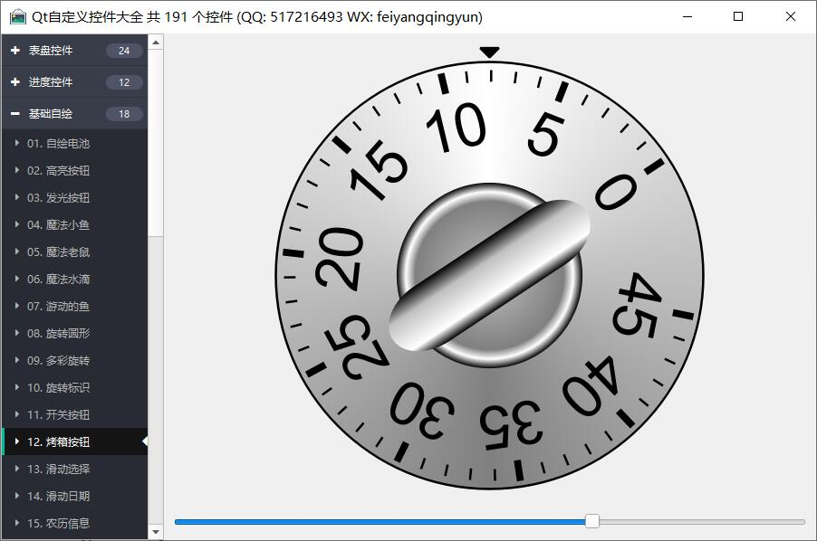

**完整源码**
```cpp
#ifndef OVENTIMER_H
#define OVENTIMER_H

#include <QWidget>
#include <QDateTime>

class QTimer;

#ifdef quc
class Q_DECL_EXPORT OvenTimer : public QWidget
#else
class OvenTimer : public QWidget
#endif

{
    Q_OBJECT
public:
    explicit OvenTimer(QWidget *parent = 0);
    ~OvenTimer();

protected:
    void mousePressEvent(QMouseEvent *event);
    void paintEvent(QPaintEvent *);
    void draw(QPainter *painter);

private:
    int duration;
    QDateTime finishTime;

    QTimer *updateTimer;
    QTimer *finishTimer;

public:
    int getDuration()               const;
    QSize sizeHint()                const;
    QSize minimumSizeHint()         const;

public Q_SLOTS:
    void setDuration(int secs);

Q_SIGNALS:
    void timeout();
};

#endif

#pragma execution_character_set("utf-8")

#include "oventimer.h"
#include "qpainter.h"
#include "qevent.h"
#include "qtimer.h"
#include "qdatetime.h"
#include "qmath.h"
#include "qpixmap.h"
#include "qdebug.h"

const double DegreesPerMinute = 7.0;
const double DegreesPerSecond = DegreesPerMinute / 60;
const int MaxMinutes = 45;
const int MaxSeconds = MaxMinutes * 60;
const int UpdateInterval = 1;

OvenTimer::OvenTimer(QWidget *parent) : QWidget(parent)
{
    finishTime = QDateTime::currentDateTime();

    updateTimer = new QTimer(this);
    connect(updateTimer, SIGNAL(timeout()), this, SLOT(update()));

    finishTimer = new QTimer(this);
    finishTimer->setSingleShot(true);
    connect(finishTimer, SIGNAL(timeout()), this, SIGNAL(timeout()));
    connect(finishTimer, SIGNAL(timeout()), updateTimer, SLOT(stop()));

    setFont(QFont("Arial", 8));
}

OvenTimer::~OvenTimer()
{
    if (updateTimer->isActive()) {
        updateTimer->stop();
    }

    if (finishTimer->isActive()) {
        finishTimer->stop();
    }
}

void OvenTimer::mousePressEvent(QMouseEvent *event)
{
    QPointF point = event->pos() - rect().center();
    double theta = qAtan2(-point.x(), point.y()) * 180.0 / M_PI;
    setDuration(getDuration() + int(theta / DegreesPerSecond));
}

void OvenTimer::paintEvent(QPaintEvent *)
{
    int width = this->width();
    int height = this->height();
    int side = qMin(width, height);

    QPainter painter(this);
    painter.setRenderHint(QPainter::Antialiasing, true);

    painter.setViewport((width - side) / 2, (height - side) / 2, side, side);
    painter.setWindow(-50, -50, 100, 100);
    draw(&painter);
}

void OvenTimer::draw(QPainter *painter)
{
    static const int triangle[3][2] = {
        {-2, -49}, {+2, -49}, {0, -47}
    };

    QPen thickPen(palette().windowText(), 1.5);
    QPen thinPen(palette().windowText(), 0.5);

    painter->setPen(thinPen);
    painter->setBrush(palette().windowText());
    painter->drawPolygon(QPolygon(3, &triangle[0][0]));

    QConicalGradient coneGradient(0, 0, -90.0);
    coneGradient.setColorAt(0.0, Qt::darkGray);
    coneGradient.setColorAt(0.5, Qt::white);
    coneGradient.setColorAt(1.0, Qt::darkGray);

    painter->setBrush(coneGradient);
    painter->drawEllipse(-46, -46, 92, 92);

    QRadialGradient haloGradient(0, 0, 20, 0, 0);
    haloGradient.setColorAt(0.0, Qt::lightGray);
    haloGradient.setColorAt(0.8, Qt::darkGray);
    haloGradient.setColorAt(0.9, Qt::white);
    haloGradient.setColorAt(1.0, Qt::black);

    painter->setPen(Qt::NoPen);
    painter->setBrush(haloGradient);
    painter->drawEllipse(-20, -20, 40, 40);

    QLinearGradient knobGradient(-7, -25, 7, -25);
    knobGradient.setColorAt(0.0, Qt::black);
    knobGradient.setColorAt(0.3, Qt::lightGray);
    knobGradient.setColorAt(0.8, Qt::white);
    knobGradient.setColorAt(1.0, Qt::black);

    painter->setPen(Qt::NoPen);
    painter->setBrush(knobGradient);
    painter->rotate(getDuration()*DegreesPerSecond);
    painter->drawRoundedRect(-7, -25, 14, 50, 10, 10);

    for (int i = 0; i <= MaxMinutes; ++i) {
        painter->save();
        painter->rotate(-i * DegreesPerMinute);

        if (i % 5 == 0) {
            painter->setPen(thickPen);
            painter->drawLine(0, -41, 0, -44);
            painter->drawText(-15, -41, 30, 30, Qt::AlignHCenter | Qt::AlignTop, QString::number(i));
        } else {
            painter->setPen(thinPen);
            painter->drawLine(0, -42, 0, -44);
        }

        painter->restore();
    }
}

int OvenTimer::getDuration() const
{
    int secs = QDateTime::currentDateTime().secsTo(finishTime);
    if (secs < 0) {
        secs = 0;
    }
    return secs;
}

QSize OvenTimer::sizeHint() const
{
    return QSize(200, 200);
}

QSize OvenTimer::minimumSizeHint() const
{
    return QSize(50, 50);
}

void OvenTimer::setDuration(int secs)
{
    secs = qBound(0, secs, MaxSeconds);

    finishTime = QDateTime::currentDateTime().addSecs(secs);
    if (secs > 0) {
        updateTimer->start(UpdateInterval * 1000);
        finishTimer->start(secs * 1000);
    } else {
        updateTimer->stop();
        finishTimer->stop();
    }

    this->update();
}
```

##### 3.3.13 滑动选择-tumbler
**运行效果**
 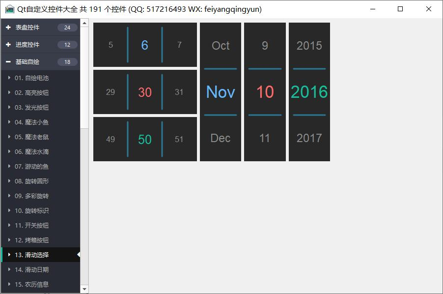

**功能特点**
1. 可设置数据队列值。
2. 可设置当前队列索引及当前值。
3. 支持任意窗体大小缩放。
4. 支持背景色前景色文字颜色线条颜色设置。
5. 支持左右滑动和上下滑动两种形式。
6. 支持鼠标滚动切换元素。
7. 中间值自动放大显示且居中。

**公共接口**
```cpp
public Q_SLOTS:
    //设置值队列
    void setListValue(const QStringList &listValue);
    //设置当前索引
    void setCurrentIndex(int currentIndex);
    //设置当前值
    void setCurrentValue(const QString &currentValue);
    //设置横向显示,如果为假则纵向显示
    void setHorizontal(bool horizontal);

    //设置前景色
    void setForeground(const QColor &foreground);
    //设置背景色
    void setBackground(const QColor &background);
    //设置线条颜色
    void setLineColor(const QColor &lineColor);
    //设置文本颜色
    void setTextColor(const QColor &textColor);

Q_SIGNALS:
    void currentIndexChanged(int currentIndex);
    void currentValueChanged(QString currentValue);
```

**使用示例**
```cpp
#pragma execution_character_set("utf-8")

#include "frmtumbler.h"
#include "ui_frmtumbler.h"

frmTumbler::frmTumbler(QWidget *parent) : QWidget(parent), ui(new Ui::frmTumbler)
{
    ui->setupUi(this);
    this->initForm();
}

frmTumbler::~frmTumbler()
{
    delete ui;
}

void frmTumbler::initForm()
{
    ui->tumbler1->setTextColor(QColor(100, 184, 255));
    ui->tumbler2->setTextColor(QColor(255, 107, 107));
    ui->tumbler3->setTextColor(QColor(24, 189, 155));
    ui->tumbler4->setTextColor(QColor(100, 184, 255));
    ui->tumbler5->setTextColor(QColor(255, 107, 107));
    ui->tumbler6->setTextColor(QColor(24, 189, 155));

    QStringList listValue;

    for (int i = 0; i <= 100; i++) {
        listValue.append(QString::number(i));
    }

    ui->tumbler2->setListValue(listValue);
    ui->tumbler3->setListValue(listValue);

    ui->tumbler1->setCurrentIndex(5);
    ui->tumbler2->setCurrentIndex(30);
    ui->tumbler3->setCurrentValue("50");

    ui->tumbler4->setHorizontal(false);
    ui->tumbler5->setHorizontal(false);
    ui->tumbler6->setHorizontal(false);

    ui->tumbler5->setListValue(listValue);
    ui->tumbler5->setCurrentIndex(10);

    listValue.clear();

    for (int i = 2010; i <= 2030; i++) {
        listValue.append(QString::number(i));
    }

    ui->tumbler6->setListValue(listValue);
    ui->tumbler6->setCurrentValue("2016");

    listValue.clear();
    listValue << "Jan" << "Feb" << "Mar" << "Apr" << "May" << "Jun" << "Jul" << "Aug" << "Sep" << "Oct" << "Nov" << "Dec";

    ui->tumbler4->setListValue(listValue);
    ui->tumbler4->setCurrentValue("Nov");
}
```

##### 3.3.14 滑动日期-tumblerdatetime
**运行效果**
 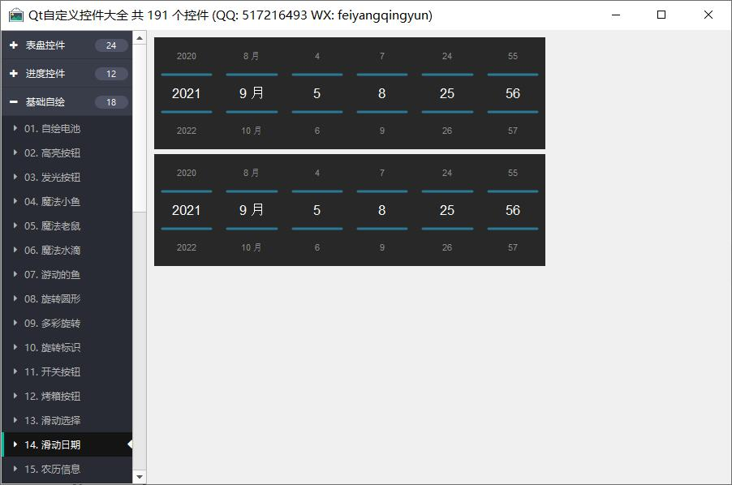

**功能特点**
1. 可设置年月日时分秒。
2. 可鼠标或者手指滑动选择年月日时分秒。
3. 支持自定义数值范围。
4. 支持鼠标滚轮选择。
5. 年月日自动联动计算。

**公共接口**
```cpp
public Q_SLOTS:
    //设置年份
    void setYear(int year);

    //设置月份
    void setMonth(int month);

    //设置日期
    void setDay(int day);

    //设置时钟
    void setHour(int hour);

    //设置分钟
    void setMin(int min);

    //设置秒钟
    void setSec(int sec);

    //设置年月日
    void setDateTime(int year, int month, int day, int hour, int min, int sec);
```

**使用示例**
```cpp
#include "frmtumblerdatetime.h"
#include "ui_frmtumblerdatetime.h"

frmTumblerDateTime::frmTumblerDateTime(QWidget *parent) : QWidget(parent), ui(new Ui::frmTumblerDateTime)
{
    ui->setupUi(this);
    this->initForm();
}

frmTumblerDateTime::~frmTumblerDateTime()
{
    delete ui;
}

void frmTumblerDateTime::initForm()
{
    QDate date = QDate::currentDate();
    QTime time = QTime::currentTime();

    ui->tumblerDateTime1->setYear(date.year());
    ui->tumblerDateTime1->setMonth(date.month());
    ui->tumblerDateTime1->setDay(date.day());
    ui->tumblerDateTime1->setHour(time.hour());
    ui->tumblerDateTime1->setMin(time.minute());
    ui->tumblerDateTime1->setSec(time.second());

    ui->tumblerDateTime2->setYear(date.year());
    ui->tumblerDateTime2->setMonth(date.month());
    ui->tumblerDateTime2->setDay(date.day());
    ui->tumblerDateTime2->setHour(time.hour());
    ui->tumblerDateTime2->setMin(time.minute());
    ui->tumblerDateTime2->setSec(time.second());
}
```

##### 3.3.15 农历信息-lunarcalendarinfo
**运行效果**
 

**功能特点**
1. 计算是否闰年。
2. 计算国际节日。
3. 计算二十四节气。
4. 计算农历年 天干、地支、生肖。
5. 计算指定年月日农历信息，包括公历节日和农历节日及二十四节气。

**公共接口**
```cpp
public:
    static LunarCalendarInfo *Instance();
    explicit LunarCalendarInfo(QObject *parent = 0);

    //计算是否闰年
    bool isLoopYear(int year);

    //计算指定年月该月共多少天
    int getMonthDays(int year, int month);

    //计算指定年月对应到该月共多少天
    int getTotalMonthDays(int year, int month);

    //计算指定年月对应星期几
    int getFirstDayOfWeek(int year, int month);

    //计算国际节日
    QString getHoliday(int month, int day);

    //计算二十四节气
    QString getSolarTerms(int year, int month, int day);

    //计算农历节日(必须传入农历年份月份)
    QString getLunarFestival(int month, int day);

    //计算农历年 天干+地支+生肖
    QString getLunarYear(int year);

    //计算指定年月日农历信息,包括公历节日和农历节日及二十四节气
    void getLunarCalendarInfo(int year, int month, int day,
                              QString &strHoliday,
                              QString &strSolarTerms,
                              QString &strLunarFestival,
                              QString &strLunarYear,
                              QString &strLunarMonth,
                              QString &strLunarDay);

    //获取指定年月日农历信息
    QString getLunarInfo(int year, int month, int day, bool yearInfo, bool monthInfo, bool dayInfo);
    QString getLunarYearMonthDay(int year, int month, int day);
    QString getLunarMonthDay(int year, int month, int day);
    QString getLunarDay(int year, int month, int day);
```

**使用示例**
```cpp
#pragma execution_character_set("utf-8")

#include "frmlunarcalendarinfo.h"
#include "ui_frmlunarcalendarinfo.h"
#include "lunarcalendarinfo.h"

frmLunarCalendarInfo::frmLunarCalendarInfo(QWidget *parent) : QWidget(parent), ui(new Ui::frmLunarCalendarInfo)
{
    ui->setupUi(this);
    on_calendarWidget_clicked(QDate::currentDate());
}

frmLunarCalendarInfo::~frmLunarCalendarInfo()
{
    delete ui;
}

void frmLunarCalendarInfo::on_calendarWidget_clicked(const QDate &date)
{
    QString strHoliday, strSolarTerms, strLunarFestival, strLunarYear, strLunarMonth, strLunarDay;

    LunarCalendarInfo::Instance()->getLunarCalendarInfo(date.year(), date.month(), date.day(),
            strHoliday, strSolarTerms, strLunarFestival,
            strLunarYear, strLunarMonth, strLunarDay);

    QString str = QString("节日名称: %1\n节气名称: %2\n农历节气: %3\n农历年份: %4\n农历月份: %5\n农历日期: %6")
                  .arg(strHoliday).arg(strSolarTerms).arg(strLunarFestival).arg(strLunarYear).arg(strLunarMonth).arg(strLunarDay);
    ui->textEdit->setText(str);
}
```

##### 3.3.16 农历面板-lunarcalendarwidget
**运行效果**
 

**功能特点**
1. 可设置边框颜色、周末颜色、角标颜色、农历节日颜色。
2. 可设置当前月文字颜色、其他月文字颜色、选中日期文字颜色、悬停日期文字颜色。
3. 可设置当前月农历文字颜色、其他月农历文字颜色、选中日期农历文字颜色、悬停日期农历文字颜色。
4. 可设置当前月背景颜色、其他月背景颜色、选中日期背景颜色、悬停日期背景颜色。
5. 可设置三种选中背景模式，矩形背景、圆形背景、图片背景。
6. 可直接切换到上一年、下一年、上一月、下一月、转到今天。
7. 可设置是否显示农历信息，不显示则当做正常的日历使用。
8. 支持1901年-2099年范围。
9. 很方便改成多选日期。

**公共接口**
```cpp
public Q_SLOTS:
    //上一年,下一年
    void showPreviousYear();
    void showNextYear();

    //上一月,下一月
    void showPreviousMonth();
    void showNextMonth();

    //转到今天
    void showToday();

    //设置整体样式
    void setCalendarStyle(const CalendarStyle &calendarStyle);
    //设置星期名称格式
    void setWeekNameFormat(const WeekNameFormat &weekNameFormat);

    //设置日期
    void setDate(const QDate &date);

    //设置顶部星期名称文字颜色+背景色
    void setWeekTextColor(const QColor &weekTextColor);
    void setWeekBgColor(const QColor &weekBgColor);

    //设置是否显示农历信息
    void setShowLunar(bool showLunar);
    //设置背景图片
    void setBgImage(const QString &bgImage);
    //设置选中背景样式
    void setSelectType(const SelectType &selectType);

    //设置边框颜色
    void setBorderColor(const QColor &borderColor);
    //设置周末颜色
    void setWeekColor(const QColor &weekColor);
    //设置角标颜色
    void setSuperColor(const QColor &superColor);
    //设置农历节日颜色
    void setLunarColor(const QColor &lunarColor);

    //设置当前月文字颜色
    void setCurrentTextColor(const QColor &currentTextColor);
    //设置其他月文字颜色
    void setOtherTextColor(const QColor &otherTextColor);
    //设置选中日期文字颜色
    void setSelectTextColor(const QColor &selectTextColor);
    //设置悬停日期文字颜色
    void setHoverTextColor(const QColor &hoverTextColor);

    //设置当前月农历文字颜色
    void setCurrentLunarColor(const QColor &currentLunarColor);
    //设置其他月农历文字颜色
    void setOtherLunarColor(const QColor &otherLunarColor);
    //设置选中日期农历文字颜色
    void setSelectLunarColor(const QColor &selectLunarColor);
    //设置悬停日期农历文字颜色
    void setHoverLunarColor(const QColor &hoverLunarColor);

    //设置当前月背景颜色
    void setCurrentBgColor(const QColor &currentBgColor);
    //设置其他月背景颜色
    void setOtherBgColor(const QColor &otherBgColor);
    //设置选中日期背景颜色
    void setSelectBgColor(const QColor &selectBgColor);
    //设置悬停日期背景颜色
    void setHoverBgColor(const QColor &hoverBgColor);

Q_SIGNALS:
    void clicked(const QDate &date);
    void selectionChanged();
```

**使用示例**
```cpp
#include "frmlunarcalendarwidget.h"
#include "ui_frmlunarcalendarwidget.h"

frmLunarCalendarWidget::frmLunarCalendarWidget(QWidget *parent) : QWidget(parent), ui(new Ui::frmLunarCalendarWidget)
{
    ui->setupUi(this);
    this->initForm();
}

frmLunarCalendarWidget::~frmLunarCalendarWidget()
{
    delete ui;
}

void frmLunarCalendarWidget::initForm()
{
    ui->cboxWeekNameFormat->setCurrentIndex(2);
}

void frmLunarCalendarWidget::on_cboxCalendarStyle_currentIndexChanged(int index)
{
    ui->lunarCalendarWidget->setCalendarStyle((LunarCalendarWidget::CalendarStyle)index);
}

void frmLunarCalendarWidget::on_cboxSelectType_currentIndexChanged(int index)
{
    ui->lunarCalendarWidget->setSelectType((LunarCalendarWidget::SelectType)index);
}

void frmLunarCalendarWidget::on_cboxWeekNameFormat_currentIndexChanged(int index)
{
    ui->lunarCalendarWidget->setWeekNameFormat((LunarCalendarWidget::WeekNameFormat)index);
}

void frmLunarCalendarWidget::on_ckShowLunar_stateChanged(int arg1)
{
    ui->lunarCalendarWidget->setShowLunar(arg1 != 0);
}
```

##### 3.3.17 平铺背景-tiledbg
**运行效果**
 

**功能特点**
1. 可设置交替背景颜色。

**公共接口**
```cpp
public Q_SLOTS:
    //设置颜色1
    void setColor1(const QColor &color1);
    //设置颜色2
    void setColor2(const QColor &color2);
    //设置背景图片
    void setBgPix(const QPixmap &bgPix);
```

**使用示例**
```cpp
#pragma execution_character_set("utf-8")

#include "frmtiledbg.h"
#include "ui_frmtiledbg.h"

frmTiledBg::frmTiledBg(QWidget *parent) : QWidget(parent), ui(new Ui::frmTiledBg)
{
    ui->setupUi(this);
    this->initForm();
}

frmTiledBg::~frmTiledBg()
{
    delete ui;
}

void frmTiledBg::initForm()
{
    ui->tiledBg1->setColor2(QColor(166, 193, 215));
    ui->tiledBg2->setColor2(QColor(34, 163, 169, 150));
    ui->tiledBg3->setColor2(QColor(214, 77, 84, 150));
    ui->tiledBg4->setColor2(QColor(0, 177, 125, 150));
}
```

##### 3.3.18 手机通讯录-telwidget
**运行效果**
 

**功能特点**
1. 可设置信息集合(图标、姓名、类型、电话)以及添加单个联系人。
2. 可设置背景图片、背景颜色。
3. 可设置右侧导航字母的列表、默认颜色、高亮颜色。
4. 可设置联系人按钮姓名颜色、+姓名字体。
5. 可设置联系人按钮类型颜色、姓名字体。
6. 可设置联系人按钮选中背景颜色。
7. 可设置字母导航的风格(背景颜色、线条)。
8. 可设置字母导航的颜色、字体大小。
9. 可设置各种边距、联系人列数、元素间隔等。
10. 支持悬浮滚动条，可设置悬停时间。
11. 可设置悬浮滚动条的正常颜色、高亮颜色。
12. 支持滑动，可设置滑动的步长速度。
13. 支持单击右侧字母导航定位、文本突出显示。
14. 单击发出当前联系人的姓名、类型、电话等信息。
15. 根据汉字字母排序从小到大排列联系人，自带汉字转拼音功能。

**公共接口**
```cpp
public Q_SLOTS:
    //设置姓名+类型+电话集合
    void setNames(const QString &names);
    void setTypes(const QString &types);
    void setTels(const QString &tels);
    void setInfo(const QString &names, const QString &types, const QString &tels);
    void setInfo(const QStringList &names, const QStringList &types,
                 const QStringList &tels, const QList<QPixmap> &pixmaps);

    //添加单个联系人
    void addInfo(const QString &name, const QString &type,
                 const QString &tel, const QPixmap &pixmap);
    //删除单个联系人
    void deleteInfo(const QString &name, const QString &tel, bool one = true);
    //清空联系人
    void clearInfo();

    //设置背景图+背景颜色
    void setBgImage(const QPixmap &bgImage);
    void setBgColor(const QColor &bgColor);

    //设置高亮字母标签相关属性
    void setTelHighFontSize(int telHighFontSize);
    void setTelHighBgImage(const QPixmap &telHighBgImage);
    void setTelHighBgColor(const QColor &telHighBgColor);
    void setTelHighTextColor(const QColor &telHighTextColor);

    //设置顶部字母导航相关属性
    void setTelBannerBgColor(const QColor &telBannerBgColor);
    void setTelBannerTextColor(const QColor &telBannerTextColor);
    void setTelBannerLineColor(const QColor &telBannerLineColor);

    //设置右侧字母导航相关属性
    void setTelLetterNormalColor(const QColor &telLetterNormalColor);
    void setTelLetterHighColor(const QColor &telLetterHighColor);

    //设置通讯录按钮相关属性
    void setTelButtonBgColor(const QColor &telButtonBgColor);
    void setTelButtonNameColor(const QColor &telButtonNameColor);
    void setTelButtonTypeColor(const QColor &telButtonTypeColor);

    //设置滚动条相关属性
    void setTelPanelNormalColor(const QColor &telPanelNormalColor);
    void setTelPanelHighColor(const QColor &telPanelHighColor);

Q_SIGNALS:
    void telClicked(const QString &name, const QString &type, const QString &tel);
```

**使用示例**
```cpp
#pragma execution_character_set("utf-8")

#include "frmtelwidget.h"
#include "ui_frmtelwidget.h"
#include "qmessagebox.h"
#include "qdebug.h"

frmTelWidget::frmTelWidget(QWidget *parent) : QWidget(parent), ui(new Ui::frmTelWidget)
{
    ui->setupUi(this);
    this->initForm();
}

frmTelWidget::~frmTelWidget()
{
    delete ui;
}

void frmTelWidget::initForm()
{
    //绑定单击事件
    connect(ui->telWidget, SIGNAL(telClicked(QString, QString, QString)),
            this, SLOT(telClicked(QString, QString, QString)));

    ui->telWidget->setBgImage(QPixmap(":/image/bg.jpg"));
    //ui->telWidget->setBgColor(QColor(40, 45, 48));

    //设置类背景图片则优先取背景图片,否则样式为中间圆形
    //ui->telWidget->setTelHighBgImage(QPixmap(":/image/letter.png"));
    ui->telWidget->setTelHighBgColor(QColor(0, 0, 0, 130));

#if 1
    ui->telWidget->setTelHighBgColor(QColor(255, 255, 255, 100));
    ui->telWidget->setTelBannerBgColor(QColor(255, 255, 255, 50));
    ui->telWidget->setTelBannerTextColor(QColor(255, 255, 255));
    ui->telWidget->setTelLetterNormalColor(QColor(255, 255, 255));
    ui->telWidget->setTelLetterHighColor(QColor(27, 188, 155));
    ui->telWidget->setTelButtonNameColor(QColor(255, 255, 255));
    ui->telWidget->setTelButtonTypeColor(QColor(200, 200, 200));
    ui->telWidget->setTelPanelNormalColor(QColor(255, 255, 255, 100));
    ui->telWidget->setTelPanelHighColor(QColor(255, 255, 255, 200));
#endif

    //设置联系人信息集合
    QStringList listName, listType, listTel;
    QList<QPixmap> listPix;

    //123许    、许    *许    @++许    さぎす许    ~许    ???许    厤瀵硅
#if 0
    //listName << "张三";
    //listType << "家里";
    //listTel << "12866666666";
    //listPix << QPixmap(":/image/img1.jpg");
#elif 0
    listName << "张三" << "李四" << "王二" << "123许" << "、许" << "张五";
    listType << "家里" << "公司" << "" << "住宅" << "住宅" << "住宅";
    listTel << "12866666666" << "02162569999" << "15622222222" << "13888888888" << "13888888888" << "13888888888";
    listPix << QPixmap(":/image/img1.jpg") << QPixmap(":/image/img2.jpg") << QPixmap(":/image/img3.jpg") << QPixmap(":/image/img4.jpg") << QPixmap(":/image/img4.jpg") << QPixmap(":/image/img4.jpg");
#else
    QStringList list;
    list << "住宅" << "家里" << "公司";
    for (int i = 0; i < 550; i++) {
        //设置字母属性
        QString letter;
        if (i < 10) {
            letter = "A";
        } else if (i < 23) {
            letter = "B";
        } else if (i < 45) {
            letter = "C";
        } else if (i < 80) {
            letter = "D";
        } else if (i < 100) {
            letter = "E";
        } else if (i < 130) {
            letter = "F";
        } else if (i < 160) {
            letter = "G";
        } else if (i < 180) {
            letter = "H";
        } else if (i < 200) {
            letter = "I";
        } else if (i < 230) {
            letter = "J";
        } else if (i < 250) {
            letter = "K";
        } else if (i < 260) {
            letter = "L";
        } else if (i < 270) {
            letter = "M";
        } else if (i < 280) {
            letter = "N";
        } else if (i < 290) {
            letter = "O";
        } else if (i < 300) {
            letter = "P";
        } else if (i < 310) {
            letter = "Q";
        } else if (i < 330) {
            letter = "R";
        } else if (i < 350) {
            letter = "S";
        } else if (i < 380) {
            letter = "T";
        } else if (i < 400) {
            letter = "U";
        } else if (i < 430) {
            letter = "V";
        } else if (i < 450) {
            letter = "W";
        } else if (i < 470) {
            letter = "X";
        } else if (i < 500) {
            letter = "Y";
        } else {
            letter = "Z";
        }

        //统计下当前该字母的有多少
        int count = 1;
        foreach (QString name, listName) {
            if (QString(name.at(0)) == letter) {
                count++;
            }
        }

        listName << QString("%1 %2").arg(letter).arg(count, 2, 10, QChar('0'));
        listType << list.at(rand() % 3);
        listTel << QString("1381234%1").arg(rand() % 10000, 3, 10, QChar('0'));
        listPix << QPixmap(QString(":/image/img%1.jpg").arg(rand() % 10));
    }
#endif

    //如果为空则相当于清空
    ui->telWidget->setInfo(listName, listType, listTel, listPix);
}

void frmTelWidget::telClicked(const QString &name, const QString &type, const QString &tel)
{
    ui->txtName->setText(name);
    ui->cboxType->setCurrentIndex(ui->cboxType->findText(type));
    ui->txtTel->setText(tel);
    QString info = QString("姓名: %1  类型: %2  电话: %3").arg(name).arg(type).arg(tel);
    QMessageBox::information(this, "单击", info);
}

void frmTelWidget::on_btnAdd_clicked()
{
    QString name = ui->txtName->text().trimmed();
    QString type = ui->cboxType->currentText().trimmed();
    QString tel = ui->txtTel->text().trimmed();
    ui->telWidget->addInfo(name, type, tel, QPixmap(":/image/tel.png"));
}

void frmTelWidget::on_btnDelete_clicked()
{
    QString name = ui->txtName->text().trimmed();
    QString tel = ui->txtTel->text().trimmed();
    //第三个参数true表示只删除一个否则删除所有符合条件的
    ui->telWidget->deleteInfo(name, tel, true);
}

void frmTelWidget::on_btnClear_clicked()
{
    ui->telWidget->clearInfo();
}
```

#### 3.4 高级自绘-custom
##### 3.4.1 自定义多边形-customgraphics
**运行效果**
 

**功能特点**
1. 自定义随意绘制多边形。
2. 产生闭合形状后可单击选中移动整个多边形。
3. 可拉动某个点。
4. 支持多个多边形。
5. 鼠标右键退出绘制。
6. 可设置各种颜色。

**公共接口**
```cpp
public Q_SLOTS:
    //设置选中点可见
    void setSelectDotVisible(bool selectDotVisible);
    //设置点的圆角角度
    void setDotRadius(int dotRadius);
    //使劲儿中线条宽度
    void setLineWidth(int lineWidth);

    //设置点颜色
    void setDotColor(const QColor &dotColor);
    //设置线条颜色
    void setLineColor(const QColor &lineColor);
    //设置封闭区域颜色
    void setPolygonColor(const QColor &polygonColor);
    //设置选中颜色
    void setSelectColor(const QColor &selectColor);

    //清除临时绘制的
    void clearTemp();
    //清除所有
    void clearAll();
    //获取多边形区域点坐标集合
    void getPoints();

Q_SIGNALS:
    //封闭区域多边形点坐标集合
    void receivePoints(const QVector<QPoint> &points);
```

**使用示例**
```cpp
#include "frmcustomgraphics.h"
#include "ui_frmcustomgraphics.h"
#include "qdebug.h"

frmCustomGraphics::frmCustomGraphics(QWidget *parent) : QWidget(parent), ui(new Ui::frmCustomGraphics)
{
    ui->setupUi(this);
    //点坐标集合以信号的形式传过来
    connect(ui->customGraphics, SIGNAL(receivePoints(QVector<QPoint>)),
            this, SLOT(receivePoints(QVector<QPoint>)));
}

frmCustomGraphics::~frmCustomGraphics()
{
    delete ui;
}

void frmCustomGraphics::receivePoints(const QVector<QPoint> &points)
{
    qDebug() << points;
}

void frmCustomGraphics::on_btnOk_clicked()
{
    ui->customGraphics->getPoints();
}
```

##### 3.4.2 自定义摇杆-customrocker
**运行效果**
 

**功能特点**
1. 可设置是否只在外边缘线上。
2. 可设置边框宽度。
3. 可设置摇杆的半径。
4. 可设置边框颜色。
5. 可设置背景颜色。
6. 可设置摇杆颜色。
7. 发出移动角度信号。

**公共接口**
```cpp
public Q_SLOTS:
    //设置是否限定边缘移动
    void setOnline(bool online);
    //设置边框宽度
    void setBorderWidth(int borderWidth);
    //设置摇杆圆角角度
    void setRockerRadius(int rockerRadius);

    //设置边框颜色
    void setBorderColor(const QColor &borderColor);
    //设置背景颜色
    void setBgColor(const QColor &bgColor);
    //设置摇杆颜色
    void setRockerColor(const QColor &rockerColor);

Q_SIGNALS:
    //当前角度和离中心点的距离
    void moveAngle(double angle, double distance);
```

**使用示例**
```cpp
#pragma execution_character_set("utf-8")

#include "frmcustomrocker.h"
#include "ui_frmcustomrocker.h"

frmCustomRocker::frmCustomRocker(QWidget *parent) : QWidget(parent), ui(new Ui::frmCustomRocker)
{
    ui->setupUi(this);
    connect(ui->customRocker, SIGNAL(moveAngle(double, double)), this, SLOT(moveAngle(double, double)));
}

frmCustomRocker::~frmCustomRocker()
{
    delete ui;
}

void frmCustomRocker::moveAngle(double angle, double distance)
{
    ui->labAngle->setText(QString("角度: %1  距离: %2").arg(angle).arg(distance));
}

void frmCustomRocker::on_ckOnline_stateChanged(int arg1)
{
    ui->customRocker->setOnline(arg1 != 0);
}
```

##### 3.4.3 自定义饼状图-custompie
**运行效果**
 

**功能特点**
1. 可设置文字颜色。
2. 可设置边框颜色。
3. 可设置颜色集合。
4. 可设置某个区域是否弹出。
5. 可设置是否显示百分比。
6. 支持字符串形式设置数据。

**公共接口**
```cpp
public Q_SLOTS:
    //设置是否全部展开+展开的索引
    void setExplodedAll(bool explodedAll);
    void setExplodedIndex(int index);

    //设置是否启用默认颜色
    void setDefaultColor(bool defaultColor);

    //设置文字颜色+边框颜色
    void setTextColor(const QColor &textColor);
    void setBorderColor(const QColor &borderColor);

    //设置颜色集合
    void setColors(const QList<QColor> &colors);

    //初始化饼图
    void initPie();
    //添加饼图数据
    void appendPie(const QString &label, double value, const QString &tip = "");
    //设置数据
    void setDataPie(const QList<QString> &labels, const QList<double> &values);
    //设置值集合
    void setInfos(const QString &infos);
    //重新设置百分比
    void loadPercent();
    //清除饼图
    void clearPie();
    //设置空心占比
    void setHoleSize(double holeSize);
```

**使用示例**
```cpp
#pragma execution_character_set("utf-8")

#include "frmcustompie.h"
#include "ui_frmcustompie.h"

frmCustomPie::frmCustomPie(QWidget *parent) : QWidget(parent), ui(new Ui::frmCustomPie)
{
    ui->setupUi(this);
    this->initForm();
}

frmCustomPie::~frmCustomPie()
{
    delete ui;
}

void frmCustomPie::initForm()
{
    ui->customPie1->clearPie();
    ui->customPie1->appendPie("非常好", 5);
    ui->customPie1->appendPie("正常", 6);
    ui->customPie1->appendPie("不合格", 4);
    ui->customPie1->appendPie("很糟糕", 3);
    ui->customPie1->loadPercent();

    ui->customPie2->clearPie();
    ui->customPie2->appendPie("", 5);
    ui->customPie2->appendPie("", 6);
    ui->customPie2->appendPie("", 4);
    ui->customPie2->loadPercent();

    QList<QColor> colors;
    colors << QColor(0, 176, 180) << QColor(0, 113, 193) << QColor(72, 103, 149) << QColor(214, 77, 84);
    ui->customPie3->clearPie();
    ui->customPie3->setColors(colors);
    ui->customPie3->appendPie("非常好", 5);
    ui->customPie3->appendPie("正常", 6);
    ui->customPie3->appendPie("不合格", 4);
    ui->customPie3->appendPie("很糟糕", 3);
    ui->customPie3->loadPercent();

    //另外一种设置方法
    QList<QString> labels;
    QList<double> values;
    labels << "非常好" << "正常" << "不合格";
    values << 5 << 6 << 4;
    ui->customPie4->clearPie();
    ui->customPie4->setDataPie(labels, values);
}
```

##### 3.4.4 自定义环形图-customring
**运行效果**
 

**功能特点**
1. 可设置是否显示标题、标题文字、标题高度、标题字号。
2. 可设置是否显示图例、图例高度、图例字号。
3. 可设置背景颜色、文字颜色、高亮颜色、标识颜色。
4. 可设置外圆颜色、中间圆颜色、内圆颜色。
5. 可设置外圆数据集合、内圆数据集合。
6. 鼠标悬停突出显示区域并高亮显示文字。
7. 每个区域都可设置对应的颜色、文字描述、百分比。
8. 支持直接字符串设置文字集合和百分比集合。
9. 可设置悬停的偏移值即往外突出多少像素。
10. 可设置悬停突出的颜色透明度。

**公共接口**
```cpp
public Q_SLOTS:
    //显示标题+标题栏高度+标题字号+标题文字
    void setShowTitle(bool showTitle);
    void setTitleHeight(int titleHeight);
    void setTitleFontSize(int titleFontSize);
    void setTitle(const QString &title);

    //显示图例+图例高度+图例字号
    void setShowLegend(bool showLegend);
    void setLegendHeight(int legendHeight);
    void setLegendFontSize(int legendFontSize);

    //设置鼠标悬停偏移值+颜色透明度
    void setHoverOffset(int hoverOffset);
    void setHoverAlpha(int hoverAlpha);

    //设置背景颜色+文字颜色+高亮颜色+标识颜色
    void setBgColor(const QColor &bgColor);
    void setTextColor(const QColor &textColor);
    void setHighColor(const QColor &highColor);
    void setFlagColor(const QColor &flagColor);

    //设置外圆颜色+中间圆颜色+里边圆颜色
    void setOutCircleColor(const QColor &outCircleColor);
    void setMidCircleColor(const QColor &midCircleColor);
    void setInCircleColor(const QColor &inCircleColor);

    //字符串形式设置数据
    void setOutPieInfos(const QString &outPieInfos);
    void setInPieInfos(const QString &inPieInfos);

    //设置颜色集合
    void setOutPieColors(const QList<QColor> &outPieColors);
    void setInPieColors(const QList<QColor> &inPieColors);

    //清空+设置饼图数据
    void clearOutPie();
    void clearInPie();
    void appendOutPie(const RingData &data);
    void appendInPie(const RingData &data);
```

**使用示例**
```cpp
#pragma execution_character_set("utf-8")

#include "frmcustomring.h"
#include "ui_frmcustomring.h"
#include "customring.h"

frmCustomRing::frmCustomRing(QWidget *parent) : QWidget(parent), ui(new Ui::frmCustomRing)
{
    ui->setupUi(this);
    this->initForm();
}

frmCustomRing::~frmCustomRing()
{
    delete ui;
}

void frmCustomRing::initForm()
{
#if 0
    //设置外圆数据
    {
        CustomRing::RingData data1;
        data1.color = QColor("#4CD0DD");
        data1.text = "直接访问";
        data1.percent = 60;

        CustomRing::RingData data2;
        data2.color = QColor("#DF86F0");
        data2.text = "邮件营销";
        data2.percent = 30;

        CustomRing::RingData data3;
        data3.color = QColor("#F5A7C1");
        data3.text = "联盟广告";
        data3.percent = 10;

        ui->customRing->appendOutPie(data1);
        ui->customRing->appendOutPie(data2);
        ui->customRing->appendOutPie(data3);
    }

    //设置内圆数据
    {
        CustomRing::RingData data1;
        data1.color = QColor("#F9D858");
        data1.text = "视频广告";
        data1.percent = 40;

        CustomRing::RingData data2;
        data2.color = QColor("#56A1D5");
        data2.text = "搜索引擎";
        data2.percent = 30;

        CustomRing::RingData data3;
        data3.color = QColor("#978BDF");
        data3.text = "其他广告";
        data3.percent = 30;

        ui->customRing->appendInPie(data1);
        ui->customRing->appendInPie(data2);
        ui->customRing->appendInPie(data3);
    }
#else
    //需要先设置颜色,也可以不设置直接用默认的颜色集合
    QList<QColor> outPieColors, inPieColors;
    outPieColors << QColor("#4CD0DD") << QColor("#DF86F0") << QColor("#F5A7C1");
    inPieColors << QColor("#F9D858") << QColor("#56A1D5") << QColor("#978BDF");
    ui->customRing->setOutPieColors(outPieColors);
    ui->customRing->setInPieColors(inPieColors);

    QString outPieInfos = "直接访问,60|邮件营销,30|联盟广告,10";
    QString inPieInfos = "视频广告,40|搜索引擎,30|其他广告,30";
    ui->customRing->setOutPieInfos(outPieInfos);
    ui->customRing->setInPieInfos(inPieInfos);
#endif

    //可以设置样式表来控制背景颜色+边框+圆角等
    QString qss = "CustomRing{background:#FF0000;border:5px solid #00FF00;border-radius:5px;}";
    //ui->customRing->setStyleSheet(qss);
    ui->customRing->setTitle("广告占比图");
    ui->customRing->setLegendHeight(70);
}
```

##### 3.4.5 探探雷达-scantantan
**运行效果**
 

**功能特点**
1. 可设置中间图像。
2. 可设置图像的边框宽度、边框颜色，产生圆形图像效果。
3. 可设置扫描线的最大半径。
4. 可设置扫描线的边框宽度。
5. 可设置扩散圈的线条宽度。
6. 可设置扫描线的每次移动的步长。
7. 可设置扩散圈的每次移动的步长。
8. 可设置扫描线的颜色。
9. 可设置扩散圈的颜色。

**公共接口**
```cpp
public Q_SLOTS:
    //设置图片+图片边框宽度+图片边框颜色
    void setImage(const QPixmap &image);
    void setImageBorderWidth(int imageBorderWidth);
    void setImageBorderColor(const QColor &imageBorderColor);

    //设置扫描线最大半径+扫描线边框宽度+扩散圈线条宽度
    void setScanRadius(int scanRadius);
    void setScanWidth(int scanWidth);
    void setRingWidth(int ringWidth);

    //设置扫描线步长+扩散圈步长
    void setScanStep(int scanStep);
    void setRingStep(int ringStep);

    //设置扫描线颜色+扩散圈颜色
    void setScanColor(const QColor &scanColor);
    void setRingColor(const QColor &ringColor);
```

**使用示例**
```cpp
#include "frmscantantan.h"
#include "ui_frmscantantan.h"

frmScanTanTan::frmScanTanTan(QWidget *parent) : QWidget(parent), ui(new Ui::frmScanTanTan)
{
    ui->setupUi(this);
}

frmScanTanTan::~frmScanTanTan()
{
    delete ui;
}

void frmScanTanTan::initForm()
{
    ui->scanTanTan->setImage(QPixmap(":/image/liuyifei3.jpg"));
}
```

##### 3.4.6 光晕日历-shadowcalendar
**运行效果**
 

**功能特点**
1. 可设置背景颜色。
2. 可设置光晕颜色。
3. 可设置文字颜色。
4. 可设置选中日期背景。
5. 光晕跟随鼠标移动。

**公共接口**
```cpp
public Q_SLOTS:
    //设置背景颜色+文字颜色+光晕颜色+选中颜色
    void setBgColor(const QColor &bgColor);
    void setTextColor(const QColor &textColor);
    void setShadowColor(const QColor &shadowColor);
    void setSelectColor(const QColor &selectColor);
```

**使用示例**
```cpp
#pragma execution_character_set("utf-8")

#include "frmshadowcalendar.h"
#include "ui_frmshadowcalendar.h"
#include "qfontdatabase.h"
#include "qdebug.h"

frmShadowCalendar::frmShadowCalendar(QWidget *parent) : QWidget(parent), ui(new Ui::frmShadowCalendar)
{
    ui->setupUi(this);
    this->initForm();
}

frmShadowCalendar::~frmShadowCalendar()
{
}

void frmShadowCalendar::initForm()
{
    //判断图形字体是否存在,不存在则加入
    QFontDatabase fontDb;
    QFont iconFont;
    if (!fontDb.families().contains("FontAwesome")) {
        int fontId = fontDb.addApplicationFont(":/image/fontawesome-webfont.ttf");
        QStringList fontName = fontDb.applicationFontFamilies(fontId);
        if (fontName.count() == 0) {
            qDebug() << "load fontawesome-webfont.ttf error";
        }
    }

    if (fontDb.families().contains("FontAwesome")) {
        iconFont = QFont("FontAwesome");
#if (QT_VERSION >= QT_VERSION_CHECK(4,8,0))
        iconFont.setHintingPreference(QFont::PreferNoHinting);
#endif
    }

    //设置图形字体
    iconFont.setPixelSize(30);
    ui->btnUp->setFont(iconFont);
    ui->btnDown->setFont(iconFont);
    ui->btnUp->setText((QChar)0xf106);
    ui->btnDown->setText((QChar)0xf107);

    //设置样式表
    QStringList qss;
    //qss << "#frmShadowCalendar{background:#212425;}";
    qss << "#line{border:1px solid #888888;}";
    qss << "#labInfo{font:18px;color:#43C1FB;}";
    qss << "#btnUp,#btnDown{color:#FFFFFF;background:rgba(0,0,0,0);padding:0px;}";
    qss << "#btnUp:hover,#btnDown:hover{color:#43C1FB;}";
    this->setStyleSheet(qss.join(""));

    QPalette palette = this->palette();
    palette.setBrush(QPalette::Window, QColor("#212425"));
    this->setPalette(palette);
    this->setAutoFillBackground(true);

    currentDate = QDateTime::currentDateTime();
    updateInfo();
}

void frmShadowCalendar::updateInfo()
{
    ui->labInfo->setText(currentDate.toString("yyyy年MM月dd日  ddd"));
}

void frmShadowCalendar::on_btnUp_clicked()
{
    currentDate = currentDate.addMonths(-1);
    ui->shadowCalendar->updateCalendar(currentDate.date());
    updateInfo();
}

void frmShadowCalendar::on_btnDown_clicked()
{
    currentDate = currentDate.addMonths(1);
    ui->shadowCalendar->updateCalendar(currentDate.date());
    updateInfo();
}
```

##### 3.4.7 光晕时钟-shadowclock
**运行效果**
 

**功能特点**
1. 可设置圆弧半径宽度。
2. 可设置光晕宽度。
3. 可设置光晕颜色。
4. 可设置文本颜色。
5. 可分辨设置时钟、分钟、秒钟的颜色。
6. 采用动画机制平滑进度展示时间。

**公共接口**
```cpp
public Q_SLOTS:
    //设置半径宽度+光晕宽度
    void setRadiusWidth(int radiusWidth);
    void setShadowWidth(int shadowWidth);

    //设置文本颜色+光晕颜色
    void setTextColor(const QColor &textColor);
    void setShadowColor(const QColor &shadowColor);

    //设置时钟分钟秒钟颜色
    void setHourColor(const QColor &hourColor);
    void setMinuteColor(const QColor &minuteColor);
    void setSecondColor(const QColor &secondColor);
```

**使用示例**
```cpp
#pragma execution_character_set("utf-8")

#include "frmshadowclock.h"
#include "ui_frmshadowclock.h"

frmShadowClock::frmShadowClock(QWidget *parent) : QWidget(parent), ui(new Ui::frmShadowClock)
{
    ui->setupUi(this);
    this->initForm();
}

frmShadowClock::~frmShadowClock()
{

}

void frmShadowClock::initForm()
{
    QPalette palette = this->palette();
    palette.setBrush(QPalette::Window, QColor("#2C3E50"));
    this->setPalette(palette);
    this->setAutoFillBackground(true);

    ui->shadowClock1->setTextColor("#00FFFF");
    ui->shadowClock2->setTextColor("#FDC150");
    ui->shadowClock3->setTextColor("#FDA356");
    ui->shadowClock4->setTextColor("#EB766E");
    ui->shadowClock5->setTextColor("#A3DAD7");
    ui->shadowClock6->setTextColor("#9DBCFF");

    ui->shadowClock1->setShadowColor("#00FFFF");
    ui->shadowClock2->setShadowColor("#FDC150");
    ui->shadowClock3->setShadowColor("#FDA356");
    ui->shadowClock4->setShadowColor("#EB766E");
    ui->shadowClock5->setShadowColor("#A3DAD7");
    ui->shadowClock6->setShadowColor("#9DBCFF");
}
```

##### 3.4.8 阴影窗体-shadowwidget
**运行效果**
 

**功能特点**
1. 可设置提示窗体的圆角角度。
2. 可设置提示窗体的边距。
3. 可设置提示箭头的宽度和高度。
4. 可设置提示箭头的位置比例。
5. 可设置提示箭头的位置为上、下、左、右、无。
6. 可设置阴影边框颜色。
7. 可设置窗体背景颜色。

**公共接口**
```cpp
public Q_SLOTS:
    //设置边框圆角角度+边距
    void setBorderRadius(int borderRadius);
    void setBorderMargin(int borderMargin);

    //设置提示箭头的宽度高度
    void setTriangleWidth(int triangleWidth);
    void setTriangleHeight(int triangleHeight);

    //设置边框颜色+背景颜色
    void setBorderColor(const QColor &borderColor);
    void setBgColor(const QColor &bgColor);

    //设置边框模糊半径+提示箭头的比例+位置
    void setBlurRadius(double blurRadius);
    void setTriangleRatio(double triangleRatio);
    void setTrianglePosition(const TrianglePosition &trianglePosition);
```

**使用示例**
```cpp
#pragma execution_character_set("utf-8")

#include "frmshadowwidget.h"
#include "ui_frmshadowwidget.h"
#include "shadowwidget.h"

frmShadowWidget::frmShadowWidget(QWidget *parent) : QWidget(parent), ui(new Ui::frmShadowWidget)
{
    ui->setupUi(this);
    this->initForm();
}

frmShadowWidget::~frmShadowWidget()
{
    delete ui;
}

void frmShadowWidget::initForm()
{
    //设置阴影边框颜色
    ui->shadowWidget2->setBorderColor(QColor(71, 164, 233));
    ui->shadowWidget3->setBorderColor(QColor(97, 117, 118));
    ui->shadowWidget4->setBorderColor(QColor(24, 189, 155));

    //设置箭头位置
    ui->shadowWidget2->setTrianglePosition(ShadowWidget::TrianglePosition_Right);
    ui->shadowWidget3->setTrianglePosition(ShadowWidget::TrianglePosition_Bottom);
    ui->shadowWidget4->setTrianglePosition(ShadowWidget::TrianglePosition_Left);
}

void frmShadowWidget::on_btnChange_clicked()
{
    ui->shadowWidget1->setTriangleRatio(0.2);
    ui->shadowWidget1->setTrianglePosition(ShadowWidget::TrianglePosition_Right);
}

void frmShadowWidget::on_btnShow_clicked()
{
    ShadowWidget *shadowWidget = new ShadowWidget;
    //设置箭头的位置
    shadowWidget->setTriangleRatio(0.6);

    //放一个关闭按钮方便关闭弹出的窗体
    QPushButton *btn = new QPushButton(shadowWidget);
    connect(btn, SIGNAL(clicked(bool)), shadowWidget, SLOT(close()));
    btn->setText("关闭");
    btn->move(100, 100);

    shadowWidget->resize(800, 600);
    shadowWidget->show();
}
```

##### 3.4.9 任务策略表格-tasktableview
**运行效果**
 

**功能特点**
1. 可设置表格背景颜色。
2. 可设置表格线条颜色。
3. 可设置表头背景颜色。
4. 可设置表头文字颜色。
5. 可设置正常状态颜色。
6. 可设置选中状态颜色。
7. 支持撤销上一步操作。
8. 支持全选、反选操作。
9. 支持清空选中。

**公共接口**
```cpp
public Q_SLOTS:
    //表格背景颜色
    QColor getBgColor() const;
    void setBgColor(const QColor &color);

    //表格线条颜色
    QColor getGridColor() const;
    void setGridColor(const QColor &color);

    //表头文字颜色
    QColor getHeaderTextColor() const;
    void setHeaderTextColor(const QColor &color);

    //表头背景颜色
    QColor getHeaderBgColor() const;
    void setHeaderBgColor(const QColor &color);

    //正常状态颜色
    QColor getNormalColor() const;
    void setNormalColor(const QColor &color);

    //选中状态颜色
    QColor getSelectColor() const;
    void setSelectColor(const QColor &color);
```

**使用示例**
```cpp
#include "frmtasktableview.h"
#include "ui_frmtasktableview.h"
#include "qcolordialog.h"
#include "qdebug.h"

frmTaskTableView::frmTaskTableView(QWidget *parent) : QWidget(parent), ui(new Ui::frmTaskTableView)
{
    ui->setupUi(this);
    this->initForm();
}

frmTaskTableView::~frmTaskTableView()
{

}

void frmTaskTableView::initForm()
{
    QList<QPushButton *> btns = this->findChildren<QPushButton *>();
    foreach (QPushButton *btn, btns) {
        connect(btn, SIGNAL(clicked(bool)), this, SLOT(clicked()));
    }
}

void frmTaskTableView::clicked()
{
    QColor color = QColorDialog::getColor();
    if (color.isValid()) {
        QPushButton *btn = (QPushButton *)sender();
        if (btn == ui->btnBgColor) {
            ui->taskTableView->setBgColor(color);
        } else if (btn == ui->btnGridColor) {
            ui->taskTableView->setGridColor(color);
        } else if (btn == ui->btnHeaderBgColor) {
            ui->taskTableView->setHeaderBgColor(color);
        } else if (btn == ui->btnHeaderTextColor) {
            ui->taskTableView->setHeaderTextColor(color);
        } else if (btn == ui->btnNormalColor) {
            ui->taskTableView->setNormalColor(color);
        } else if (btn == ui->btnSelectColor) {
            ui->taskTableView->setSelectColor(color);
        }
    }
}
```

##### 3.4.10 垂直时间轴-timeaxis
**运行效果**
 

**功能特点**
1. 可设置节点边距。
2. 可设置节点高度。
3. 可设置信息边框边距。
4. 可设置信息所占高度。
5. 可设置基准颜色、线条颜色。
6. 可设置标题、信息集合。
7. 自动产生滚动条。
8. 支持字符串形式设置数据。

**公共接口**
```cpp
public Q_SLOTS:
    //设置节点边距+节点高度
    void setItemMargin(int itemMargin);
    void setItemHeight(int itemHeight);

    //设置信息边距+信息高度
    void setInfoPadding(int infoPadding);
    void setInfoHeight(int infoHeight);

    //设置基准颜色+线条颜色
    void setBaseColor(const QColor &baseColor);
    void setLineColor(const QColor &lineColor);

    //设置标题+信息集合
    void setTitle(const QString &title);
    void setInfos(const QString &infos);

    //设置信息集合,结构体方式
    void setItemInfos(const QList<TimeAxisInfo> &itemInfos);
```

**使用示例**
```cpp
#pragma execution_character_set("utf-8")

#include "frmtimeaxis.h"
#include "ui_frmtimeaxis.h"
#include "qscrollbar.h"
#include "qdatetime.h"
#include "timeaxis.h"

frmTimeAxis::frmTimeAxis(QWidget *parent) : QWidget(parent), ui(new Ui::frmTimeAxis)
{
    ui->setupUi(this);
    this->initForm();
}

frmTimeAxis::~frmTimeAxis()
{

}

void frmTimeAxis::initForm()
{
    ui->timeAxis->verticalScrollBar()->hide();
    ui->timeAxis->setTitle("公司发展历程");

    //有两种方式设置信息集合
#if 1
    QStringList list;
    list << "2010.07,公司成立" << "2010.08,研发部成立" << "2011.5,产品发布上线";
    list << "2012.02,成立上海研发中心" << "2012.12,年营业额突破1亿" << "2013.6,重量级核心产品问世";
    list << "2014.11,成立各级分销中心" << "2015.03,总营业额突破10亿" << "2017.5,公司上市";
    ui->timeAxis->setInfos(list.join("|"));
#else
    QDateTime now = QDateTime::currentDateTime();
    QList<TimeAxisWidget::TimeAxisInfo> itemInfos;
    for (int i = 1; i <= 10; i++) {
        TimeAxisWidget::TimeAxisInfo itemInfo;
        QDateTime date = now.addMonths(i);
        itemInfo.time = date.toString("yyyy.MM.dd");
        itemInfo.info = QString("公司营业额突破%1亿").arg(i);
        itemInfos << itemInfo;
    }
    ui->timeAxis->getWidget()->setItemInfos(itemInfos);
#endif

    QPalette palette = this->palette();
    palette.setBrush(QPalette::Window, QColor("#333645"));
    this->setPalette(palette);
    this->setAutoFillBackground(true);
}
```

##### 3.4.11 横向时间线-timeline
**运行效果**
 

**功能特点**
1. 可设置当前缩放比例。
2. 可设置线条高度。
3. 可设置线条颜色。
4. 可设置背景颜色。
5. 缩放级别支持 时、分、秒、毫秒。
6. 支持鼠标滚轮缩放。

**公共接口**
```cpp
public:
    //缩放级别
    int getScaled() const;
    int getScaledWidth() const;
    void setScaled(int scaled);

    //线条高度
    int getLineHeight() const;
    void setLineHeight(int lineHeight);

    //线条颜色
    QColor getLineColor() const;
    void setLineColor(const QColor &lineColor);

    //背景颜色
    QColor getBgColor() const;
    void setBgColor(const QColor &bgColor);

    //开始位置时间
    TimeLineTime getStartTime() const;
    void setStartTime(const TimeLineTime &time);

    //当前按下处时间
    TimeLineTime getCurrentTime() const;
    void setCurrentTime(const TimeLineTime &time);

    QSize sizeHint()            const;
    QSize minimumSizeHint()     const;

Q_SIGNALS:
    //当前线条位置变动信号
    void timeLineChanged(const TimeLineTime &time);
```

**使用示例**
```cpp
#pragma execution_character_set("utf-8")
#include "frmtimeline.h"
#include "ui_frmtimeline.h"
#include "qdebug.h"

frmTimeLine::frmTimeLine(QWidget *parent) : QWidget(parent), ui(new Ui::frmTimeLine)
{
    ui->setupUi(this);
    this->initForm();
}

frmTimeLine::~frmTimeLine()
{
    delete ui;
}

void frmTimeLine::initForm()
{
    ui->timeLine2->setScaled(30);
    ui->timeLine3->setScaled(55);
    ui->timeLine1->setLineColor(QColor(255, 107, 107, 200));
    ui->timeLine2->setLineColor(QColor(34, 163, 169, 200));
    ui->timeLine3->setLineColor(QColor(162, 121, 197, 200));
}
```

#### 3.5 导航指示-nav
##### 3.5.1 导航按钮-navbutton
**运行效果**
 

**功能特点**
1. 可设置文字的左侧、右侧、顶部、底部间隔。
2. 可设置文字对齐方式。
3. 可设置显示倒三角、倒三角边长、倒三角位置、倒三角颜色。
4. 可设置显示图标、图标间隔、图标尺寸、正常状态图标、悬停状态图标、选中状态图标。
5. 可设置显示边框线条、线条宽度、线条间隔、线条位置、线条颜色。
6. 可设置正常背景颜色、悬停背景颜色、选中背景颜色。
7. 可设置正常文字颜色、悬停文字颜色、选中文字颜色。
8. 可设置背景颜色为画刷颜色。

**公共接口**
```cpp
public Q_SLOTS:
    //设置文字间隔
    void setPaddingLeft(int paddingLeft);
    void setPaddingRight(int paddingRight);
    void setPaddingTop(int paddingTop);
    void setPaddingBottom(int paddingBottom);
    void setPadding(int padding);
    void setPadding(int paddingLeft, int paddingRight, int paddingTop, int paddingBottom);

    //设置文字对齐
    void setTextAlign(const TextAlign &textAlign);

    //设置显示倒三角
    void setShowTriangle(bool showTriangle);
    //设置倒三角边长
    void setTriangleLen(int triangleLen);
    //设置倒三角位置
    void setTrianglePosition(const TrianglePosition &trianglePosition);
    //设置倒三角颜色
    void setTriangleColor(const QColor &triangleColor);

    //设置显示图标
    void setShowIcon(bool showIcon);
    //设置图标间隔
    void setIconSpace(int iconSpace);
    //设置图标尺寸
    void setIconSize(const QSize &iconSize);
    //设置正常图标
    void setIconNormal(const QPixmap &iconNormal);
    //设置悬停图标
    void setIconHover(const QPixmap &iconHover);
    //设置按下图标
    void setIconCheck(const QPixmap &iconCheck);

    //设置显示线条
    void setShowLine(bool showLine);
    //设置线条间隔
    void setLineSpace(int lineSpace);
    //设置线条宽度
    void setLineWidth(int lineWidth);
    //设置线条位置
    void setLinePosition(const LinePosition &linePosition);
    //设置线条颜色
    void setLineColor(const QColor &lineColor);

    //设置正常背景颜色
    void setNormalBgColor(const QColor &normalBgColor);
    //设置悬停背景颜色
    void setHoverBgColor(const QColor &hoverBgColor);
    //设置选中背景颜色
    void setCheckBgColor(const QColor &checkBgColor);

    //设置正常文字颜色
    void setNormalTextColor(const QColor &normalTextColor);
    //设置悬停文字颜色
    void setHoverTextColor(const QColor &hoverTextColor);
    //设置选中文字颜色
    void setCheckTextColor(const QColor &checkTextColor);

    //设置正常背景画刷
    void setNormalBgBrush(const QBrush &normalBgBrush);
    //设置悬停背景画刷
    void setHoverBgBrush(const QBrush &hoverBgBrush);
    //设置选中背景画刷
    void setCheckBgBrush(const QBrush &checkBgBrush);
```

**使用示例**
```cpp
#pragma execution_character_set("utf-8")

#include "frmnavbutton.h"
#include "ui_frmnavbutton.h"
#include "navbutton.h"
#include "iconhelper.h"
#include "qdebug.h"

frmNavButton::frmNavButton(QWidget *parent) : QWidget(parent), ui(new Ui::frmNavButton)
{
    ui->setupUi(this);
    this->initForm();
    this->initBtn1();
    this->initBtn2();
    this->initBtn3();
    this->initBtn4();
    this->initBtn5();
    this->initBtn6();
    this->initBtn7();
}

frmNavButton::~frmNavButton()
{
    delete ui;
}

void frmNavButton::initForm()
{
    icons << 0xf17b << 0xf002 << 0xf013 << 0xf021 << 0xf0e0 << 0xf135;

    ui->navButton11->setChecked(true);
    ui->navButton23->setChecked(true);
    ui->navButton31->setChecked(true);
    ui->navButton44->setChecked(true);
    ui->navButton53->setChecked(true);
    ui->navButton61->setChecked(true);
    ui->navButton75->setChecked(true);

    //设置整体圆角
    ui->widgetNav5->setStyleSheet(".QWidget{background:#292929;border:1px solid #292929;border-radius:20px;}");
}

void frmNavButton::initBtn1()
{
    quint32 size = 15;
    quint32 pixWidth = 15;
    quint32 pixHeight = 15;

    //从图形字体获得图片,也可以从资源文件或者路径文件获取
    int icon = 0xf061;
    QPixmap iconNormal = IconHelper::getPixmap(QColor(100, 100, 100).name(), icon, size, pixWidth, pixHeight);
    QPixmap iconHover = IconHelper::getPixmap(QColor(255, 255, 255).name(), icon, size, pixWidth, pixHeight);
    QPixmap iconCheck = IconHelper::getPixmap(QColor(255, 255, 255).name(), icon, size, pixWidth, pixHeight);

    btns1 << ui->navButton11 << ui->navButton12 << ui->navButton13 << ui->navButton14;
    for (int i = 0; i < btns1.count(); i++) {
        NavButton *btn = btns1.at(i);
        btn->setPaddingLeft(32);
        btn->setLineSpace(6);

        btn->setShowIcon(true);
        btn->setIconSpace(15);
        btn->setIconSize(QSize(10, 10));
        btn->setIconNormal(iconNormal);
        btn->setIconHover(iconHover);
        btn->setIconCheck(iconCheck);

        connect(btn, SIGNAL(clicked(bool)), this, SLOT(buttonClick1()));
    }
}

void frmNavButton::initBtn2()
{
    quint32 size = 15;
    quint32 pixWidth = 20;
    quint32 pixHeight = 20;

    QColor normalBgColor = QColor("#2D9191");
    QColor hoverBgColor = QColor("#187294");
    QColor checkBgColor = QColor("#145C75");
    QColor normalTextColor = QColor("#FFFFFF");
    QColor hoverTextColor = QColor("#FFFFFF");
    QColor checkTextColor = QColor("#FFFFFF");

    btns2 << ui->navButton21 << ui->navButton22 << ui->navButton23 << ui->navButton24;
    for (int i = 0; i < btns2.count(); i++) {
        NavButton *btn = btns2.at(i);
        btn->setPaddingLeft(35);
        btn->setLineSpace(0);
        btn->setLineWidth(8);
        btn->setLineColor(QColor(255, 107, 107));
        btn->setShowTriangle(true);

        btn->setShowIcon(true);
        btn->setIconSpace(10);
        btn->setIconSize(QSize(22, 22));

        //分开设置图标
        int icon = icons.at(i);
        QPixmap iconNormal = IconHelper::getPixmap(normalTextColor.name(), icon, size, pixWidth, pixHeight);
        QPixmap iconHover = IconHelper::getPixmap(hoverTextColor.name(), icon, size, pixWidth, pixHeight);
        QPixmap iconCheck = IconHelper::getPixmap(checkTextColor.name(), icon, size, pixWidth, pixHeight);

        btn->setIconNormal(iconNormal);
        btn->setIconHover(iconHover);
        btn->setIconCheck(iconCheck);

        btn->setNormalBgColor(normalBgColor);
        btn->setHoverBgColor(hoverBgColor);
        btn->setCheckBgColor(checkBgColor);
        btn->setNormalTextColor(normalTextColor);
        btn->setHoverTextColor(hoverTextColor);
        btn->setCheckTextColor(checkTextColor);

        connect(btn, SIGNAL(clicked(bool)), this, SLOT(buttonClick2()));
    }
}

void frmNavButton::initBtn3()
{
    quint32 size = 15;
    quint32 pixWidth = 20;
    quint32 pixHeight = 20;

    QColor normalBgColor = QColor("#292F38");
    QColor hoverBgColor = QColor("#1D2025");
    QColor checkBgColor = QColor("#1D2025");
    QColor normalTextColor = QColor("#54626F");
    QColor hoverTextColor = QColor("#FDFDFD");
    QColor checkTextColor = QColor("#FDFDFD");

    btns3 << ui->navButton31 << ui->navButton32 << ui->navButton33 << ui->navButton34;
    for (int i = 0; i < btns3.count(); i++) {
        NavButton *btn = btns3.at(i);
        btn->setPaddingLeft(35);
        btn->setLineWidth(10);
        btn->setLineColor(QColor("#029FEA"));
        btn->setShowTriangle(true);
        btn->setTextAlign(NavButton::TextAlign_Left);
        btn->setTrianglePosition(NavButton::TrianglePosition_Left);
        btn->setLinePosition(NavButton::LinePosition_Right);

        btn->setShowIcon(true);
        btn->setIconSpace(10);
        btn->setIconSize(QSize(22, 22));

        //分开设置图标
        int icon = icons.at(i);
        QPixmap iconNormal = IconHelper::getPixmap(normalTextColor.name(), icon, size, pixWidth, pixHeight);
        QPixmap iconHover = IconHelper::getPixmap(hoverTextColor.name(), icon, size, pixWidth, pixHeight);
        QPixmap iconCheck = IconHelper::getPixmap(checkTextColor.name(), icon, size, pixWidth, pixHeight);

        btn->setIconNormal(iconNormal);
        btn->setIconHover(iconHover);
        btn->setIconCheck(iconCheck);

        btn->setNormalBgColor(normalBgColor);
        btn->setHoverBgColor(hoverBgColor);
        btn->setCheckBgColor(checkBgColor);
        btn->setNormalTextColor(normalTextColor);
        btn->setHoverTextColor(hoverTextColor);
        btn->setCheckTextColor(checkTextColor);

        connect(btn, SIGNAL(clicked(bool)), this, SLOT(buttonClick3()));
    }
}

void frmNavButton::initBtn4()
{
    quint32 size = 15;
    quint32 pixWidth = 15;
    quint32 pixHeight = 15;

    int icon = 0xf105;
    QPixmap iconNormal = IconHelper::getPixmap(QColor(100, 100, 100).name(), icon, size, pixWidth, pixHeight);
    QPixmap iconHover = IconHelper::getPixmap(QColor(255, 255, 255).name(), icon, size, pixWidth, pixHeight);
    QPixmap iconCheck = IconHelper::getPixmap(QColor(255, 255, 255).name(), icon, size, pixWidth, pixHeight);

    btns4 << ui->navButton41 << ui->navButton42 << ui->navButton43 << ui->navButton44;
    for (int i = 0; i < btns4.count(); i++) {
        NavButton *btn = btns4.at(i);
        btn->setLineSpace(10);
        btn->setLineWidth(10);
        btn->setPaddingRight(35);
        btn->setShowTriangle(true);
        btn->setTextAlign(NavButton::TextAlign_Right);
        btn->setTrianglePosition(NavButton::TrianglePosition_Left);
        btn->setLinePosition(NavButton::LinePosition_Right);

        btn->setShowIcon(true);
        btn->setIconSpace(20);
        btn->setIconSize(QSize(15, 15));
        btn->setIconNormal(iconNormal);
        btn->setIconHover(iconHover);
        btn->setIconCheck(iconCheck);

        connect(btn, SIGNAL(clicked(bool)), this, SLOT(buttonClick4()));
    }
}

void frmNavButton::initBtn5()
{
    QFont font;
    font.setPixelSize(15);
    font.setBold(true);

    quint32 size = 15;
    quint32 pixWidth = 20;
    quint32 pixHeight = 20;

    QColor normalBgColor = QColor("#292929");
    QColor hoverBgColor = QColor("#064077");
    QColor checkBgColor = QColor("#10689A");
    QColor normalTextColor = QColor("#FFFFFF");
    QColor hoverTextColor = Qt::yellow;
    QColor checkTextColor = QColor("#FFFFFF");

    btns5 << ui->navButton51 << ui->navButton52 << ui->navButton53 << ui->navButton54 << ui->navButton55;
    for (int i = 0; i < btns5.count(); i++) {
        NavButton *btn = btns5.at(i);
        btn->setFont(font);
        btn->setPaddingLeft(20);
        btn->setShowLine(false);
        btn->setTextAlign(NavButton::TextAlign_Center);
        btn->setLinePosition(NavButton::LinePosition_Bottom);

        btn->setShowIcon(true);
        btn->setIconSpace(15);
        btn->setIconSize(QSize(22, 22));

        //分开设置图标
        int icon = icons.at(i);
        QPixmap iconNormal = IconHelper::getPixmap(normalTextColor.name(), icon, size, pixWidth, pixHeight);
        QPixmap iconHover = IconHelper::getPixmap(hoverTextColor.name(), icon, size, pixWidth, pixHeight);
        QPixmap iconCheck = IconHelper::getPixmap(checkTextColor.name(), icon, size, pixWidth, pixHeight);

        btn->setIconNormal(iconNormal);
        btn->setIconHover(iconHover);
        btn->setIconCheck(iconCheck);

        btn->setNormalBgColor(normalBgColor);
        btn->setHoverBgColor(hoverBgColor);
        btn->setCheckBgColor(checkBgColor);
        btn->setNormalTextColor(normalTextColor);
        btn->setHoverTextColor(hoverTextColor);
        btn->setCheckTextColor(checkTextColor);

        connect(btn, SIGNAL(clicked(bool)), this, SLOT(buttonClick5()));
    }
}

void frmNavButton::initBtn6()
{
    QFont font;
    font.setPixelSize(15);
    font.setBold(true);

    quint32 size = 15;
    quint32 pixWidth = 20;
    quint32 pixHeight = 20;

    QColor normalBgColor = QColor("#E6393D");
    QColor hoverBgColor = QColor("#EE0000");
    QColor checkBgColor = QColor("#A40001");
    QColor normalTextColor = QColor("#FFFFFF");
    QColor hoverTextColor = QColor("#FFFFFF");
    QColor checkTextColor = QColor("#FFFFFF");

    btns6 << ui->navButton61 << ui->navButton62 << ui->navButton63 << ui->navButton64 << ui->navButton65;
    for (int i = 0; i < btns6.count(); i++) {
        NavButton *btn = btns6.at(i);
        btn->setFont(font);
        btn->setPaddingLeft(20);
        btn->setShowLine(false);
        btn->setTextAlign(NavButton::TextAlign_Center);
        btn->setLinePosition(NavButton::LinePosition_Bottom);

        btn->setShowIcon(true);
        btn->setIconSpace(15);
        btn->setIconSize(QSize(22, 22));

        //分开设置图标
        int icon = icons.at(i);
        QPixmap iconNormal = IconHelper::getPixmap(normalTextColor.name(), icon, size, pixWidth, pixHeight);
        QPixmap iconHover = IconHelper::getPixmap(hoverTextColor.name(), icon, size, pixWidth, pixHeight);
        QPixmap iconCheck = IconHelper::getPixmap(checkTextColor.name(), icon, size, pixWidth, pixHeight);

        btn->setIconNormal(iconNormal);
        btn->setIconHover(iconHover);
        btn->setIconCheck(iconCheck);

        btn->setNormalBgColor(normalBgColor);
        btn->setHoverBgColor(hoverBgColor);
        btn->setCheckBgColor(checkBgColor);
        btn->setNormalTextColor(normalTextColor);
        btn->setHoverTextColor(hoverTextColor);
        btn->setCheckTextColor(checkTextColor);

        connect(btn, SIGNAL(clicked(bool)), this, SLOT(buttonClick6()));
    }
}

void frmNavButton::initBtn7()
{
    QFont font;
    font.setPixelSize(15);
    font.setBold(true);

    QColor normalTextColor = QColor("#FFFFFF");
    QColor hoverTextColor = QColor("#FFFFFF");
    QColor checkTextColor = QColor("#FFFFFF");

    //设置背景色为画刷
    QLinearGradient normalBgBrush(0, 0, 0, ui->navButton71->height());
    normalBgBrush.setColorAt(0.0, QColor("#3985BF"));
    normalBgBrush.setColorAt(0.5, QColor("#2972A9"));
    normalBgBrush.setColorAt(1.0, QColor("#1C6496"));

    QLinearGradient hoverBgBrush(0, 0, 0, ui->navButton71->height());
    hoverBgBrush.setColorAt(0.0, QColor("#4897D1"));
    hoverBgBrush.setColorAt(0.5, QColor("#3283BC"));
    hoverBgBrush.setColorAt(1.0, QColor("#3088C3"));

    btns7 << ui->navButton71 << ui->navButton72 << ui->navButton73 << ui->navButton74 << ui->navButton75 << ui->navButton76;
    for (int i = 0; i < btns7.count(); i++) {
        NavButton *btn = btns7.at(i);
        btn->setFont(font);
        btn->setPaddingLeft(0);
        btn->setLineSpace(0);
        btn->setShowTriangle(true);
        btn->setTextAlign(NavButton::TextAlign_Center);
        btn->setTrianglePosition(NavButton::TrianglePosition_Bottom);
        btn->setLinePosition(NavButton::LinePosition_Top);

        btn->setNormalTextColor(normalTextColor);
        btn->setHoverTextColor(hoverTextColor);
        btn->setCheckTextColor(checkTextColor);

        btn->setNormalBgBrush(normalBgBrush);
        btn->setHoverBgBrush(hoverBgBrush);
        btn->setCheckBgBrush(hoverBgBrush);

        connect(btn, SIGNAL(clicked(bool)), this, SLOT(buttonClick7()));
    }
}

void frmNavButton::buttonClick1()
{
    NavButton *b = (NavButton *)sender();
    qDebug() << "当前按下" << b->text();
    for (int i = 0; i < btns1.count(); i++) {
        NavButton *btn = btns1.at(i);
        btn->setChecked(b == btn);
    }
}

void frmNavButton::buttonClick2()
{
    NavButton *b = (NavButton *)sender();
    qDebug() << "当前按下" << b->text();
    for (int i = 0; i < btns2.count(); i++) {
        NavButton *btn = btns2.at(i);
        btn->setChecked(b == btn);
    }
}

void frmNavButton::buttonClick3()
{
    NavButton *b = (NavButton *)sender();
    qDebug() << "当前按下" << b->text();
    for (int i = 0; i < btns3.count(); i++) {
        NavButton *btn = btns3.at(i);
        btn->setChecked(b == btn);
    }
}

void frmNavButton::buttonClick4()
{
    NavButton *b = (NavButton *)sender();
    qDebug() << "当前按下" << b->text();
    for (int i = 0; i < btns4.count(); i++) {
        NavButton *btn = btns4.at(i);
        btn->setChecked(b == btn);
    }
}

void frmNavButton::buttonClick5()
{
    NavButton *b = (NavButton *)sender();
    qDebug() << "当前按下" << b->text();
    for (int i = 0; i < btns5.count(); i++) {
        NavButton *btn = btns5.at(i);
        btn->setChecked(b == btn);
    }
}

void frmNavButton::buttonClick6()
{
    NavButton *b = (NavButton *)sender();
    qDebug() << "当前按下" << b->text();
    for (int i = 0; i < btns6.count(); i++) {
        NavButton *btn = btns6.at(i);
        btn->setChecked(b == btn);
    }
}

void frmNavButton::buttonClick7()
{
    NavButton *b = (NavButton *)sender();
    qDebug() << "当前按下" << b->text();
    for (int i = 0; i < btns7.count(); i++) {
        NavButton *btn = btns7.at(i);
        btn->setChecked(b == btn);
    }
}
```

##### 3.5.2 导航标签-navlabel
**运行效果**
 

**功能特点**
1. 可设置前景色和背景色。
2. 可设置箭头位置方向 左、右、上、下。
3. 可设置箭头大小。
4. 可设置显示倒三角。
5. 可设置倒三角长度、位置、颜色。

**公共接口**
```cpp
public Q_SLOTS:
    //设置边框圆角角度
    void setBorderRadius(int borderRadius);
    //设置前景色
    void setBackground(const QColor &background);
    //设置前景色
    void setForeground(const QColor &foreground);

    //设置显示箭头
    void setShowArrow(bool showArrow);
    //设置箭头大小
    void setArrowSize(int arrowSize);
    //设置箭头位置
    void setArrowPosition(const ArrowPosition &arrowPosition);

    //设置显示倒三角
    void setShowTriangle(bool showTriangle);
    //设置倒三角边长
    void setTriangleLen(int triangleLen);
    //设置倒三角位置
    void setTrianglePosition(const TrianglePosition &trianglePosition);
    //设置倒三角颜色
    void setTriangleColor(const QColor &triangleColor);

Q_SIGNALS:
    void clicked();
```

**使用示例**
```cpp
#pragma execution_character_set("utf-8")

#include "frmnavlabel.h"
#include "ui_frmnavlabel.h"

frmNavLabel::frmNavLabel(QWidget *parent) : QWidget(parent), ui(new Ui::frmNavLabel)
{
    ui->setupUi(this);
    this->initForm();
}

frmNavLabel::~frmNavLabel()
{
    delete ui;
}

void frmNavLabel::initForm()
{
    ui->navLabel11->setArrowPosition(NavLabel::ArrowPosition_Left);
    ui->navLabel12->setArrowPosition(NavLabel::ArrowPosition_Left);
    ui->navLabel13->setArrowPosition(NavLabel::ArrowPosition_Left);

    ui->navLabel21->setArrowPosition(NavLabel::ArrowPosition_Right);
    ui->navLabel22->setArrowPosition(NavLabel::ArrowPosition_Right);
    ui->navLabel23->setArrowPosition(NavLabel::ArrowPosition_Right);

    ui->navLabel31->setArrowPosition(NavLabel::ArrowPosition_Top);
    ui->navLabel32->setArrowPosition(NavLabel::ArrowPosition_Top);
    ui->navLabel33->setArrowPosition(NavLabel::ArrowPosition_Top);

    ui->navLabel41->setArrowPosition(NavLabel::ArrowPosition_Bottom);
    ui->navLabel42->setArrowPosition(NavLabel::ArrowPosition_Bottom);
    ui->navLabel43->setArrowPosition(NavLabel::ArrowPosition_Bottom);

    ui->navLabel12->setBackground(QColor(255, 107, 107));
    ui->navLabel13->setBackground(QColor(24, 189, 155));
    ui->navLabel21->setBackground(QColor(225, 102, 255));
    ui->navLabel22->setBackground(QColor(45, 62, 80));
    ui->navLabel23->setBackground(QColor(210, 84, 0));

    ui->navLabel32->setBackground(QColor(255, 107, 107));
    ui->navLabel33->setBackground(QColor(24, 189, 155));
    ui->navLabel41->setBackground(QColor(225, 102, 255));
    ui->navLabel42->setBackground(QColor(45, 62, 80));
    ui->navLabel43->setBackground(QColor(210, 84, 0));

    ui->navLabel51->setBorderRadius(0);
    ui->navLabel52->setBorderRadius(0);
    ui->navLabel53->setBorderRadius(0);
    ui->navLabel51->setBackground(QColor(80, 80, 80));
    ui->navLabel52->setBackground(QColor(80, 80, 80));
    ui->navLabel53->setBackground(QColor(80, 80, 80));

    ui->navLabel52->setShowTriangle(true);
    ui->navLabel53->setShowTriangle(true);
    ui->navLabel53->setShowArrow(false);
}
```

##### 3.5.3 导航进度条-navprogress
**运行效果**
 

**功能特点**
1. 可设置前景色、背景色、当前值前景色、当前值背景色。
2. 可设置最大步数及当前第几步。
3. 可设置导航标签队列文字信息。
4. 可设置三种风格样式 京东订单流程样式、淘宝订单流程样式、支付宝订单流程样式。
5. 文字自适应大小。

**公共接口**
```cpp
public Q_SLOTS:
    //设置导航顶部标签数据
    void setTopInfo(const QStringList &topInfo);
    //设置导航底部标签数据
    void setBottomInfo(const QStringList &bottomInfo);

    //设置最大步数
    void setMaxStep(int maxStep);
    //设置当前第几步
    void setCurrentStep(int currentStep);
    //设置导航样式
    void setNavStyle(const NavStyle &navStyle);

    //设置前景色
    void setBackground(const QColor &background);
    //设置前景色
    void setForeground(const QColor &foreground);
    //设置当前前景色
    void setCurrentBackground(const QColor &currentBackground);
    //设置当前前景色
    void setCurrentForeground(const QColor &currentForeground);
```

**使用示例**
```cpp
#pragma execution_character_set("utf-8")

#include "frmnavprogress.h"
#include "ui_frmnavprogress.h"
#include "navprogress.h"
#include "qtimer.h"

frmNavProgress::frmNavProgress(QWidget *parent) : QWidget(parent), ui(new Ui::frmNavProgress)
{
    ui->setupUi(this);
    QTimer::singleShot(0, this, SLOT(initForm()));
}

frmNavProgress::~frmNavProgress()
{
    delete ui;
}

void frmNavProgress::initForm()
{
    QStringList topInfo;
    QStringList bottomInfo;

    topInfo.clear();
    topInfo << "创建订单" << "审核订单" << "生产" << "配送" << "签收";

    ui->navProgress1->setTopInfo(topInfo);
    ui->navProgress1->setMaxStep(5);
    ui->navProgress1->setCurrentStep(3);

    ui->navProgress2->setTopInfo(topInfo);
    ui->navProgress2->setMaxStep(5);
    ui->navProgress2->setCurrentStep(5);
    ui->navProgress2->setCurrentBackground(QColor(24, 189, 155));

    topInfo.clear();
    topInfo << "拍下商品" << "付款到支付宝" << "卖家发货" << "确认收货" << "评价";

    bottomInfo.clear();
    bottomInfo << "2016-11-24 20:58:59" << "2016-11-24 21:25:26" << "2016-11-25 10:25:26" << "2016-11-25 15:26:58" << "2016-11-25 20:36:39";

    ui->navProgress3->setTopInfo(topInfo);
    ui->navProgress3->setBottomInfo(bottomInfo);
    ui->navProgress3->setMaxStep(5);
    ui->navProgress3->setCurrentStep(3);
    ui->navProgress3->setNavStyle(NavProgress::NavStyle_TB);

    ui->navProgress4->setTopInfo(topInfo);
    ui->navProgress4->setBottomInfo(bottomInfo);
    ui->navProgress4->setMaxStep(5);
    ui->navProgress4->setCurrentStep(5);
    ui->navProgress4->setCurrentBackground(QColor(24, 189, 155));
    ui->navProgress4->setNavStyle(NavProgress::NavStyle_TB);

    topInfo.clear();
    topInfo << "已发货" << "运输中" << "派件中" << "已签收" << "已评价";

    bottomInfo.clear();
    bottomInfo << "深圳市" << "上海市";

    ui->navProgress5->setTopInfo(topInfo);
    ui->navProgress5->setBottomInfo(bottomInfo);
    ui->navProgress5->setMaxStep(5);
    ui->navProgress5->setCurrentStep(3);
    ui->navProgress5->setNavStyle(NavProgress::NavStyle_ZFB);

    ui->navProgress6->setTopInfo(topInfo);
    ui->navProgress6->setBottomInfo(bottomInfo);
    ui->navProgress6->setMaxStep(5);
    ui->navProgress6->setCurrentStep(5);
    ui->navProgress6->setCurrentBackground(QColor(24, 189, 155));
    ui->navProgress6->setNavStyle(NavProgress::NavStyle_ZFB);
}
```

##### 3.5.4 树状导航栏-navlistview
**运行效果**
 

**功能特点**
1. 设置节点数据相当方便，按照对应格式填入即可。
2. 可设置提示信息 是否显示、宽度。
3. 可设置行分隔符 是否显示、高度、颜色。
4. 可设置选中节点线条突出显示、颜色、左侧右侧位置。
5. 可设置选中节点三角形突出显示、颜色、左侧右侧位置。
6. 可设置父节点的 选中颜色、悬停颜色、默认颜色。
7. 可设置子节点的 选中颜色、悬停颜色、默认颜色。
8. 可设置父节点文字的 图标边距、左侧距离、字体大小、高度。
9. 可设置子节点文字的 图标边距、左侧距离、字体大小、高度。
10. 可设置节点展开模式 单击、双击、禁用。

**公共接口**
```cpp
public Q_SLOTS:
    //设置节点数据
    void setItems(const QString &items);
    //设置选中指定行
    void setCurrentRow(int row);
    //设置父节点右侧图标是否显示
    void setRightIconVisible(bool rightIconVisible);

    //设置提示信息 是否显示+宽度
    void setTipVisible(bool tipVisible);
    void setTipWidth(int tipWidth);

    //设置行分隔符 是否显示+高度+颜色
    void setSeparateVisible(bool separateVisible);
    void setSeparateHeight(int separateHeight);
    void setSeparateColor(const QColor &separateColor);

    //设置线条 位置+可见+宽度+颜色
    void setLineLeft(bool lineLeft);
    void setLineVisible(bool lineVisible);
    void setLineWidth(int lineWidth);
    void setLineColor(const QColor &lineColor);

    //设置三角形 位置+可见+宽度+颜色
    void setTriangleLeft(bool triangleLeft);
    void setTriangleVisible(bool triangleVisible);
    void setTriangleWidth(int triangleWidth);
    void setTriangleColor(const QColor &triangleColor);

    //设置父节点 图标边距+左侧边距+字体大小+节点高度+颜色集合
    void setParentIconMargin(int parentIconMargin);
    void setParentMargin(int parentMargin);
    void setParentFontSize(int parentFontSize);
    void setParentHeight(int parentHeight);
    void setParentBgNormalColor(const QColor &parentBgNormalColor);
    void setParentBgSelectedColor(const QColor &parentBgSelectedColor);
    void setParentBgHoverColor(const QColor &parentBgHoverColor);
    void setParentTextNormalColor(const QColor &parentTextNormalColor);
    void setParentTextSelectedColor(const QColor &parentTextSelectedColor);
    void setParentTextHoverColor(const QColor &parentTextHoverColor);

    //设置子节点 图标边距+左侧边距+字体大小+节点高度+颜色集合
    void setChildIconMargin(int childIconMargin);
    void setChildMargin(int childMargin);
    void setChildFontSize(int childFontSize);
    void setChildHeight(int childHeight);
    void setChildBgNormalColor(const QColor &childBgNormalColor);
    void setChildBgSelectedColor(const QColor &childBgSelectedColor);
    void setChildBgHoverColor(const QColor &childBgHoverColor);
    void setChildTextNormalColor(const QColor &childTextNormalColor);
    void setChildTextSelectedColor(const QColor &childTextSelectedColor);
    void setChildTextHoverColor(const QColor &childTextHoverColor);

    //设置节点展开模式
    void setExpendMode(const ExpendMode &expendMode);

Q_SIGNALS:
    void pressed(const QString &text, const QString &parentText);
    void pressed(int index, int parentIndex);
    void pressed(int childIndex);
```

**使用示例**
```cpp
#pragma execution_character_set("utf-8")

#include "frmnavlistview.h"
#include "ui_frmnavlistview.h"
#include "qtimer.h"

frmNavListView::frmNavListView(QWidget *parent) : QWidget(parent), ui(new Ui::frmNavListView)
{
    ui->setupUi(this);
    this->initForm();
}

frmNavListView::~frmNavListView()
{
    delete ui;
}

void frmNavListView::initForm()
{
    //设置节点数据格式: 标题|父节点标题(父节点为空)|是否展开(0展开)|提示信息|左侧图标
    QStringList items;
    items.append("主界面||0|正常|");
    items.append("地图监控|主界面|||0xf03e");
    items.append("视频监控|主界面|||0xf03d");
    items.append("设备监控|主界面|||0xf108");

    items.append("系统设置||0||");
    items.append("防区信息|系统设置|||0xf0e8");
    items.append("位置调整|系统设置|||0xf060");
    items.append("地图编辑|系统设置|||0xf03e");

    items.append("警情查询||0|120|");
    items.append("记录查询|警情查询|||0xf073");
    items.append("图像查询|警情查询|||0xf03e");
    items.append("视频查询|警情查询|||0xf03d");
    items.append("数据回放|警情查询|||0xf080");

    items.append("帮助文档||1|1024|");

    ui->navListView1->setItems(items.join(","));
    ui->navListView2->setItems(items.join(","));
    ui->navListView3->setItems(items.join(","));
    ui->navListView4->setItems(items.join(","));

    ui->navListView1->setTipVisible(true);
    ui->navListView2->setTipVisible(false);
    ui->navListView3->setTipVisible(false);
    ui->navListView4->setTipVisible(false);

    ui->navListView2->setSeparateColor(QColor(255, 255, 255));
    ui->navListView2->setChildBgNormalColor(QColor(238, 238, 238));
    ui->navListView2->setChildBgSelectedColor(QColor(255, 69, 0));
    ui->navListView2->setChildBgHoverColor(QColor(255, 160, 122));
    ui->navListView2->setChildTextNormalColor(QColor(10, 10, 10));
    ui->navListView2->setChildTextSelectedColor(QColor(250, 250, 250));
    ui->navListView2->setChildTextHoverColor(QColor(10, 10, 10));
    ui->navListView2->setParentBgNormalColor(QColor(238, 238, 238));
    ui->navListView2->setParentBgSelectedColor(QColor(255, 69, 0));
    ui->navListView2->setParentBgHoverColor(QColor(255, 160, 122));
    ui->navListView2->setParentTextNormalColor(QColor(10, 10, 10));
    ui->navListView2->setParentTextSelectedColor(QColor(250, 250, 250));
    ui->navListView2->setParentTextHoverColor(QColor(10, 10, 10));

    ui->navListView3->setSeparateColor(QColor(193, 193, 193));
    ui->navListView3->setChildBgNormalColor(QColor(255, 255, 255));
    ui->navListView3->setChildBgSelectedColor(QColor(230, 230, 230));
    ui->navListView3->setChildBgHoverColor(QColor(240, 240, 240));
    ui->navListView3->setChildTextNormalColor(QColor(19, 36, 62));
    ui->navListView3->setChildTextSelectedColor(QColor(19, 36, 62));
    ui->navListView3->setChildTextHoverColor(QColor(19, 36, 62));
    ui->navListView3->setParentBgNormalColor(QColor(255, 255, 255));
    ui->navListView3->setParentBgSelectedColor(QColor(230, 230, 230));
    ui->navListView3->setParentBgHoverColor(QColor(240, 240, 240));
    ui->navListView3->setParentTextNormalColor(QColor(19, 36, 62));
    ui->navListView3->setParentTextSelectedColor(QColor(19, 36, 62));
    ui->navListView3->setParentTextHoverColor(QColor(19, 36, 62));

    ui->navListView4->setSeparateColor(QColor(32, 53, 74));
    ui->navListView4->setChildBgNormalColor(QColor(52, 73, 94));
    ui->navListView4->setChildBgSelectedColor(QColor(24, 189, 155));
    ui->navListView4->setChildBgHoverColor(QColor(24, 189, 155));
    ui->navListView4->setChildTextNormalColor(QColor(250, 250, 250));
    ui->navListView4->setChildTextSelectedColor(QColor(230, 230, 230));
    ui->navListView4->setChildTextHoverColor(QColor(10, 10, 10));
    ui->navListView4->setParentBgNormalColor(QColor(52, 73, 94));
    ui->navListView4->setParentBgSelectedColor(QColor(24, 189, 155));
    ui->navListView4->setParentBgHoverColor(QColor(24, 189, 155));
    ui->navListView4->setParentTextNormalColor(QColor(250, 250, 250));
    ui->navListView4->setParentTextSelectedColor(QColor(230, 230, 230));
    ui->navListView4->setParentTextHoverColor(QColor(10, 10, 10));

    ui->navListView1->setExpendMode(NavListView::ExpendMode_SingleClick);
    ui->navListView2->setExpendMode(NavListView::ExpendMode_DoubleClick);
    ui->navListView3->setExpendMode(NavListView::ExpendMode_SingleClick);
    ui->navListView4->setExpendMode(NavListView::ExpendMode_DoubleClick);
}
```

##### 3.5.5 树状导航窗体-navlistviewx
**运行效果**
 

**使用示例**
```cpp
#pragma execution_character_set("utf-8")

#include "frmnavlistviewform.h"
#include "ui_frmnavlistviewform.h"
#include "qdebug.h"

frmNavListViewForm::frmNavListViewForm(QWidget *parent) : QWidget(parent), ui(new Ui::frmNavListViewForm)
{
    ui->setupUi(this);
    this->initForm();
}

frmNavListViewForm::~frmNavListViewForm()
{
    delete ui;
}

void frmNavListViewForm::initForm()
{
    ui->navListView->setSeparateHeight(1);
    ui->navListView->setSeparateColor(QColor(40, 43, 51));

    ui->navListView->setChildBgNormalColor(QColor(40, 43, 51));
    ui->navListView->setChildBgSelectedColor(QColor(20, 20, 20));
    ui->navListView->setChildBgHoverColor(QColor(20, 20, 20));
    ui->navListView->setChildTextNormalColor(QColor(180, 180, 180));
    ui->navListView->setChildTextSelectedColor(QColor(250, 250, 250));
    ui->navListView->setChildTextHoverColor(QColor(255, 255, 255));

    ui->navListView->setParentBgNormalColor(QColor(57, 61, 73));
    ui->navListView->setParentBgSelectedColor(QColor(78, 83, 102));
    ui->navListView->setParentBgHoverColor(QColor(78, 83, 102));
    ui->navListView->setParentTextNormalColor(QColor(250, 250, 250));
    ui->navListView->setParentTextSelectedColor(QColor(250, 250, 250));
    ui->navListView->setParentTextHoverColor(QColor(250, 250, 250));

    ui->navListView->setExpendMode(NavListView::ExpendMode_SingleClick);

    //设置节点数据格式: 标题|父节点标题(父节点为空)|是否展开(0展开)|提示信息|左侧图标
    QStringList items;
    items.append("主界面||0|正常|");
    items.append("地图监控|主界面|||0xf03e");
    items.append("视频监控|主界面|||0xf03d");
    items.append("设备监控|主界面|||0xf108");

    items.append("系统设置||0||");
    items.append("防区信息|系统设置|||0xf0e8");
    items.append("位置调整|系统设置|||0xf060");
    items.append("地图编辑|系统设置|||0xf03e");

    items.append("警情查询||0|120|");
    items.append("记录查询|警情查询|||0xf073");
    items.append("图像查询|警情查询|||0xf03e");
    items.append("视频查询|警情查询|||0xf03d");
    items.append("数据回放|警情查询|||0xf080");

    items.append("帮助文档||1|1024|");

    ui->navListView->setItems(items.join(","));
    ui->navListView->setCurrentRow(0);
    on_navListView_pressed(ui->navListView->currentIndex());
}

void frmNavListViewForm::on_navListView_pressed(const QModelIndex &index)
{
    QString text = index.data().toString();
    if (text == "地图监控") {
        ui->stackedWidget->setCurrentIndex(0);
    } else if (text == "视频监控") {
        ui->stackedWidget->setCurrentIndex(1);
    } else if (text == "设备监控") {
        ui->stackedWidget->setCurrentIndex(2);
    }
}
```

##### 3.5.6 滑动导航栏-navbar
**运行效果**
 

**功能特点**
1. 可键盘按键上下移动元素功能。
2. 支持窗体大小改变控件自动拉伸。
3. 支持移动到第一个、末一个、上移、下移、移动到指定索引、移动到指定元素。
4. 支持扁平处理。
5. 支持纵向风格。
6. 可设置圆角角度，包括主背景和选中元素背景。
7. 可设置间距。
8. 可设置导航条主背景渐变色。
9. 可设置当前条目选中背景渐变色。
10. 可设置条目未选中和选中的文字颜色。
11. 可设置五种选中风格样式。
12. 可设置线条颜色和宽度。
13. 选中条目的宽度为条目文字集合中最长的一个。

**公共接口**
```cpp
public Q_SLOTS:
    //删除所有条目
    void clearItem();

    //设置导航条主背景渐变色
    void setBgColorStart(const QColor &bgColorStart);
    void setBgColorEnd(const QColor &bgColorEnd);

    //设置当前条目选中背景渐变色
    void setBarColorStart(const QColor &barColorStart);
    void setBarColorEnd(const QColor &barColorEnd);

    //设置文字颜色
    void setTextNormalColor(const QColor &textNormalColor);
    void setTextSelectColor(const QColor &textSelectColor);

    //设置子项元素及当前索引及值
    void setItems(const QString &items);
    void setCurrentIndex(int index);
    void setCurrentItem(const QString &item);

    //设置边框圆角
    void setBgRadius(int bgRadius);
    void setBarRadius(int barRadius);
    //设置条目间距
    void setSpace(int space);

    //设置线条宽度
    void setLineWidth(int lineWidth);
    //设置线条颜色
    void setLineColor(const QColor &lineColor);

    //设置选中元素样式
    void setBarStyle(const BarStyle &barStyle);

    //设置键盘按键是否能够移动条目
    void setKeyMove(bool keyMove);
    //设置横向显示,如果为假则纵向显示
    void setHorizontal(bool horizontal);
    //设置扁平,默认不扁平
    void setFlat(bool flat);

    //移动到第一个条目
    void moveFirst();
    //移动到最后一个条目
    void moveLast();
    //往前移动条目
    void movePrevious();
    //往后移动条目
    void moveNext();
    //移动到指定索引条目
    void moveTo(int index);
    //移动到指定文字条目
    void moveTo(const QString &item);
    //移动到指定坐标位置条目
    void moveTo(const QPointF &point);

Q_SIGNALS:
    //当前条目改变信号,index为当前条目索引索引 item为当前条目文字
    void currentItemChanged(int index, const QString &item);
```

**使用示例**
```cpp
#pragma execution_character_set("utf-8")

#include "frmnavbar.h"
#include "ui_frmnavbar.h"
#include "navbar.h"
#include "qtimer.h"
#include "qdebug.h"

frmNavBar::frmNavBar(QWidget *parent) : QWidget(parent), ui(new Ui::frmNavBar)
{
    ui->setupUi(this);
    this->initForm();
}

frmNavBar::~frmNavBar()
{
    delete ui;
}

void frmNavBar::showEvent(QShowEvent *)
{
    //只需要加载一次就行
    static bool isLoad = false;
    if (!isLoad) {
        isLoad = true;
        QTimer::singleShot(100, this, SLOT(setIndex()));
    }
}

void frmNavBar::initForm()
{
    QString item = "系统设置|教师管理|学生管理|数据查询|关于";

    ui->navBar1->setBgRadius(5);
    ui->navBar2->setBgRadius(5);

    ui->navBar1->setBarRadius(5);
    ui->navBar2->setBarRadius(5);

    ui->navBar2->setBarColorStart(QColor(24, 189, 155));
    ui->navBar2->setBarColorEnd(QColor(26, 188, 156));

    ui->navBar4->setBarColorStart(QColor(24, 189, 155));
    ui->navBar4->setBarColorEnd(QColor(26, 188, 156));

    ui->navBar3->setLineWidth(3);
    ui->navBar3->setBarStyle(NavBar::BarStyle_Line_Top);

    ui->navBar4->setLineWidth(3);
    ui->navBar4->setBarStyle(NavBar::BarStyle_Line_Top);

    ui->navBar5->setLineWidth(4);
    ui->navBar5->setLineColor(QColor(24, 189, 155));
    ui->navBar5->setBarStyle(NavBar::BarStyle_Line_Bottom);

    ui->navBar6->setLineWidth(4);
    ui->navBar6->setLineColor(QColor(24, 189, 155));
    ui->navBar6->setBgColorStart(Qt::transparent);
    ui->navBar6->setBgColorEnd(Qt::transparent);
    ui->navBar6->setBarColorStart(Qt::transparent);
    ui->navBar6->setBarColorEnd(Qt::transparent);
    ui->navBar6->setTextNormalColor(QColor(50, 50, 50));
    ui->navBar6->setTextSelectColor(QColor(255, 107, 107));
    ui->navBar6->setBarStyle(NavBar::BarStyle_Line_Bottom);

    ui->navBar1->setItems(item);
    ui->navBar2->setItems(item);
    ui->navBar3->setItems(item);
    ui->navBar4->setItems(item);
    ui->navBar5->setItems(item);
    ui->navBar6->setItems(item);
    ui->navBarLeft->setItems(item);

    ui->navBarLeft->setSpace(15);
    ui->navBarLeft->setKeyMove(true);
    ui->navBarLeft->setHorizontal(false);
    ui->navBarLeft->setBarStyle(NavBar::BarStyle_Line_Left);

    ui->navBarLeft->setBarColorStart(QColor(13, 138, 166));
    ui->navBarLeft->setBarColorEnd(QColor(13, 138, 166));

    ui->navBarLeft->setBgColorStart(QColor(9, 52, 69));
    ui->navBarLeft->setBgColorEnd(QColor(9, 52, 69));

    ui->navBarLeft->setTextNormalColor(QColor(73, 138, 174));
    ui->navBarLeft->setTextSelectColor(QColor(223, 252, 253));

    ui->navBarLeft->setLineColor(QColor(223, 252, 253));
}

void frmNavBar::setIndex()
{
    ui->navBar1->setCurrentIndex(3);
    ui->navBar2->setCurrentIndex(0);
    ui->navBar3->setCurrentIndex(1);
    ui->navBar4->setCurrentIndex(4);
    ui->navBar5->setCurrentIndex(2);
    ui->navBar6->setCurrentIndex(0);
    ui->navBarLeft->setCurrentIndex(1);
}
```

##### 3.5.7 滑动导航窗体-navbarx
**运行效果**
 

**使用示例**
```cpp
#pragma execution_character_set("utf-8")

#include "frmnavbarform.h"
#include "ui_frmnavbarform.h"
#include "qtimer.h"
#include "qdebug.h"

frmNavBarForm::frmNavBarForm(QWidget *parent) : QWidget(parent), ui(new Ui::frmNavBarForm)
{
    ui->setupUi(this);
    this->initForm();
}

frmNavBarForm::~frmNavBarForm()
{
    delete ui;
}

void frmNavBarForm::showEvent(QShowEvent *)
{
    //只需要加载一次就行
    static bool isLoad = false;
    if (!isLoad) {
        isLoad = true;
        QTimer::singleShot(100, this, SLOT(setIndex()));
    }
}

void frmNavBarForm::initForm()
{
    //设置圆角
    //ui->navBar->setBgRadius(5);
    //ui->navBar->setBarRadius(5);

    //设置间距,即元素高度
    ui->navBar->setSpace(18);
    ui->navBar->setBarColorStart(QColor(24, 189, 155));
    ui->navBar->setBarColorEnd(QColor(24, 189, 155));
    ui->navBar->setItems("主界面|系统设置|防区管理|警情查询|视频预览");
    connect(ui->navBar, SIGNAL(currentItemChanged(int, QString)), this, SLOT(currentItemChanged(int, QString)));
}

void frmNavBarForm::currentItemChanged(int index, const QString &item)
{
    ui->stackedWidget->setCurrentIndex(index);
    qDebug() << "index" << index << "item" << item;
}

void frmNavBarForm::setIndex()
{
    ui->navBar->setCurrentIndex(0);
}
```

##### 3.5.8 导航按钮组-navbuttongroup
**运行效果**
 

**功能特点**
1. 可设置线条的宽度。
2. 可设置线条的颜色。
3. 可设置线条的位置 上、下、左、右。
4. 可设置按钮的正常、悬停、选中背景颜色。
5. 可设置文字的正常、悬停、选中背景颜色。
6. 切换位置线条自动跟随。
7. 可设置按钮字符串组合生成按钮组。
8. 可设置线条滑动的速度。

**公共接口**
```cpp
public Q_SLOTS:
    //设置线条移动的速度
    void setInterval(int interval);
    //设置线条的尺寸
    void setLineLen(int lineLen);
    //设置当前索引,选中按钮
    void setIndex(int index);
    //设置按钮文本集合
    void setTexts(const QString &texts);
    //设置线条方向
    void setLinePosition(const LinePosition &linePosition);

    //设置线条颜色
    void setLineColor(const QColor &lineColor);
    //设置按钮正常颜色
    void setBtnNormalColor(const QColor &btnNormalColor);
    //设置按钮悬停颜色
    void setBtnHoverColor(const QColor &btnHoverColor);
    //设置鼠标选中颜色
    void setBtnDarkColor(const QColor &btnDarkColor);
    //设置文字正常颜色
    void setTextNormalColor(const QColor &textNormalColor);
    //设置文字悬停颜色
    void setTextHoverColor(const QColor &textHoverColor);
    //设置文字选中颜色
    void setTextDarkColor(const QColor &textDarkColor);
    //设置基准颜色
    void setBaseColor(const QColor &baseColor, bool normal = false);

    //初始化按下按钮
    void init();
    //添加按钮
    void addButton(QAbstractButton *btn, int id);
    //清空按钮
    void clearButton();
    //结束添加
    void addFinsh();
    //设置按钮样式
    void setBtnStyle();

Q_SIGNALS:
    void buttonClicked(int index);
    void buttonClicked(QAbstractButton *btn);
```

**使用示例**
```cpp
#pragma execution_character_set("utf-8")

#include "frmnavbuttongroup.h"
#include "ui_frmnavbuttongroup.h"
#include "qpushbutton.h"
#include "qtimer.h"

frmNavButtonGroup::frmNavButtonGroup(QWidget *parent) : QWidget(parent), ui(new Ui::frmNavButtonGroup)
{
    ui->setupUi(this);
    this->initForm();
    QTimer::singleShot(1000, this, SLOT(setIndex()));
}

frmNavButtonGroup::~frmNavButtonGroup()
{
    delete ui;
}

void frmNavButtonGroup::initForm()
{
    //ui->buttonGroup1->clearButton();
    ui->buttonGroup2->clearButton();
    ui->buttonGroup3->clearButton();
    ui->buttonGroup4->clearButton();

    QStringList list;
    list << "学生管理" << "教师管理" << "成绩管理" << "成绩查询" << "系统设置";
    int count = list.count();

    for (int i = 0; i < count; i++) {
        QPushButton *btn = new QPushButton;
        btn->setCheckable(true);
        btn->setText(list.at(i));
        btn->setMinimumHeight(30);
        //btn->setFixedSize(80, 30);
        //ui->buttonGroup1->addButton((QAbstractButton *)btn, i);
    }

    for (int i = 0; i < count; i++) {
        QPushButton *btn = new QPushButton;
        btn->setCheckable(true);
        btn->setText(list.at(i));
        btn->setMinimumHeight(30);
        //btn->setFixedSize(80, 30);
        ui->buttonGroup2->addButton((QAbstractButton *)btn, i);
    }

    for (int i = 0; i < count; i++) {
        QPushButton *btn = new QPushButton;
        btn->setCheckable(true);
        btn->setText(list.at(i));
        btn->setMinimumHeight(30);
        ui->buttonGroup3->addButton((QAbstractButton *)btn, i);
    }

    for (int i = 0; i < count; i++) {
        QPushButton *btn = new QPushButton;
        btn->setCheckable(true);
        btn->setText(list.at(i));
        btn->setMinimumHeight(30);
        ui->buttonGroup4->addButton((QAbstractButton *)btn, i);
    }

    ui->buttonGroup2->setBaseColor(QColor(23, 160, 134));
    ui->buttonGroup3->setBaseColor(QColor(40, 45, 48), true);
    ui->buttonGroup4->setBaseColor(QColor(214, 77, 84), true);

    //ui->buttonGroup2->setTextNormalColor(QColor(255,255,255));
    ui->buttonGroup3->setTextNormalColor(QColor(255, 255, 255));
    ui->buttonGroup4->setTextNormalColor(QColor(255, 255, 255));

    ui->buttonGroup1->setLinePosition(NavButtonGroup::LinePosition_Top);
    ui->buttonGroup2->setLinePosition(NavButtonGroup::LinePosition_Bottom);
    ui->buttonGroup3->setLinePosition(NavButtonGroup::LinePosition_Left);
    ui->buttonGroup4->setLinePosition(NavButtonGroup::LinePosition_Right);

    //ui->buttonGroup1->addFinsh();
    //ui->buttonGroup2->addFinsh();
    ui->buttonGroup3->addFinsh();
    ui->buttonGroup4->addFinsh();

    ui->buttonGroup1->setFixedHeight(33);
    ui->buttonGroup2->setFixedHeight(33);
    ui->buttonGroup3->setFixedWidth(100);
    ui->buttonGroup4->setFixedWidth(100);
}

void frmNavButtonGroup::setIndex()
{
    ui->buttonGroup1->setIndex(1);
    ui->buttonGroup2->setIndex(3);
    ui->buttonGroup3->setIndex(1);
    ui->buttonGroup4->setIndex(3);
}
```

##### 3.5.9 导航标题栏-navtitle
**运行效果**
 

**功能特点**
1. 可设置标题文字。
2. 可设置左侧图标和右侧五个图标。
3. 可设置图标的正常颜色、悬停颜色、按下颜色。
4. 可识别各图标按下信号、松开信号，用索引标识。
5. 可以自行拓展图标大小。
6. 可设置标题是否居中。

**公共接口**
```cpp
public Q_SLOTS:
    //设置左侧图标
    void setLeftIcon(int leftIcon);
    //设置右侧多个图标
    void setRightIcon1(int rightIcon1);
    void setRightIcon2(int rightIcon2);
    void setRightIcon3(int rightIcon3);
    void setRightIcon4(int rightIcon4);
    void setRightIcon5(int rightIcon5);

    //设置间隔
    void setPadding(int padding);
    //设置图标大小
    void setIconSize(int iconSize);
    //设置文字是否居中
    void setTextCenter(bool textCenter);
    //设置标题
    void setText(const QString &text);

    //设置背景颜色
    void setBgColor(const QColor &bgColor);
    //设置文字颜色
    void setTextColor(const QColor &textColor);
    //设置边框颜色
    void setBorderColor(const QColor &borderColor);

    //设置图标正常颜色
    void setIconNormalColor(const QColor &iconNormalColor);
    //设置图标悬停颜色
    void setIconHoverColor(const QColor &iconHoverColor);
    //设置图标按下颜色
    void setIconPressColor(const QColor &iconPressColor);

Q_SIGNALS:
    //鼠标单击对应图标发出信号
    //index 1-左侧图标 2-右侧图标1 3-右侧图标2 ...
    void mousePressed(int index);
    void mouseReleased(int index);
```

**使用示例**
```cpp
#pragma execution_character_set("utf-8")

#include "frmnavtitle.h"
#include "ui_frmnavtitle.h"
#include "navtitle.h"
#include "qdebug.h"

frmNavTitle::frmNavTitle(QWidget *parent) : QWidget(parent), ui(new Ui::frmNavTitle)
{
    ui->setupUi(this);
    this->initForm();
}

frmNavTitle::~frmNavTitle()
{
    delete ui;
}

void frmNavTitle::initForm()
{
    ui->navTitle1->setText("设备列表");
    ui->navTitle1->setRightIcon1(0xf067);
    ui->navTitle1->setRightIcon2(0xf068);
    ui->navTitle1->setRightIcon3(0xf0c7);
    ui->navTitle1->setRightIcon4(0xf013);
    connect(ui->navTitle1, SIGNAL(mousePressed(int)), this, SLOT(mousePressed(int)));
    connect(ui->navTitle1, SIGNAL(mouseReleased(int)), this, SLOT(mouseReleased(int)));
}

void frmNavTitle::mousePressed(int index)
{
    qDebug() << "mousePressed" << index;
}

void frmNavTitle::mouseReleased(int index)
{
    qDebug() << "mouseReleased" << index;
}
```

##### 3.5.10 分页导航-navpage
**运行效果**
 

**功能特点**
1. 可设置页码按钮的个数。
2. 可设置字体大小。
3. 可设置边框圆角角度、大小、颜色。
4. 可设置正常状态背景颜色、文字颜色。
5. 可识别悬停状态背景颜色、文字颜色。
6. 可设置按下状态背景颜色、文字颜色。
7. 可设置选中状态背景颜色、文字颜色。
8. 可设置导航位置居中对齐、左对齐、右对齐。
9. 可设置是否显示提示标签控件。
10. 可设置是否显示跳转页码。
11. 自动计算总页码数显示隐藏多余按钮。
12. 自动计算切换页码导航。
13. 可快速切换到第一页、末一页、上一页、下一页、页码按钮页、指定页码页。
14. 和分页导航功能类无缝对接完美融合。

**公共接口**
```cpp
public Q_SLOTS:
    //设置显示样式
    void setShowStyle(bool showStyle);
    //设置显示提示信息标签
    void setShowLabInfo(bool showLabInfo);
    //设置显示跳转页码
    void setShowGoPage(bool showGoPage);
    //设置导航位置
    void setNavPosition(const NavPosition &navPosition);

    //设置页码按钮数量+间隔+字体大小
    void setPageButtonCount(int pageButtonCount);
    void setSpacing(int spacing);
    void setFontSize(int fontSize);

    //设置边框圆角+宽度+颜色
    void setBorderRadius(int borderRadius);
    void setBorderWidth(int borderWidth);
    void setBorderColor(const QColor &borderColor);

    //设置正常状态背景颜色+文字颜色
    void setNormalBgColor(const QColor &normalBgColor);
    void setNormalTextColor(const QColor &normalTextColor);

    //设置悬停状态背景颜色+文字颜色
    void setHoverBgColor(const QColor &hoverBgColor);
    void setHoverTextColor(const QColor &hoverTextColor);

    //设置按下状态背景颜色+文字颜色
    void setPressedBgColor(const QColor &pressedBgColor);
    void setPressedTextColor(const QColor &pressedTextColor);

    //设置选中状态背景颜色+文字颜色
    void setCheckedBgColor(const QColor &checkedBgColor);
    void setCheckedTextColor(const QColor &checkedTextColor);

    //统一设置 普通+加深 颜色
    void setNormalColor(const QColor &bgColor, const QColor &textColor);
    void setDarkColor(const QColor &bgColor, const QColor &textColor);

Q_SIGNALS:
    void selectPage(int page);
```

**使用示例**
```cpp
#pragma execution_character_set("utf-8")

#include "frmnavpage.h"
#include "ui_frmnavpage.h"
#include "qtimer.h"

frmNavPage::frmNavPage(QWidget *parent) : QWidget(parent), ui(new Ui::frmNavPage)
{
    ui->setupUi(this);
    this->initForm();
}

frmNavPage::~frmNavPage()
{
    delete ui;
}

void frmNavPage::showEvent(QShowEvent *)
{
    static bool isLoad = false;
    if (!isLoad) {
        isLoad = true;
        this->initForm();
    }
}

void frmNavPage::initForm()
{
    //显示跳转按钮
    //ui->navPage3->setShowGoPage(true);
    //ui->navPage5->setShowGoPage(true);

    //设置对齐
    ui->navPage1->setNavPosition(NavPage::NavPosition_Left);
    ui->navPage3->setNavPosition(NavPage::NavPosition_Right);

    //设置颜色
    ui->navPage2->setDarkColor("#32B9CF", "#FFFFFF");
    ui->navPage3->setDarkColor("#A279C5", "#FFFFFF");
    ui->navPage4->setDarkColor("#8C2957", "#FFFFFF");
    ui->navPage5->setDarkColor("#04567E", "#FFFFFF");

    //设置页码按钮个数
    ui->navPage3->setPageButtonCount(3);
    ui->navPage4->setPageButtonCount(6);
    ui->navPage5->setPageButtonCount(3);

    //设置圆角角度
    ui->navPage4->setBorderRadius(19);
    ui->navPage5->setBorderRadius(19);
}
```

#### 3.6 波形曲线-wave
##### 3.6.1 直方动态图-wavebar
**运行效果**
 

**功能特点**

1. 可设置范围值、当前值、步长、圆角角度。
2. 可设置顶部滑块高度。
3. 可设置背景颜色和柱状条颜色。

**公共接口**
```cpp
public Q_SLOTS:
    //设置范围值
    void setRange(int minValue, int maxValue);

    //设置最大最小值
    void setMinValue(int minValue);
    void setMaxValue(int maxValue);

    //设置目标值
    void setValue(int value);

    //设置步长
    void setStep(double step);
    //设置间距
    void setSpace(int space);
    //设置顶部条块高度
    void setHeadHeight(int headHeight);

    //设置背景颜色
    void setBgColorStart(const QColor &bgColorStart);
    void setBgColorEnd(const QColor &bgColorEnd);

    //设置柱状条颜色
    void setBarColor(const QColor &barColor);
```

**使用示例**
```cpp
#pragma execution_character_set("utf-8")

#include "frmwavebar.h"
#include "ui_frmwavebar.h"
#include "qdatetime.h"
#include "qtimer.h"

frmWaveBar::frmWaveBar(QWidget *parent) : QWidget(parent), ui(new Ui::frmWaveBar)
{
    ui->setupUi(this);
    this->initForm();
}

frmWaveBar::~frmWaveBar()
{
    delete ui;
}

void frmWaveBar::resizeEvent(QResizeEvent *)
{
    if (height() <= 300) {
        return;
    }

    double step = height() / 100;
    ui->waveBar1->setStep(step);
    ui->waveBar2->setStep(step);
    ui->waveBar3->setStep(step);
    ui->waveBar4->setStep(step);
    ui->waveBar5->setStep(step);
    ui->waveBar6->setStep(step);
    ui->waveBar7->setStep(step);
}

void frmWaveBar::initForm()
{
    ui->waveBar2->setBarColor(QColor(255, 107, 107));
    ui->waveBar3->setBarColor(QColor(24, 189, 155));
    ui->waveBar4->setBarColor(QColor(255, 85, 255));
    ui->waveBar5->setBarColor(QColor(255, 0, 127));
    ui->waveBar6->setBarColor(QColor(0, 255, 255));
    ui->waveBar7->setBarColor(QColor(255, 255, 0));

    //初始化随机数种子
    QTime t = QTime::currentTime();
    srand(t.msec() + t.second() * 1000);

    QTimer *timer = new QTimer(this);
    timer->setInterval(2000);
    connect(timer, SIGNAL(timeout()), this, SLOT(updateValue()));
    timer->start();
    updateValue();
}

void frmWaveBar::updateValue()
{
    ui->waveBar1->setValue(rand() % 100);
    ui->waveBar2->setValue(rand() % 100);
    ui->waveBar3->setValue(rand() % 100);
    ui->waveBar4->setValue(rand() % 100);
    ui->waveBar5->setValue(rand() % 100);
    ui->waveBar6->setValue(rand() % 100);
    ui->waveBar7->setValue(rand() % 100);
}
```

##### 3.6.2 直方对称图-wavedouble
**运行效果**
 

**功能特点**
1. 可设置最大值、最小值、当前值。
2. 可设置每次过渡的步长。
3. 可设置item之间的间隔。
4. 可设置渐变的背景颜色。
5. 可设置柱状条的颜色。

**公共接口**
```cpp
public Q_SLOTS:
    //设置范围值
    void setRange(int minValue, int maxValue);

    //设置最大最小值
    void setMinValue(int minValue);
    void setMaxValue(int maxValue);

    //设置目标值
    void setValue(int value);

    //设置步长
    void setStep(int step);
    //设置间距
    void setSpace(int space);

    //设置背景颜色
    void setBgColorStart(const QColor &bgColorStart);
    void setBgColorEnd(const QColor &bgColorEnd);

    //设置柱状条颜色
    void setBarColor(const QColor &barColor);

Q_SIGNALS:
    void valueChanged(int value);
```

**使用示例**
```cpp
#pragma execution_character_set("utf-8")

#include "frmwavedouble.h"
#include "ui_frmwavedouble.h"
#include "qdatetime.h"
#include "qtimer.h"

frmWaveDouble::frmWaveDouble(QWidget *parent) : QWidget(parent), ui(new Ui::frmWaveDouble)
{
    ui->setupUi(this);
    this->initForm();
}

frmWaveDouble::~frmWaveDouble()
{
    delete ui;
}

void frmWaveDouble::initForm()
{
    ui->waveDouble1->setSpace(2);
    ui->waveDouble2->setSpace(2);
    ui->waveDouble3->setSpace(2);
    ui->waveDouble4->setSpace(2);
    ui->waveDouble5->setSpace(2);
    ui->waveDouble6->setSpace(2);
    ui->waveDouble7->setSpace(2);
    ui->waveDouble8->setSpace(2);
    ui->waveDouble9->setSpace(2);
    ui->waveDouble10->setSpace(2);

    ui->waveDouble2->setBarColor(QColor(255, 107, 107));
    ui->waveDouble3->setBarColor(QColor(24, 189, 155));
    ui->waveDouble4->setBarColor(QColor(154, 254, 155));
    ui->waveDouble5->setBarColor(QColor(0, 139, 138));

    ui->waveDouble7->setBarColor(QColor(255, 107, 107));
    ui->waveDouble8->setBarColor(QColor(24, 189, 155));
    ui->waveDouble9->setBarColor(QColor(154, 254, 155));
    ui->waveDouble10->setBarColor(QColor(0, 139, 138));

    //初始化随机数种子
    QTime t = QTime::currentTime();
    srand(t.msec() + t.second() * 1000);

    QTimer *timer = new QTimer(this);
    timer->setInterval(2000);
    connect(timer, SIGNAL(timeout()), this, SLOT(updateValue()));
    timer->start();
    updateValue();
}

void frmWaveDouble::updateValue()
{
    ui->waveDouble1->setValue(rand() % 100);
    ui->waveDouble2->setValue(rand() % 100);
    ui->waveDouble3->setValue(rand() % 100);
    ui->waveDouble4->setValue(rand() % 100);
    ui->waveDouble5->setValue(rand() % 100);

    ui->waveDouble6->setValue(rand() % 100);
    ui->waveDouble7->setValue(rand() % 100);
    ui->waveDouble8->setValue(rand() % 100);
    ui->waveDouble9->setValue(rand() % 100);
    ui->waveDouble10->setValue(rand() % 100);
}
```

##### 3.6.3 直方波形图-waveline
**运行效果**
 

**功能特点**
1. 可设置最大值。
2. 可设置每次过渡的步长。
3. 可设置item之间的间隔。
4. 可设置渐变的背景颜色。
5. 可设置线条的颜色。

**公共接口**
```cpp
public Q_SLOTS:
    //设置数据
    void setData(const QVector<int> &dataVec);

    //设置最大值
    void setMaxValue(int maxValue);
    //设置步长
    void setStep(int step);
    //设置间距
    void setSpace(int space);

    //设置背景颜色
    void setBgColorStart(const QColor &bgColorStart);
    void setBgColorEnd(const QColor &bgColorEnd);

    //设置线条颜色
    void setLineColor(const QColor &lineColor);
```

**使用示例**
```cpp
#pragma execution_character_set("utf-8")

#include "frmwaveline.h"
#include "ui_frmwaveline.h"
#include "qdatetime.h"
#include "qtimer.h"

frmWaveLine::frmWaveLine(QWidget *parent) : QWidget(parent), ui(new Ui::frmWaveLine)
{
    ui->setupUi(this);
    this->initForm();
}

frmWaveLine::~frmWaveLine()
{
    delete ui;
}

void frmWaveLine::initForm()
{
    QColor bgColor(30, 30, 30);
    ui->waveLine1->setBgColorStart(bgColor);
    ui->waveLine1->setBgColorEnd(bgColor);
    ui->waveLine2->setBgColorStart(bgColor);
    ui->waveLine2->setBgColorEnd(bgColor);
    ui->waveLine3->setBgColorStart(bgColor);
    ui->waveLine3->setBgColorEnd(bgColor);

    ui->waveLine2->setLineColor(QColor(255, 107, 107));
    ui->waveLine3->setLineColor(QColor(24, 189, 155));

    //初始化随机数种子
    QTime t = QTime::currentTime();
    srand(t.msec() + t.second() * 1000);

    QTimer *timer = new QTimer(this);
    timer->setInterval(2000);
    connect(timer, SIGNAL(timeout()), this, SLOT(updateValue()));
    timer->start();
    updateValue();
}

void frmWaveLine::updateValue()
{
    QVector<int> data;
    int maxValue = 100;

    for (int i = 0; i < 50; i++) {
        data << rand() % maxValue;
    }

    ui->waveLine1->setMaxValue(maxValue);
    ui->waveLine1->setData(data);

    data.clear();
    maxValue = 50;

    for (int i = 0; i < 100; i++) {
        data << rand() % maxValue;
    }

    ui->waveLine2->setMaxValue(maxValue);
    ui->waveLine2->setData(data);

    data.clear();
    maxValue = 100;

    for (int i = 0; i < 100; i++) {        
        data << rand() % maxValue;
    }

    ui->waveLine3->setMaxValue(maxValue);
    ui->waveLine3->setData(data);
}
```

##### 3.6.4 波浪曲线-waveplot
**运行效果**
 

**功能特点**
1. 可设置波浪的速度。
2. 可设置波浪的高度。
3. 可设置波浪的密度，密度越大越浪。
4. 可设置背景颜色。
5. 可设置波浪颜色。

**公共接口**
```cpp
public Q_SLOTS:
    //启动波动
    void start();
    //停止波动
    void stop();

    //设置波动间隔
    void setInterval(int interval);
    //设置水波高度
    void setWaterHeight(double waterHeight);
    //设置水波密度
    void setWaterDensity(double waterDensity);

    //设置线条颜色
    void setLineColor(const QColor &lineColor);
    //设置背景颜色
    void setBgColor(const QColor &bgColor);
```

**使用示例**
```cpp
#pragma execution_character_set("utf-8")

#include "frmwaveplot.h"
#include "ui_frmwaveplot.h"

frmWavePlot::frmWavePlot(QWidget *parent) : QWidget(parent), ui(new Ui::frmWavePlot)
{
    ui->setupUi(this);
    this->initForm();
}

frmWavePlot::~frmWavePlot()
{
    delete ui;
}

void frmWavePlot::initForm()
{
    ui->horizontalSlider1->setValue(100);
    ui->horizontalSlider2->setValue(5);
    ui->horizontalSlider3->setValue(5);

    ui->widgetPlot->setLineColor(QColor(255, 107, 107));
    ui->widgetPlot->start();
}

void frmWavePlot::on_horizontalSlider1_valueChanged(int value)
{
    ui->widgetPlot->setInterval(value);
}

void frmWavePlot::on_horizontalSlider2_valueChanged(int value)
{
    ui->widgetPlot->setWaterHeight((double)value / 100);
}

void frmWavePlot::on_horizontalSlider3_valueChanged(int value)
{
    ui->widgetPlot->setWaterDensity(value);
}
```

##### 3.6.5 简单曲线图-wavechart
**运行效果**
 

**功能特点**
1. 可设置间隔。
2. 可设置标题。
3. 可设置是否显示横线及坐标点。
4. 可设置背景色文字颜色。
5. 可设置范围值及x轴y轴步长。
6. 暂时不支持最小值小于0的数据。

**公共接口**
```cpp
public Q_SLOTS:
    //添加和设置数据数据
    void addData(double data);
    void setData(QVector<double> data);
    void clearData();

    //设置范围值及步长
    void setMinValue(double minValue);
    void setMaxValue(double maxValue);
    void setXStep(double xStep);
    void setYStep(double yStep);

    //设置间隔
    void setSpace(double space);
    //设置标题
    void setTitle(const QString &title);
    //设置平滑类型
    void setSmoothType(int smoothType);

    //设置显示横线
    void setShowHLine(bool showHLine);
    //设置显示坐标点
    void setShowPoint(bool showPoint);
    //设置显示坐标背景
    void setShowPointBg(bool showPointBg);

    //设置颜色
    void setBgColorStart(const QColor &bgColorStart);
    void setBgColorEnd(const QColor &bgColorEnd);
    void setTextColor(const QColor &textColor);
    void setPointColor(const QColor &pointColor);
```

**使用示例**
```cpp
#pragma execution_character_set("utf-8")

#include "frmwavechart.h"
#include "ui_frmwavechart.h"
#include "qdatetime.h"
#include "qtimer.h"

frmWaveChart::frmWaveChart(QWidget *parent) : QWidget(parent), ui(new Ui::frmWaveChart)
{
    ui->setupUi(this);
    this->initForm();
}

frmWaveChart::~frmWaveChart()
{
    delete ui;
}

void frmWaveChart::showEvent(QShowEvent *)
{
    static bool isLoad = false;
    if (!isLoad) {
        isLoad = true;
        QTimer::singleShot(100, this, SLOT(on_btnSetData_clicked()));
    }
}

void frmWaveChart::initForm()
{
    ui->waveChart1->setMaxValue(150);
    ui->waveChart1->setXStep(30);
    ui->waveChart1->setTitle("简单曲线图示例 1");

    ui->waveChart2->setPointColor(QColor(255, 107, 107));
    ui->waveChart2->setTitle("简单曲线图示例 2");

    QTime t = QTime::currentTime();
    srand(t.msec() + t.second() * 1000);

    timer = new QTimer(this);
    timer->setInterval(200);
    connect(timer, SIGNAL(timeout()), this, SLOT(addData()));
}

void frmWaveChart::addData()
{
    int value1 = rand() % 130;
    value1 = (value1 < 20 ? 20 : value1);
    ui->waveChart1->addData(value1);

    int value2 = rand() % 80;
    value2 = (value2 < 20 ? 20 : value2);
    ui->waveChart2->addData(value2);
}

void frmWaveChart::on_cboxSmoothType_currentIndexChanged(int index)
{
    ui->waveChart1->setSmoothType(index);
    ui->waveChart2->setSmoothType(index);
}

void frmWaveChart::on_ckShowHLine_stateChanged(int arg1)
{
    bool show = (arg1 != 0);
    ui->waveChart1->setShowHLine(show);
    ui->waveChart2->setShowHLine(show);
}

void frmWaveChart::on_ckShowPoint_stateChanged(int arg1)
{
    bool show = (arg1 != 0);
    ui->waveChart1->setShowPoint(show);
    ui->waveChart2->setShowPoint(show);
}

void frmWaveChart::on_ckShowPointBg_stateChanged(int arg1)
{
    bool show = (arg1 != 0);
    ui->waveChart1->setShowPointBg(show);
    ui->waveChart2->setShowPointBg(show);
}

void frmWaveChart::on_btnSetData_clicked()
{
    if (ui->btnAddData->text() == "停止模拟") {
        on_btnAddData_clicked();
    }

    on_btnClearData_clicked();

    QVector<double> data;
    for (int i = 0; i < 200; i++) {
        int value = rand() % 80;
        value = (value < 20 ? 20 : value);
        data.push_front(value);
    }

    ui->waveChart1->setData(data);
    ui->waveChart2->setData(data);
}

void frmWaveChart::on_btnAddData_clicked()
{
    if (ui->btnAddData->text() == "模拟数据") {
        timer->start();
        ui->btnAddData->setText("停止模拟");
    } else {
        timer->stop();
        ui->btnAddData->setText("模拟数据");
    }
}

void frmWaveChart::on_btnClearData_clicked()
{
    ui->waveChart1->clearData();
    ui->waveChart2->clearData();
}
```

##### 3.6.6 声音波形图-wavedata
**运行效果**
 

**功能特点**
1. 可设置采样深度。
2. 可设置当前位置线条宽度、线条颜色。
3. 可设置背景颜色。
4. 可设置三条数据曲线的颜色。
5. 可设置数据展示样式。
6. 支持最多3条数据曲线。

**公共接口**
```cpp
public Q_SLOTS:
    //设置采样深度
    void setDeep(double deep);

    //设置是否显示线条+线条宽度+线条颜色
    void setShowLine(bool showLine);
    void setLineWidth(int lineWidth);
    void setLineColor(const QColor &lineColor);

    //设置背景颜色+数据颜色
    void setBgColor(const QColor &bgColor);
    void setDataColor(const QColor &dataColor);
    void setDataColor2(const QColor &dataColor2);
    void setDataColor3(const QColor &dataColor3);

    //设置数据样式
    void setWaveStyle(const WaveStyle &waveStyle);

    //设置总长度+当前位置
    void setLength(int length);
    void setPosition(int position);

    //设置当前数据+清空数据
    void setData(const QVector<float> &data);
    void setData2(const QVector<float> &data2);
    void setData3(const QVector<float> &data3);
    void clearData();

Q_SIGNALS:
    void positionChanged(int position);
```

**使用示例**
```cpp
#pragma execution_character_set("utf-8")

#include "frmwavedata.h"
#include "ui_frmwavedata.h"
#include "qfile.h"

frmWaveData::frmWaveData(QWidget *parent) : QWidget(parent), ui(new Ui::frmWaveData)
{
    ui->setupUi(this);
    this->initForm();
}

frmWaveData::~frmWaveData()
{
    delete ui;
}

void frmWaveData::initForm()
{
    ui->waveData2->setDataColor(QColor(34, 163, 169));
    ui->waveData3->setDataColor(QColor(162, 121, 197));

    //从资源文件中读取数据
    QString file1 = ":/image/data1.txt";
    QString file2 = ":/image/data2.txt";
    QString file3 = ":/image/data3.txt";
    QVector<float> data1 = readFile(file1);
    QVector<float> data2 = readFile(file2);
    QVector<float> data3 = readFile(file3);

#if 0
    //3条数据显示在同一个控件上
    ui->waveData1->setData(data1);
    ui->waveData1->setData2(data2);
    ui->waveData1->setData3(data3);
#else
    //3条数据显示在不同的控件上
    ui->waveData1->setData(data1);
    ui->waveData2->setData(data2);
    ui->waveData3->setData(data3);
#endif
}

QVector<float> frmWaveData::readFile(const QString &file)
{
    QVector<float> data;
    QFile f(file);
    if (f.open(QFile::ReadOnly)) {
        QString str = f.readAll();
        QStringList list = str.split(" ");
        foreach (QString s, list) {
            data.append(s.toDouble());
        }
    }

    return data;
}
```

##### 3.6.7 水波效果图-wavewater
**运行效果**
 

**功能特点**
1. 可设置显示的图像。
2. 可设置衰减系数，控制消失速度，值越小水波消失越快。
3. 可设置折射系数，控制扩散速度，值越大水波扩散越快。
4. 可设置石头大小，控制水波面积，值越大水波面积越大。
5. 可设置石头重量，控制水波深度，值越大水波深度越浪。
6. 目前采用的是cpu运算和绘制，图片越小越流畅。

**公共接口**
```cpp
public Q_SLOTS:
    //设置衰减率系数
    void setDamping(int damping);
    //设置折射率系数
    void setRefractive(int refractive);
    //设置石头大小
    void setStoneSize(int stoneSize);
    //设置石头重量
    void setStoneWeight(int stoneWeight);
    //设置背景图片
    void setImage(const QPixmap &pixmap);
```

**使用示例**
```cpp
#pragma execution_character_set("utf-8")

#include "frmwavewater.h"
#include "ui_frmwavewater.h"
#include "qfiledialog.h"
#include "qapplication.h"

frmWaveWater::frmWaveWater(QWidget *parent) : QWidget(parent), ui(new Ui::frmWaveWater)
{
    ui->setupUi(this);
    this->initForm();
}

frmWaveWater::~frmWaveWater()
{
    delete ui;
}

void frmWaveWater::initForm()
{
    //loadImage(":/image/liuyifei4.jpg");
    loadImage(":/image/meinv1.jpg");
}

void frmWaveWater::loadImage(const QString &file)
{
    QPixmap pix(file);
    pix = pix.scaled(ui->waveWater->size(), Qt::KeepAspectRatio, Qt::SmoothTransformation);
    ui->labFile->setText(file);
    ui->waveWater->setImage(pix);
}

void frmWaveWater::on_btnOpen_clicked()
{
    QString file = QFileDialog::getOpenFileName(this, "选择图像", qApp->applicationDirPath(), "图片文件(*.jpg *.png)");
    if (!file.isEmpty()) {
        loadImage(file);
    }
}
```

#### 3.7 标尺刻度-ruler
##### 3.7.1 柱状标尺-rulerbar
**运行效果**
 

**功能特点**
1. 可设置精确度(小数点后几位)和间距。
2. 可设置背景色、柱状颜色、线条颜色。
3. 可设置长线条步长及短线条步长。
4. 可启用动画及设置动画步长。
5. 可设置范围值。
6. 支持负数刻度值。

**公共接口**
```cpp
public Q_SLOTS:
    //设置最大最小值-范围值
    void setRange(double minValue, double maxValue);
    void setRange(int minValue, int maxValue);

    //设置最大最小值
    void setMinValue(double minValue);
    void setMaxValue(double maxValue);

    //设置目标值
    void setValue(double value);
    void setValue(int value);

    //设置精确度
    void setPrecision(int precision);
    //设置线条等分步长
    void setLongStep(int longStep);
    void setShortStep(int shortStep);
    //设置间距
    void setSpace(int space);

    //设置是否启用动画显示
    void setAnimation(bool animation);
    //设置动画显示的步长
    void setAnimationStep(double animationStep);

    //设置背景颜色
    void setBgColorStart(const QColor &bgColorStart);
    void setBgColorEnd(const QColor &bgColorEnd);
    //设置线条颜色
    void setLineColor(const QColor &lineColor);
    //设置柱状颜色
    void setBarBgColor(const QColor &barBgColor);
    void setBarColor(const QColor &barColor);

Q_SIGNALS:
    void valueChanged(double value);
```

**使用示例**
```cpp
#pragma execution_character_set("utf-8")

#include "frmrulerbar.h"
#include "ui_frmrulerbar.h"
#include "qdatetime.h"
#include "qtimer.h"

frmRulerBar::frmRulerBar(QWidget *parent) : QWidget(parent), ui(new Ui::frmRulerBar)
{
    ui->setupUi(this);
    this->initForm();
}

frmRulerBar::~frmRulerBar()
{
    delete ui;
}

void frmRulerBar::initForm()
{
    ui->rulerBar1->setShortStep(2);
    ui->rulerBar2->setShortStep(2);
    ui->rulerBar3->setShortStep(2);
    ui->rulerBar4->setShortStep(2);

    ui->rulerBar3->setAnimation(true);
    ui->rulerBar4->setAnimation(true);
    ui->rulerBar3->setAnimationStep(1);
    ui->rulerBar4->setAnimationStep(2);

    ui->rulerBar2->setBarColor(QColor(255, 107, 107));
    ui->rulerBar3->setBarColor(QColor(24, 189, 155));
    ui->rulerBar4->setBarColor(QColor(0, 255, 255));

    //初始化随机数种子
    QTime t = QTime::currentTime();
    srand(t.msec() + t.second() * 1000);

    QTimer *timer = new QTimer(this);
    timer->setInterval(2000);
    connect(timer, SIGNAL(timeout()), this, SLOT(updateValue()));
    timer->start();
    updateValue();
}

void frmRulerBar::updateValue()
{
    ui->rulerBar1->setValue(rand() % 100);
    ui->rulerBar2->setValue(rand() % 100);
    ui->rulerBar3->setValue(rand() % 100);
    ui->rulerBar4->setValue(rand() % 100);
}
```

##### 3.7.2 线性标尺-rulerline
**运行效果**
 

**功能特点**
1. 可设置精确度(小数点后几位)和间距。
2. 可设置背景色、线条颜色。
3. 可设置长线条步长及短线条步长。
4. 可启用动画及设置动画步长。
5. 可设置范围值。
6. 可设置指示器颜色及宽度。
7. 支持负数刻度值。

**公共接口**
```cpp
public Q_SLOTS:
    //设置范围值
    void setRange(double minValue, double maxValue);
    void setRange(int minValue, int maxValue);

    //设置最大最小值
    void setMinValue(double minValue);
    void setMaxValue(double maxValue);

    //设置目标值
    void setValue(double value);
    void setValue(int value);

    //设置精确度
    void setPrecision(int precision);
    //设置线条等分步长
    void setLongStep(int longStep);
    void setShortStep(int shortStep);
    //设置间距
    void setSpace(int space);

    //设置是否启用动画显示
    void setAnimation(bool animation);
    //设置动画显示的步长
    void setAnimationStep(double animationStep);

    //设置背景颜色
    void setBgColorStart(const QColor &bgColorStart);
    void setBgColorEnd(const QColor &bgColorEnd);
    //设置线条颜色
    void setLineColor(const QColor &lineColor);

    //设置指示器颜色
    void setPointerColor(const QColor &pointerColor);
    //设置指示器宽度
    void setPointerWidth(int pointerWidth);

Q_SIGNALS:
    void valueChanged(double value);
```

**使用示例**
```cpp
#pragma execution_character_set("utf-8")

#include "frmrulerline.h"
#include "ui_frmrulerline.h"

frmRulerLine::frmRulerLine(QWidget *parent) : QWidget(parent), ui(new Ui::frmRulerLine)
{
    ui->setupUi(this);
    this->initForm();
}

frmRulerLine::~frmRulerLine()
{
    delete ui;
}

void frmRulerLine::initForm()
{
    ui->rulerLine2->setPointerWidth(5);
    ui->rulerLine2->setPointerColor(QColor(255, 107, 107));
    connect(ui->horizontalSlider, SIGNAL(valueChanged(int)), ui->rulerLine1, SLOT(setValue(int)));
    connect(ui->horizontalSlider, SIGNAL(valueChanged(int)), ui->rulerLine2, SLOT(setValue(int)));
    ui->horizontalSlider->setValue(88);
}
```

##### 3.7.3 滑动标尺-rulerslider
**运行效果**
 

**功能特点**
1. 可设置精确度(小数点后几位)和间距。
2. 可设置背景色、滑块颜色、提示信息背景前景色。
3. 支持鼠标滚轮。
4. 可设置长线条步长及短线条步长。
5. 移除定时器实现显示和隐藏提示值。
6. 可设置范围值。
7. 支持负数刻度值。

**公共接口**
```cpp
public Q_SLOTS:
    //设置范围值
    void setRange(double minValue, double maxValue);
    void setRange(int minValue, int maxValue);

    //设置最大最小值
    void setMinValue(double minValue);
    void setMaxValue(double maxValue);

    //设置目标值
    void setValue(double value);
    void setValue(int value);

    //设置精确度
    void setPrecision(int precision);
    //设置线条等分步长
    void setLongStep(int longStep);
    void setShortStep(int shortStep);
    //设置间距
    void setSpace(int space);

    //设置背景颜色
    void setBgColorStart(const QColor &bgColorStart);
    void setBgColorEnd(const QColor &bgColorEnd);
    //设置线条颜色
    void setLineColor(const QColor &lineColor);

    //设置滑块颜色
    void setSliderColorTop(const QColor &sliderColorTop);
    void setSliderColorBottom(const QColor &sliderColorBottom);

    //设置提示信息背景
    void setTipBgColor(const QColor &tipBgColor);
    void setTipTextColor(const QColor &tipTextColor);

Q_SIGNALS:
    void valueChanged(double value);
```

**使用示例**
```cpp
#pragma execution_character_set("utf-8")

#include "frmrulerslider.h"
#include "ui_frmrulerslider.h"

frmRulerSlider::frmRulerSlider(QWidget *parent) : QWidget(parent), ui(new Ui::frmRulerSlider)
{
    ui->setupUi(this);
    this->initForm();
}

frmRulerSlider::~frmRulerSlider()
{
    delete ui;
}

void frmRulerSlider::initForm()
{
    ui->rulerSlider1->setValue(25);

    ui->rulerSlider2->setRange(-50, 50);
    ui->rulerSlider2->setValue(25);
    ui->rulerSlider2->setShortStep(2);
    ui->rulerSlider2->setSliderColorTop(QColor(255, 107, 107));

    ui->rulerSlider3->setRange(0, 200);
    ui->rulerSlider3->setValue(120);
    ui->rulerSlider3->setShortStep(5);
    ui->rulerSlider3->setLongStep(20);
    ui->rulerSlider3->setSliderColorTop(QColor(24, 188, 155));
}
```

##### 3.7.4 双向刻度尺-rulerdouble
**运行效果**
 

**功能特点**
1. 可设置目标值范围值。
2. 可设置两种样式 单向标尺/双向标尺。
3. 可设置刻度尺颜色、文字颜色、告警颜色。
4. 可设置长线条步长及短线条步长。
5. 同时支持左右不同刻度尺。
6. 支持负数刻度值。

**公共接口**
```cpp
public Q_SLOTS:
    //设置范围值
    void setRange(double minValue, double maxValue);
    void setRange(int minValue, int maxValue);
    void setRangeRight(double minValueRight, double maxValueRight);
    void setRangeRight(int minValueRight, int maxValueRight);

    //设置最大最小值
    void setMinValue(double minValue);
    void setMaxValue(double maxValue);
    void setMinValueRight(double minValue);
    void setMaxValueRight(double maxValue);

    //设置目标值
    void setValue(double value);
    void setValue(int value);
    void setValueRight(double valueRight);
    void setValueRight(int valueRight);

    //设置警戒值
    void setAlarmValue(double alarmValue);
    void setAlarmValueRight(double alarmValueRight);

    //设置线条等分步长
    void setLongStep(int longStep);
    void setShortStep(int shortStep);
    void setLongStepRight(int longStepRight);
    void setShortStepRight(int shortStepRight);

    //设置背景色
    void setBgColor(const QColor &bgColor);
    //设置刻度颜色
    void setScaleColor(const QColor &scaleColor);
    //设置文本颜色
    void setTextColor(const QColor &textColor);
    //设置告警刻度颜色
    void setAlarmScaleColor(const QColor &alarmScaleColor);

    //设置间距
    void setSpace(int space);
    //设置刻度样式
    void setScaleStyle(const ScaleStyle &scaleStyle);
```

**使用示例**
```cpp
#pragma execution_character_set("utf-8")

#include "frmrulerdouble.h"
#include "ui_frmrulerdouble.h"

frmRulerDouble::frmRulerDouble(QWidget *parent) : QWidget(parent), ui(new Ui::frmRulerDouble)
{
    ui->setupUi(this);
    this->initForm();
}

frmRulerDouble::~frmRulerDouble()
{
    delete ui;
}

void frmRulerDouble::initForm()
{
    ui->rulerDouble1->setMaxValue(800);
    ui->rulerDouble1->setLongStep(100);
    ui->rulerDouble1->setShortStep(20);
    ui->rulerDouble1->setMaxValueRight(800);

    ui->rulerDouble2->setMaxValue(800);
    ui->rulerDouble2->setLongStep(100);
    ui->rulerDouble2->setShortStep(20);
    ui->rulerDouble2->setLongStepRight(20);
    ui->rulerDouble2->setShortStepRight(5);
    ui->rulerDouble2->setScaleStyle(RulerDouble::ScaleStyle_Double);

    ui->verticalSlider1->setRange(0, 800);
    connect(ui->verticalSlider1, SIGNAL(valueChanged(int)), ui->rulerDouble1, SLOT(setValue(int)));
    connect(ui->verticalSlider1, SIGNAL(valueChanged(int)), ui->rulerDouble2, SLOT(setValue(int)));

    ui->verticalSlider2->setRange(0, 100);
    connect(ui->verticalSlider2, SIGNAL(valueChanged(int)), ui->rulerDouble2, SLOT(setValueRight(int)));

    connect(ui->verticalSlider3, SIGNAL(valueChanged(int)), ui->rulerDouble3, SLOT(setValue(int)));
    connect(ui->verticalSlider3, SIGNAL(valueChanged(int)), ui->rulerDouble3, SLOT(setValueRight(int)));

    ui->verticalSlider1->setValue(300);
    ui->verticalSlider2->setValue(90);
    ui->verticalSlider3->setValue(50);
}
```

##### 3.7.5 温度计标尺-rulertemp
**运行效果**
 

**功能特点**
1. 可设置精确度(小数点后几位)和间距。
2. 可设置背景色、柱状颜色、线条颜色。
3. 可设置长线条步长及短线条步长。
4. 可启用动画及动画步长。
5. 可设置范围值。
6. 支持负数刻度值。
7. 支持任意窗体大小缩放。
8. 可设置柱状条位置、左侧、居中、右侧。
9. 可设置刻度尺位置、无、左侧、右侧、两侧。
10. 可设置用户设定目标值。

**公共接口**
```cpp
public Q_SLOTS:
    //设置最大最小值-范围值
    void setRange(double minValue, double maxValue);
    void setRange(int minValue, int maxValue);

    //设置最大最小值
    void setMinValue(double minValue);
    void setMaxValue(double maxValue);

    //设置目标值
    void setValue(double value);
    void setValue(int value);

    //设置精确度
    void setPrecision(int precision);

    //设置线条等分步长
    void setLongStep(int longStep);
    void setShortStep(int shortStep);

    //设置间距
    void setSpace(int space);

    //设置是否启用动画显示
    void setAnimation(bool animation);
    //设置动画显示的步长
    void setAnimationStep(double animationStep);

    //设置是否显示用户设定值
    void setShowUserValue(bool showUserValue);

    //设置用户值
    void setUserValue(double userValue);
    void setUserValue(int userValue);

    //设置用户设定值颜色
    void setUserValueColor(const QColor &userValueColor);

    //设置背景颜色
    void setBgColorStart(const QColor &bgColorStart);
    void setBgColorEnd(const QColor &bgColorEnd);

    //设置线条颜色
    void setLineColor(const QColor &lineColor);

    //设置柱状颜色
    void setBarBgColor(const QColor &barBgColor);
    void setBarColor(const QColor &barColor);

    //设置柱状条位置
    void setBarPosition(const BarPosition &barPosition);

    //设置刻度尺位置
    void setTickPosition(const TickPosition &tickPosition);

Q_SIGNALS:
    void valueChanged(double value);
```

**使用示例**
```cpp
#pragma execution_character_set("utf-8")

#include "frmrulertemp.h"
#include "ui_frmrulertemp.h"
#include "rulertemp.h"
#include "qdatetime.h"
#include "qtimer.h"

frmRulerTemp::frmRulerTemp(QWidget *parent) : QWidget(parent), ui(new Ui::frmRulerTemp)
{
    ui->setupUi(this);
    this->initForm();
}

frmRulerTemp::~frmRulerTemp()
{
    delete ui;
}

void frmRulerTemp::initForm()
{
    ui->rulerTemp1->setTickPosition(RulerTemp::TickPosition_Left);
    ui->rulerTemp1->setBarPosition(RulerTemp::BarPosition_Right);
    ui->rulerTemp2->setTickPosition(RulerTemp::TickPosition_Left);
    ui->rulerTemp4->setTickPosition(RulerTemp::TickPosition_Right);
    ui->rulerTemp5->setTickPosition(RulerTemp::TickPosition_Right);
    ui->rulerTemp5->setBarPosition(RulerTemp::BarPosition_Left);

    ui->rulerTemp3->setAnimation(true);

    ui->rulerTemp2->setBarColor(QColor(24, 189, 155));
    ui->rulerTemp3->setBarColor(QColor(255, 107, 107));
    ui->rulerTemp4->setBarColor(QColor("#DEAF39"));
    ui->rulerTemp5->setBarColor(QColor("#A279C5"));

    ui->rulerTemp3->setAnimation(true);

    //初始化随机数种子
    QTime t = QTime::currentTime();
    srand(t.msec() + t.second() * 1000);

    QTimer *timer = new QTimer(this);
    timer->setInterval(2000);
    connect(timer, SIGNAL(timeout()), this, SLOT(updateValue()));
    timer->start();
    updateValue();
}

void frmRulerTemp::updateValue()
{
    ui->rulerTemp1->setValue(rand() % 100);
    ui->rulerTemp2->setValue(rand() % 100);
    ui->rulerTemp3->setValue(rand() % 100);
    ui->rulerTemp4->setValue(rand() % 100);
    ui->rulerTemp5->setValue(rand() % 100);
}
```

##### 3.7.6 半圆仪标尺-rulerscale
**运行效果**
 

**功能特点**
1. 可设置范围值，支持负数值。
2. 可设置刻度尺颜色、刻度值颜色、指针颜色、底部线条颜色、盖子颜色、文本颜色。
3. 可设置大刻度尺间隔。
4. 可设置小刻度尺数量。

**公共接口**
```cpp
public Q_SLOTS:
    //设置范围值
    void setRange(int minValue, int maxValue);

    //设置最大最小值
    void setMinValue(int minValue);
    void setMaxValue(int maxValue);

    //设置目标值
    void setValue(int value);

    //设置边框宽度
    void setBorderWidth(int borderWidth);
    //设置主刻度数量
    void setScaleMajor(int scaleMajor);
    //设置小刻度数量
    void setScaleMinor(int scaleMinor);

    //设置刻度尺颜色
    void setScaleColor(const QColor &scaleColor);
    //设置刻度值颜色
    void setScaleNumColor(const QColor &scaleNumColor);
    //设置指针颜色
    void setPointerColor(const QColor &pointerColor);
    //设置底部边框颜色
    void setBorderColor(const QColor &borderColor);
    //设置盖子颜色
    void setCoverColor(const QColor &coverColor);
    //设置文本颜色
    void setTextColor(const QColor &textColor);

    //设置刻度尺方向
    void setOrientation(const Qt::Orientations &orientation);

Q_SIGNALS:
    void valueChanged(int value);
```

**使用示例**
```cpp
#pragma execution_character_set("utf-8")

#include "frmrulerscale.h"
#include "ui_frmrulerscale.h"
#include "qdebug.h"

frmRulerScale::frmRulerScale(QWidget *parent) : QWidget(parent), ui(new Ui::frmRulerScale)
{
    ui->setupUi(this);
    this->initForm();
}

frmRulerScale::~frmRulerScale()
{
    delete ui;
}

void frmRulerScale::initForm()
{
    connect(ui->horizontalSlider, SIGNAL(valueChanged(int)), ui->rulerScale, SLOT(setValue(int)));
}
```

##### 3.7.7 进度标尺-rulerprogress
**运行效果**
 

**功能特点**
1. 可设置精确度(小数点后几位)和间距。
2. 可设置背景色、线条颜色。
3. 可设置长线条步长及短线条步长。
4. 可启用动画及设置动画步长。
5. 可设置范围值。
6. 可设置进度颜色。
7. 支持负数刻度值。
8. 可设置标尺在上面还是下面。
9. 支持直接按下定位进度。

**公共接口**
```cpp
public Q_SLOTS:
    //设置范围值
    void setRange(double minValue, double maxValue);
    void setRange(int minValue, int maxValue);

    //设置最大最小值
    void setMinValue(double minValue);
    void setMaxValue(double maxValue);

    //设置目标值
    void setValue(double value);
    void setValue(int value);

    //设置精确度
    void setPrecision(int precision);
    //设置线条等分步长
    void setLongStep(int longStep);
    void setShortStep(int shortStep);
    //设置刻度尺在上面
    void setRulerTop(bool rulerTop);

    //设置是否启用动画显示
    void setAnimation(bool animation);
    //设置动画显示的步长
    void setAnimationStep(double animationStep);

    //设置背景颜色
    void setBgColor(const QColor &bgColor);
    //设置线条颜色
    void setLineColor(const QColor &lineColor);
    //设置进度颜色
    void setProgressColor(const QColor &progressColor);

Q_SIGNALS:
    void valueChanged(double value);
```

**使用示例**
```cpp
#pragma execution_character_set("utf-8")

#include "frmrulerprogress.h"
#include "ui_frmrulerprogress.h"
#include "rulerprogress.h"

frmRulerProgress::frmRulerProgress(QWidget *parent) : QWidget(parent), ui(new Ui::frmRulerProgress)
{
    ui->setupUi(this);
    this->initForm();
}

frmRulerProgress::~frmRulerProgress()
{
    delete ui;
}

void frmRulerProgress::initForm()
{
    ui->rulerProgress2->setRulerTop(false);
    ui->rulerProgress4->setRulerTop(false);

    ui->rulerProgress3->setBgColor(Qt::transparent);
    ui->rulerProgress4->setBgColor(Qt::transparent);

    ui->rulerProgress3->setLineColor(Qt::black);
    ui->rulerProgress4->setLineColor(Qt::black);

    ui->rulerProgress2->setProgressColor(QColor(255, 107, 107, 200));
    ui->rulerProgress3->setProgressColor(QColor(34, 163, 169, 200));
    ui->rulerProgress4->setProgressColor(QColor(162, 121, 197, 200));
    ui->rulerProgress5->setProgressColor(QColor(34, 163, 169, 200));

    connect(ui->rulerProgress1, SIGNAL(valueChanged(double)), this, SLOT(valueChanged(double)));
    connect(ui->rulerProgress2, SIGNAL(valueChanged(double)), this, SLOT(valueChanged(double)));
    connect(ui->rulerProgress3, SIGNAL(valueChanged(double)), this, SLOT(valueChanged(double)));
    connect(ui->rulerProgress4, SIGNAL(valueChanged(double)), this, SLOT(valueChanged(double)));
    connect(ui->rulerProgress5, SIGNAL(valueChanged(double)), this, SLOT(valueChanged(double)));

    connect(ui->horizontalSlider, SIGNAL(valueChanged(int)), ui->rulerProgress1, SLOT(setValue(int)));
    connect(ui->horizontalSlider, SIGNAL(valueChanged(int)), ui->rulerProgress2, SLOT(setValue(int)));
    connect(ui->horizontalSlider, SIGNAL(valueChanged(int)), ui->rulerProgress3, SLOT(setValue(int)));
    connect(ui->horizontalSlider, SIGNAL(valueChanged(int)), ui->rulerProgress4, SLOT(setValue(int)));
    connect(ui->horizontalSlider, SIGNAL(valueChanged(int)), ui->rulerProgress5, SLOT(setValue(int)));
    ui->horizontalSlider->setValue(88);
}

void frmRulerProgress::valueChanged(double value)
{
    RulerProgress *ruler = (RulerProgress *)sender();
    if (ruler == ui->rulerProgress1) {
        ui->labValue1->setText(QString::number(value, 'f', 0));
    } else if (ruler == ui->rulerProgress2) {
        ui->labValue2->setText(QString::number(value, 'f', 0));
    } else if (ruler == ui->rulerProgress3) {
        ui->labValue3->setText(QString::number(value, 'f', 0));
    } else if (ruler == ui->rulerProgress4) {
        ui->labValue4->setText(QString::number(value, 'f', 0));
    } else if (ruler == ui->rulerProgress5) {
        ui->labValue5->setText(QString::number(value, 'f', 0));
    }
}
```

#### 3.8 滑动控件-slider
##### 3.8.1 范围选择条-sliderselect
**运行效果**
 

**功能特点**
1. 可设置范围值，支持负数值。
2. 可设置当前范围值。
3. 可设置范围值颜色、范围值外颜色、文字颜色。
4. 自适应窗体拉伸，刻度尺和文字自动缩放。

**公共接口**
```cpp
public Q_SLOTS:
    //设置范围值
    void setRange(int minValue, int maxValue);

    //设置最大最小值
    void setMinValue(int minValue);
    void setMaxValue(int maxValue);

    //设置当前范围值
    void setCurrentRange(int leftValue, int rightValue);
    void setLeftValue(int leftValue);
    void setRightValue(int rightValue);

    //设置范围宽度
    void setRangeValue(int rangeValue);

    //设置单步步长
    void setStep(int step);

    //设置滑块边框宽度
    void setBorderWidth(int borderWidth);

    //设置方向
    void setHorizontal(bool horizontal);

    //设置刻度值颜色
    void setUsedColor(const QColor &usedColor);
    //设置指针颜色
    void setFreeColor(const QColor &freeColor);
    //设置文本颜色
    void setTextColor(const QColor &textColor);
    //设置文本颜色
    void setRangeTextColor(const QColor &rangeTextColor);
    //设置滑块颜色
    void setSliderColor(const QColor &sliderColor);
    //设置边框颜色
    void setBorderColor(const QColor &borderColor);

    //设置按钮正常颜色
    void setBtnNormalColor(const QColor &btnNormalColor);
    //设置按钮按下颜色
    void setBtnPressColor(const QColor &btnPressColor);

Q_SIGNALS:
    void valueChanged(int leftValue, int rightValue);
    void rangeChanged(int rangeValue);
```

**使用示例**
```cpp
#pragma execution_character_set("utf-8")

#include "frmsliderselect.h"
#include "ui_frmsliderselect.h"
#include "sliderselect.h"
#include "qdebug.h"

frmSliderSelect::frmSliderSelect(QWidget *parent) : QWidget(parent), ui(new Ui::frmSliderSelect)
{
    ui->setupUi(this);
    this->initForm();
}

frmSliderSelect::~frmSliderSelect()
{
    delete ui;
}

void frmSliderSelect::initForm()
{
    ui->sliderSelect1->setUsedColor("#22A3A9");
    ui->sliderSelect2->setUsedColor("#FF6B6B");
    ui->sliderSelect3->setUsedColor("#3498DB");

    ui->sliderSelect1->setSliderColor("#22A3A9");
    ui->sliderSelect2->setSliderColor("#FF6B6B");
    ui->sliderSelect3->setSliderColor("#3498DB");

    sliders << ui->sliderSelect1 << ui->sliderSelect2 << ui->sliderSelect3;

    foreach (SliderSelect *slider, sliders) {
        connect(ui->sliderLeftValue, SIGNAL(valueChanged(int)), slider, SLOT(setLeftValue(int)));
        connect(ui->sliderRightValue, SIGNAL(valueChanged(int)), slider, SLOT(setRightValue(int)));
        connect(ui->sliderRangeValue, SIGNAL(valueChanged(int)), slider, SLOT(setRangeValue(int)));
        connect(ui->sliderRangeValue, SIGNAL(valueChanged(int)), this, SLOT(rangeChanged(int)));
        connect(slider, SIGNAL(valueChanged(int, int)), this, SLOT(valueChanged(int, int)));
        connect(slider, SIGNAL(rangeChanged(int)), this, SLOT(rangeChanged(int)));
    }

    ui->sliderLeftValue->setValue(-20);
    ui->sliderRightValue->setValue(20);
    ui->sliderRangeValue->setValue(40);
}

void frmSliderSelect::valueChanged(int leftValue, int rightValue)
{
    ui->labValueLeft->setText(QString::number(leftValue));
    ui->labValueRight->setText(QString::number(rightValue));
}

void frmSliderSelect::rangeChanged(int rangeValue)
{
    ui->labValueRange->setText(QString::number(rangeValue));
}
```

##### 3.8.2 范围滑动条-sliderrange
**运行效果**
 

**功能特点**
1. 可设置范围值，支持负数值。
2. 可设置当前范围值。
3. 可设置范围值颜色、范围值外颜色、文字颜色。
4. 自适应窗体拉伸，刻度尺和文字自动缩放。
5. 可设置滑块条所占比例及滑块所占比例。
6. 可设置多种滑块样式。
7. 可设置是否显示当前值。

**公共接口**
```cpp
public Q_SLOTS:
    //设置范围值
    void setRange(int minValue, int maxValue);

    //设置最大最小值
    void setMinValue(int minValue);
    void setMaxValue(int maxValue);

    //设置当前范围值
    void setCurrentRange(int leftValue, int rightValue);
    void setLeftValue(int leftValue);
    void setRightValue(int rightValue);

    //设置滑块边框宽度
    void setBorderWidth(int borderWidth);

    //设置方向
    void setHorizontal(bool horizontal);

    //设置是否显示值
    void setShowText(bool showText);

    //设置刻度值颜色
    void setUsedColor(const QColor &usedColor);
    //设置指针颜色
    void setFreeColor(const QColor &freeColor);
    //设置文本颜色
    void setTextColor(const QColor &textColor);
    //设置文本颜色
    void setRangeTextColor(const QColor &rangeTextColor);
    //设置滑块颜色
    void setSliderColor(const QColor &sliderColor);
    //设置滑块边框颜色
    void setBorderColor(const QColor &borderColor);

    //设置滑块风格
    void setSliderStyle(const SliderStyle &sliderStyle);
    //设置滑块背景所占比例
    void setSliderBgPercent(const SliderBgPercent &sliderBgPercent);
    //设置滑块所占比例
    void setSliderPercent(const SliderPercent &sliderPercent);

Q_SIGNALS:
    void valueChanged(int leftValue, int rightValue);
```

**使用示例**
```cpp
#pragma execution_character_set("utf-8")

#include "frmsliderrange.h"
#include "ui_frmsliderrange.h"

frmSliderRange::frmSliderRange(QWidget *parent) : QWidget(parent), ui(new Ui::frmSliderRange)
{
    ui->setupUi(this);
    this->initForm();
}

frmSliderRange::~frmSliderRange()
{
    delete ui;
}

void frmSliderRange::initForm()
{
    ui->sliderRange2->setCurrentRange(10, 80);
    ui->sliderRange3->setCurrentRange(30, 70);
    ui->sliderRange4->setCurrentRange(50, 90);

    ui->sliderRange3->setShowText(true);
    ui->sliderRange4->setShowText(true);
    ui->sliderRange3->setSliderStyle(SliderRange::SliderStyle_Circle);
    ui->sliderRange4->setSliderStyle(SliderRange::SliderStyle_Circle);

    ui->sliderRange2->setUsedColor(QColor(255, 107, 107));
    ui->sliderRange4->setUsedColor(QColor(255, 107, 107));
}
```

##### 3.8.3 滑动提示条-slidertip
**运行效果**
 

**功能特点**
1. 可设置气泡跟随提示。
2. 可设置气泡的圆角角度、箭头大小、背景色、前景色、箭头方向。
3. 可设置是否单击切换到当前。
4. 可设置气泡宽度、高度、字体。
5. 可设置是否换算成时间显示。
6. 支持横向和纵向。

**公共接口**
```cpp
public Q_SLOTS:
    //设置边框圆角角度
    void setBorderRadius(int borderRadius);
    //设置箭头大小
    void setArrowSize(int arrowSize);
    //设置箭头样式
    void setArrowStyle(const ArrowStyle &arrowStyle);

    //设置前景色
    void setBackground(const QColor &background);
    //设置前景色
    void setForeground(const QColor &foreground);

    //设置气泡提示宽度
    void setLabTipWidth(int labTipWidth);
    //设置气泡提示高度
    void setLabTipHeight(int labTipHeight);
    //设置气泡提示字体
    void setLabTipFont(const QFont &labTipFont);

    //设置显示时间
    void setShowTime(bool showTime);
    //设置是否单击切换到当前
    void setClickEnable(bool clickEnable);
    //设置单位字符
    void setUnit(const QString &unit);

Q_SIGNALS:
    void clicked();
```

**使用示例**
```cpp
#pragma execution_character_set("utf-8")

#include "frmslidertip.h"
#include "ui_frmslidertip.h"
#include "flatui.h"

frmSliderTip::frmSliderTip(QWidget *parent) : QWidget(parent), ui(new Ui::frmSliderTip)
{
    ui->setupUi(this);
    this->initForm();
}

frmSliderTip::~frmSliderTip()
{
    delete ui;
}

void frmSliderTip::initForm()
{
    FlatUI::setSliderQss(ui->horizontalSlider1, 8, "#505050", "#1ABC9C", "#1ABC9C");
    FlatUI::setSliderQss(ui->horizontalSlider2, 8, "#505050", "#C0392B", "#C0392B");
    FlatUI::setSliderQss(ui->horizontalSlider3, 16, "#505050", "#2C3E50", "#2C3E50");
    FlatUI::setSliderQss(ui->horizontalSlider4, 16, "#505050", "#8E44AD", "#8E44AD");
    FlatUI::setSliderQss(ui->verticalSlider1, 8, "#505050", "#1ABC9C", "#1ABC9C");
    FlatUI::setSliderQss(ui->verticalSlider2, 8, "#505050", "#8E44AD", "#8E44AD");

    ui->horizontalSlider1->setBackground("#1ABC9C");
    ui->horizontalSlider2->setBackground("#C0392B");
    ui->horizontalSlider3->setBackground("#2C3E50");
    ui->horizontalSlider4->setBackground("#8E44AD");
    ui->verticalSlider1->setBackground("#1ABC9C");
    ui->verticalSlider2->setBackground("#1ABC9C");

    ui->horizontalSlider1->setArrowStyle(SliderTip::ArrowStyle_Bottom);
    ui->horizontalSlider2->setArrowStyle(SliderTip::ArrowStyle_Top);
    ui->horizontalSlider3->setArrowStyle(SliderTip::ArrowStyle_Bottom);
    ui->horizontalSlider4->setArrowStyle(SliderTip::ArrowStyle_Top);
    ui->verticalSlider1->setArrowStyle(SliderTip::ArrowStyle_Right);
    ui->verticalSlider2->setArrowStyle(SliderTip::ArrowStyle_Left);

    QFont font;
    font.setPixelSize(20);
    ui->horizontalSlider3->setLabTipFont(font);
    ui->horizontalSlider4->setLabTipFont(font);
    ui->horizontalSlider3->setUnit("毫秒");
    ui->horizontalSlider4->setUnit(" cm");

    ui->horizontalSlider3->setFixedHeight(30);
    ui->horizontalSlider4->setFixedHeight(30);
    ui->horizontalSlider3->setLabTipWidth(100);
    ui->horizontalSlider4->setLabTipWidth(100);
    ui->horizontalSlider3->setLabTipHeight(45);
    ui->horizontalSlider4->setLabTipHeight(45);
    ui->verticalSlider1->setLabTipWidth(40);
    ui->verticalSlider2->setLabTipWidth(40);

    ui->horizontalSlider1->setValue(20);
    ui->horizontalSlider2->setValue(50);
    ui->horizontalSlider3->setValue(40);
    ui->horizontalSlider4->setValue(70);
    ui->verticalSlider1->setValue(20);
    ui->verticalSlider2->setValue(50);

    ui->horizontalSlider3->setRange(0, 150);
}
```

#### 3.9 柱形控件-bar
##### 3.9.1 柱状音量条-barvolume
**运行效果**
 

**功能特点**
1. 可设置范围值、当前值、步长、圆角角度。
2. 可设置背景渐变颜色。
3. 可设置柱状三种渐变颜色。

**公共接口**
```cpp
public Q_SLOTS:
    //设置目标值
    void setValue(int value);
    //设置步长
    void setStep(int step);
    //设置间距
    void setSpace(int space);
    //设置间隔
    void setPadding(int padding);
    //设置圆角角度
    void setRadius(int radius);

    //设置背景颜色
    void setBgColorStart(QColor bgColorStart);
    void setBgColorEnd(QColor bgColorEnd);

    //设置柱状颜色
    void setBarBgColor(QColor barBgColor);
    void setBarColorStart(QColor barColorStart);
    void setBarColorMid(QColor barColorMid);
    void setBarColorEnd(QColor barColorEnd);
```

**使用示例**
```cpp
#pragma execution_character_set("utf-8")

#include "frmbarvolume.h"
#include "ui_frmbarvolume.h"
#include "qdatetime.h"
#include "qtimer.h"

frmBarVolume::frmBarVolume(QWidget *parent) : QWidget(parent), ui(new Ui::frmBarVolume)
{
    ui->setupUi(this);
    this->initForm();
}

frmBarVolume::~frmBarVolume()
{
    delete ui;
}

void frmBarVolume::initForm()
{
    ui->barVolume2->setBarColorStart(QColor(255, 64, 64));
    ui->barVolume2->setBarColorMid(QColor(255, 127, 36));
    ui->barVolume2->setBarColorEnd(QColor(238, 238, 0));

    ui->barVolume3->setBarColorStart(QColor(24, 189, 155));
    ui->barVolume3->setBarColorMid(QColor(140, 238, 237));
    ui->barVolume3->setBarColorEnd(QColor("#2E8B57"));

    ui->barVolume4->setBarColorStart(QColor("#8A2BE2"));
    ui->barVolume4->setBarColorMid(QColor("#836FFF"));
    ui->barVolume4->setBarColorEnd(QColor("#7B68EE"));

    //初始化随机数种子
    QTime t = QTime::currentTime();
    srand(t.msec() + t.second() * 1000);

    QTimer *timer = new QTimer(this);
    timer->setInterval(2000);
    connect(timer, SIGNAL(timeout()), this, SLOT(updateValue()));
    timer->start();
    updateValue();
}

void frmBarVolume::updateValue()
{
    ui->barVolume1->setValue(rand() % 10);
    ui->barVolume2->setValue(rand() % 10);
    ui->barVolume3->setValue(rand() % 10);
    ui->barVolume4->setValue(rand() % 10);
    ui->barVolume5->setValue(rand() % 10);
}
```

##### 3.9.2 声道音量条-barvumeter
**运行效果**
 

**功能特点**
1. 可设置最大值最小值范围值。
2. 可设置左通道、右通道音量值。
3. 可设置背景颜色。
4. 可设置值进度颜色。
5. 可设置大值颜色、小值颜色。

**公共接口**
```cpp
public Q_SLOTS:
    //设置最小值最大值
    void setMinValue(double minValue);
    void setMaxValue(double maxValue);
    //设置左通道右通道音量值
    void setLeftValue(double leftValue);
    void setRightValue(double rightValue);

    //设置背景颜色
    void setColorBg(const QColor &colorBg);
    //设置值进度颜色
    void setColorValue(const QColor &colorValue);
    //设置大值颜色
    void setColorHigh(const QColor &colorHigh);
    //设置小值颜色
    void setColorLow(const QColor &colorLow);

Q_SIGNALS:
    //左通道音量值改变
    void valueLChanged(double);
    //右通道音量值改变
    void valueRChanged(double);
```

**使用示例**
```cpp
#include "frmbarvumeter.h"
#include "ui_frmbarvumeter.h"
#include "qdatetime.h"
#include "qtimer.h"

frmBarVUMeter::frmBarVUMeter(QWidget *parent) : QWidget(parent), ui(new Ui::frmBarVUMeter)
{
    ui->setupUi(this);
    this->initForm();
}

frmBarVUMeter::~frmBarVUMeter()
{
    delete ui;
}

void frmBarVUMeter::initForm()
{
    ui->barVUMeter2->setColorLow(QColor(24, 189, 155));
    ui->barVUMeter3->setColorLow(QColor(255, 107, 107));
    ui->barVUMeter4->setColorLow(QColor(21, 156, 119));
    ui->barVUMeter5->setColorLow(QColor(1, 206, 209));

    //初始化随机数种子
    QTime t = QTime::currentTime();
    srand(t.msec() + t.second() * 1000);

    QTimer *timer = new QTimer(this);
    timer->setInterval(2000);
    connect(timer, SIGNAL(timeout()), this, SLOT(updateValue()));
    timer->start();
    updateValue();
}

void frmBarVUMeter::updateValue()
{
    ui->barVUMeter1->setLeftValue(rand() % 100);
    ui->barVUMeter1->setRightValue(rand() % 100);

    ui->barVUMeter2->setLeftValue(rand() % 100);
    ui->barVUMeter2->setRightValue(rand() % 100);

    ui->barVUMeter3->setLeftValue(rand() % 100);
    ui->barVUMeter3->setRightValue(rand() % 100);

    ui->barVUMeter4->setLeftValue(rand() % 100);
    ui->barVUMeter4->setRightValue(rand() % 100);

    ui->barVUMeter5->setLeftValue(rand() % 100);
    ui->barVUMeter5->setRightValue(rand() % 100);

    ui->barVUMeter6->setLeftValue(rand() % 100);
    ui->barVUMeter6->setRightValue(rand() % 100);
}
```

#### 3.10 颜色控件-color
##### 3.10.1 颜色面板集合-colorpanel
**运行效果**
 

**使用示例**
```cpp
#pragma execution_character_set("utf-8")

#include "frmcolorpanel.h"
#include "ui_frmcolorpanel.h"

frmColorPanel::frmColorPanel(QWidget *parent) : QWidget(parent), ui(new Ui::frmColorPanel)
{
    ui->setupUi(this);
    this->initForm();
}

frmColorPanel::~frmColorPanel()
{
    delete ui;
}

void frmColorPanel::initForm()
{
    ui->btnHue->setBorderColor(Qt::darkGray);
    ui->btnSat->setBorderColor(Qt::darkGray);
    ui->btnBright->setBorderColor(Qt::darkGray);
    ui->btnHue->setNormalColor(QColor(Qt::darkGray).lighter(20));
    ui->btnSat->setNormalColor(QColor(Qt::darkGray).lighter(20));
    ui->btnBright->setNormalColor(QColor(Qt::darkGray).lighter(20));

    ui->btnCyan->setBorderColor(Qt::cyan);
    ui->btnMagenta->setBorderColor(Qt::magenta);
    ui->btnYellow->setBorderColor(Qt::yellow);
    ui->btnCyan->setNormalColor(QColor(Qt::cyan).lighter(50));
    ui->btnMagenta->setNormalColor(QColor(Qt::magenta).lighter(50));
    ui->btnYellow->setNormalColor(QColor(Qt::yellow).lighter(50));

    ui->btnRed->setBorderColor(Qt::red);
    ui->btnGreen->setBorderColor(Qt::green);
    ui->btnBlue->setBorderColor(Qt::blue);
    ui->btnRed->setNormalColor(QColor(Qt::red).lighter(50));
    ui->btnGreen->setNormalColor(QColor(Qt::green).lighter(50));
    ui->btnBlue->setNormalColor(QColor(Qt::blue).lighter(50));

    ui->btnPanelFader->setText("颜色滑块面板");
    ui->btnPanelHSB->setText("颜色选取面板");
    ui->btnPanelBtn->setText("颜色按钮面板");

    ui->btnPanelFader->setNormalColor("#16A085");
    ui->btnPanelHSB->setNormalColor("#C0392B");
    ui->btnPanelBtn->setNormalColor("#27AE60");

    QFont font;
    font.setPixelSize(15);
    font.setBold(true);
    ui->btnPanelFader->setTextFont(font);
    ui->btnPanelHSB->setTextFont(font);
    ui->btnPanelBtn->setTextFont(font);

    connect(ui->colorPanelFader, SIGNAL(colorChanged(QColor, double, double, double)),
            this, SLOT(colorChangedFader(QColor, double, double, double)));
    connect(ui->colorPanelHSB, SIGNAL(colorChanged(QColor, double, double)),
            this, SLOT(colorChangedHSB(QColor, double, double)));
    connect(ui->colorPanelBar, SIGNAL(colorChanged(QColor, double, double)),
            this, SLOT(colorChangedBar(QColor, double, double)));
    connect(ui->colorPanelBtn, SIGNAL(colorChanged(QColor)),
            this, SLOT(colorChangedBtn(QColor)));

    ui->widgetColor->setEnabled(false);
    ui->stackedWidget->setCurrentIndex(0);
    ui->colorPanelBar->setStaticMode(false);
    colorChangedBar(Qt::red, 0, 100);

    connect(ui->btnPanelFader, SIGNAL(clicked()), this, SLOT(buttonClicked()));
    connect(ui->btnPanelHSB, SIGNAL(clicked()), this, SLOT(buttonClicked()));
    connect(ui->btnPanelBtn, SIGNAL(clicked()), this, SLOT(buttonClicked()));
}

void frmColorPanel::colorChangedFader(const QColor &color, double hue, double sat, double bright)
{
    ui->btnHue->setText(QString("Hue\n%1").arg(QString::number(hue, 'f', 1)));
    ui->btnSat->setText(QString("Sat\n%1%").arg(QString::number(sat, 'f', 1)));
    ui->btnBright->setText(QString("Bright\n%1%").arg(QString::number(bright, 'f', 1)));

    setColor(color);
}

void frmColorPanel::colorChangedHSB(const QColor &color, double hue, double sat)
{
    ui->colorPanelBar->setTopColor(color);
    ui->colorPanelBar->setBorderColor(color);

    ui->btnHue->setText(QString("Hue\n%1").arg(QString::number(hue, 'f', 1)));
    ui->btnSat->setText(QString("Sat\n%1%").arg(QString::number(sat, 'f', 1)));
    ui->btnBright->setText(QString("Bright\n%1%").arg(QString::number(ui->colorPanelBar->getPercent(), 'f', 1)));

    QColor c = QColor::fromHsvF(hue / 360, sat / 100, ui->colorPanelBar->getPercent() / 100);
    setColor(c);
}

void frmColorPanel::colorChangedBar(const QColor &color, double value, double percent)
{
    if (ui->colorPanelHSB->isVisible()) {
        ui->colorPanelHSB->setPercent(percent);
    }

    double hue = color.hue();
    hue = hue < 0 ? 360 : hue;
    double sat = color.saturationF() * 100;

    if (!ui->colorPanelBar->isVisible()) {
        ui->btnHue->setText(QString("Hue\n%1").arg(QString::number(hue, 'f', 1)));
        ui->btnSat->setText(QString("Sat\n%1%").arg(QString::number(sat, 'f', 1)));
    }

    ui->btnBright->setText(QString("Bright\n%1%").arg(QString::number(percent, 'f', 1)));

    setColor(color);
}

void frmColorPanel::colorChangedBtn(const QColor &color)
{
    colorChangedBar(color, 0, 100);
}

void frmColorPanel::setColor(const QColor &color)
{
    //根据背景色自动计算合适的前景色
    double gray = (0.299 * color.red() + 0.587 * color.green() + 0.114 * color.blue()) / 255;
    QColor textColor = gray > 0.5 ? Qt::black : Qt::white;
    ui->labColor->setText(color.name().toUpper());
    ui->labColor->setStyleSheet(QString("QLabel{font:25px;color:%1;background:%2;}")
                                .arg(textColor.name()).arg(color.name()));

    double percentRed = color.redF() * 100;
    double percentGreen = color.greenF() * 100;
    double percentBlue = color.blueF() * 100;

    ui->btnCyan->setText(QString("Cyan\n%1%").arg(QString::number(100 - percentRed, 'f', 1)));
    ui->btnMagenta->setText(QString("Magenta\n%1%").arg(QString::number(100 - percentGreen, 'f', 1)));
    ui->btnYellow->setText(QString("Yellow\n%1%").arg(QString::number(100 - percentBlue, 'f', 1)));

    ui->btnRed->setText(QString("Red\n%1%").arg(QString::number(percentRed, 'f', 1)));
    ui->btnGreen->setText(QString("Green\n%1%").arg(QString::number(percentGreen, 'f', 1)));
    ui->btnBlue->setText(QString("Blue\n%1%").arg(QString::number(percentBlue, 'f', 1)));
}

void frmColorPanel::buttonClicked()
{
    ColorButton *btn = (ColorButton *)sender();
    if (btn == ui->btnPanelFader) {
        ui->stackedWidget->setCurrentIndex(0);
    } else if (btn == ui->btnPanelHSB) {
        ui->stackedWidget->setCurrentIndex(1);
    } else if (btn == ui->btnPanelBtn) {
        ui->stackedWidget->setCurrentIndex(2);
    }
}
```

##### 3.10.2 颜色按钮面板-colorpanelbtn
**运行效果**
 

**功能特点**
1. 可设置颜色集合。
2. 可设置按钮圆角角度。
3. 可设置列数。
4. 可设置按钮边框宽度和边框颜色。

**公共接口**
```cpp
public Q_SLOTS:
    //设置颜色集合
    void setColors(const QStringList &colors);

    //设置按钮间隔
    void setSpace(int space);

    //设置列数
    void setColumnCount(int columnCount);

    //设置圆角角度
    void setBorderRadius(int borderRadius);

    //设置边框宽度
    void setBorderWidth(int borderWidth);

    //设置边框颜色
    void setBorderColor(const QColor &borderColor);

Q_SIGNALS:
    void colorChanged(const QColor &color);
```

**使用示例**
```cpp
#include "frmcolorpanelbtn.h"
#include "ui_frmcolorpanelbtn.h"

frmColorPanelBtn::frmColorPanelBtn(QWidget *parent) : QWidget(parent), ui(new Ui::frmColorPanelBtn)
{
    ui->setupUi(this);
    connect(ui->colorPanelBtn, SIGNAL(colorChanged(QColor)), this, SLOT(colorChanged(QColor)));
    colorChanged(Qt::red);
}

frmColorPanelBtn::~frmColorPanelBtn()
{
    delete ui;
}

void frmColorPanelBtn::colorChanged(const QColor &color)
{
    ui->labColor->setStyleSheet(QString("QLabel{background:%1;}").arg(color.name()));
}
```

##### 3.10.3 颜色滑块面板-colorpanelfader
**运行效果**
 

**功能特点**
1. 可设置边框宽度、圆角角度、颜色。
2. 可设置百分比选取框高度、边框宽度、圆角角度、颜色。
3. 可设置上部分颜色、下部分颜色、禁用状态下背景颜色。
4. 可设置是否遮住上部分、遮住颜色。
5. 可设置显示为HSB模式。
6. 可设置是否显示当前值或者当前值百分比。
7. 可设置上下高度对应的范围值。
8. 可设置初始值及初始百分比。

**公共接口**
```cpp
public Q_SLOTS:
    //设置边框宽度
    void setBorderWidth(int borderWidth);
    //设置边框圆角
    void setBorderRadius(int borderRadius);
    //设置边框颜色
    void setBorderColor(const QColor &borderColor);

    //设置百分比选择框是否自动高度
    void setAutoHeight(bool autoHeight);
    //设置百分比选中框高度
    void setPercentHeight(int percentHeight);
    //设置百分比选中框的边框宽度
    void setPercentBorder(int percentBorder);
    //设置百分比选中框的边框圆角
    void setPercentRadius(int percentRadius);
    //设置百分比选中框的颜色
    void setPercentColor(const QColor &percentColor);

    //设置顶部颜色
    void setTopColor(const QColor &topColor);
    //设置底部颜色
    void setBottomColor(const QColor &bottomColor);
    //设置禁用状态下背景颜色
    void setDisableColor(const QColor &disableColor);

    //设置是否遮住上部分
    void setShowOverlay(bool showOverlay);
    //设置遮住颜色
    void setOverlayColor(const QColor &overlayColor);

    //设置是否为静态颜色模式
    void setStaticMode(bool staticMode);
    //设置是否突出显示选择框
    void setOutMode(bool outMode);
    //设置是否为HSB颜色模式
    void setHSBMode(bool hsbMode);
    //设置是否显示当前值
    void setShowValue(bool showValue);

    //设置最小值
    void setMinValue(double minValue);
    void setMinValue(int minValue);

    //设置最大值
    void setMaxValue(double maxValue);
    void setMaxValue(int maxValue);

    //设置当前值
    void setValue(double value);
    void setValue(int value);

    //设置当前百分比
    void setPercent(double percent);
    void setPercent(int percent);

Q_SIGNALS:
    void colorChanged(const QColor &color, double value, double percent);
```

**使用示例**
```cpp
#include "frmcolorpanelfader.h"
#include "ui_frmcolorpanelfader.h"

frmColorPanelFader::frmColorPanelFader(QWidget *parent) : QWidget(parent), ui(new Ui::frmColorPanelFader)
{
    ui->setupUi(this);

    connect(ui->colorPanelFader, SIGNAL(colorChanged(QColor, double, double, double)),
            this, SLOT(colorChanged(QColor, double, double, double)));
    colorChanged(Qt::red, 0, 100, 100);
}

frmColorPanelFader::~frmColorPanelFader()
{
    delete ui;
}

void frmColorPanelFader::colorChanged(const QColor &color, double hue, double sat, double bright)
{
    ui->labColor->setStyleSheet(QString("QLabel{background:%1;}").arg(color.name()));
}
```

##### 3.10.4 颜色选取面板-colorpanelhsb
**运行效果**
 

**功能特点**
1. 可设置当前百分比，用于控制指针大小。
2. 可设置边框宽度。
3. 可设置边框颜色。
4. 可设置指针颜色。

**公共接口**
```cpp
public Q_SLOTS:
    //设置百分比
    void setPercent(int percent);

    //设置边框颜色
    void setBorderColor(const QColor &borderColor);

    //设置文字形状颜色
    void setCursorColor(const QColor &cursorColor);

Q_SIGNALS:
    void colorChanged(const QColor &color, double hue, double sat);
```

**使用示例**
```cpp
#include "frmcolorpanelhsb.h"
#include "ui_frmcolorpanelhsb.h"
#include "qdebug.h"

frmColorPanelHSB::frmColorPanelHSB(QWidget *parent) : QWidget(parent), ui(new Ui::frmColorPanelHSB)
{
    ui->setupUi(this);

    connect(ui->colorPanelHSB, SIGNAL(colorChanged(QColor, double, double)),
            this, SLOT(colorChangedHSB(QColor, double, double)));
    connect(ui->colorPanelBar, SIGNAL(colorChanged(QColor, double, double)),
            this, SLOT(colorChangedBar(QColor, double, double)));

    ui->colorPanelBar->setStaticMode(false);
    colorChangedBar(Qt::red, ui->colorPanelBar->getValue(), ui->colorPanelBar->getPercent());
}

frmColorPanelHSB::~frmColorPanelHSB()
{
    delete ui;
}

void frmColorPanelHSB::colorChangedHSB(const QColor &color, double hue, double sat)
{
    ui->colorPanelBar->setTopColor(color);
    ui->colorPanelBar->setBorderColor(color);
    colorChangedBar(ui->colorPanelBar->getColor(), ui->colorPanelBar->getValue(), ui->colorPanelBar->getPercent());
}

void frmColorPanelHSB::colorChangedBar(const QColor &color, double value, double percent)
{
    ui->colorPanelHSB->setPercent(percent);
    ui->labColor->setStyleSheet(QString("QLabel{background:%1;}").arg(color.name()));
}
```

##### 3.10.5 颜色多态按钮-colorbutton
**运行效果**
 

**功能特点**
1. 可设置圆角角度，边框宽度。
2. 可设置角标和正文文字内容、字体、对齐方式、颜色。
3. 可设置边框颜色，正常颜色，按下颜色。
4. 可设置背景图片。
5. 可设置按钮颜色模式。

**公共接口**
```cpp
public Q_SLOTS:
    //设置边框圆角角度
    void setBorderRadius(int borderRadius);
    //设置边框宽度
    void setBorderWidth(int borderWidth);
    //设置边框颜色
    void setBorderColor(const QColor &borderColor);

    //设置是否显示角标
    void setShowSuperText(bool showSuperText);
    //设置角标文字
    void setSuperText(const QString &superText);
    //设置角标文字字体
    void setSuperTextFont(const QFont &superTextFont);
    //设置角标文字对齐方式
    void setSuperTextAlign(const TextAlign &superTextAlign);
    //设置角标文字颜色
    void setSuperTextColor(const QColor &superTextColor);

    //设置文字
    void setText(const QString &text);
    //设置文字字体
    void setTextFont(const QFont &textFont);
    //设置文字对齐方式
    void setTextAlign(const TextAlign &textAlign);
    //设置文字颜色
    void setTextColor(const QColor &textColor);

    //设置正常颜色
    void setNormalColor(const QColor &normalColor);
    //设置按下颜色
    void setPressedColor(const QColor &pressedColor);

    //设置是否可以移动
    void setCanMove(bool canMove);
    //设置背景图片
    void setBgImage(const QPixmap &bgImage);
    //设置颜色模式
    void setColorMode(const ColorMode &colorMode);

Q_SIGNALS:
    void clicked();
```

**使用示例**
```cpp
#pragma execution_character_set("utf-8")

#include "frmcolorbutton.h"
#include "ui_frmcolorbutton.h"
#include "qfontdatabase.h"
#include "qdebug.h"

frmColorButton::frmColorButton(QWidget *parent) : QWidget(parent), ui(new Ui::frmColorButton)
{
    ui->setupUi(this);
    this->initForm();
}

frmColorButton::~frmColorButton()
{
    delete ui;
}

void frmColorButton::initForm()
{
    ui->colorButton1->setTextAlign(ColorButton::TextAlign_Center_Center);
    ui->colorButton1->setText("Groups\nWorkspace");
    ui->colorButton1->setNormalColor(QColor("#C62F2F"));
    ui->colorButton1->setBorderColor(QColor(255, 107, 107));

    ui->colorButton2->setText("Groups\nWorkspace");
    ui->colorButton2->setColorMode(ColorButton::ColorMode_Replace);
    ui->colorButton2->setBorderColor(QColor(180, 180, 180));

    ui->colorButton3->setText("Workspace");
    ui->colorButton3->setColorMode(ColorButton::ColorMode_Shade);
    ui->colorButton3->setBorderColor(QColor(180, 180, 180));
    ui->colorButton3->setNormalColor(QColor("#2BB669"));
    ui->colorButton3->setPressedColor(QColor("#159C77"));
    ui->colorButton3->setBorderColor(QColor("#1D9E74"));

    ui->colorButton4->setText("Workspace");
    ui->colorButton4->setColorMode(ColorButton::ColorMode_Shade);
    ui->colorButton4->setBorderColor(QColor(100, 100, 100));
    ui->colorButton4->setBorderWidth(2);
    ui->colorButton4->setBorderRadius(5);

    ui->colorButton5->setText("Position");
    ui->colorButton5->setColorMode(ColorButton::ColorMode_Replace);
    ui->colorButton5->setBorderColor(QColor(200, 200, 200));
    ui->colorButton5->setNormalColor(QColor("#2BB669"));
    ui->colorButton5->setPressedColor(QColor("#159C77"));
    ui->colorButton5->setBorderColor(QColor("#1D9E74"));
    ui->colorButton5->setShowSuperText(true);
    ui->colorButton5->setSuperText("5");

    ui->colorButton6->setText("Palete\n10");
    ui->colorButton7->setText("Group\n17");
    ui->colorButton8->setText("201");
    ui->colorButton8->setTextAlign(ColorButton::TextAlign_Top_Center);
    ui->colorButton9->setText("202");
    ui->colorButton9->setTextAlign(ColorButton::TextAlign_Bottom_Center);
    ui->colorButton10->setText("1/500");

    QFont textFont;
    textFont.setPixelSize(25);
    textFont.setBold(true);
    ui->colorButton10->setTextFont(textFont);
    ui->colorButton10->setTextAlign(ColorButton::TextAlign_Center_Center);

    //判断图形字体是否存在,不存在则加入
    QFontDatabase fontDb;
    if (!fontDb.families().contains("FontAwesome")) {
        int fontId = fontDb.addApplicationFont(":/image/fontawesome-webfont.ttf");
        QStringList fontName = fontDb.applicationFontFamilies(fontId);
        if (fontName.count() == 0) {
            qDebug() << "load fontawesome-webfont.ttf error";
        }
    }

    if (fontDb.families().contains("FontAwesome")) {
        iconFont = QFont("FontAwesome");
#if (QT_VERSION >= QT_VERSION_CHECK(4,8,0))
        iconFont.setHintingPreference(QFont::PreferNoHinting);
#endif
    }

    iconFont.setPixelSize(45);

    ui->colorButton11->setTextFont(iconFont);
    ui->colorButton11->setText((QChar)0xf100);
    ui->colorButton11->setTextColor(QColor("#F4B634"));

    ui->colorButton12->setTextFont(iconFont);
    ui->colorButton12->setText((QChar)0xf101);
    ui->colorButton12->setTextColor(QColor("#F4B634"));

    ui->colorButton13->setTextFont(iconFont);
    ui->colorButton13->setText((QChar)0xf102);
    ui->colorButton13->setTextColor(QColor("#F4B634"));

    ui->colorButton14->setTextFont(iconFont);
    ui->colorButton14->setText((QChar)0xf103);
    ui->colorButton14->setTextColor(QColor("#F4B634"));

    ui->colorButton15->setTextFont(iconFont);
    ui->colorButton15->setText((QChar)0xf085);
    ui->colorButton15->setTextColor(QColor("#F4B634"));

    QFont font1;
    font1.setPointSize(8);
    QFont font2;
    font2.setPointSize(11);
    font2.setBold(true);

    ui->colorButton16->setSuperTextAlign(ColorButton::TextAlign_Top_Left);
    ui->colorButton16->setShowSuperText(true);
    ui->colorButton16->setSuperTextFont(font1);
    ui->colorButton16->setSuperText("1");
    ui->colorButton16->setTextFont(font2);
    ui->colorButton16->setText("演出秀1");

    ui->colorButton17->setSuperTextAlign(ColorButton::TextAlign_Top_Center);
    ui->colorButton17->setShowSuperText(true);
    ui->colorButton17->setSuperTextFont(font1);
    ui->colorButton17->setSuperText("2");
    ui->colorButton17->setTextFont(font2);
    ui->colorButton17->setText("演出秀2");

    ui->colorButton18->setSuperTextAlign(ColorButton::TextAlign_Top_Right);
    ui->colorButton18->setShowSuperText(true);
    ui->colorButton18->setSuperTextFont(font1);
    ui->colorButton18->setSuperText("3");
    ui->colorButton18->setTextFont(font2);
    ui->colorButton18->setText("演出秀3");

    ui->colorButton19->setSuperTextAlign(ColorButton::TextAlign_Bottom_Left);
    ui->colorButton19->setShowSuperText(true);
    ui->colorButton19->setSuperTextFont(font1);
    ui->colorButton19->setSuperText("4");
    ui->colorButton19->setTextFont(font2);
    ui->colorButton19->setText("演出秀4");

    ui->colorButton20->setSuperTextAlign(ColorButton::TextAlign_Bottom_Right);
    ui->colorButton20->setShowSuperText(true);
    ui->colorButton20->setSuperTextFont(font1);
    ui->colorButton20->setSuperText("5");
    ui->colorButton20->setTextFont(font2);
    ui->colorButton20->setText("演出秀5");

    ui->colorButton21->setNormalColor(QColor("#16A085"));
    ui->colorButton21->setBorderColor(ui->colorButton21->getNormalColor().lighter(90));
    ui->colorButton22->setNormalColor(QColor("#2980B9"));
    ui->colorButton22->setBorderColor(ui->colorButton22->getNormalColor().lighter(90));
    ui->colorButton23->setNormalColor(QColor("#8E44AD"));
    ui->colorButton23->setBorderColor(ui->colorButton23->getNormalColor().lighter(90));
    ui->colorButton24->setNormalColor(QColor("#2C3E50"));
    ui->colorButton24->setBorderColor(ui->colorButton24->getNormalColor().lighter(90));
    ui->colorButton25->setNormalColor(QColor("#D35400"));
    ui->colorButton25->setBorderColor(ui->colorButton25->getNormalColor().lighter(90));
}
```

##### 3.10.6 颜色下拉框-colorcombobox
**运行效果**
 

**功能特点**
1. 支持内置所有颜色下拉选择。
2. 可设置是否显示对应颜色的名称。
3. 可指定当前颜色为哪个颜色。
4. 发出颜色改变信号通知。

**公共接口**
```cpp
public Q_SLOTS:
    //设置是否显示颜色名称
    void setShowColorName(bool showColorName);
    //设置当前颜色名称
    void setColorName(const QString &colorName);
    //初始化下拉框节点集合
    void initItems();

Q_SIGNALS:
    //颜色改变信号
    void colorChanged(const QString &colorName);
    void colorChanged(const QColor &color);
```

**使用示例**
```cpp
#pragma execution_character_set("utf-8")

#include "frmcolorcombobox.h"
#include "ui_frmcolorcombobox.h"

frmColorComboBox::frmColorComboBox(QWidget *parent) : QWidget(parent), ui(new Ui::frmColorComboBox)
{
    ui->setupUi(this);
    this->initForm();
}

frmColorComboBox::~frmColorComboBox()
{
    delete ui;
}

void frmColorComboBox::initForm()
{
    ui->colorComboBox1->setIconSize(QSize(150, 16));
    ui->colorComboBox1->setShowColorName(false);
    ui->colorComboBox1->initItems();
    ui->colorComboBox2->initItems();
}
```

##### 3.10.7 样式面板集合-colorstyle
**运行效果**
 

**功能特点**
1. 可设置背景颜色。
2. 可设置角标颜色。
3. 可设置角标大小。

**公共接口**
```cpp
public Q_SLOTS:
    //设置背景颜色
    void setBgColor(const QColor &bgColor);

    //设置角标颜色
    void setSignColor(const QColor &signColor);

    //设置角标大小
    void setSignSize(int signSize);

    //设置是否选中
    void setChecked(bool checked);

    //设置是否永久悬停
    void setHovered(bool hovered);

Q_SIGNALS:
    //当前选中发送颜色值
    void selected(const QColor &bgColor);
```

**使用示例**
```cpp
#include "frmcolorstyle.h"
#include "ui_frmcolorstyle.h"
#include "colorstyle.h"

frmColorStyle::frmColorStyle(QWidget *parent) : QWidget(parent), ui(new Ui::frmColorStyle)
{
    ui->setupUi(this);
    this->initForm();
}

frmColorStyle::~frmColorStyle()
{
    delete ui;
}

void frmColorStyle::initForm()
{
    QStringList colors;
    colors << "#26282C" << "#C62F2F" << "#FB79A5" << "#4BACF8" << "#159C77";
    colors << "#FF5C8A" << "#FF7A9E" << "#FE76C8" << "#717FF9" << "#39AFEA";
    colors << "#2BB669" << "#6ACC19" << "#E2AB12" << "#FD726D" << "#FD544E";

    widgets << ui->colorStyle1 << ui->colorStyle2 << ui->colorStyle3 << ui->colorStyle4 << ui->colorStyle5;
    widgets << ui->colorStyle6 << ui->colorStyle7 << ui->colorStyle8 << ui->colorStyle9 << ui->colorStyle10;
    widgets << ui->colorStyle11 << ui->colorStyle12 << ui->colorStyle13 << ui->colorStyle14 << ui->colorStyle15;

    for (int i = 0; i < widgets.count(); i++) {
        widgets.at(i)->setBgColor(colors.at(i));
        connect(widgets.at(i), SIGNAL(selected(QColor)), this, SLOT(selected(QColor)));
    }

    connect(ui->sliderRed, SIGNAL(sliderReleased()), this, SLOT(sliderReleased()));
    connect(ui->sliderGreen, SIGNAL(sliderReleased()), this, SLOT(sliderReleased()));
    connect(ui->sliderBlue, SIGNAL(sliderReleased()), this, SLOT(sliderReleased()));

    ui->colorStyle1->setChecked(true);
    ui->colorStyle0->setHovered(true);
}

void frmColorStyle::selected(const QColor &color)
{
    ColorStyle *w = (ColorStyle *)sender();
    foreach (ColorStyle *widget, widgets) {
        if (widget != w) {
            widget->setChecked(false);
        }
    }

    ui->sliderRed->setValue(color.red());
    ui->sliderGreen->setValue(color.green());
    ui->sliderBlue->setValue(color.blue());

    //根据背景色自动计算合适的前景色
    double gray = (0.299 * color.red() + 0.587 * color.green() + 0.114 * color.blue()) / 255;
    QColor textColor = gray > 0.5 ? Qt::black : Qt::white;
    ui->labValue->setStyleSheet(QString("font:16px;color:%1;").arg(textColor.name()));

    ui->labValue->setText(color.name().toUpper());
    ui->colorStyle0->setBgColor(color);
    ui->colorStyle0->setChecked(false);
    emit changeStyle(color.name());
}

void frmColorStyle::sliderReleased()
{
    foreach (ColorStyle *widget, widgets) {
        widget->setChecked(false);
    }

    int red = ui->sliderRed->value();
    int green = ui->sliderGreen->value();
    int blue = ui->sliderBlue->value();

    QColor color(red, green, blue);

    //根据背景色自动计算合适的前景色
    double gray = (0.299 * color.red() + 0.587 * color.green() + 0.114 * color.blue()) / 255;
    QColor textColor = gray > 0.5 ? Qt::black : Qt::white;
    ui->labValue->setStyleSheet(QString("font:16px;color:%1;").arg(textColor.name()));

    ui->labValue->setText(color.name().toUpper());
    ui->colorStyle0->setBgColor(color);
    ui->colorStyle0->setChecked(true);
    emit changeStyle(color.name());
}
```

#### 3.11 贴图控件-image
##### 3.11.1 广告轮播-adswidget
**运行效果**
 

**功能特点**
1. 可设置显示的图像。
2. 可添加多个广告。
3. 可设置指示器样式 迷你型样式、数字型样式。
4. 可设置指示器大小。
5. 可设置切换间隔。

**公共接口**
```cpp
public Q_SLOTS:
    //设置切换间隔
    void setInterval(int interval);

    //设置导航指示器固定尺寸
    void setBannerFixedSize(const QSize &bannerFixedSize);
    //设置导航指示器样式 迷你样式+数字样式
    void setBannerStyle(const BannerStyle &bannerStyle);

    //设置图片路径集合
    void setImageNames(const QString &imageNames);
```

**使用示例**
```cpp
#pragma execution_character_set("utf-8")

#include "frmadswidget.h"
#include "ui_frmadswidget.h"

frmAdsWidget::frmAdsWidget(QWidget *parent) : QWidget(parent), ui(new Ui::frmAdsWidget)
{
    ui->setupUi(this);
    this->initForm();
}

frmAdsWidget::~frmAdsWidget()
{
    delete ui;
}

void frmAdsWidget::initForm()
{
    ui->adsWidget1->setFixedSize(QSize(564, 182));
    ui->adsWidget2->setFixedSize(QSize(564, 182));

    ui->adsWidget1->setInterval(1000);
    ui->adsWidget1->setBannerFixedSize(QSize(20, 10));
    ui->adsWidget1->setImageNames(":/image/ad1.png|:/image/ad2.png|:/image/ad3.png");
    ui->adsWidget1->setBannerStyle(AdsWidget::BannerStyle_Min);

    ui->adsWidget2->setImageNames(":/image/ad1.png|:/image/ad2.png|:/image/ad3.png");
}
```

##### 3.11.2 图片轮播-adswidget2
**运行效果**
 

**功能特点**
1. 可设置图片路径集合。
2. 可设置提示信息集合。
3. 可设置指示器最小宽度和最大宽度。
4. 可设置图片切换间隔。
5. 可设置指示器颜色和提示文字颜色。
6. 可设置指示器高度。
7. 可设置指示器显示序号。
8. 可设置指示器位置 左边、中间、右边。
9. 可设置指示器的样式 椭圆条状、圆形、矩形、小圆点、长条状。
10. 可设置鼠标悬停停止轮播。

**公共接口**
```cpp
public Q_SLOTS:
    //设置鼠标悬停停止轮播
    void setHoverStop(bool hoverStop);
    //设置是否显示序号
    void setShowNumber(bool showNumber);

    //设置指示器高度
    void setMinHeight(int minHeight);
    //设置最小拉伸宽度
    void setMinWidth(int minWidth);
    //设置最大拉伸宽度
    void setMaxWidth(int maxWidth);
    //设置切换间隔
    void setInterval(int interval);
    //设置指示器圆角角度
    void setNavRadius(int navRadius);

    //设置指示器颜色
    void setNavColor(const QColor &navColor);
    //设置指示器文字颜色
    void setTextColor(const QColor &textColor);
    //设置提示信息颜色
    void setTipColor(const QColor &tipColor);
    //设置加深颜色
    void setDarkColor(const QColor &darkColor);

    //设置图片名称
    void setImageNames(const QString &imageNames);
    //设置提示信息
    void setImageTips(const QString &imageTips);

    //设置指示器位置
    void setNavPosition(const NavPosition &navPosition);
    //设置指示器样式
    void setNavStyle(const NavStyle &navStyle);
```

**使用示例**
```cpp
#pragma execution_character_set("utf-8")

#include "frmadswidget2.h"
#include "ui_frmadswidget2.h"

frmAdsWidget2::frmAdsWidget2(QWidget *parent) : QWidget(parent), ui(new Ui::frmAdsWidget2)
{
    ui->setupUi(this);
    this->initForm();
}

frmAdsWidget2::~frmAdsWidget2()
{
    delete ui;
}

void frmAdsWidget2::initForm()
{
    QString imageNames = ":/image/ad1.png|:/image/ad2.png|:/image/ad3.png";
    QString imageTips = "广告图片1|广告图片2|广告图片3";
    ui->adsWidget2->setImageNames(imageNames);
    ui->adsWidget2->setImageTips(imageTips);
}

void frmAdsWidget2::on_cboxNavPosition_currentIndexChanged(int index)
{
    ui->adsWidget2->setNavPosition((AdsWidget2::NavPosition)index);
}

void frmAdsWidget2::on_cboxNavStyle_currentIndexChanged(int index)
{
    ui->adsWidget2->setNavStyle((AdsWidget2::NavStyle)index);
}

void frmAdsWidget2::on_ckHoverStop_stateChanged(int arg1)
{
    ui->adsWidget2->setHoverStop(arg1 != 0);
}
```

##### 3.11.3 动画按钮-animationbutton
**运行效果**
 

**功能特点**
1. 可设置普通状态图片。
2. 可设置进入状态图片。
3. 可设置离开状态图片。
4. 按照比例自动居中绘制。

**公共接口**
```cpp
public Q_SLOTS:
    //设置普通状态图片
    void setNormalImage(QString normalImage);
    //设置进入状态图片
    void setEnterImage(QString enterImage);
    //设置离开状态图片
    void setLeaveImage(QString leaveImage);

Q_SIGNALS:
    void pressed();
    void released();
    void clicked();
```

**使用示例**
```cpp
#pragma execution_character_set("utf-8")

#include "frmanimationbutton.h"
#include "ui_frmanimationbutton.h"
#include "qdebug.h"

frmAnimationButton::frmAnimationButton(QWidget *parent) : QWidget(parent), ui(new Ui::frmAnimationButton)
{
    ui->setupUi(this);
    this->initForm();
}

frmAnimationButton::~frmAnimationButton()
{
    delete ui;
}

void frmAnimationButton::initForm()
{
    ui->animationButton1->setImageName(":/image/v-home-ico-contact.png");
    ui->animationButton2->setImageName(":/image/v-home-ico-home.png");
    ui->animationButton3->setImageName(":/image/v-home-ico-img.png");

    ui->animationButton4->setNormalImage(":/image/clean.png");
    ui->animationButton4->setEnterImage(":/image/clean_enter.png");
    ui->animationButton4->setLeaveImage(":/image/clean_leave.png");

    ui->animationButton5->setNormalImage(":/image/safe.png");
    ui->animationButton5->setEnterImage(":/image/safe_enter.png");
    ui->animationButton5->setLeaveImage(":/image/safe_leave.png");

    ui->animationButton6->setNormalImage(":/image/youhua.png");
    ui->animationButton6->setEnterImage(":/image/youhua_enter.png");
    ui->animationButton6->setLeaveImage(":/image/youhua_leave.png");

    connect(ui->animationButton1, SIGNAL(pressed()), this, SLOT(pressed()));
    connect(ui->animationButton2, SIGNAL(pressed()), this, SLOT(pressed()));
    connect(ui->animationButton3, SIGNAL(pressed()), this, SLOT(pressed()));
    connect(ui->animationButton4, SIGNAL(pressed()), this, SLOT(pressed()));
    connect(ui->animationButton5, SIGNAL(pressed()), this, SLOT(pressed()));
    connect(ui->animationButton6, SIGNAL(pressed()), this, SLOT(pressed()));

    connect(ui->animationButton1, SIGNAL(released()), this, SLOT(released()));
    connect(ui->animationButton2, SIGNAL(released()), this, SLOT(released()));
    connect(ui->animationButton3, SIGNAL(released()), this, SLOT(released()));
    connect(ui->animationButton4, SIGNAL(released()), this, SLOT(released()));
    connect(ui->animationButton5, SIGNAL(released()), this, SLOT(released()));
    connect(ui->animationButton6, SIGNAL(released()), this, SLOT(released()));

    connect(ui->animationButton1, SIGNAL(clicked()), this, SLOT(clicked()));
    connect(ui->animationButton2, SIGNAL(clicked()), this, SLOT(clicked()));
    connect(ui->animationButton3, SIGNAL(clicked()), this, SLOT(clicked()));
    connect(ui->animationButton4, SIGNAL(clicked()), this, SLOT(clicked()));
    connect(ui->animationButton5, SIGNAL(clicked()), this, SLOT(clicked()));
    connect(ui->animationButton6, SIGNAL(clicked()), this, SLOT(clicked()));
}

void frmAnimationButton::pressed()
{
    QString objName = sender()->objectName();
    qDebug() << objName << "pressed";
}

void frmAnimationButton::released()
{
    QString objName = sender()->objectName();
    qDebug() << objName << "released";
}

void frmAnimationButton::clicked()
{
    QString objName = sender()->objectName();
    qDebug() << objName << "clicked";
}
```

##### 3.11.4 设备按钮-devicebutton
**运行效果**
 

**功能特点**
1. 可设置按钮样式 圆形、警察、气泡、气泡2、消息、消息2。
2. 可设置按钮颜色 布防、撤防、报警、旁路、故障。
3. 可设置报警切换。
4. 可设置显示的防区号。
5. 可设置是否可鼠标拖动。
6. 发出单击和双击信号。

**公共接口**
```cpp
public:
    //设备按钮样式
    enum ButtonStyle {
        ButtonStyle_Circle = 0,     //圆形
        ButtonStyle_Police = 1,     //警察
        ButtonStyle_Bubble = 2,     //气泡
        ButtonStyle_Bubble2 = 3,    //气泡2
        ButtonStyle_Msg = 4,        //消息
        ButtonStyle_Msg2 = 5        //消息2
    };

    //设备按钮颜色
    enum ButtonColor {
        ButtonColor_Green = 0,      //绿色 激活状态
        ButtonColor_Blue = 1,       //蓝色 在线状态
        ButtonColor_Red = 2,        //红色 报警状态
        ButtonColor_Gray = 3,       //灰色 离线状态
        ButtonColor_Black = 4,      //黑色 故障状态
        ButtonColor_Purple = 5,     //紫色 其他状态
        ButtonColor_Yellow = 6      //黄色 其他状态
    };
    
public Q_SLOTS:
    //设置可移动
    void setCanMove(bool canMove);
    //设置显示文字
    void setText(const QString &text);
    //设置样式
    void setButtonStyle(const ButtonStyle &buttonStyle);
    //设置颜色
    void setButtonColor(const ButtonColor &buttonColor);

Q_SIGNALS:
    void clicked();
    void doubleClicked();
```

**使用示例**
```cpp
#include "frmdevicebutton.h"
#include "ui_frmdevicebutton.h"
#include "devicebutton.h"
#include "qdebug.h"

frmDeviceButton::frmDeviceButton(QWidget *parent) : QWidget(parent), ui(new Ui::frmDeviceButton)
{
    ui->setupUi(this);
    this->initForm();
}

frmDeviceButton::~frmDeviceButton()
{
    delete ui;
}

void frmDeviceButton::initForm()
{
    //设置背景地图
    ui->labMap->setStyleSheet("border-image:url(:/image/bg_call.jpg);");

    btn1 = new DeviceButton(ui->labMap);
    btn1->setText("#1");
    btn1->setGeometry(5, 5, 35, 35);

    btn2 = new DeviceButton(ui->labMap);
    btn2->setText("#2");
    btn2->setGeometry(45, 5, 35, 35);

    btn3 = new DeviceButton(ui->labMap);
    btn3->setText("#3");
    btn3->setGeometry(85, 5, 35, 35);

    btnStyle << ui->btnCircle << ui->btnPolice << ui->btnBubble << ui->btnBubble2 << ui->btnMsg << ui->btnMsg2;
    foreach (QPushButton *btn, btnStyle) {
        connect(btn, SIGNAL(clicked(bool)), this, SLOT(changeStyle()));
    }

    btnColor << ui->btnGreen << ui->btnBlue << ui->btnRed << ui->btnGray << ui->btnBlack << ui->btnPurple << ui->btnYellow;
    foreach (QPushButton *btn, btnColor) {
        connect(btn, SIGNAL(clicked(bool)), this, SLOT(changeColor()));
    }
}

void frmDeviceButton::changeStyle()
{
    QPushButton *btn = (QPushButton *)sender();
    int index = btnStyle.indexOf(btn);
    DeviceButton::ButtonStyle style = (DeviceButton::ButtonStyle)index;
    btn1->setButtonStyle(style);
    btn2->setButtonStyle(style);
    btn3->setButtonStyle(style);
}

void frmDeviceButton::changeColor()
{
    QPushButton *btn = (QPushButton *)sender();
    int index = btnColor.indexOf(btn);
    DeviceButton::ButtonColor style = (DeviceButton::ButtonColor)index;
    btn1->setButtonColor(style);
    btn2->setButtonColor(style);
    btn3->setButtonColor(style);
}

void frmDeviceButton::on_ckCanMove_stateChanged(int arg1)
{
    bool canMove = (arg1 != 0);
    btn1->setCanMove(canMove);
    btn2->setCanMove(canMove);
    btn3->setCanMove(canMove);
}
```

##### 3.11.5 图片切换-imageanimation
**运行效果**
 

**功能特点**
1. 可设置动画类型，默认9种，后期会增加更多。
- FadeEffect = 0,             //图像1渐渐变淡,图像2渐渐显现
- BlindsEffect = 1,           //百叶窗效果
- FlipRightToLeft = 2,        //图像从右向左翻转
- OutsideToInside = 3,        //从外到内水平分割
- MoveLeftToRightEffect = 4,  //图像1从左至右退出可视区域,同时图像2从左至右进入可视区域
- MoveRightToLeftEffect = 5,  //图像1从左至右退出可视区域,同时图像2从左至右进入可视区域
- MoveBottomToUpEffect = 6,   //图像1从下至上退出可视区域,同时图像2从下至上进入可视区域
- MoveUpToBottomEffect = 7,   //图像1从上至下退出可视区域,同时图像2从上至下进入可视区域
- MoveBottomToLeftUpEffect = 8//图像1不动,同时图像2从右下到左上
2. 可设置两张图片的路径名称或者图片。
3. 可设置动画因子。

**公共接口**
```cpp
public:
    enum AnimationType {
        FadeEffect = 0,             //渐变渐显
        BlindsEffect = 1,           //百叶窗
        FlipRightToLeft = 2,        //从右向左翻转
        OutsideToInside = 3,        //从外到内水平分割
        MoveLeftToRightEffect = 4,  //从左到右转动
        MoveRightToLeftEffect = 5,  //从右到左转动
        MoveBottomToUpEffect = 6,   //从下到上转动
        MoveUpToBottomEffect = 7,   //从上到下转动
        MoveBottomToLeftUpEffect = 8//从右下到左上飞入
    };
    
public Q_SLOTS:
    //设置动画因子
    void setFactor(float factor);

    //设置图片1+图片2路径名称
    void setImageName1(const QString &imageName1);
    void setImageName2(const QString &imageName2);

    //设置图片1+图片2
    void setPixmap1(const QPixmap &pixmap1);
    void setPixmap2(const QPixmap &pixmap2);

    //设置动画类型
    void setAnimationType(const AnimationType &animationType);

    //启动+停止动画
    void start();
    void stop();
```

**使用示例**
```cpp
#pragma execution_character_set("utf-8")

#include "frmimageanimation.h"
#include "ui_frmimageanimation.h"
#include "imageanimation.h"

frmImageAnimation::frmImageAnimation(QWidget *parent) : QWidget(parent), ui(new Ui::frmImageAnimation)
{
    ui->setupUi(this);
    this->initForm();
}

frmImageAnimation::~frmImageAnimation()
{
    delete ui;
}

void frmImageAnimation::showEvent(QShowEvent *)
{
    on_cboxType_activated(ui->cboxType->currentIndex());
}

void frmImageAnimation::resizeEvent(QResizeEvent *)
{
    if (this->isVisible()) {
        on_cboxType_activated(ui->cboxType->currentIndex());
    }
}

void frmImageAnimation::initForm()
{
    QStringList types;
    types << "渐变" << "百叶窗" << "从右向左翻转" << "从外到内水平分割" << "从左到右"
          << "从右到左" << "从下到上" << "从上到下" << "从右下到左上";
    ui->cboxType->addItems(types);
}

void frmImageAnimation::on_cboxType_activated(int index)
{
    //以下两种方式二选一
    QString imageName1 = ":/image/liuyifei.jpg";
    QString imageName2 = ":/image/liuyifei2.jpg";
#if 1
    ui->imageAnimation->setImageName1(imageName1);
    ui->imageAnimation->setImageName2(imageName2);
#else
    ui->imageAnimation->setPixmap1(QPixmap(imageName1));
    ui->imageAnimation->setPixmap2(QPixmap(imageName2));
#endif

    ui->imageAnimation->setAnimationType((ImageAnimation::AnimationType)index);
    ui->imageAnimation->start();
}
```

##### 3.11.6 图片处理-imageeffect
**运行效果**
 

**功能特点**
1. 支持多种图片效果，后期不断增加。
2. 灰度效果。
3. 复古效果。
4. 红色蒙版。
5. 反转效果。
6. 变亮变暗。

**公共接口**
```cpp
public:
    //通用处理
    static QImage effect(QImage image, int type, int value);
    //灰度效果
    static QImage gray(QImage image);
    //复古效果
    static QImage old(QImage image);
    //红色蒙版
    static QImage red(QImage image);
    //反转效果
    static QImage invert(QImage image);
    //变亮变暗效果
    static QImage brightness(QImage image, int value);
```

**使用示例**
```cpp
#pragma execution_character_set("utf-8")

#include "frmimageeffect.h"
#include "ui_frmimageeffect.h"
#include "imageeffect.h"
#include "qfiledialog.h"
#include "qdebug.h"

frmImageEffect::frmImageEffect(QWidget *parent) : QWidget(parent), ui(new Ui::frmImageEffect)
{
    ui->setupUi(this);
    this->initForm();
}

frmImageEffect::~frmImageEffect()
{
    delete ui;
}

void frmImageEffect::showEvent(QShowEvent *)
{
    imageEffect();
}

void frmImageEffect::resizeEvent(QResizeEvent *)
{
    imageEffect();
}

void frmImageEffect::initForm()
{
    connect(ui->cboxFile, SIGNAL(currentIndexChanged(int)), this, SLOT(imageEffect()));
    connect(ui->cboxType, SIGNAL(currentIndexChanged(int)), this, SLOT(imageEffect()));

    ui->cboxFile->addItem(":/image/liuyifei.jpg");
    ui->cboxFile->addItem(":/image/liuyifei2.jpg");

    QStringList types;
    types << "原始图片" << "灰度效果" << "复古效果" << "红色蒙版" << "反转效果" << "变亮效果" << "变暗效果";
    ui->cboxType->addItems(types);
}

void frmImageEffect::imageEffect()
{
    if (!isVisible()) {
        return;
    }

    QImage img(ui->cboxFile->currentText());
    int index = ui->cboxType->currentIndex();

    if (index == 5) {
        img = ImageEffect::brightness(img, 70);
    } else if (index == 6) {
        img = ImageEffect::brightness(img, -70);
    } else {
        img = ImageEffect::effect(img, index, 0);
    }

    img = img.scaled(ui->labImage->size() - QSize(4, 4), Qt::KeepAspectRatio, Qt::SmoothTransformation);
    ui->labImage->setPixmap(QPixmap::fromImage(img));
}

void frmImageEffect::on_btnOpen_clicked()
{
    QString filter = "图片文件(*.png *.bmp *.jpg)";
    QString fileName = QFileDialog::getOpenFileName(this, "选择", qApp->applicationDirPath(), filter);
    if (!fileName.isEmpty()) {
        ui->cboxFile->addItem(fileName);
        ui->cboxFile->setCurrentIndex(ui->cboxFile->count() - 1);
    }
}
```

##### 3.11.7 图片开关-imageswitch
**运行效果**
 

**完整代码**
```cpp
#ifndef IMAGESWITCH_H
#define IMAGESWITCH_H

/**
 * 图片开关控件 作者:feiyangqingyun(QQ:517216493) 2016-11-25
 * 1. 自带三种开关按钮样式。
 * 2. 可自定义开关图片。
 */

#include <QWidget>

#ifdef quc
class Q_DECL_EXPORT ImageSwitch : public QWidget
#else
class ImageSwitch : public QWidget
#endif

{
    Q_OBJECT
    Q_ENUMS(ButtonStyle)

    Q_PROPERTY(bool isChecked READ getChecked WRITE setChecked)
    Q_PROPERTY(ButtonStyle buttonStyle READ getButtonStyle WRITE setButtonStyle)

public:
    enum ButtonStyle {
        ButtonStyle_1 = 0,  //开关样式1
        ButtonStyle_2 = 1,  //开关样式2
        ButtonStyle_3 = 2   //开关样式3
    };

    explicit ImageSwitch(QWidget *parent = 0);

protected:
    void mousePressEvent(QMouseEvent *);
    void paintEvent(QPaintEvent *event);

private:
    bool isChecked;
    ButtonStyle buttonStyle;

    QString imgOffFile;
    QString imgOnFile;
    QString imgFile;

public:
    bool getChecked()               const;
    ButtonStyle getButtonStyle()    const;
    QSize sizeHint()                const;
    QSize minimumSizeHint()         const;

public Q_SLOTS:
    //设置是否选中
    void setChecked(bool isChecked);
    //设置按钮样式
    void setButtonStyle(const ImageSwitch::ButtonStyle &buttonStyle);
};

#endif // IMAGESWITCH_H

#pragma execution_character_set("utf-8")

#include "imageswitch.h"
#include "qpainter.h"
#include "qdebug.h"

ImageSwitch::ImageSwitch(QWidget *parent) : QWidget(parent)
{
    isChecked = false;
    buttonStyle = ButtonStyle_2;

    imgOffFile = ":/image/imageswitch/btncheckoff2.png";
    imgOnFile = ":/image/imageswitch/btncheckon2.png";
    imgFile = imgOffFile;
}

void ImageSwitch::mousePressEvent(QMouseEvent *)
{
    imgFile = isChecked ? imgOffFile : imgOnFile;
    isChecked = !isChecked;
    this->update();
}

void ImageSwitch::paintEvent(QPaintEvent *)
{
    QPainter painter(this);
    painter.setRenderHints(QPainter::SmoothPixmapTransform);
    QImage img(imgFile);
    img = img.scaled(this->size(), Qt::KeepAspectRatio, Qt::SmoothTransformation);

    //按照比例自动居中绘制
    int pixX = rect().center().x() - img.width() / 2;
    int pixY = rect().center().y() - img.height() / 2;
    QPoint point(pixX, pixY);
    painter.drawImage(point, img);
}

bool ImageSwitch::getChecked() const
{
    return isChecked;
}

ImageSwitch::ButtonStyle ImageSwitch::getButtonStyle() const
{
    return this->buttonStyle;
}

QSize ImageSwitch::sizeHint() const
{
    return QSize(87, 28);
}

QSize ImageSwitch::minimumSizeHint() const
{
    return QSize(87, 28);
}

void ImageSwitch::setChecked(bool isChecked)
{
    if (this->isChecked != isChecked) {
        this->isChecked = isChecked;
        imgFile = isChecked ? imgOnFile : imgOffFile;
        this->update();
    }
}

void ImageSwitch::setButtonStyle(const ImageSwitch::ButtonStyle &buttonStyle)
{
    if (this->buttonStyle != buttonStyle) {
        this->buttonStyle = buttonStyle;

        if (buttonStyle == ButtonStyle_1) {
            imgOffFile = ":/image/imageswitch/btncheckoff1.png";
            imgOnFile = ":/image/imageswitch/btncheckon1.png";
            this->resize(87, 28);
        } else if (buttonStyle == ButtonStyle_2) {
            imgOffFile = ":/image/imageswitch/btncheckoff2.png";
            imgOnFile = ":/image/imageswitch/btncheckon2.png";
            this->resize(87, 28);
        } else if (buttonStyle == ButtonStyle_3) {
            imgOffFile = ":/image/imageswitch/btncheckoff3.png";
            imgOnFile = ":/image/imageswitch/btncheckon3.png";
            this->resize(96, 38);
        }

        imgFile = isChecked ? imgOnFile : imgOffFile;
        setChecked(isChecked);
        this->update();
        updateGeometry();
    }
}
```

**使用示例**
```cpp
#pragma execution_character_set("utf-8")

#include "frmimageswitch.h"
#include "ui_frmimageswitch.h"

frmImageSwitch::frmImageSwitch(QWidget *parent) : QWidget(parent), ui(new Ui::frmImageSwitch)
{
    ui->setupUi(this);
    this->initForm();
}

frmImageSwitch::~frmImageSwitch()
{
    delete ui;
}

void frmImageSwitch::initForm()
{
    ui->imageSwitch1->setChecked(true);
    ui->imageSwitch2->setChecked(true);
    ui->imageSwitch3->setChecked(true);
    ui->imageSwitch1->setFixedSize(87, 30);
    ui->imageSwitch2->setFixedSize(87, 30);
    ui->imageSwitch3->setFixedSize(87, 30);
    ui->imageSwitch1->setButtonStyle(ImageSwitch::ButtonStyle_1);
    ui->imageSwitch2->setButtonStyle(ImageSwitch::ButtonStyle_2);
    ui->imageSwitch3->setButtonStyle(ImageSwitch::ButtonStyle_3);
}
```

##### 3.11.8 图片浏览-imageview
**运行效果**
 

**功能特点**
1. 增加鼠标右键清空。
2. 增加设置背景色。
3. 增加设置间距和翻页图标大小。
4. 增加设置是否拉伸填充显示。
5. 增加设置是否渐变显示图像。
6. 增加设置键盘翻页。
7. 增加移动到第一张、末一张、上一张、下一张。
8. 修正内存泄露BUG及其他BUG。

**公共接口**
```cpp
public Q_SLOTS:
    //载入图像文件夹
    void load();
    void load(const QString &strFolder);

    //清除图像
    void clear();

    //设置背景颜色
    void setBgColorStart(const QColor &bgColorStart);
    void setBgColorEnd(const QColor &bgColorEnd);

    //设置间距
    void setBottomSpace(int bottomSpace);
    void setButtonSpace(int buttonSpace);

    //设置翻页图标大小
    void setIcoSize(const QSize &icoSize);

    //设置图像是否拉伸填充
    void setFill(bool fill);
    //设置是否渐变显示
    void setFade(bool fade);
    //设置键盘按键是否能够移动
    void setKeyMove(bool keyMove);

    //移动到第一张
    void moveFirst();
    //移动到末一张
    void moveLast();
    //上一张
    void movePrevious();
    //下一张
    void moveNext();
    //移动到指定索引图片
    void moveTo(int index);

Q_SIGNALS:
    //总数发生改变时触发
    void totalNumChanged(int totalNum);
    //当前图片索引发生改变时触发
    void currentIndexChanged(int currentIndex);
```

**使用示例**
```cpp
#pragma execution_character_set("utf-8")

#include "frmimageview.h"
#include "ui_frmimageview.h"
#include "qfiledialog.h"

frmImageView::frmImageView(QWidget *parent) : QWidget(parent), ui(new Ui::frmImageView)
{
    ui->setupUi(this);
    this->initForm();
}

frmImageView::~frmImageView()
{
    delete ui;
}

void frmImageView::initForm()
{
    QString path = "E:/myFile/美女图片";
    ui->labPath->setText(path);
    ui->imageView->load(path);
}

void frmImageView::on_btnOpen_clicked()
{
    QString path = QFileDialog::getExistingDirectory(this, "选择文件夹");
    if (!path.isEmpty()) {
        ui->labPath->setText(path);
        ui->imageView->load(path);
    }
}

void frmImageView::on_ckFill_stateChanged(int arg1)
{
    ui->imageView->setFill(arg1 != 0);
}

void frmImageView::on_ckFade_stateChanged(int arg1)
{
    ui->imageView->setFade(arg1 != 0);
}

void frmImageView::on_ckKeyMove_stateChanged(int arg1)
{
    ui->imageView->setKeyMove(arg1 != 0);
}
```

##### 3.11.9 图片背景日历-imagecalendar
**运行效果**
 

**功能特点**
1. 可设置六种图片背景风格 黄色风格、蓝色风格、褐色风格、灰色风格、紫色风格、红色风格。
2. 显示当前日期及农历。

**公共接口**
```cpp
public:
    enum CalendarStyle {
        CalendarStyle_Yellow = 0,   //黄色风格
        CalendarStyle_Blue = 1,     //蓝色风格
        CalendarStyle_Brown = 2,    //褐色风格
        CalendarStyle_Gray = 3,     //灰色风格
        CalendarStyle_Purple = 4,   //紫色风格
        CalendarStyle_Red = 5       //红色风格
    };
    
public Q_SLOTS:
    //设置图片日历样式
    void setCalendarStyle(const CalendarStyle &calendarStyle);
```

**使用示例**
```cpp
#pragma execution_character_set("utf-8")

#include "frmimagecalendar.h"
#include "ui_frmimagecalendar.h"

frmImageCalendar::frmImageCalendar(QWidget *parent) : QWidget(parent), ui(new Ui::frmImageCalendar)
{
    ui->setupUi(this);
    this->initForm();
}

frmImageCalendar::~frmImageCalendar()
{
    delete ui;
}

void frmImageCalendar::initForm()
{
    ui->imageCalendar1->setCalendarStyle(ImageCalendar::CalendarStyle_Yellow);
    ui->imageCalendar2->setCalendarStyle(ImageCalendar::CalendarStyle_Blue);
    ui->imageCalendar3->setCalendarStyle(ImageCalendar::CalendarStyle_Brown);
    ui->imageCalendar4->setCalendarStyle(ImageCalendar::CalendarStyle_Gray);
    ui->imageCalendar5->setCalendarStyle(ImageCalendar::CalendarStyle_Purple);
    ui->imageCalendar6->setCalendarStyle(ImageCalendar::CalendarStyle_Red);
}
```

##### 3.11.10 图片背景电池-imagepower
**运行效果**
 

**功能特点**
1. 可设置五种电源状态。
2. 可自定义电源图片。

**完整代码**
```cpp
#ifndef IMAGEPOWER_H
#define IMAGEPOWER_H

/**
 * 图片电源控件 作者:feiyangqingyun(QQ:517216493) 2016-11-25
 * 1. 可设置五种电源状态。
 * 2. 可自定义电源图片。
 */

#include <QWidget>
#include <QImage>

#ifdef quc
class Q_DECL_EXPORT ImagePower : public QWidget
#else
class ImagePower : public QWidget
#endif

{
    Q_OBJECT

    Q_PROPERTY(QImage image READ getImage WRITE setImage)
    Q_PROPERTY(int value READ getValue WRITE setValue)

public:
    explicit ImagePower(QWidget *parent = 0);

protected:
    void paintEvent(QPaintEvent *event);

private:
    QImage image;               //电池电量图片
    int value;                  //当前电量

public:
    QImage getImage()           const;
    int getValue()              const;

    QSize sizeHint()            const;
    QSize minimumSizeHint()     const;

public Q_SLOTS:
    //设置图片
    void setImage(const QImage &image);
    //设置电量值 范围 0-5
    void setValue(int value);
};

#endif // IMAGEPOWER_H

#pragma execution_character_set("utf-8")

#include "imagepower.h"
#include "qpainter.h"
#include "qdebug.h"

ImagePower::ImagePower(QWidget *parent) : QWidget(parent)
{
    setValue(4);
}

void ImagePower::paintEvent(QPaintEvent *)
{
    QPainter painter(this);
    painter.setRenderHints(QPainter::SmoothPixmapTransform);
    QImage img = image.scaled(this->size(), Qt::KeepAspectRatio, Qt::SmoothTransformation);

    //按照比例自动居中绘制
    int pixX = rect().center().x() - img.width() / 2;
    int pixY = rect().center().y() - img.height() / 2;
    QPoint point(pixX, pixY);
    painter.drawImage(point, img);
}

QImage ImagePower::getImage() const
{
    return this->image;
}

int ImagePower::getValue() const
{
    return this->value;
}

QSize ImagePower::sizeHint() const
{
    return QSize(245, 140);
}

QSize ImagePower::minimumSizeHint() const
{
    return QSize(24, 14);
}

void ImagePower::setImage(const QImage &image)
{
    if (this->image != image) {
        this->image = image;
        this->update();
    }
}

void ImagePower::setValue(int value)
{
    if (value >= 0 && value <= 5 && this->value != value) {
        this->value = value;
        image = QImage(QString(":/image/imagepower/power_%1.png").arg(value));
        this->update();
    }
}
```

**使用示例**
```cpp
#pragma execution_character_set("utf-8")

#include "frmimagepower.h"
#include "ui_frmimagepower.h"

frmImagePower::frmImagePower(QWidget *parent) : QWidget(parent), ui(new Ui::frmImagePower)
{
    ui->setupUi(this);
    this->initForm();
}

frmImagePower::~frmImagePower()
{
    delete ui;
}

void frmImagePower::initForm()
{
    ui->imagePower1->setValue(0);
    ui->imagePower2->setValue(1);
    ui->imagePower3->setValue(2);
    ui->imagePower4->setValue(3);
    ui->imagePower5->setValue(4);
    ui->imagePower6->setValue(5);
}
```

##### 3.11.11 图片背景时钟-imageclock
**运行效果**
 

**功能特点**
1. 支持鼠标右键切换风格。
2. 支持设置四种背景风格样式。
3. 支持四种秒针走动风格样式。
4. 增加设置时间接口。

**公共接口**
```cpp
public:
    enum ClockStyle {
        ClockStyle_Trad = 0,        //黑色风格
        ClockStyle_System = 1,      //银色风格
        ClockStyle_Modern = 2,      //红色风格
        ClockStyle_Flower = 3       //花瓣风格
    };

    enum SecondStyle {
        SecondStyle_Normal = 0,     //普通效果
        SecondStyle_Spring = 1,     //弹簧效果
        SecondStyle_Continue = 2,   //连续效果
        SecondStyle_Hide = 3        //隐藏效果
    };

public Q_SLOTS:
    //设置图片背景时钟样式
    void setClockStyle(const ClockStyle &clockStyle);
    //设置秒针走动样式
    void setSecondStyle(const SecondStyle &secondStyle);
    //设置系统时间
    void setSystemDateTime(const QString &year, const QString &month, const QString &day,
                           const QString &hour, const QString &min, const QString &sec);
```

**使用示例**
```cpp
#pragma execution_character_set("utf-8")

#include "frmimageclock.h"
#include "ui_frmimageclock.h"

frmImageClock::frmImageClock(QWidget *parent) : QWidget(parent), ui(new Ui::frmImageClock)
{
    ui->setupUi(this);
    this->initForm();
}

frmImageClock::~frmImageClock()
{
    delete ui;
}

void frmImageClock::initForm()
{
    ui->imageClock1->setClockStyle(ImageClock::ClockStyle_Trad);
    ui->imageClock2->setClockStyle(ImageClock::ClockStyle_System);
    ui->imageClock3->setClockStyle(ImageClock::ClockStyle_Modern);
    ui->imageClock4->setClockStyle(ImageClock::ClockStyle_Flower);

    ui->imageClock2->setSecondStyle(ImageClock::SecondStyle_Spring);
    ui->imageClock3->setSecondStyle(ImageClock::SecondStyle_Continue);
}
```

##### 3.11.12 图片指示灯-imagepilot
**运行效果**
 

**功能特点**
1. 可设置五种颜色。
2. 可自定义指示灯图片。

**公共接口**
```cpp
public:
    enum PilotStyle {
        PilotStyle_Blue = 0,        //蓝色风格
        PilotStyle_Gray = 1,        //灰色风格
        PilotStyle_Green = 2,       //绿色风格
        PilotStyle_Red = 3,         //红色风格
        PilotStyle_Yellow = 4       //黄色风格
    };

public Q_SLOTS:
    //设置指示灯样式
    void setPilotStyle(const PilotStyle &pilotStyle);
    //设置指示灯图片
    void setImage(const QString &imgFile);
```

**使用示例**
```cpp
#pragma execution_character_set("utf-8")

#include "frmimagepilot.h"
#include "ui_frmimagepilot.h"

frmImagePilot::frmImagePilot(QWidget *parent) : QWidget(parent), ui(new Ui::frmImagePilot)
{
    ui->setupUi(this);
    this->initForm();
}

frmImagePilot::~frmImagePilot()
{
    delete ui;
}

void frmImagePilot::initForm()
{
    ui->imagePilot1->setPilotStyle(ImagePilot::PilotStyle_Blue);
    ui->imagePilot2->setPilotStyle(ImagePilot::PilotStyle_Gray);
    ui->imagePilot3->setPilotStyle(ImagePilot::PilotStyle_Green);
    ui->imagePilot4->setPilotStyle(ImagePilot::PilotStyle_Red);
    ui->imagePilot5->setPilotStyle(ImagePilot::PilotStyle_Yellow);
    ui->imagePilot6->setPilotStyle(ImagePilot::PilotStyle_Blue);
}
```

#### 3.12 其他控件-other
##### 3.12.1 移动控件-movewidget
**运行效果**
 

**使用示例**
```cpp
#pragma execution_character_set("utf-8")

#include "frmpanelmovewidget.h"
#include "ui_frmpanelmovewidget.h"
#include "lightbutton.h"

frmPanelMoveWidget::frmPanelMoveWidget(QWidget *parent) : QWidget(parent), ui(new Ui::frmPanelMoveWidget)
{
    ui->setupUi(this);
    this->initForm();
}

frmPanelMoveWidget::~frmPanelMoveWidget()
{
    delete ui;
}

void frmPanelMoveWidget::initForm()
{
    QList<QColor> colors;
    colors.append(QColor(100, 184, 255));
    colors.append(QColor(255, 107, 107));
    colors.append(QColor(24, 189, 155));
    colors.append(QColor(1, 174, 103));
    colors.append(QColor(52, 73, 94));

    int x = 5;
    int y = 5;
    int radius = 50;

    for (int i = 0; i < 5; i++) {
        LightButton *btn = new LightButton(ui->frame);

        btn->setGeometry(x, y, radius, radius);
        x = x + radius;
        btn->setText(QString("0%10").arg(i + 1));
        btn->setCanMove(false);
        btn->setShowOverlay(false);
        btn->setBgColor(colors.at(i));
        btns.append(btn);
    }
}

void frmPanelMoveWidget::on_checkBox_stateChanged(int arg1)
{
    bool canMove = (arg1 != 0);

    foreach (LightButton *btn, btns) {
        btn->setCanMove(canMove);
    }
}

void frmPanelMoveWidget::on_btnShow_clicked()
{
    foreach (LightButton *btn, btns) {
        QString text = btn->getText();
        int x = btn->x();
        int y = btn->y();
        ui->textEdit->append(QString("名称:%1\tx:%2\ty:%3").arg(text).arg(x).arg(y));
    }
}

void frmPanelMoveWidget::on_btnClear_clicked()
{
    ui->textEdit->clear();
}
```

##### 3.12.2 面板区域-panelitem
**运行效果**
 

**功能特点**
1. 可设置标题栏文字、高度、字体、对齐方式、颜色。
2. 可设置边框宽度、边框圆角角度、边框颜色。
3. 可设置报警颜色切换间隔、报警加深颜色、报警普通颜色。
4. 可设置启用状态和禁用状态时文字和边框颜色。

**公共接口**
```cpp
public Q_SLOTS:
    //设置报警状态
    void setAlarm(bool alarm);
    //设置启用状态
    void setEnable(bool enable);

    //设置标题栏高度
    void setTitleHeight(int titleHeight);
    //设置标题文字
    void setTitleText(const QString &titleText);
    //设置标题字体
    void setTitleFont(const QFont &titleFont);
    //设置标题文字对齐方式
    void setTitleAlignment(const Alignment &titleAlignment);
    //设置标题文字颜色
    void setTitleColor(const QColor &titleColor);
    //设置禁用状态下标题文字颜色
    void setTitleDisableColor(const QColor &titleDisableColor);

    //设置边框宽度
    void setBorderWidth(int borderWidth);
    //设置边框圆角角度
    void setBorderRadius(int borderRadius);
    //设置边框颜色
    void setBorderColor(const QColor &borderColor);
    //设置禁用状态下边框颜色
    void setBorderDisableColor(const QColor &borderDisableColor);

    //设置报警切换间隔
    void setAlarmInterval(int alarmInterval);
    //设置报警文字颜色
    void setAlarmTextColor(const QColor &alarmTextColor);
    //设置报警加深颜色
    void setAlarmDarkColor(const QColor &alarmDarkColor);
    //设置报警普通颜色
    void setAlarmNormalColor(const QColor &alarmNormalColor);
```

**使用示例**
```cpp
#pragma execution_character_set("utf-8")

#include "frmpanelitem.h"
#include "ui_frmpanelitem.h"
#include "panelitem.h"

frmPanelItem::frmPanelItem(QWidget *parent) : QWidget(parent), ui(new Ui::frmPanelItem)
{
    ui->setupUi(this);
    this->initForm();
}

frmPanelItem::~frmPanelItem()
{
    delete ui;
}

void frmPanelItem::initForm()
{
    items << ui->panelItem1 << ui->panelItem2 << ui->panelItem3 << ui->panelItem4;
    ui->cboxAlignment->setCurrentIndex(1);

    for (int i = 0; i < items.count(); i++) {
        items.at(i)->setTitleText(QString("标题%1").arg(i + 1));
    }
}

void frmPanelItem::on_btnDisable_clicked()
{
    foreach (PanelItem *item, items) {
        item->setEnable(false);
    }
}

void frmPanelItem::on_btnEnable_clicked()
{
    foreach (PanelItem *item, items) {
        item->setEnable(true);
    }
}

void frmPanelItem::on_btnAlarm_clicked()
{
    foreach (PanelItem *item, items) {
        item->setAlarm(true);
    }
}

void frmPanelItem::on_btnNormal_clicked()
{
    foreach (PanelItem *item, items) {
        item->setAlarm(false);
    }
}

void frmPanelItem::on_cboxAlignment_activated(int index)
{
    foreach (PanelItem *item, items) {
        item->setTitleAlignment((PanelItem::Alignment)index);
    }
}

void frmPanelItem::on_cboxColor_activated(int index)
{
    QList<QColor> colors;
    colors << QColor("#16A085") << QColor("#2980B9") << QColor("#8E44AD") << QColor("#2C3E50");
    foreach (PanelItem *item, items) {
        item->setBorderColor(colors.at(index));
    }
}
```

##### 3.12.3 面板窗体-panelwidget
**运行效果**
 

**功能特点**
1. 支持所有widget子类对象，自动产生滚动条。
2. 支持自动拉伸自动填充。
3. 提供接口获取容器内的所有对象的指针。
4. 可设置是否自动拉伸宽度高度。
5. 可设置设备面板之间的间距和边距。

**公共接口**
```cpp
public Q_SLOTS:
    //设置边距+间距
    void setMargin(int left, int top, int right, int bottom);
    void setMargin(int margin);
    void setSpace(int space);

    //设置自动填充宽度+自动填充高度
    void setAutoWidth(bool autoWidth);
    void setAutoHeight(bool autoHeight);

    //设置列数+窗体集合
    void setColumnCount(int columnCount);
    void setWidgets(QList<QWidget *> widgets);

    //载入窗体集合+指定位置插入新窗体+移除指定的窗体+清空窗体
    void loadWidgets();
    void insertWidget(int index, QWidget *widget);
    void removeWidget(QWidget *widget);
    void clearWidgets();
```

**使用示例**
```cpp
#pragma execution_character_set("utf-8")

#include "frmpanelwidget.h"
#include "ui_frmpanelwidget.h"
#include "qpushbutton.h"
#include "frmpanelwidgetx.h"

frmPanelWidget::frmPanelWidget(QWidget *parent) : QWidget(parent), ui(new Ui::frmPanelWidget)
{
    ui->setupUi(this);
    this->initForm();
    this->test();
}

frmPanelWidget::~frmPanelWidget()
{
    delete ui;
}

void frmPanelWidget::initForm()
{
    for (int i = 1; i <= 100; i++) {
        QPushButton *btn = new QPushButton;
        btn->setText(QString::number(i));
        btn->setFixedHeight(100);
        btn->setSizePolicy(QSizePolicy::Expanding, QSizePolicy::Fixed);
        widgets1.append(btn);
    }

    ui->widget1->setContentsMargins(3, 3, 3, 3);
    ui->widget1->setColumnCount(10);
    ui->widget1->setWidgets(widgets1);

    for (int i = 1; i <= 50; i++) {
        frmPanelWidgetX *frm = new frmPanelWidgetX;
        frm->setFixedHeight(105);
        frm->setMinimumWidth(200);
        frm->setSizePolicy(QSizePolicy::Expanding, QSizePolicy::Fixed);
        //设置唯一标识,可以自定义,这里填 0001 0002 之类的
        frm->setFlag(QString("%1").arg(i, 4, 10, QChar('0')));
        widgets2.append(frm);
    }

    ui->widget2->setMargin(3, 3, 3, 3);
    ui->widget2->setColumnCount(6);
    ui->widget2->setWidgets(widgets2);
}

void frmPanelWidget::test()
{
    //测试改变面板中一个子窗体的值
    foreach (QWidget *widget, widgets2) {
        //转换成原始的窗体类
        frmPanelWidgetX *frm = (frmPanelWidgetX *)widget;
        //改变标识符=0002的这个窗体中的数据
        if (frm->getFlag() == "0002") {
            frm->setValue(99);
        }
    }
}
```

##### 3.12.4 LCD时间-lcddatetime
**运行效果**
 

**完整源码**
```cpp
#ifndef LCDDATETIME_H
#define LCDDATETIME_H

/**
 * 当前时间LCD控件 作者:feiyangqingyun(QQ:517216493) 2016-11-25
 * 1. 可设置时间字符串格式。
 * 2. 可设置中间点分隔符是否闪烁。
 * 3. 可实时显示当前时间。
 */

#include <QLCDNumber>

#ifdef quc
class Q_DECL_EXPORT LcdDateTime : public QLCDNumber
#else
class LcdDateTime : public QLCDNumber
#endif

{
    Q_OBJECT

    Q_PROPERTY(bool dotHide READ getDotHide WRITE setDotHide)
    Q_PROPERTY(QString format READ getFormat WRITE setFormat)
    Q_PROPERTY(int digitCount READ getDigitCount WRITE setDigitCount)

public:
    explicit LcdDateTime(QWidget *parent = 0);
    ~LcdDateTime();

private:
    bool dotHide;
    QString format;
    int digitCount;

    bool isHide;
    QTimer *timer;

public:
    bool getDotHide()               const;
    QString getFormat()             const;
    int getDigitCount()             const;

    QSize sizeHint()                const;
    QSize minimumSizeHint()         const;

public Q_SLOTS:
    void start(int interval = 1000);
    void setDateTime();
    void setDotHide(bool dotHide);
    void setFormat(const QString &format);
};

#endif // LCDDATETIME_H
#pragma execution_character_set("utf-8")

#include "lcddatetime.h"
#include "qtimer.h"
#include "qdatetime.h"
#include "qdebug.h"

LcdDateTime::LcdDateTime(QWidget *parent) : QLCDNumber(parent)
{
    setDotHide(false);
    setFormat("yyyy-MM-dd HH:mm:ss");
    this->setSegmentStyle(QLCDNumber::Flat);

    isHide = false;
    timer = new QTimer(this);
    connect(timer, SIGNAL(timeout()), this, SLOT(setDateTime()));
    start(1000);
}

LcdDateTime::~LcdDateTime()
{
    if (timer->isActive()) {
        timer->stop();
    }
}

bool LcdDateTime::getDotHide() const
{
    return this->dotHide;
}

QString LcdDateTime::getFormat() const
{
    return this->format;
}

int LcdDateTime::getDigitCount() const
{
    return this->digitCount;
}

QSize LcdDateTime::sizeHint() const
{
    return QSize(300, 50);
}

QSize LcdDateTime::minimumSizeHint() const
{
    return QSize(10, 10);
}

void LcdDateTime::start(int interval)
{
    setDateTime();
    timer->start(interval);
}

void LcdDateTime::setDateTime()
{
    QDateTime now = QDateTime::currentDateTime();
    QString str = now.toString(format);

    if (dotHide) {
        if (!isHide) {
            str.replace(":", " ");
        }

        isHide = !isHide;
    }

    this->display(str);
}

void LcdDateTime::setDotHide(bool dotHide)
{
    if (this->dotHide != dotHide) {
        this->dotHide = dotHide;
    }
}

void LcdDateTime::setFormat(const QString &format)
{
    if (this->format != format) {
        this->format = format;

        if (format == "yyyy-MM-dd HH:mm:ss") {
            digitCount = 19;
        } else if (format == "yyyy-MM-dd") {
            digitCount = 10;
        } else if (format == "HH:mm:ss") {
            digitCount = 8;
        }

        this->setDigitCount(digitCount);
    }
}
```

##### 3.12.5 LCD数码管-lcdnumber
**运行效果**
 

**功能特点**
1. 可设置目标值和间隔。
2. 可设置背景颜色和数字颜色。

**公共接口**
```cpp
public Q_SLOTS:
    //设置值
    void setNumber(int number);
    //设置间距
    void setSpace(int space);

    //设置背景颜色
    void setBgColorStart(const QColor &bgColorStart);
    void setBgColorEnd(const QColor &bgColorEnd);

    //设置数字颜色
    void setNumberColorStart(const QColor &numberColorStart);
    void setNumberColorEnd(const QColor &numberColorEnd);
```

**使用示例**
```cpp
#pragma execution_character_set("utf-8")

#include "frmlcdnumber.h"
#include "ui_frmlcdnumber.h"
#include "qdatetime.h"
#include "qtimer.h"

frmLcdNumber::frmLcdNumber(QWidget *parent) : QWidget(parent), ui(new Ui::frmLcdNumber)
{
    ui->setupUi(this);
    this->initForm();
}

frmLcdNumber::~frmLcdNumber()
{
    delete ui;
}

void frmLcdNumber::initForm()
{
    ui->lcdNumber2->setNumberColorStart(QColor(255, 107, 107));
    ui->lcdNumber2->setNumberColorEnd(QColor(255, 0, 0));

    //初始化随机数种子
    QTime t = QTime::currentTime();
    srand(t.msec() + t.second() * 1000);

    QTimer *timer = new QTimer(this);
    timer->setInterval(1000);
    connect(timer, SIGNAL(timeout()), this, SLOT(updateValue()));
    timer->start();
    updateValue();
}

void frmLcdNumber::updateValue()
{
    ui->lcdNumber1->setNumber(rand() % 10);
    ui->lcdNumber2->setNumber(rand() % 10);
}
```

##### 3.12.6 LED数码管-lednumber
**运行效果**
 

**功能特点**
1. 可设置当前数字。
2. 可设置各种颜色。

**公共接口**
```cpp
public Q_SLOTS:
    //设置值
    void setNumber(int number);
    //设置间距
    void setSpace(int space);
    //设置数字间的间隔
    void setPadding(int padding);
    //设置圆角角度
    void setRadius(int radius);

    //设置背景颜色
    void setBgColorStart(const QColor &bgColorStart);
    void setBgColorEnd(const QColor &bgColorEnd);

    //设置无数字颜色
    void setNumberBgColorStart(const QColor &numberBgColorStart);
    void setNumberBgColorEnd(const QColor &numberBgColorEnd);

    //设置数字颜色
    void setNumberColorStart(const QColor &numberColorStart);
    void setNumberColorEnd(const QColor &numberColorEnd);
```

**使用示例**
```cpp
#pragma execution_character_set("utf-8")

#include "frmlednumber.h"
#include "ui_frmlednumber.h"
#include "qdatetime.h"
#include "qtimer.h"

frmLedNumber::frmLedNumber(QWidget *parent) : QWidget(parent), ui(new Ui::frmLedNumber)
{
    ui->setupUi(this);
    this->initForm();
}

frmLedNumber::~frmLedNumber()
{
    delete ui;
}

void frmLedNumber::initForm()
{
    ui->ledNumber2->setNumberColorStart(QColor(255, 107, 107));
    ui->ledNumber2->setNumberColorEnd(QColor(255, 0, 0));

    //初始化随机数种子
    QTime t = QTime::currentTime();
    srand(t.msec() + t.second() * 1000);

    QTimer *timer = new QTimer(this);
    timer->setInterval(1000);
    connect(timer, SIGNAL(timeout()), this, SLOT(updateValue()));
    timer->start();
    updateValue();
}

void frmLedNumber::updateValue()
{
    ui->ledNumber1->setNumber(rand() % 10);
    ui->ledNumber2->setNumber(rand() % 10);
}
```

##### 3.12.7 LED文字-ledtext
**运行效果**
 

**功能特点**
1. 可设置字模文字。
2. 可设置字体名称及字号。
3. 可设置步长间隔。
4. 可设置前景色。

**公共接口**
```cpp
public Q_SLOTS:
    //设置字模信息
    void setText(const QString &text);
    void setStep(int step);

    //设置前景色
    void setForeground(const QColor &foreground);
    //设置背景色
    void setBackground(const QColor &background);
```

**使用示例**
```cpp
#pragma execution_character_set("utf-8")

#include "frmledtext.h"
#include "ui_frmledtext.h"

frmLedText::frmLedText(QWidget *parent) : QWidget(parent), ui(new Ui::frmLedText)
{
    ui->setupUi(this);
    this->initForm();
}

frmLedText::~frmLedText()
{
    delete ui;
}

void frmLedText::initForm()
{
    ui->ledText1->setText("123456789");
    ui->ledText2->setText("ABCDEFG");
    ui->ledText3->setText("飞扬青云-游龙");

    ui->ledText2->setForeground(QColor(255, 107, 107));
    ui->ledText3->setForeground(QColor(0, 255, 255));
}
```

##### 3.12.8 磁盘容量-devicesizetable
**运行效果**
 

**功能特点**
1. 可自动加载本地存储设备的总容量/已用容量。
2. 进度条显示已用容量。
3. 支持所有操作系统。
4. 增加U盘或者SD卡到达信号。

**公共接口**
```cpp
public Q_SLOTS:
    //载入容量
    void load();

    //设置背景颜色
    void setBgColor(const QColor &bgColor);

    //设置进度颜色
    void setChunkColor1(const QColor &chunkColor1);
    void setChunkColor2(const QColor &chunkColor2);
    void setChunkColor3(const QColor &chunkColor3);

    //设置文字颜色
    void setTextColor1(const QColor &textColor1);
    void setTextColor2(const QColor &textColor2);
    void setTextColor3(const QColor &textColor3);

Q_SIGNALS:
    void sdcardReceive(const QString &sdcardName);
    void udiskReceive(const QString &udiskName);
```

**完整代码**
```cpp
#pragma execution_character_set("utf-8")

#include "devicesizetable.h"
#include "qprocess.h"
#include "qtablewidget.h"
#include "qheaderview.h"
#include "qfileinfo.h"
#include "qdir.h"
#include "qprogressbar.h"
#include "qtimer.h"
#include "qdebug.h"

#ifdef Q_OS_WIN
#include "windows.h"
#endif
#define GB (1024 * 1024 * 1024)
#define MB (1024 * 1024)
#define KB (1024)

DeviceSizeTable::DeviceSizeTable(QWidget *parent) : QTableWidget(parent)
{
    bgColor = QColor(255, 255, 255);

    chunkColor1 = QColor(100, 184, 255);
    chunkColor2 = QColor(24, 189, 155);
    chunkColor3 = QColor(255, 107, 107);

    textColor1 = QColor(10, 10, 10);
    textColor2 = QColor(255, 255, 255);
    textColor3 = QColor(255, 255, 255);

    process = new QProcess(this);
    connect(process, SIGNAL(readyRead()), this, SLOT(readData()));

    this->clear();

    //设置列数和列宽
    this->setColumnCount(5);
    this->setColumnWidth(0, 100);
    this->setColumnWidth(1, 120);
    this->setColumnWidth(2, 120);
    this->setColumnWidth(3, 120);
    this->setColumnWidth(4, 120);

    this->setStyleSheet("QTableWidget::item{padding:0px;}");

    QStringList headText;
    headText << "盘符" << "已用空间" << "可用空间" << "总大小" << "已用百分比" ;

    this->setHorizontalHeaderLabels(headText);
    this->setSelectionBehavior(QAbstractItemView::SelectRows);
    this->setEditTriggers(QAbstractItemView::NoEditTriggers);
    this->setSelectionMode(QAbstractItemView::SingleSelection);
    this->verticalHeader()->setVisible(true);
    this->horizontalHeader()->setStretchLastSection(true);

    QTimer::singleShot(0, this, SLOT(load()));
}

QColor DeviceSizeTable::getBgColor() const
{
    return this->bgColor;
}

QColor DeviceSizeTable::getChunkColor1() const
{
    return this->chunkColor1;
}

QColor DeviceSizeTable::getChunkColor2() const
{
    return this->chunkColor2;
}

QColor DeviceSizeTable::getChunkColor3() const
{
    return this->chunkColor3;
}

QColor DeviceSizeTable::getTextColor1() const
{
    return this->textColor1;
}

QColor DeviceSizeTable::getTextColor2() const
{
    return this->textColor2;
}

QColor DeviceSizeTable::getTextColor3() const
{
    return this->textColor3;
}

void DeviceSizeTable::load()
{
    //清空原有数据
    int row = this->rowCount();
    for (int i = 0; i < row; i++) {
        this->removeRow(0);
    }

#ifdef Q_OS_WIN
    QFileInfoList list = QDir::drives();
    foreach (QFileInfo dir, list) {
        QString dirName = dir.absolutePath();
        LPCWSTR lpcwstrDriver = (LPCWSTR)dirName.utf16();
        ULARGE_INTEGER liFreeBytesAvailable, liTotalBytes, liTotalFreeBytes;

        if (GetDiskFreeSpaceEx(lpcwstrDriver, &liFreeBytesAvailable, &liTotalBytes, &liTotalFreeBytes)) {
            QString use = QString::number((double)(liTotalBytes.QuadPart - liTotalFreeBytes.QuadPart) / GB, 'f', 1);
            use += "G";
            QString free = QString::number((double) liTotalFreeBytes.QuadPart / GB, 'f', 1);
            free += "G";
            QString all = QString::number((double) liTotalBytes.QuadPart / GB, 'f', 1);
            all += "G";
            int percent = 100 - ((double)liTotalFreeBytes.QuadPart / liTotalBytes.QuadPart) * 100;
            insertSize(dirName, use, free, all, percent);
        }
    }

#else
    process->start("df -h");
#endif
}

void DeviceSizeTable::setBgColor(const QColor &bgColor)
{
    if (this->bgColor != bgColor) {
        this->bgColor = bgColor;
        this->load();
    }
}

void DeviceSizeTable::setChunkColor1(const QColor &chunkColor1)
{
    if (this->chunkColor1 != chunkColor1) {
        this->chunkColor1 = chunkColor1;
        this->load();
    }
}

void DeviceSizeTable::setChunkColor2(const QColor &chunkColor2)
{
    if (this->chunkColor2 != chunkColor2) {
        this->chunkColor2 = chunkColor2;
        this->load();
    }
}

void DeviceSizeTable::setChunkColor3(const QColor &chunkColor3)
{
    if (this->chunkColor3 != chunkColor3) {
        this->chunkColor3 = chunkColor3;
        this->load();
    }
}

void DeviceSizeTable::setTextColor1(const QColor &textColor1)
{
    if (this->textColor1 != textColor1) {
        this->textColor1 = textColor1;
        this->load();
    }
}

void DeviceSizeTable::setTextColor2(const QColor &textColor2)
{
    if (this->textColor2 != textColor2) {
        this->textColor2 = textColor2;
        this->load();
    }
}

void DeviceSizeTable::setTextColor3(const QColor &textColor3)
{
    if (this->textColor3 != textColor3) {
        this->textColor3 = textColor3;
        this->load();
    }
}

void DeviceSizeTable::readData()
{
    while (!process->atEnd()) {
        QString result = QLatin1String(process->readLine());
#ifdef __arm__
        if (result.startsWith("/dev/root")) {
            checkSize(result, "本地存储");
        } else if (result.startsWith("/dev/mmcblk")) {
            checkSize(result, "本地存储");
        } else if (result.startsWith("/dev/mmcblk1p")) {
            checkSize(result, "SD卡");
            QStringList list = result.split(" ");
            emit sdcardReceive(list.at(0));
        } else if (result.startsWith("/dev/sd")) {
            checkSize(result, "U盘");
            QStringList list = result.split(" ");
            emit udiskReceive(list.at(0));
        }
#else
        if (result.startsWith("/dev/sd")) {
            checkSize(result, "");
            QStringList list = result.split(" ");
            emit udiskReceive(list.at(0));
        }
#endif
    }
}

void DeviceSizeTable::checkSize(const QString &result, const QString &name)
{
    QString dev, use, free, all;
    int percent = 0;
    QStringList list = result.split(" ");
    int index = 0;

    for (int i = 0; i < list.count(); i++) {
        QString s = list.at(i).trimmed();
        if (s == "") {
            continue;
        }

        index++;
        if (index == 1) {
            dev = s;
        } else if (index == 2) {
            all = s;
        } else if (index == 3) {
            use = s;
        } else if (index == 4) {
            free = s;
        } else if (index == 5) {
            percent = s.left(s.length() - 1).toInt();
            break;
        }
    }

    if (name.length() > 0) {
        dev = name;
    }

    insertSize(dev, use, free, all, percent);
}

void DeviceSizeTable::insertSize(const QString &name, const QString &use, const QString &free, const QString &all, int percent)
{
    int row = this->rowCount();
    this->insertRow(row);

    QTableWidgetItem *itemname = new QTableWidgetItem(name);
    QTableWidgetItem *itemuse = new QTableWidgetItem(use);
    itemuse->setTextAlignment(Qt::AlignCenter);
    QTableWidgetItem *itemfree = new QTableWidgetItem(free);
    itemfree->setTextAlignment(Qt::AlignCenter);
    QTableWidgetItem *itemall = new QTableWidgetItem(all);
    itemall->setTextAlignment(Qt::AlignCenter);

    this->setItem(row, 0, itemname);
    this->setItem(row, 1, itemuse);
    this->setItem(row, 2, itemfree);
    this->setItem(row, 3, itemall);

    QProgressBar *bar = new QProgressBar;
    bar->setRange(0, 100);
    bar->setValue(percent);

    QString qss = QString("QProgressBar{background:%1;border-width:0px;border-radius:0px;text-align:center;}"
                          "QProgressBar::chunk{border-radius:0px;}").arg(bgColor.name());

    if (percent < 50) {
        qss += QString("QProgressBar{color:%1;}QProgressBar::chunk{background:%2;}").arg(textColor1.name()).arg(chunkColor1.name());
    } else if (percent < 90) {
        qss += QString("QProgressBar{color:%1;}QProgressBar::chunk{background:%2;}").arg(textColor2.name()).arg(chunkColor2.name());
    } else {
        qss += QString("QProgressBar{color:%1;}QProgressBar::chunk{background:%2;}").arg(textColor3.name()).arg(chunkColor3.name());
    }

    bar->setStyleSheet(qss);
    this->setCellWidget(row, 4, bar);
}

QSize DeviceSizeTable::sizeHint() const
{
    return QSize(500, 300);
}

QSize DeviceSizeTable::minimumSizeHint() const
{
    return QSize(200, 150);
}
```

##### 3.12.9 CPU内存-cpumemorylabel
**运行效果**
 

**功能特点**
1. 实时显示当前CPU占用率。
2. 实时显示内存使用情况。
3. 包括共多少内存、已使用多少内存。
4. 全平台通用，包括windows、linux、ARM。
5. 发出信号通知占用率和内存使用情况等，以便自行显示到其他地方。

**公共接口**
```cpp
public Q_SLOTS:
    //开始启动服务
    void start(int interval);
    //停止服务
    void stop();

Q_SIGNALS:
    //文本改变信号
    void textChanged(const QString &text);
    //cpu和内存占用情况数值改变信号
    void valueChanged(quint64 cpuPercent, quint64 memoryPercent, quint64 memoryAll, quint64 memoryUse, quint64 memoryFree);
```

**使用示例**
```cpp
#pragma execution_character_set("utf-8")

#include "frmcpumemorylabel.h"
#include "ui_frmcpumemorylabel.h"

frmCpuMemoryLabel::frmCpuMemoryLabel(QWidget *parent) : QWidget(parent), ui(new Ui::frmCpuMemoryLabel)
{
    ui->setupUi(this);
    this->initForm();
}

frmCpuMemoryLabel::~frmCpuMemoryLabel()
{
    delete ui;
}

void frmCpuMemoryLabel::initForm()
{
    setFont(QFont("Microsoft Yahei", 13));

    QString qss1 = QString("QLabel{background-color:rgb(0,0,0);color:rgb(%1);}").arg("100,184,255");
    QString qss2 = QString("QLabel{background-color:rgb(0,0,0);color:rgb(%1);}").arg("255,107,107");
    QString qss3 = QString("QLabel{background-color:rgb(0,0,0);color:rgb(%1);}").arg("24,189,155");

    ui->label1->setStyleSheet(qss1);
    ui->label2->setStyleSheet(qss2);
    ui->label3->setStyleSheet(qss3);

    connect(ui->label1, SIGNAL(textChanged(QString)), ui->label2, SLOT(setText(QString)));
    connect(ui->label1, SIGNAL(textChanged(QString)), ui->label3, SLOT(setText(QString)));
    ui->label1->start(1500);
}
```

##### 3.12.10 文字滚动-textmovewidget
**运行效果**
 

**功能特点**
1. 支持三种风格样式 左右来回滚动、从左滚动到右、从右滚动到左。
2. 支持鼠标悬停停止滚动。
3. 可设置前景色背景色。
4. 可设置滚动的文本。
5. 可设置定时器间隔。
6. 可设置临时显示的静态文本。
7. 可设置临时显示的文本的时间。

**公共接口**
```cpp
public:
    enum MoveStyle {
        MoveStyle_LeftAndRight = 0, //左右来回滚动
        MoveStyle_LeftToRight = 1,  //从左滚动到右
        MoveStyle_RightToLeft = 2   //从右滚动到左
    };
public Q_SLOTS:
    //设置步长
    void setStep(int step);
    //设置间隔
    void setInterval(int interval);
    //设置静态文本停留间隔
    void setSleep(int sleep);

    //设置静态文本
    void setStaticText(const QString &staticText);
    //设置文本
    void setText(const QString &text);
    //设置文本大小
    void setTextSize(int textSize);
    //设置前景色
    void setForeground(const QColor &foreground);
    //设置背景色
    void setBackground(const QColor &background);

    //设置鼠标悬停停止滚动
    void setMouseHoverStop(bool mouseHoverStop);
    //设置滚动样式
    void setMoveStyle(const MoveStyle &moveStyle);
```

**使用示例**
```cpp
#pragma execution_character_set("utf-8")

#include "frmtextmovewidget.h"
#include "ui_frmtextmovewidget.h"

frmTextMoveWidget::frmTextMoveWidget(QWidget *parent) : QWidget(parent), ui(new Ui::frmTextMoveWidget)
{
    ui->setupUi(this);
    this->initForm();
}

frmTextMoveWidget::~frmTextMoveWidget()
{
    delete ui;
}

void frmTextMoveWidget::initForm()
{
    ui->textMoveWidget1->setTextSize(30);
    ui->textMoveWidget2->setTextSize(40);
    ui->textMoveWidget3->setTextSize(40);

    ui->textMoveWidget1->setText("今天天气真不错啊!中奖啦!");

    ui->textMoveWidget2->setInterval(15);
    ui->textMoveWidget2->setText("今天天气真不错啊!中奖啦!");
    ui->textMoveWidget2->setForeground(QColor(255, 107, 107));
    ui->textMoveWidget2->setMoveStyle(TextMoveWidget::MoveStyle_LeftToRight);

    ui->textMoveWidget3->setInterval(15);
    ui->textMoveWidget3->setMouseHoverStop(true);
    ui->textMoveWidget3->setText("中华人民共和国万岁!");
    ui->textMoveWidget3->setForeground(QColor(24, 189, 155));
    ui->textMoveWidget3->setMoveStyle(TextMoveWidget::MoveStyle_RightToLeft);
}
```

##### 3.12.11 验证码-verifiedcode
**运行效果**
 

**功能特点**
1. 可设置字符长度。
2. 可设置噪点数量。
3. 可设置干扰线条数量。

**公共接口**
```cpp
public Q_SLOTS:
    //载入验证码
    void loadCode();
    //设置验证码长度
    void setCodeLen(int codeLen);
    //设置干扰噪点数量
    void setNoiseCount(int noiseCount);
    //设置干扰线条数量
    void setLineCount(int lineCount);
```

**使用示例**
```cpp
#pragma execution_character_set("utf-8")

#include "frmverifiedcode.h"
#include "ui_frmverifiedcode.h"

frmVerifiedCode::frmVerifiedCode(QWidget *parent) : QWidget(parent), ui(new Ui::frmVerifiedCode)
{
    ui->setupUi(this);
}

frmVerifiedCode::~frmVerifiedCode()
{
    delete ui;
}

void frmVerifiedCode::on_btnReflash_clicked()
{
    ui->verifiedCode->loadCode();
}

void frmVerifiedCode::on_btnCheck_clicked()
{
    QString str = ui->lineEdit->text();
    if (str == ui->verifiedCode->getCode()) {
        ui->label->setText("校验结果: 成功");
    } else {
        ui->label->setText("校验结果: 失败");
    }
}
```

##### 3.12.12 图标编辑器-iconeditor
**运行效果**
 

**功能特点**
1. 可设置缩放因子。
2. 可设置宫格线条颜色。
3. 可设置画笔颜色。
4. 可设置ico图片。

**公共接口**
```cpp
public Q_SLOTS:
    //设置伸缩因子
    void setZoomFactor(int zoomFactor);

    //设置线条颜色
    void setLineColor(const QColor &lineColor);
    //设置画笔颜色
    void setPenColor(const QColor &penColor);

    //设置图标图片
    void setIconImage(const QImage &iconImage);
    void setIconImage(const QString &iconFile);

    //保存图标文件
    void saveIcon(const QString &file);
    void saveBg(const QString &file);
```

**使用示例**
```cpp
#pragma execution_character_set("utf-8")

#include "frmiconeditor.h"
#include "ui_frmiconeditor.h"
#include "qfiledialog.h"

frmIconEditor::frmIconEditor(QWidget *parent) : QWidget(parent), ui(new Ui::frmIconEditor)
{
    ui->setupUi(this);
    this->initForm();
}

frmIconEditor::~frmIconEditor()
{
    delete ui;
}

void frmIconEditor::initForm()
{
    for (int i = 3; i < 50; i++) {
        ui->cboxZoom->addItem(QString::number(i));
    }

    int value = 25;
    ui->cboxZoom->setCurrentIndex(ui->cboxZoom->findText(QString::number(value)));
    ui->iconEditor->setZoomFactor(value);
}

void frmIconEditor::on_btnOpen_clicked()
{
    QString file = QFileDialog::getOpenFileName(this, "打开");
    if (!file.isEmpty()) {
        ui->iconEditor->setIconImage(file);
    }
}

void frmIconEditor::on_btnSave_clicked()
{
    QString file = QFileDialog::getSaveFileName(this, "保存");
    if (!file.isEmpty()) {
        ui->iconEditor->saveIcon(file);
    }
}

void frmIconEditor::on_btnSaveBg_clicked()
{
    QString file = QFileDialog::getSaveFileName(this, "保存");
    if (!file.isEmpty()) {
        ui->iconEditor->saveBg(file);
    }
}

void frmIconEditor::on_cboxZoom_activated(int)
{
    ui->iconEditor->setZoomFactor(ui->cboxZoom->currentText().toInt());
}
```

##### 3.12.13 IP地址输入框-ipaddress
**运行效果**
 

**功能特点**
1. 可设置IP地址，自动填入框。
2. 可清空IP地址。
3. 支持按下小圆点自动切换。
4. 支持退格键自动切换。
5. 支持IP地址过滤。
6. 可设置背景色、边框颜色、边框圆角角度。

**公共接口**
```cpp
public Q_SLOTS:
    //设置IP地址
    void setIP(const QString &ip);
    //清空
    void clear();

    //设置背景颜色
    void setBgColor(const QString &bgColor);
    //设置边框颜色
    void setBorderColor(const QString &borderColor);
    //设置边框圆角角度
    void setBorderRadius(int borderRadius);
```

**使用示例**
```cpp
#pragma execution_character_set("utf-8")

#include "frmipaddress.h"
#include "ui_frmipaddress.h"
#include "qdebug.h"

frmIPAddress::frmIPAddress(QWidget *parent) : QWidget(parent), ui(new Ui::frmIPAddress)
{
    ui->setupUi(this);
    on_btnSetIP_clicked();
}

frmIPAddress::~frmIPAddress()
{
    delete ui;
}

void frmIPAddress::on_btnSetIP_clicked()
{
    ui->widgetIP->setIP("192.168.1.56");
}

void frmIPAddress::on_btnGetIP_clicked()
{
    qDebug() << ui->widgetIP->getIP();
}

void frmIPAddress::on_btnClear_clicked()
{
    ui->widgetIP->clear();
}
```

##### 3.12.14 蚂蚁线-antline
**运行效果**
 

**功能特点**
1. 可设置蚂蚁线的长度。
2. 可设置蚂蚁线的宽度=粗细。
3. 可设置蚂蚁线的步长。
4. 可设置蚂蚁线的流动速度。
5. 可设置蚂蚁线的颜色。
6. 可设置蚂蚁线的形状。

**公共接口**
```cpp
public:
    enum LineStyle {
        LineStyle_Rect = 0,         //矩形
        LineStyle_RoundedRect = 1,  //圆角矩形
        LineStyle_Ellipse = 2,      //椭圆
        LineStyle_Circle = 3        //圆形
    };
public Q_SLOTS:
    //设置线条长度
    void setLineLen(int lineLen);
    //设置线条宽度
    void setLineWidth(int lineWidth);
    //设置线条步长
    void setLineStep(int lineStep);
    //设置线条速度
    void setLineSpeed(int lineSpeed);

    //设置线条颜色
    void setLineColor(const QColor &lineColor);
    //设置线条样式
    void setLineStyle(const LineStyle &lineStyle);
```

**使用示例**
```cpp
#pragma execution_character_set("utf-8")

#include "frmantline.h"
#include "ui_frmantline.h"
#include "qdebug.h"

frmAntLine::frmAntLine(QWidget *parent) : QWidget(parent), ui(new Ui::frmAntLine)
{
    ui->setupUi(this);
    this->initForm();
}

frmAntLine::~frmAntLine()
{
    delete ui;
}

void frmAntLine::initForm()
{
    ui->antLine1->setLineStyle(AntLine::LineStyle_Rect);
    ui->antLine2->setLineStyle(AntLine::LineStyle_RoundedRect);
    ui->antLine3->setLineStyle(AntLine::LineStyle_Ellipse);
    ui->antLine4->setLineStyle(AntLine::LineStyle_Circle);

    ui->antLine1->setLineLen(8);
    ui->antLine2->setLineWidth(6);

    ui->antLine2->setLineColor("#22A3A9");
    ui->antLine3->setLineColor("#A279C5");
    ui->antLine4->setLineColor("#8C2957");
}
```

##### 3.12.15 描点跟随窗体-selectwidget
**运行效果**
 

**功能特点**
1. 可设置是否绘制描点。
2. 可设置边距。
3. 可设置描点颜色。
4. 可设置描点尺寸。
5. 可设置描点样式 正方形+圆形。
6. 可设置选中边框宽度。
7. 支持上下左右按键移动窗体。
8. 支持delete键删除窗体。
9. 支持八个描点改变窗体大小尺寸。
10. 支持拖动窗体。

**公共接口**
```cpp
public Q_SLOTS:
    //设置是否绘制描点
    void setDrawPoint(bool drawPoint);
    //设置跟随窗体的边距
    void setPadding(int padding);
    //设置线条宽度
    void setBorderWidth(int borderWidth);
    //设置描点的尺寸
    void setPointSize(int pointSize);
    //设置描点的颜色
    void setPointColor(const QColor &pointColor);
    //设置描点的样式
    void setPointStyle(const PointStyle &pointStyle);

    //设置跟随窗体
    void setWidget(QWidget *widget);

Q_SIGNALS:
    void widgetPressed(QWidget *widget);
    void widgetRelease(QWidget *widget);
    void widgetDelete(QWidget *widget);
```

**使用示例**
```cpp
#pragma execution_character_set("utf-8")

#include "frmselectwidget.h"
#include "ui_frmselectwidget.h"
#include "selectwidget.h"
#include "qpushbutton.h"
#include "qdial.h"

frmSelectWidget::frmSelectWidget(QWidget *parent) : QWidget(parent), ui(new Ui::frmSelectWidget)
{
    ui->setupUi(this);
    this->initForm();
}

frmSelectWidget::~frmSelectWidget()
{
    delete ui;
}

void frmSelectWidget::initForm()
{
    QPushButton *btn = new QPushButton(this);
    btn->setGeometry(10, 10, 100, 100);
    SelectWidget *selectBtn = new SelectWidget(this);
    connect(selectBtn, SIGNAL(widgetPressed(QWidget *)), this, SLOT(widgetPressed(QWidget *)));
    connect(selectBtn, SIGNAL(widgetRelease(QWidget *)), this, SLOT(widgetRelease(QWidget *)));
    selectBtn->setWidget(btn);
    selectWidgets.append(selectBtn);

    QDial *dial = new QDial(this);
    dial->setGeometry(120, 10, 100, 100);
    SelectWidget *selectDial = new SelectWidget(this);
    connect(selectDial, SIGNAL(widgetPressed(QWidget *)), this, SLOT(widgetPressed(QWidget *)));
    connect(selectDial, SIGNAL(widgetRelease(QWidget *)), this, SLOT(widgetRelease(QWidget *)));
    selectDial->setWidget(dial);
    selectDial->setPointSize(20);
    selectDial->setPointStyle(SelectWidget::PointStyle_Circle);
    selectDial->setPointColor(QColor(214, 77, 84));
    selectWidgets.append(selectDial);

    //立即执行获取焦点以及设置属性
    widgetPressed(btn);
}

void frmSelectWidget::clearFocus()
{
    //将原有焦点窗体全部设置成无焦点
    foreach (SelectWidget *widget, selectWidgets) {
        widget->setDrawPoint(false);
    }
}

void frmSelectWidget::widgetPressed(QWidget *widget)
{
    //清空所有控件的焦点
    clearFocus();

    //设置当前按下的控件有焦点
    foreach (SelectWidget *w, selectWidgets) {
        if (w->getWidget() == widget) {
            w->setDrawPoint(true);
            break;
        }
    }
}

void frmSelectWidget::widgetRelease(QWidget *widget)
{

}
```

##### 3.12.16 流式布局-flowlayout
**运行效果**
 

**使用示例**
```cpp
#pragma execution_character_set("utf-8")

#include "frmflowlayout.h"
#include "ui_frmflowlayout.h"
#include "flowlayout.h"
#include "qpushbutton.h"

frmFlowLayout::frmFlowLayout(QWidget *parent) : QWidget(parent), ui(new Ui::frmFlowLayout)
{
    ui->setupUi(this);
    this->initForm();
}

frmFlowLayout::~frmFlowLayout()
{
    delete ui;
}

void frmFlowLayout::initForm()
{
    //在该布局中的控件自动宽高排列
    FlowLayout *layout = new FlowLayout;
    for (int i = 0; i < 50; i++) {
        QPushButton *btn = new QPushButton;
        btn->setText(QString::number(i + 1));
        layout->addWidget(btn);
    }

    setLayout(layout);
}
```

##### 3.12.17 正方形布局-squarelayout
**运行效果**
 

**使用示例**
```cpp
#pragma execution_character_set("utf-8")

#include "frmsquarelayout.h"
#include "ui_frmsquarelayout.h"
#include "squarelayout.h"
#include "qboxlayout.h"
#include "qpushbutton.h"

frmSquareLayout::frmSquareLayout(QWidget *parent) : QWidget(parent), ui(new Ui::frmSquareLayout)
{
    ui->setupUi(this);
    this->initForm();
}

frmSquareLayout::~frmSquareLayout()
{
    delete ui;
}

void frmSquareLayout::initForm()
{
    QLayout *layout;
#if 1
    //在该布局中的控件永远正方形
    layout = new SquareLayout;
#else
    //在该布局中自动拉伸填充
    layout = new QHBoxLayout;
#endif

    QPushButton *btn = new QPushButton;
    btn->setSizePolicy(QSizePolicy::Expanding, QSizePolicy::Expanding);
    layout->addWidget(btn);
    this->setLayout(layout);
}
```

#### 3.13 视频监控-video
##### 3.13.1 视频监控布局-videobox
**运行效果**
 

**功能特点**
1. 将所有通道切换处理全部集中到一个类。
2. 通用整数倍数布局切换函数，可方便拓展到100、255通道等。
3. 通用异形布局切换函数，可以参考进行自定义异形布局。
4. 通道布局切换发出信号通知。
5. 可控每种布局切换菜单是否启用。
6. 支持自定义子菜单布局内容。
7. 支持设置对应的菜单标识比如默认的通道字样改成设备。

**公共接口**
```cpp
public Q_SLOTS:
    //设置当前画面类型
    void setVideoType(const QString &videoType);
    //设置表格布局
    void setLayout(QGridLayout *gridLayout);
    //设置视频控件集合
    void setWidgets(QWidgetList widgets);

    //设置主菜单子菜单文字标识
    void setMenuFlag(const QString &menuFlag);
    void setActionFlag(const QString &actionFlag);

    //设置子菜单类型集合
    void setTypes(const QMap<int, QStringList> &types);
    //初始化菜单
    void initMenu(QMenu *menu, const QList<bool> &enable);

    //通用设置函数
    void show_video(int type, int index);
    //菜单切换布局槽函数
    void show_video();

    //显示和隐藏所有通道
    void show_video_all();
    void hide_video_all();

    //常规及异形通道布局
    void change_video_normal(int index, int flag);
    void change_video_custom(int index, int type);

    //异形布局
    void change_video_6(const QList<int> &indexs);
    void change_video_8(const QList<int> &indexs);
    void change_video_13(const QList<int> &indexs);

    //具体通道切换函数
    void change_video_1(int index);
    void change_video_4(int index);
    void change_video_6(int index);
    void change_video_8(int index);
    void change_video_9(int index);
    void change_video_13(int index);
    void change_video_16(int index);
    void change_video_25(int index);
    void change_video_36(int index);
    void change_video_64(int index);

Q_SIGNALS:
    //画面布局切换信号
    void changeVideo(int type, const QString &videoType, bool videoMax);
```

**使用示例**
```cpp
#pragma execution_character_set("utf-8")
#include "frmvideobox.h"
#include "ui_frmvideobox.h"
#include "videobox.h"
#include "qapplication.h"
#include "qevent.h"
#include "qlabel.h"
#include "qmenu.h"
#include "qcursor.h"
#include "qlist.h"
#include "qdebug.h"

frmVideoBox::frmVideoBox(QWidget *parent) : QWidget(parent), ui(new Ui::frmVideoBox)
{
    ui->setupUi(this);
    this->initForm();
}

frmVideoBox::~frmVideoBox()
{
    delete ui;
}

bool frmVideoBox::eventFilter(QObject *watched, QEvent *event)
{
    if (event->type() == QEvent::MouseButtonDblClick) {
        //双击最大化再次双击还原
        QLabel *widget = (QLabel *) watched;
        if (!max) {
            max = true;
            box->hide_video_all();
            ui->gridLayout->addWidget(widget, 0, 0);
            widget->setVisible(true);
        } else {
            max = false;
            box->show_video_all();
        }

        return true;
    } else if (event->type() == QEvent::MouseButtonPress) {
        //鼠标右键的地方弹出菜单
        if (qApp->mouseButtons() == Qt::RightButton) {
            menu->exec(QCursor::pos());
        }
    }

    return QWidget::eventFilter(watched, event);
}

void frmVideoBox::initForm()
{
    max = false;
    //安装事件过滤器
    this->installEventFilter(this);

    //实例化子对象
    QWidgetList widgets;
    for (int i = 0; i < 64; ++i) {
        //这里用QLabel做演示可以改成自己的窗体类比如视频监控窗体
        QLabel *label = new QLabel;
        label->installEventFilter(this);
        label->setFrameShape(QLabel::Box);
        label->setAlignment(Qt::AlignCenter);
        label->setText(QString("通道 %1").arg(i + 1));
        widgets << label;
    }

    //实例化盒子
    box = new VideoBox(this);
    //关联信号槽
    connect(box, SIGNAL(changeVideo(int, QString, bool)), this, SLOT(changeVideo(int, QString, bool)));
    //可以改成 1_4 5_8 1_36 等
    box->setVideoType("1_16");
    box->setLayout(ui->gridLayout);
    box->setWidgets(widgets);
    //box->setMenuFlag("排列");
    //box->setActionFlag("监控");
    box->show_video_all();

    //实例化菜单
    menu = new QMenu(this);
    //先安排自己的菜单
    //这里关联到一个槽函数处理,也可以关联到不同的槽函数
    menu->addAction("切换全屏模式", this, SLOT(doAction()));
    menu->addAction("启动轮询视频", this, SLOT(doAction()));
    menu->addSeparator();

    //把菜单加到盒子上,并控制布局切换菜单是否可用(默认9个布局切换菜单)
    QList<bool> enable;
    enable << true << true << true << true << true << true << true << true << true;
    box->initMenu(menu, enable);
}

void frmVideoBox::doAction()
{
    //判断是哪个动作触发的
    QAction *action = (QAction *)sender();
    ui->label->setText(QString("触发了菜单： %1").arg(action->text()));
}

void frmVideoBox::changeVideo(int type, const QString &videoType, bool videoMax)
{
    QString info = QString("主菜单：%1  子菜单：%2").arg(type).arg(videoType);
    ui->label->setText(info);
}
```

##### 3.13.2 视频监控画面-videopanel
**运行效果**
 

**功能特点**
1. 可设定视频通道数量。
2. 支持双击最大化再次双击还原。
3. 支持4/6/8/9/13/16/25/36/64等通道布局。
4. 内置了选中边框高亮等样式。
5. 通用的视频通道布局盒子类，方便拓展其他布局。

**完整代码**
```cpp
#ifndef VIDEOPANEL_H
#define VIDEOPANEL_H

/**
 * 视频监控画面控件 整理:feiyangqingyun(QQ:517216493) 2019-04-11
 * 1. 可设定视频通道数量。
 * 2. 支持双击最大化再次双击还原。
 * 3. 支持4/6/8/9/13/16/25/36/64等通道布局。
 * 4. 内置了选中边框高亮等样式。
 * 5. 通用的视频通道布局盒子类，方便拓展其他布局。
 */

#include <QWidget>

class QMenu;
class QLabel;
class QGridLayout;
class VideoBox;

#ifdef quc
class Q_DECL_EXPORT VideoPanel : public QWidget
#else
class VideoPanel : public QWidget
#endif

{
    Q_OBJECT

public:
    explicit VideoPanel(QWidget *parent = 0);

protected:
    bool eventFilter(QObject *watched, QEvent *event);

private:
    bool videoMax;              //是否最大化
    int videoCount;             //视频通道个数
    QString videoType;          //当前画面类型
    QMenu *videoMenu;           //右键菜单
    QAction *actionFull;        //全屏动作
    QAction *actionPoll;        //轮询动作

    QGridLayout *gridLayout;    //通道表格布局
    QWidgetList widgets;        //视频控件集合
    VideoBox *videoBox;         //通道布局类

public:
    QSize sizeHint()            const;
    QSize minimumSizeHint()     const;

private slots:
    void initControl();
    void initForm();
    void initMenu();
    void full();
    void poll();

private slots:
    void play_video_all();
    void snapshot_video_one();
    void snapshot_video_all(); 

signals:
    //全屏切换信号
    void fullScreen(bool full);
};

#endif // VIDEOPANEL_H

#pragma execution_character_set("utf-8")

#include "videopanel.h"
#include "videobox.h"
#include "qevent.h"
#include "qmenu.h"
#include "qlayout.h"
#include "qlabel.h"
#include "qtimer.h"
#include "qdebug.h"

VideoPanel::VideoPanel(QWidget *parent) : QWidget(parent)
{
    this->initControl();
    this->initForm();
    this->initMenu();
    QTimer::singleShot(1000, this, SLOT(play_video_all()));
}

bool VideoPanel::eventFilter(QObject *watched, QEvent *event)
{
    if (event->type() == QEvent::MouseButtonDblClick) {
        QLabel *widget = (QLabel *) watched;
        if (!videoMax) {
            videoMax = true;
            videoBox->hide_video_all();
            gridLayout->addWidget(widget, 0, 0);
            widget->setVisible(true);
        } else {
            videoMax = false;
            videoBox->show_video_all();
        }

        widget->setFocus();
    } else if (event->type() == QEvent::MouseButtonPress) {
        QMouseEvent *mouseEvent = (QMouseEvent *)event;
        if (mouseEvent->button() == Qt::RightButton) {
            videoMenu->exec(QCursor::pos());
        }
    }

    return QWidget::eventFilter(watched, event);
}

QSize VideoPanel::sizeHint() const
{
    return QSize(800, 600);
}

QSize VideoPanel::minimumSizeHint() const
{
    return QSize(80, 60);
}

void VideoPanel::initControl()
{
    gridLayout = new QGridLayout;
    gridLayout->setSpacing(1);
    gridLayout->setContentsMargins(0, 0, 0, 0);
    this->setLayout(gridLayout);
}

void VideoPanel::initForm()
{
    //设置样式表
#ifndef no_style
    QStringList qss;
    qss.append("QFrame{border:2px solid #000000;}");
    qss.append("QLabel{font:75 25px;color:#F0F0F0;border:2px solid #AAAAAA;background:#303030;}");
    qss.append("QLabel:focus{border:2px solid #00BB9E;background:#555555;}");
    this->setStyleSheet(qss.join(""));
#endif

    videoMax = false;
    videoCount = 64;
    videoType = "1_16";

    for (int i = 0; i < videoCount; i++) {
        QLabel *widget = new QLabel;
        widget->setObjectName(QString("video%1").arg(i + 1));
        widget->installEventFilter(this);
        widget->setFocusPolicy(Qt::StrongFocus);
        widget->setAlignment(Qt::AlignCenter);

        //二选一可以选择显示文字,也可以选择显示背景图片
        widget->setText(QString("通道 %1").arg(i + 1));
        //widget->setPixmap(QPixmap(":/bg_novideo.png"));
        widgets << widget;
    }
}

void VideoPanel::initMenu()
{
    videoMenu = new QMenu(this);

    //单独关联信号槽
    actionFull = new QAction("切换全屏模式", videoMenu);
    connect(actionFull, SIGNAL(triggered(bool)), this, SLOT(full()));
    actionPoll = new QAction("启动轮询视频", videoMenu);
    connect(actionPoll, SIGNAL(triggered(bool)), this, SLOT(poll()));

    //通过QAction类方式添加子菜单
    videoMenu->addAction(actionFull);
    videoMenu->addAction(actionPoll);
    videoMenu->addSeparator();

    //直接通过文字的形式添加子菜单
    videoMenu->addAction("截图当前视频", this, SLOT(snapshot_video_one()));
    videoMenu->addAction("截图所有视频", this, SLOT(snapshot_video_all()));
    videoMenu->addSeparator();

    //实例化通道布局类
    videoBox = new VideoBox(this);
    QList<bool> enable;
    enable << true << true << true << true << true << true << true << true << true;
    videoBox->initMenu(videoMenu, enable);
    videoBox->setVideoType(videoType);
    videoBox->setLayout(gridLayout);
    videoBox->setWidgets(widgets);
    videoBox->show_video_all();
}

void VideoPanel::full()
{
    if (actionFull->text() == "切换全屏模式") {
        emit fullScreen(true);
        actionFull->setText("切换正常模式");
    } else {
        emit fullScreen(false);
        actionFull->setText("切换全屏模式");
    }

    //执行全屏处理
}

void VideoPanel::poll()
{
    if (actionPoll->text() == "启动轮询视频") {
        actionPoll->setText("停止轮询视频");
    } else {
        actionPoll->setText("启动轮询视频");
    }

    //执行轮询处理
}

void VideoPanel::play_video_all()
{

}

void VideoPanel::snapshot_video_one()
{

}

void VideoPanel::snapshot_video_all()
{

}
```

##### 3.13.3 视频回放控件-videoplayback
**运行效果**
 

**功能特点**
1. 可设置回放控件部件的边距、间距、左侧文字宽度。
2. 可设置通道1-4的文字。
3. 可设置线条宽度、线条颜色。
4. 可设置文字颜色、背景颜色。
5. 可设置顶部时间标尺文字颜色、背景颜色。
6. 可设置4个通道背景颜色、数据颜色。
7. 可设置4个通道的数据集合，每个视频数据可以多个分段。
8. 自由拓展度极高。

**公共接口**
```cpp
public Q_SLOTS:
    //设置边距+间距+左侧宽度
    void setMargin(int margin);
    void setSpacing(int spacing);
    void setLabWidth(int labWidth);

    //设置通道文字
    void setTextCh1(const QString &textCh1);
    void setTextCh2(const QString &textCh2);
    void setTextCh3(const QString &textCh3);
    void setTextCh4(const QString &textCh4);
    void setTextCh(const QString &textCh1, const QString &textCh2, const QString &textCh3, const QString &textCh4);

    //设置线条宽度+颜色
    void setLineWidth(int lineWidth);
    void setLineColor(const QColor &lineColor);

    //设置文字颜色+背景颜色
    void setTextColor(const QColor &textColor);
    void setBgColor(const QColor &bgColor);

    //设置时间标尺+通道颜色
    void setVideoTextColor(const QColor &videoTextColor);
    void setVideoBgColor(const QColor &videoBgColor);
    void setVideoChColor(const QColor &videoChColor);
    void setVideoDataColor(const QColor &videoDataColor);

    //设置各个通道的数据段
    void setDatas1(const QList<VideoCh::VideoData> &datas);
    void setDatas2(const QList<VideoCh::VideoData> &datas);
    void setDatas3(const QList<VideoCh::VideoData> &datas);
    void setDatas4(const QList<VideoCh::VideoData> &datas);
```

**使用示例**
```cpp
#pragma execution_character_set("utf-8")

#include "frmvideoplayback.h"
#include "ui_frmvideoplayback.h"
#include "videoplayback.h"

frmVideoPlayback::frmVideoPlayback(QWidget *parent) : QWidget(parent), ui(new Ui::frmVideoPlayback)
{
    ui->setupUi(this);
    this->initForm();
}

frmVideoPlayback::~frmVideoPlayback()
{
    delete ui;
}

void frmVideoPlayback::initForm()
{
    VideoCh::VideoData data1, data2, data3, data4;

    data1.startX = 30;
    data1.length = 150;
    data2.startX = 200;
    data2.length = 50;
    data3.startX = 280;
    data3.length = 100;
    ui->videoPlayback1->setDatas1(QList<VideoCh::VideoData>() << data1 << data2 << data3);

    data4.startX = 30;
    data4.length = 380;
    ui->videoPlayback1->setDatas2(QList<VideoCh::VideoData>() << data4);
    ui->videoPlayback1->setDatas3(QList<VideoCh::VideoData>() << data4);
    ui->videoPlayback1->setDatas4(QList<VideoCh::VideoData>() << data4);
}
```

##### 3.13.4 视频监控窗体-videowidget
**运行效果**
 

**功能特点**
1. 可设置边框大小。
2. 可设置边框颜色。
3. 可设置两路OSD标签。
4. 可设置是否绘制OSD标签。
5. 可设置标签文本或图片。
6. 可设置OSD位置 左上角、左下角、右上角、右下角。
7. 可设置OSD风格 文本、日期、时间、日期时间、图片。
8. 自定义半透明悬浮窗体，一排按钮。
9. 悬浮按钮可自定义设置，包括背景颜色+按下颜色。
10. 发送信号通知单击了哪个悬浮按钮。
11. 能够识别拖进来的文件，通知url。
12. 提供open close pause等接口。

**公共接口**
```cpp
public:
    //标签格式
    enum OSDFormat {
        OSDFormat_Text = 0,             //文本
        OSDFormat_Date = 1,             //日期
        OSDFormat_Time = 2,             //时间
        OSDFormat_DateTime = 3,         //日期时间
        OSDFormat_Image = 4             //图片
    };

    //标签位置
    enum OSDPosition {
        OSDPosition_Left_Top = 0,       //左上角
        OSDPosition_Left_Bottom = 1,    //左下角
        OSDPosition_Right_Top = 2,      //右上角
        OSDPosition_Right_Bottom = 3    //右下角
    };
signals:
    //播放成功
    void receivePlayStart();
    //播放失败
    void receivePlayError();
    //播放结束
    void receivePlayFinsh();

    //总时长
    void fileLengthReceive(qint64 length);
    //当前播放时长
    void filePositionReceive(qint64 position);

    //收到图片信号
    void receiveImage(const QImage &image);

    //接收到拖曳文件
    void fileDrag(const QString &url);

    //工具栏单击
    void btnClicked(const QString &objName);

public slots:
    //获取长度
    uint getLength();
    //获取当前播放位置
    uint getPosition();
    //设置播放位置
    void setPosition(int position);

    //获取静音状态
    bool getMuted();
    //设置静音
    void setMuted(bool muted);

    //获取音量
    int getVolume();
    //设置音量
    void setVolume(int volume);

    //设置显示间隔
    void setInterval(int interval);
    //设置休眠时间
    void setSleepTime(int sleepTime);
    //设置检测连接超时
    void setCheckTime(int checkTime);
    //设置是否检测连接
    void setCheckConn(bool checkConn);

    //设置视频流地址
    void setUrl(const QString &url);
    //设置是否采用回调
    void setCallback(bool callback);
    //设置硬件解码器名称
    void setHardware(const QString &hardware);
    //设置通信协议
    void setTransport(const QString &transport);

    //设置是否保存文件
    void setSaveFile(bool saveFile);
    //设置保存间隔
    void setSaveInterval(int saveInterval);
    //设置定时保存文件唯一标识符
    void setFileFlag(const QString &fileFlag);
    //设置保存文件夹
    void setSavePath(const QString &savePath);
    //设置保存文件名称
    void setFileName(const QString &fileName);

    //设置是否拷贝图片
    void setCopyImage(bool copyImage);
    //设置是否检测活着
    void setCheckLive(bool checkLive);
    //设置是否实时绘制图片
    void setDrawImage(bool drawImage);
    //设置是否拉伸填充
    void setFillImage(bool fillImage);

    //设置是否启用悬浮条
    void setFlowEnable(bool flowEnable);
    //设置悬浮条背景颜色
    void setFlowBgColor(const QColor &flowBgColor);
    //设置悬浮条按下颜色
    void setFlowPressColor(const QColor &flowPressColor);

    //设置超时时间
    void setTimeout(int timeout);
    //设置边框宽度
    void setBorderWidth(int borderWidth);
    //设置边框颜色
    void setBorderColor(const QColor &borderColor);
    //设置有焦点边框颜色
    void setFocusColor(const QColor &focusColor);
    //设置背景颜色
    void setBgColor(const QColor &bgColor);
    //设置无图像文字
    void setBgText(const QString &bgText);
    //设置无图像背景图
    void setBgImage(const QImage &bgImage);

    //设置标签1是否可见
    void setOSD1Visible(bool osdVisible);
    //设置标签1文字字号
    void setOSD1FontSize(int osdFontSize);
    //设置标签1文本
    void setOSD1Text(const QString &osdText);
    //设置标签1文字颜色
    void setOSD1Color(const QColor &osdColor);
    //设置标签1图片
    void setOSD1Image(const QImage &osdImage);
    //设置标签1格式
    void setOSD1Format(const OSDFormat &osdFormat);
    //设置标签1位置
    void setOSD1Position(const OSDPosition &osdPosition);

    //设置标签2是否可见
    void setOSD2Visible(bool osdVisible);
    //设置标签2文字字号
    void setOSD2FontSize(int osdFontSize);
    //设置标签2文本
    void setOSD2Text(const QString &osdText);
    //设置标签2文字颜色
    void setOSD2Color(const QColor &osdColor);
    //设置标签2图片
    void setOSD2Image(const QImage &osdImage);
    //设置标签2格式
    void setOSD2Format(const OSDFormat &osdFormat);
    //设置标签2位置
    void setOSD2Position(const OSDPosition &osdPosition);

    //设置值自动进行枚举转换
    void setOSD1Format(quint8 osdFormat);
    void setOSD2Format(quint8 osdFormat);
    void setOSD1Position(quint8 osdPosition);
    void setOSD2Position(quint8 osdPosition);

    //设置人脸框粗细
    void setFaceBorder(int faceBorder);
    //设置人脸框颜色
    void setFaceColor(const QColor &faceColor);
    //设置人脸框区域集合
    void setFaceRects(const QList<QRect> &faceRects);

    //打开设备
    void open();
    //暂停播放
    void pause();
    //继续播放
    void next();
    //关闭设备
    void close();
    //重新加载
    void restart(const QString &url, int delayOpen = 500);
    //清空图片
    void clear();
    //截图快照
    void snap(const QString &fileName);
```

**使用示例**
```cpp
#pragma execution_character_set("utf-8")

#include "frmvideowidget.h"
#include "ui_frmvideowidget.h"

frmVideoWidget::frmVideoWidget(QWidget *parent) : QWidget(parent), ui(new Ui::frmVideoWidget)
{
    ui->setupUi(this);
    this->initForm();
}

frmVideoWidget::~frmVideoWidget()
{
    delete ui;
}

void frmVideoWidget::initForm()
{
    ui->videoWidget1->setFlowEnable(true);
    ui->videoWidget2->setFlowEnable(true);
    ui->videoWidget3->setFlowEnable(true);
    ui->videoWidget4->setFlowEnable(true);

    connect(ui->videoWidget1, SIGNAL(btnClicked(QString)), this, SLOT(btnClicked(QString)));
    connect(ui->videoWidget2, SIGNAL(btnClicked(QString)), this, SLOT(btnClicked(QString)));
    connect(ui->videoWidget3, SIGNAL(btnClicked(QString)), this, SLOT(btnClicked(QString)));
    connect(ui->videoWidget4, SIGNAL(btnClicked(QString)), this, SLOT(btnClicked(QString)));
}

void frmVideoWidget::btnClicked(const QString &objName)
{
    VideoWidget *videoWidget = (VideoWidget *)sender();
    QString str = QString("当前单击了控件 %1 的按钮 %2").arg(videoWidget->objectName()).arg(objName);
    ui->label->setText(str);
}
```

#### 3.14 飞控套件-flight
##### 3.14.1 飞控套件1-flight
**运行效果**
 

**功能特点**


**公共接口**
```cpp

```

**使用示例**
```cpp

```

#### 3.15 拓展控件X-xcontrol
##### 3.15.1 高级列表面板-xlistwidget
**运行效果**
 

**功能特点**
1. 可设置会议室个数。
2. 可设置文字颜色、背景颜色。
3. 可设置鼠标选中文字颜色、鼠标选中背景颜色。
4. 可设置鼠标悬停文字颜色、鼠标悬停背景颜色。
5. 可设置右键菜单单个菜单禁用启用。
6. 可设置节点的最小宽度高度。
7. 可设置节点字符串集合。
8. 可设置节点个数，自动生成节点。
9. 可设置滚动条位置左侧右侧、宽度、颜色。

**公共接口**
```cpp
public Q_SLOTS:
    //设置文字颜色
    void setTextColor(const QColor &textColor);
    //设置背景颜色
    void setBgColor(const QColor &bgColor);
    //设置选中文字颜色
    void setSelectTextColor(const QColor &selectTextColor);
    //设置选中背景颜色
    void setSelectBgColor(const QColor &selectBgColor);
    //设置悬停文字颜色
    void setHoverTextColor(const QColor &hoverTextColor);
    //设置悬停背景颜色
    void setHoverBgColor(const QColor &hoverBgColor);

    //设置节点集合
    void setItemTexts(const QString &itemTexts);
    //设置正常图标
    void setNormalPixmap(const QPixmap &normalPixmap);
    //设置选中图标
    void setSelectPixmap(const QPixmap &selectPixmap);
    //设置悬停图标
    void setHoverPixmap(const QPixmap &hoverPixmap);

    //设置节点个数
    void setItemCount(int itemCount);
    //设置节点宽度
    void setItemWidth(int itemWidth);
    //设置节点高度
    void setItemHeight(int itemHeight);

    //设置滚动条宽度
    void setScrollWidth(int scrollWidth);
    //设置滚动条位置
    void setScrollLeft(bool scrollLeft);
    //设置滚动条颜色
    void setScrollColor(const QColor &scrollColor);

    //设置编辑菜单启用禁用
    void setEnableEdit(bool enableEdit);
    //设置添加菜单启用禁用
    void setEnableAdd(bool enableAdd);
    //设置删除菜单启用禁用
    void setEnableDelete(bool enableDelete);

Q_SIGNALS:
    void itemClicked(int index, const QString &text);
    void menuClicked(const QString &text);
```

**使用示例**
```cpp
#pragma execution_character_set("utf-8")

#include "frmxlistwidget.h"
#include "ui_frmxlistwidget.h"
#include "iconhelper.h"
#include "qdebug.h"

frmXListWidget::frmXListWidget(QWidget *parent) : QWidget(parent), ui(new Ui::frmXListWidget)
{
    ui->setupUi(this);
    this->initForm();
}

frmXListWidget::~frmXListWidget()
{
    delete ui;
}

void frmXListWidget::initForm()
{
#if 0
    //设置节点个数方式
    ui->listWidget->setItemCount(150);
#else
    //添加字符串形式设置节点
    QStringList items;
    for (int i = 1; i <= 20; i++) {
        items << QString("%1楼会议室").arg(i);
    }

    for (int i = 1; i <= 80; i++) {
        items << QString("3%1楼会议室").arg(i, 2, 10, QChar('0'));
    }

    ui->listWidget->setItemTexts(items.join("|"));
#endif

    //设置颜色
    QColor textColor("#F0F0F0");
    QColor selectTextColor("#00D2C2");
    QColor hoverTextColor("#47CAF6");
    ui->listWidget->setTextColor(textColor);
    ui->listWidget->setSelectTextColor(selectTextColor);
    ui->listWidget->setHoverTextColor(hoverTextColor);

    //设置节点图片,采用图形字体,海量的图形库
    QPixmap normalPixmap = IconHelper::getPixmap(textColor, 0xe6f1, 40, 45, 45);
    QPixmap selectPixmap = IconHelper::getPixmap(selectTextColor, 0xe6f1, 40, 45, 45);
    QPixmap hoverPixmap = IconHelper::getPixmap(hoverTextColor, 0xe6f1, 40, 45, 45);
    ui->listWidget->setNormalPixmap(normalPixmap);
    ui->listWidget->setSelectPixmap(selectPixmap);
    ui->listWidget->setHoverPixmap(hoverPixmap);

    //设置图标大小
    ui->listWidget->setIconSize(QSize(60, 60));
    //设置菜单启用禁用
    ui->listWidget->setEnableAdd(false);
    ui->listWidget->setEnableDelete(false);

    //绑定信号槽获取按下的节点以及菜单按下
    connect(ui->listWidget, SIGNAL(itemClicked(int, QString)), this, SLOT(itemClicked(int, QString)));
    connect(ui->listWidget, SIGNAL(menuClicked(QString)), this, SLOT(menuClicked(QString)));
}

void frmXListWidget::itemClicked(int index, const QString &text)
{
    qDebug() << "当前按下节点" << index << text;
}

void frmXListWidget::menuClicked(const QString &text)
{
    qDebug() << "当前按下菜单" << text;
}
```

##### 3.15.2 视频源面板-xlistwidgetvs
**运行效果**
 

**功能特点**
1. 可设置视频源个数。
2. 可设置文字颜色、背景颜色。
3. 可设置鼠标选中文字颜色、鼠标选中背景颜色。
4. 可设置鼠标悬停文字颜色、鼠标悬停背景颜色。
5. 可设置标题+标题颜色。
6. 可设置节点的最小宽度高度。
7. 可设置节点字符串集合。
8. 可设置节点个数，自动生成节点。
9. 可设置滚动条位置左侧右侧、宽度、颜色。

**公共接口**
```cpp
public Q_SLOTS:
    //设置文字颜色
    void setTextColor(const QColor &textColor);
    //设置背景颜色
    void setBgColor(const QColor &bgColor);
    //设置选中文字颜色
    void setSelectTextColor(const QColor &selectTextColor);
    //设置选中背景颜色
    void setSelectBgColor(const QColor &selectBgColor);
    //设置悬停文字颜色
    void setHoverTextColor(const QColor &hoverTextColor);
    //设置悬停背景颜色
    void setHoverBgColor(const QColor &hoverBgColor);

    //设置标题+标题颜色
    void setTitle(const QString &title);
    void setTitleColor(const QColor &titleColor);
    //设置节点文本集合+颜色
    void setItemTexts(const QString &itemTexts);
    void setItemColor(const QColor &itemColor);

    //设置节点个数
    void setItemCount(int itemCount);
    //设置节点宽度
    void setItemWidth(int itemWidth);
    //设置节点高度
    void setItemHeight(int itemHeight);

    //设置滚动条宽度
    void setScrollWidth(int scrollWidth);
    //设置滚动条位置
    void setScrollLeft(bool scrollLeft);
    //设置滚动条颜色
    void setScrollColor(const QColor &scrollColor);

Q_SIGNALS:
    void itemClicked(int index, const QString &text);
```

**使用示例**
```cpp
#include "frmxlistwidgetvs.h"
#include "ui_frmxlistwidgetvs.h"

frmXListWidgetVS::frmXListWidgetVS(QWidget *parent) : QWidget(parent), ui(new Ui::frmXListWidgetVS)
{
    ui->setupUi(this);
    ui->xlistWidgetVS->setItemCount(100);
}

frmXListWidgetVS::~frmXListWidgetVS()
{
    delete ui;
}
```

##### 3.15.3 视频终端面板-xlistwidgetvt
**运行效果**
 

**功能特点**
1. 可设置视频终端个数。
2. 可设置文字颜色、背景颜色。
3. 可设置鼠标选中文字颜色、鼠标选中背景颜色。
4. 可设置鼠标悬停文字颜色、鼠标悬停背景颜色。
5. 可设置标题、标题颜色。
6. 可设置节点的最小宽度高度。
7. 可设置节点字符串集合。
8. 可设置节点个数，自动生成节点。
9. 可设置滚动条位置左侧右侧、宽度、颜色。

**公共接口**
```cpp
public Q_SLOTS:
    //设置文字颜色
    void setTextColor(const QColor &textColor);
    //设置背景颜色
    void setBgColor(const QColor &bgColor);
    //设置选中文字颜色
    void setSelectTextColor(const QColor &selectTextColor);
    //设置选中背景颜色
    void setSelectBgColor(const QColor &selectBgColor);
    //设置悬停文字颜色
    void setHoverTextColor(const QColor &hoverTextColor);
    //设置悬停背景颜色
    void setHoverBgColor(const QColor &hoverBgColor);

    //设置标题+标题颜色
    void setTitle(const QString &title);
    void setTitleColor(const QColor &titleColor);
    //设置节点文本集合+颜色
    void setItemTexts(const QString &itemTexts);
    void setItemColor(const QColor &itemColor);

    //设置节点个数
    void setItemCount(int itemCount);
    //设置节点宽度
    void setItemWidth(int itemWidth);
    //设置节点高度
    void setItemHeight(int itemHeight);

    //设置滚动条宽度
    void setScrollWidth(int scrollWidth);
    //设置滚动条位置
    void setScrollLeft(bool scrollLeft);
    //设置滚动条颜色
    void setScrollColor(const QColor &scrollColor);

Q_SIGNALS:
    void itemClicked(int index, const QString &text);
```

**使用示例**
```cpp
#include "frmxlistwidgetvt.h"
#include "ui_frmxlistwidgetvt.h"

frmXListWidgetVT::frmXListWidgetVT(QWidget *parent) : QWidget(parent), ui(new Ui::frmXListWidgetVT)
{
    ui->setupUi(this);
    ui->xlistWidgetVT->setItemCount(100);
}

frmXListWidgetVT::~frmXListWidgetVT()
{
    delete ui;
}
```

##### 3.15.4 显示值滑动条-xslider
**运行效果**
 

**功能特点**
1. 可设置高度。
2. 可设置正常颜色。
3. 可设置滑过的颜色。
4. 可设置手柄边框颜色。
5. 可设置手柄颜色。
6. 可设置文字颜色。
7. 单击自动切换到按下处位置。
8. 对应值显示在手柄圆圈处。

**公共接口**
```cpp
public Q_SLOTS:
    //设置是否显示值
    void setShowText(bool showText);
    //设置滑动条高度
    void setSliderHeight(int sliderHeight);

    //设置正常颜色
    void setNormalColor(const QColor &normalColor);
    //设置滑过的颜色
    void setGrooveColor(const QColor &grooveColor);
    //设置手柄边框颜色
    void setHandleBorderColor(const QColor &handleBorderColor);
    //设置手柄颜色
    void setHandleColor(const QColor &handleColor);
    //设置文字颜色
    void setTextColor(const QColor &textColor);

Q_SIGNALS:
    void clicked();
```

**使用示例**
```cpp
#pragma execution_character_set("utf-8")

#include "frmxslider.h"
#include "ui_frmxslider.h"

frmXSlider::frmXSlider(QWidget *parent) : QWidget(parent), ui(new Ui::frmXSlider)
{
    ui->setupUi(this);
    this->initForm();
}

frmXSlider::~frmXSlider()
{
    delete ui;
}

void frmXSlider::initForm()
{
    ui->horizontalSlider->setValue(56);
    ui->verticalSlider->setValue(88);

    ui->horizontalSlider->setSliderHeight(20);
    ui->horizontalSlider->setNormalColor("#B3B3C6");
    ui->horizontalSlider->setGrooveColor("#7C7C96");
    ui->horizontalSlider->setHandleBorderColor("#65657A");
    ui->horizontalSlider->setHandleColor("#FFCC33");
    ui->horizontalSlider->setTextColor("#000000");
}
```

##### 3.15.5 自定义进度条-xprogressbar
**运行效果**
 

**功能特点**
1. 可设置背景颜色。
2. 可设置进度颜色。
3. 可设置圆角角度。
4. 可设置进度是否圆角。
5. 可设置是否自动圆角。
6. 可设置渐变颜色进度。
7. 精准计算圆角角度，解决了QSS中border-radius当进度小于圆角角度出现方形的BUG。

**公共接口**
```cpp
public Q_SLOTS:
    //设置进度画刷+进度颜色+背景颜色+文字颜色
    void setValueBrush(const QBrush &valueBrush);
    void setValueColor(const QColor &valueColor);
    void setBgColor(const QColor &bgColor);
    void setTextColor(const QColor &textColor);

    //设置圆角+自动圆角+是否显示进度圆角角度
    void setRadius(int radius);
    void setAutoRadius(bool autoRadius);
    void setShowProgressRadius(bool showProgressRadius);

    //设置边框宽度+颜色
    void setBorderWidth(double borderWidth);
    void setBorderColor(const QColor &borderColor);
```

**使用示例**
```cpp
#pragma execution_character_set("utf-8")

#include "frmxprogressbar.h"
#include "ui_frmxprogressbar.h"

frmXProgressBar::frmXProgressBar(QWidget *parent) : QWidget(parent), ui(new Ui::frmXProgressBar)
{
    ui->setupUi(this);
    this->initForm();
}

frmXProgressBar::~frmXProgressBar()
{
    delete ui;
}

void frmXProgressBar::initForm()
{
    ui->progressPlay3->setAutoRadius(true);
    ui->progressPlay4->setAutoRadius(true);
    ui->progressPlay5->setAutoRadius(true);
    ui->progressPlay6->setAutoRadius(true);
    ui->progressPlay5->setShowProgressRadius(true);
    ui->progressPlay6->setShowProgressRadius(true);

    ui->progressPlay2->setValueColor(QColor(214, 77, 84));
    ui->progressPlay3->setValueColor(QColor(0, 150, 121));
    ui->progressPlay5->setValueColor(QColor(162, 121, 197));
    ui->progressPlay6->setValueColor(QColor(67, 206, 244));

    //设置画刷产生线性渐变
    QLinearGradient lineGradient(0, 0, ui->progressPlay4->width(), ui->progressPlay4->height());
    lineGradient.setColorAt(0.0, QColor("#F1B45B"));
    lineGradient.setColorAt(0.5, QColor("#F2765C"));
    lineGradient.setColorAt(1.0, QColor("#6D59EF"));
    ui->progressPlay4->setValueBrush(lineGradient);

    ui->horizontalSlider->setValue(65);
}

void frmXProgressBar::on_horizontalSlider_valueChanged(int value)
{
    ui->progressPlay1->setValue(value);
    ui->progressPlay2->setValue(value);
    ui->progressPlay3->setValue(value);
    ui->progressPlay4->setValue(value);
    ui->progressPlay5->setValue(value);
    ui->progressPlay6->setValue(value);
    ui->labValue->setText(QString::number(value));
}
```

##### 3.15.6 自定义下拉框-xcombobox
**运行效果**
 

**功能特点**
1. 可设置下拉框选项高度。
2. 可设置下拉框选项宽度。
3. 可设置是否自动调整下拉框选项宽度，根据选项宽高自动调整。

**公共接口**
```cpp
public Q_SLOTS:
    //设置下拉选项的宽度
    void setItemWidth(int itemWidth);
    //设置下拉选项的高度
    void setItemHeight(int itemHeight);
    //设置下拉选项是否自动调整宽度
    void setAutoWidth(bool autoWidth);
```

**使用示例**
```cpp
#pragma execution_character_set("utf-8")

#include "frmxcombobox.h"
#include "ui_frmxcombobox.h"

frmXComboBox::frmXComboBox(QWidget *parent) : QWidget(parent), ui(new Ui::frmXComboBox)
{
    ui->setupUi(this);
    this->initForm();
}

frmXComboBox::~frmXComboBox()
{
    delete ui;
}

void frmXComboBox::initForm()
{
    QStringList items;
    items << "1hello" << "2hello123456" << "3helloabcdefghijklmnopqrstuvw";

    //指定宽度,不自动计算下拉选项宽度
    ui->xcomboBox1->setAutoWidth(false);
    ui->xcomboBox1->setItemWidth(300);
    ui->xcomboBox1->addItems(items);

    //指定高度,自动计算下拉选项宽度
    ui->xcomboBox2->setAutoWidth(true);
    ui->xcomboBox2->setItemHeight(30);
    ui->xcomboBox2->addItems(items);
}
```

##### 3.15.7 动态堆栈窗体-xstackwidget
**运行效果**
 

**功能特点**
1. 可设置窗体切换间隔。
2. 可指定索引位置插入窗体。
3. 支持插入和移除窗体对象。
4. 可设置当前窗体索引或者对象。

**公共接口**
```cpp
public Q_SLOTS:
    //设置动画间隔时间
    void setDuration(int duration);

    //设置当前窗体索引
    void setCurrentIndex(int index);
    //设置当前窗体对象
    void setCurrentWidget(QWidget *widget);

    //插入窗体
    int addWidget(QWidget *widget);
    //指定索引位置插入窗体
    int insertWidget(int index, QWidget *widget);
    //移除窗体
    void removeWidget(QWidget *widget);

Q_SIGNALS:
    //当前窗体索引改变信号
    void currentChanged(int index);
    //窗体移除信号
    void widgetRemoved(int index);
```

**使用示例**
```cpp
#pragma execution_character_set("utf-8")

#include "frmxstackwidget.h"
#include "ui_frmxstackwidget.h"
#include "qbuttongroup.h"
#include "qlabel.h"

frmXStackWidget::frmXStackWidget(QWidget *parent) : QWidget(parent), ui(new Ui::frmXStackWidget)
{
    ui->setupUi(this);
    this->initForm();
}

frmXStackWidget::~frmXStackWidget()
{
    delete ui;
}

void frmXStackWidget::initForm()
{
    QList<QPushButton *> btnlst;
    btnlst << ui->pushButton_1;
    btnlst << ui->pushButton_2;
    btnlst << ui->pushButton_3;
    btnlst << ui->pushButton_4;
    btnlst << ui->pushButton_5;

    QButtonGroup *btnGroup = new QButtonGroup(this);
#if (QT_VERSION >= QT_VERSION_CHECK(6,0,0))
    connect(btnGroup, SIGNAL(idClicked(int)), ui->xstackWidget, SLOT(setCurrentIndex(int)));
#else
    connect(btnGroup, SIGNAL(buttonClicked(int)), ui->xstackWidget, SLOT(setCurrentIndex(int)));
#endif

    QList<QString> colorlst;
    colorlst << "#1abc9c";
    colorlst << "#2ecc71";
    colorlst << "#3498db";
    colorlst << "#9b59b6";
    colorlst << "#e74c3c";

    //用label作为演示窗体搞个不同的背景颜色
    for (int i = 0; i < colorlst.count(); i++) {
        QLabel *label = new QLabel(ui->xstackWidget);
        label->setStyleSheet(QString("background-color:%1;color:#ffffff;").arg(colorlst.at(i)));
        label->setText(QString::number(i + 1));
        label->setAlignment(Qt::AlignCenter);
        int index = ui->xstackWidget->addWidget(label);
        btnGroup->addButton(btnlst.at(i), index);
    }
}
```

#### 3.16 拓展控件Y-ycontrol
**本系列的控件全部是继承自Qt自带的基础控件，专为嵌入式板子上运行的控件提供方便触摸的区域，没有额外的接口。**
##### 3.16.1 下拉框-ycombobox
**运行效果**
 

**完整代码**
```cpp
#ifndef YCOMBOBOX_H
#define YCOMBOBOX_H

#include <QComboBox>

class QListView;
class QScrollBar;
class YScrollBarV;

#ifdef quc
class Q_DECL_EXPORT YComboBox : public QComboBox
#else
class YComboBox : public QComboBox
#endif

{
    Q_OBJECT
public:
    explicit YComboBox(QWidget *parent = 0);

protected:
    bool eventFilter(QObject *watched, QEvent *event);

private:
    bool isShow;
    QListView *listView;
    QScrollBar *vscrollBar;
    YScrollBarV *scrollBarV;

public:
    QSize sizeHint()        const;
    QSize minimumSizeHint() const;

private slots:
    void initStyle();
    void setPosition();
    void setRange(int min, int max);
};

#endif // YCOMBOBOX_H
#pragma execution_character_set("utf-8")

#include "ycombobox.h"
#include "qlistview.h"
#include "yscrollbarv.h"
#include "yscrollbarh.h"
#include "qscrollbar.h"
#include "qevent.h"
#include "qdebug.h"

YComboBox::YComboBox(QWidget *parent) : QComboBox(parent)
{
    isShow = false;

    //设置自定义视图,这样方便设置高度
    listView = new QListView;
    listView->installEventFilter(this);
    this->setView(listView);
    this->installEventFilter(this);

    //自定义widget控制滚动条滚动
    scrollBarV = new YScrollBarV;
    scrollBarV->setScrollBar(listView->verticalScrollBar());

    //先把自带的滚动条隐藏,然后将自定义的widget加进去
    listView->addScrollBarWidget(scrollBarV, Qt::AlignBottom);

    //自定义新的滚动条悬浮于item上
    vscrollBar = new QScrollBar(Qt::Vertical, this->view());
    vscrollBar->setObjectName("vscrollBar");
    connect(listView->verticalScrollBar(), SIGNAL(valueChanged(int)), vscrollBar, SLOT(setValue(int)));
    connect(listView->verticalScrollBar(), SIGNAL(rangeChanged(int, int)), this, SLOT(setRange(int, int)));
    connect(vscrollBar, SIGNAL(valueChanged(int)), listView->verticalScrollBar(), SLOT(setValue(int)));

    //设置滚动条位置占用的最小宽度
    listView->verticalScrollBar()->setStyleSheet("width:30px;");
    listView->verticalScrollBar()->setFixedHeight(0);
}

bool YComboBox::eventFilter(QObject *watched, QEvent *event)
{
    //在下拉列表显示的时候移动悬浮滚动条到指定位置
    if (watched == this) {
        if (event->type() == QEvent::Show) {
            if (!isShow) {
                this->initStyle();
                isShow = true;
            }
        }
    } else if (watched == listView) {
        if (event->type() == QEvent::Show) {
            QMetaObject::invokeMethod(this, "setPosition", Qt::QueuedConnection);
        }
    }

    return QComboBox::eventFilter(watched, event);
}

QSize YComboBox::sizeHint() const
{
    return QSize(300, 40);
}

QSize YComboBox::minimumSizeHint() const
{
    return QSize(60, 30);
}

void YComboBox::initStyle()
{
    QStringList list;
    list << QString("YComboBox{border:2px solid #7C7C96;padding-left:5px;padding-right:0px;}");
    list << QString("YComboBox{border-top-right-radius:20px;border-bottom-right-radius:20px;}");
    list << QString("YComboBox::drop-down{width:50px;}");
    list << QString("YComboBox::drop-down{border-image:url(:/image/ycontrol/combox_normal.png);}");
    list << QString("YComboBox::drop-down:on{border-image:url(:/image/ycontrol/combox_select.png);}");
    list << QString("YComboBox::down-arrow{border-width:0px;padding:0px;margin:0px;}");
    list << QString("YComboBox::down-arrow{image:url(:/image/ycontrol/combox_normal_2.png);}");
    list << QString("YComboBox::down-arrow:on{image:url(:/image/ycontrol/combox_select_2.png);}");
    this->setStyleSheet(list.join(""));
}

void YComboBox::setPosition()
{
    bool vbarVisible = listView->verticalScrollBar()->isVisible();
    int scrollWidth = vbarVisible ? 12 : 0;
    int rightWidth = vbarVisible ? 32 : 2;
    int startX = this->width() - scrollWidth - rightWidth;
    vscrollBar->setVisible(vbarVisible);
    vscrollBar->setGeometry(startX, 3, scrollWidth, listView->height() - 6);
    listView->viewport()->setFixedWidth(startX);
}

void YComboBox::setRange(int min, int max)
{
    vscrollBar->setRange(min, max);
}
```

##### 3.16.2 微调框-yspinbox
**运行效果**
 

**完整代码**
```cpp
#ifndef YSPINBOX_H
#define YSPINBOX_H

#include <QSpinBox>

class QLineEdit;
class QLabel;

#ifdef quc
class Q_DECL_EXPORT YSpinBox : public QSpinBox
#else
class YSpinBox : public QSpinBox
#endif

{
    Q_OBJECT

    Q_PROPERTY(int btnSize READ getBtnSize WRITE setBtnSize)
    Q_PROPERTY(QString title READ getTitle WRITE setTitle)
    Q_PROPERTY(QString unit READ getUnit WRITE setUnit)

public:
    explicit YSpinBox(QWidget *parent = 0);

protected:
    void resizeEvent(QResizeEvent *);
    void paintEvent(QPaintEvent *);

private:
    QLineEdit *edit;        //文本框
    int btnSize;            //按钮尺寸
    QLabel *labTitle;       //标题
    QLabel *labUnit;        //单位

private slots:
    void initStyle();       //加载样式

public:
    int getBtnSize()        const;
    QString getTitle()      const;
    QString getUnit()       const;

    QSize sizeHint()        const;
    QSize minimumSizeHint() const;

public Q_SLOTS:
    //设置按钮尺寸
    void setBtnSize(int btnSize);
    //设置标题
    void setTitle(const QString &title);
    //设置单位
    void setUnit(const QString &unit);
};

#endif // YSPINBOX_H
#pragma execution_character_set("utf-8")

#include "yspinbox.h"
#include "qpainter.h"
#include "qlayout.h"
#include "qlabel.h"
#include "qlineedit.h"
#include "qpushbutton.h"
#include "qdebug.h"

YSpinBox::YSpinBox(QWidget *parent) : QSpinBox(parent)
{
    //将翻页按钮隐藏
    this->setButtonSymbols(QAbstractSpinBox::NoButtons);

    //将文本框拿出来
    QList<QLineEdit *> edits = this->findChildren<QLineEdit *>();
    edit = edits.first();
    edit->setFrame(true);
    edit->setAlignment(Qt::AlignCenter);
    edit->setSizePolicy(QSizePolicy::Preferred, QSizePolicy::Expanding);

    btnSize = 30;

    //标题
    labTitle = new QLabel;
    labTitle->setAlignment(Qt::AlignCenter);
    labTitle->setText("标题");

    //单位
    labUnit = new QLabel;
    labUnit->setAlignment(Qt::AlignCenter);
    labUnit->setText("单位");

    QPushButton *btnDown = new QPushButton;
    btnDown->setObjectName("qt_spinbox_btnDown");
    connect(btnDown, SIGNAL(clicked(bool)), this, SLOT(stepDown()));
    btnDown->setSizePolicy(QSizePolicy::Preferred, QSizePolicy::Expanding);

    QPushButton *btnUp = new QPushButton;
    btnUp->setObjectName("qt_spinbox_btnUp");
    connect(btnUp, SIGNAL(clicked(bool)), this, SLOT(stepUp()));
    btnUp->setSizePolicy(QSizePolicy::Preferred, QSizePolicy::Expanding);

    QHBoxLayout *layout = new QHBoxLayout;
    layout->addStretch(1);

    //可以自行调整顺序组合摆放控件位置
    layout->addWidget(labTitle);
    layout->addWidget(edit);
    layout->addWidget(labUnit);
    layout->addWidget(btnDown);
    layout->addWidget(btnUp);

    layout->setContentsMargins(3, 3, 3, 3);
    this->setLayout(layout);
    this->initStyle();
}

void YSpinBox::resizeEvent(QResizeEvent *)
{

}

void YSpinBox::paintEvent(QPaintEvent *e)
{

}

void YSpinBox::initStyle()
{
    //设置按钮样式
    QStringList list;
    //list << QString("QAbstractSpinBox{border:2px solid #7C7C96;background:#FF0000;})";
    list << QString("QPushButton{min-width:%1px;max-width:%1px;min-height:%1px;max-height:%1px;}").arg(btnSize);
    list << QString("QPushButton{border-image:url(:/image/ycontrol/spinBoxButton_normal.png);}");
    list << QString("QPushButton:pressed{border-image:url(:/image/ycontrol/spinBoxButton_select.png);}");
    list << QString("#qt_spinbox_btnDown{image:url(:/image/ycontrol/spinBoxButton_normal_minus.png)}");
    list << QString("#qt_spinbox_btnDown:pressed{image:url(:/image/ycontrol/spinBoxButton_select_minus.png)}");
    list << QString("#qt_spinbox_btnUp{image:url(:/image/ycontrol/spinBoxButton_normal_plus.png)}");
    list << QString("#qt_spinbox_btnUp:pressed{image:url(:/image/ycontrol/spinBoxButton_select_plus.png)}");
    this->setStyleSheet(list.join(""));
}

int YSpinBox::getBtnSize() const
{
    return this->btnSize;
}

QString YSpinBox::getTitle() const
{
    return labTitle->text();
}

QString YSpinBox::getUnit() const
{
    return labUnit->text();
}

QSize YSpinBox::sizeHint() const
{
    return QSize(230, 40);
}

QSize YSpinBox::minimumSizeHint() const
{
    return QSize(50, 20);
}

void YSpinBox::setBtnSize(int btnSize)
{
    this->btnSize = btnSize;
    this->initStyle();
}

void YSpinBox::setTitle(const QString &title)
{
    labTitle->setText(title);
}

void YSpinBox::setUnit(const QString &unit)
{
    labUnit->setText(unit);
}
```

##### 3.16.3 滚动条-yscrollbar
**运行效果**
 

**完整代码**
```cpp
#ifndef YSCROLLBARH_H
#define YSCROLLBARH_H

#include <QWidget>

class QScrollBar;

#ifdef quc
class Q_DECL_EXPORT YScrollBarH : public QWidget
#else
class YScrollBarH : public QWidget
#endif

{
    Q_OBJECT

    Q_PROPERTY(int stepSingle READ getStepSingle WRITE setStepSingle)
    Q_PROPERTY(int stepDouble READ getStepDouble WRITE setStepDouble)

public:
    explicit YScrollBarH(QWidget *parent = 0);

private:
    QScrollBar *scrollBar;
    int stepSingle;
    int stepDouble;

public:
    int getStepSingle() const;
    int getStepDouble() const;

private slots:
    void initStyle();
    void buttonClicked();

public Q_SLOTS:
    //设置联动的滚动条
    void setScrollBar(QScrollBar *scrollBar);
    //设置单步滚动距离
    void setStepSingle(int stepSingle);
    //设置双倍滚动距离
    void setStepDouble(int stepDouble);
};

#endif // YSCROLLBARH_H
#pragma execution_character_set("utf-8")

#include "yscrollbarh.h"
#include "qscrollbar.h"
#include "qpushbutton.h"
#include "qlayout.h"
#include "qdebug.h"

YScrollBarH::YScrollBarH(QWidget *parent) : QWidget(parent)
{
    scrollBar = 0;
    stepSingle = 1;
    stepDouble = 2;

    //实例化6个按钮用于单击滚动条滚动
    QPushButton *btnLeft1 = new QPushButton;
    btnLeft1->setObjectName("btnLeft1");
    QPushButton *btnLeft2 = new QPushButton;
    btnLeft2->setObjectName("btnLeft2");
    QPushButton *btnLeft3 = new QPushButton;
    btnLeft3->setObjectName("btnLeft3");

    QPushButton *btnRight1 = new QPushButton;
    btnRight1->setObjectName("btnRight1");
    QPushButton *btnRight2 = new QPushButton;
    btnRight2->setObjectName("btnRight2");
    QPushButton *btnRight3 = new QPushButton;
    btnRight3->setObjectName("btnRight3");

    //设置上下布局
    QHBoxLayout *layout = new QHBoxLayout;
    layout->addWidget(btnLeft1);
    layout->addWidget(btnLeft2);
    layout->addWidget(btnLeft3);
    layout->addStretch();
    layout->addWidget(btnRight1);
    layout->addWidget(btnRight2);
    layout->addWidget(btnRight3);
    layout->setSpacing(0);
    layout->setContentsMargins(0, 0, 0, 0);
    this->setLayout(layout);
    this->initStyle();

    //关联单击事件
    QList<QPushButton *> btns = this->findChildren<QPushButton *>();
    foreach (QPushButton *btn, btns) {
        connect(btn, SIGNAL(clicked(bool)), this, SLOT(buttonClicked()));
    }
}

int YScrollBarH::getStepSingle() const
{
    return this->stepSingle;
}

int YScrollBarH::getStepDouble() const
{
    return this->stepDouble;
}

void YScrollBarH::initStyle()
{
    //设置按钮样式
    QStringList list;
    list << QString("QPushButton{min-width:50px;min-height:30px;}");
    list << QString("QPushButton{border-image:url(:/image/ycontrol/HScrollbarButton_normal.png);}");
    list << QString("QPushButton:pressed{border-image:url(:/image/ycontrol/HScrollbarButton_select.png);}");
    list << QString("#btnLeft1{image:url(:/image/ycontrol/HScrollbarButton_normal_minus---.png)}");
    list << QString("#btnLeft1:pressed{image:url(:/image/ycontrol/HScrollbarButton_select_minus---.png)}");
    list << QString("#btnLeft2{image:url(:/image/ycontrol/HScrollbarButton_normal_minus--.png)}");
    list << QString("#btnLeft2:pressed{image:url(:/image/ycontrol/HScrollbarButton_select_minus--.png)}");
    list << QString("#btnLeft3{image:url(:/image/ycontrol/HScrollbarButton_normal_minus-.png)}");
    list << QString("#btnLeft3:pressed{image:url(:/image/ycontrol/HScrollbarButton_select_minus-.png)}");
    list << QString("#btnRight1{image:url(:/image/ycontrol/HScrollbarButton_normal_plus+.png)}");
    list << QString("#btnRight1:pressed{image:url(:/image/ycontrol/HScrollbarButton_select_plus+.png)}");
    list << QString("#btnRight2{image:url(:/image/ycontrol/HScrollbarButton_normal_plus++.png)}");
    list << QString("#btnRight2:pressed{image:url(:/image/ycontrol/HScrollbarButton_select_plus++.png)}");
    list << QString("#btnRight3{image:url(:/image/ycontrol/HScrollbarButton_normal_plus+++.png)}");
    list << QString("#btnRight3:pressed{image:url(:/image/ycontrol/HScrollbarButton_select_plus+++.png)}");
    this->setStyleSheet(list.join(""));
}

void YScrollBarH::buttonClicked()
{
    if (scrollBar == 0) {
        return;
    }

    QPushButton *btn = (QPushButton *)sender();
    QString objName = btn->objectName();

    //判断不同的按钮滚动不同的距离
    int value = scrollBar->value();
    if (objName == "btnLeft1") {
        scrollBar->setValue(0);
    } else if (objName == "btnLeft2") {
        scrollBar->setValue(value - stepDouble);
    } else if (objName == "btnLeft3") {
        scrollBar->setValue(value - stepSingle);
    } else if (objName == "btnRight1") {
        scrollBar->setValue(value + stepSingle);
    } else if (objName == "btnRight2") {
        scrollBar->setValue(value + stepDouble);
    } else if (objName == "btnRight3") {
        scrollBar->setValue(scrollBar->maximum());
    }
}

void YScrollBarH::setScrollBar(QScrollBar *scrollBar)
{
    this->scrollBar = scrollBar;
}

void YScrollBarH::setStepSingle(int stepSingle)
{
    this->stepSingle = stepSingle;
}

void YScrollBarH::setStepDouble(int stepDouble)
{
    this->stepDouble = stepDouble;
}
```

##### 3.16.4 选项卡-ytabwidget
**运行效果**
 

**完整代码**
```cpp
#include "ycontrol.h"

void YControl::initStyle(QWidget *widget)
{
    //设置样式表
    QStringList list;

    //悬浮滚动条样式
    int scrollWidth = 12;
    QString bgColor = QString("rgba(179,179,198,255)");
    QString handleColor = QString("rgba(124,124,150,255)");

    //垂直滚动条
    list << QString("QScrollBar#vscrollBar:vertical{background:%1;padding:0px;min-width:%2px;max-width:%2px;}")
            .arg(bgColor).arg(scrollWidth);
    list << QString("QScrollBar#vscrollBar::handle:vertical{background:%1;min-height:100px;border-radius:%2px;}")
            .arg(handleColor).arg(scrollWidth / 2);
    list << QString("QScrollBar#vscrollBar::handle:vertical:hover{background:%1;}").arg(handleColor);
    list << QString("QScrollBar#vscrollBar::handle:vertical:pressed{background:%1;}").arg(handleColor);
    list << QString("QScrollBar#vscrollBar::add-page:vertical{background:none;}");
    list << QString("QScrollBar#vscrollBar::sub-page:vertical{background:none;}");
    list << QString("QScrollBar#vscrollBar::add-line:vertical{background:none;}");
    list << QString("QScrollBar#vscrollBar::sub-line:vertical{background:none;}");

    //左右滚动条
    list << QString("QScrollBar#hscrollBar:horizontal{background:%1;padding:0px;min-height:%2px;max-height:%2px;}")
            .arg(bgColor).arg(scrollWidth);
    list << QString("QScrollBar#hscrollBar::handle:horizontal{background:%1;min-width:100px;border-radius:%2px;}")
            .arg(handleColor).arg(scrollWidth / 2);
    list << QString("QScrollBar#hscrollBar::handle:horizontal:hover{background:%1;}").arg(handleColor);
    list << QString("QScrollBar#hscrollBar::handle:horizontal:pressed{background:%1;}").arg(handleColor);
    list << QString("QScrollBar#hscrollBar::add-page:horizontal{background:none;}");
    list << QString("QScrollBar#hscrollBar::sub-page:horizontal{background:none;}");
    list << QString("QScrollBar#hscrollBar::add-line:horizontal{background:none;}");
    list << QString("QScrollBar#hscrollBar::sub-line:horizontal{background:none;}");

    //列表元素
    int itemHeight = 35;
    list << QString("QAbstractItemView::item{min-height:%1px;margin:2px;color:#000000;background:#B3B3C6;}").arg(itemHeight);
    list << QString("QAbstractItemView::item:hover{background:#FFCC33;}");

    //表格头部样式
    list << QString("QHeaderView::section,QTableCornerButton:section{color:%1;background:%2;border:1px solid %1;}").arg("#FFFFFF").arg("#7C7C96");

    //选项卡样式
    int tabBorderWidth = 3;
    list << QString("QTabWidget::pane{border:%1px solid %2;background:%3;}").arg(tabBorderWidth).arg("#FFCC33").arg("#D6D8DC");
    list << QString("QTabBar::tab{color:#000000;background:#B7B8C3;min-height:50px;min-width:100px;}");
    list << QString("QTabBar::tab:selected{margin-bottom:-%1px;padding-bottom:%1px;border:%1px solid %2;background:%3;}").arg(tabBorderWidth).arg("#FFCC33").arg("#D6D8DC");
    list << QString("QTabBar::tab:!selected{border-bottom:%1px solid %2;}").arg(tabBorderWidth).arg("#FFCC33");
    list << QString("QTabWidget::pane:top{top:-%1px;}QTabWidget::pane:bottom{bottom:-%1px;}QTabWidget::pane:left{right:-%1px;}QTabWidget::pane:right{left:-%1px;}").arg(tabBorderWidth);

    list<<QString("*{font:%1px;}").arg(16);
    widget->setStyleSheet(list.join(""));
    //widget->setPalette(QPalette("#FF0000"));
}
```

##### 3.16.5 列表控件-ylistwidget
**运行效果**
 

**完整代码**
```cpp
#ifndef YLISTWIDGET_H
#define YLISTWIDGET_H

#include <QListWidget>

class QScrollBar;
class YScrollBarV;

#ifdef quc
class Q_DECL_EXPORT YListWidget : public QListWidget
#else
class YListWidget : public QListWidget
#endif

{
    Q_OBJECT
public:
    explicit YListWidget(QWidget *parent = 0);

protected:
    bool eventFilter(QObject *watched, QEvent *event);

private:
    bool isShow;
    QScrollBar *vscrollBar;
    YScrollBarV *scrollBarV;

public:
    QSize sizeHint()        const;
    QSize minimumSizeHint() const;

private slots:
    void setPosition();
    void setRange(int min, int max);
};

#endif // YLISTWIDGET_H
#pragma execution_character_set("utf-8")

#include "ylistwidget.h"
#include "yscrollbarv.h"
#include "yscrollbarh.h"
#include "qscrollbar.h"
#include "qevent.h"
#include "qdebug.h"

YListWidget::YListWidget(QWidget *parent) : QListWidget(parent)
{
    isShow = false;
    this->installEventFilter(this);

    //自定义widget控制滚动条滚动
    scrollBarV = new YScrollBarV;
    scrollBarV->setScrollBar(this->verticalScrollBar());

    //先把自带的滚动条隐藏,然后将自定义的widget加进去
    this->addScrollBarWidget(scrollBarV, Qt::AlignBottom);

    //自定义新的滚动条悬浮于item上
    vscrollBar = new QScrollBar(Qt::Vertical, this);
    vscrollBar->setObjectName("vscrollBar");
    connect(this->verticalScrollBar(), SIGNAL(valueChanged(int)), vscrollBar, SLOT(setValue(int)));
    connect(this->verticalScrollBar(), SIGNAL(rangeChanged(int, int)), this, SLOT(setRange(int, int)));
    connect(vscrollBar, SIGNAL(valueChanged(int)), this->verticalScrollBar(), SLOT(setValue(int)));

    //设置滚动条位置占用的最小宽度
    this->verticalScrollBar()->setStyleSheet("width:30px;");
    this->verticalScrollBar()->setFixedHeight(0);
}

bool YListWidget::eventFilter(QObject *watched, QEvent *event)
{
    //在下拉列表显示的时候移动悬浮滚动条到指定位置
    if (watched == this) {
        if (event->type() == QEvent::Show) {
            if (!isShow) {
                QMetaObject::invokeMethod(this, "setPosition", Qt::QueuedConnection);
                isShow = true;
            }
        } else if (event->type() == QEvent::Resize) {
            QMetaObject::invokeMethod(this, "setPosition", Qt::QueuedConnection);
        }
    }

    return QListWidget::eventFilter(watched, event);
}

QSize YListWidget::sizeHint() const
{
    return QSize(300, 500);
}

QSize YListWidget::minimumSizeHint() const
{
    return QSize(30, 50);
}

void YListWidget::setPosition()
{
    bool vbarVisible = this->verticalScrollBar()->isVisible();
    int scrollWidth = vbarVisible ? 12 : 0;
    int rightWidth = vbarVisible ? 32 : 2;
    int startX = this->width() - scrollWidth - rightWidth;
    vscrollBar->setVisible(vbarVisible);
    vscrollBar->setGeometry(startX, 3, scrollWidth, this->height() - 6);
    this->viewport()->setFixedWidth(startX - 3);
}

void YListWidget::setRange(int min, int max)
{
    vscrollBar->setRange(min, max);
}
```

##### 3.16.6 树状控件-ytreewidget
**运行效果**
 

**完整代码**
```cpp
#ifndef YTREEWIDGET_H
#define YTREEWIDGET_H

#include <QTreeWidget>

class QScrollBar;
class YScrollBarV;

#ifdef quc
class Q_DECL_EXPORT YTreeWidget : public QTreeWidget
#else
class YTreeWidget : public QTreeWidget
#endif

{
    Q_OBJECT
public:
    explicit YTreeWidget(QWidget *parent = 0);

protected:
    bool eventFilter(QObject *watched, QEvent *event);

private:
    bool isShow;
    QScrollBar *vscrollBar;
    YScrollBarV *scrollBarV;

public:
    QSize sizeHint()        const;
    QSize minimumSizeHint() const;

private slots:
    void setPosition();
    void setRange(int min, int max);
};

#endif // YTREEWIDGET_H
#pragma execution_character_set("utf-8")

#include "ytreewidget.h"
#include "yscrollbarv.h"
#include "yscrollbarh.h"
#include "qscrollbar.h"
#include "qevent.h"
#include "qtimer.h"
#include "qdebug.h"

YTreeWidget::YTreeWidget(QWidget *parent) : QTreeWidget(parent)
{
    isShow = false;
    this->installEventFilter(this);

    //自定义widget控制滚动条滚动
    scrollBarV = new YScrollBarV;
    scrollBarV->setScrollBar(this->verticalScrollBar());

    //先把自带的滚动条隐藏,然后将自定义的widget加进去
    this->addScrollBarWidget(scrollBarV, Qt::AlignBottom);

    //自定义新的滚动条悬浮于item上
    vscrollBar = new QScrollBar(Qt::Vertical, this);
    vscrollBar->setObjectName("vscrollBar");
    connect(this->verticalScrollBar(), SIGNAL(valueChanged(int)), vscrollBar, SLOT(setValue(int)));
    connect(this->verticalScrollBar(), SIGNAL(rangeChanged(int, int)), this, SLOT(setRange(int, int)));
    connect(vscrollBar, SIGNAL(valueChanged(int)), this->verticalScrollBar(), SLOT(setValue(int)));

    //设置滚动条位置占用的最小宽度
    this->verticalScrollBar()->setStyleSheet("width:30px;");
    this->verticalScrollBar()->setFixedHeight(0);
}

bool YTreeWidget::eventFilter(QObject *watched, QEvent *event)
{
    //在下拉列表显示的时候移动悬浮滚动条到指定位置
    if (watched == this) {
        if (event->type() == QEvent::Show) {
            if (!isShow) {
                QMetaObject::invokeMethod(this, "setPosition", Qt::QueuedConnection);
                isShow = true;
            }
        } else if (event->type() == QEvent::Resize) {
            QMetaObject::invokeMethod(this, "setPosition", Qt::QueuedConnection);
        }
    }

    return QTreeWidget::eventFilter(watched, event);
}

QSize YTreeWidget::sizeHint() const
{
    return QSize(300, 500);
}

QSize YTreeWidget::minimumSizeHint() const
{
    return QSize(30, 50);
}

void YTreeWidget::setPosition()
{
    bool vbarVisible = this->verticalScrollBar()->isVisible();
    int scrollWidth = vbarVisible ? 12 : 0;
    int rightWidth = vbarVisible ? 32 : 2;
    int startX = this->width() - scrollWidth - rightWidth;
    vscrollBar->setVisible(vbarVisible);
    vscrollBar->setGeometry(startX, 3, scrollWidth, this->height() - 6);
    this->viewport()->setFixedWidth(startX - 3);
}

void YTreeWidget::setRange(int min, int max)
{
    vscrollBar->setRange(min, max);
}
```

##### 3.16.7 表格控件-ytablewidget
**运行效果**
 

**完整代码**
```cpp
#ifndef YTABLEWIDGET_H
#define YTABLEWIDGET_H

#include <QTableWidget>

class QScrollBar;
class YScrollBarV;
class YScrollBarH;

#ifdef quc
class Q_DECL_EXPORT YTableWidget : public QTableWidget
#else
class YTableWidget : public QTableWidget
#endif

{
    Q_OBJECT
public:
    explicit YTableWidget(QWidget *parent = 0);

protected:
    bool eventFilter(QObject *watched, QEvent *event);

private:
    bool isShow;
    QScrollBar *vscrollBar;
    QScrollBar *hscrollBar;
    YScrollBarV *scrollBarV;
    YScrollBarH *scrollBarH;

public:
    QSize sizeHint()        const;
    QSize minimumSizeHint() const;

private slots:
    void setPosition();
    void setRangeV(int min, int max);
    void setRangeH(int min, int max);
};

#endif // YTABLEWIDGET_H
#pragma execution_character_set("utf-8")

#include "ytablewidget.h"
#include "qheaderview.h"
#include "yscrollbarv.h"
#include "yscrollbarh.h"
#include "qscrollbar.h"
#include "qevent.h"
#include "qdebug.h"

YTableWidget::YTableWidget(QWidget *parent) : QTableWidget(parent)
{
    isShow = false;
    this->installEventFilter(this);

    //自定义widget控制滚动条滚动
    scrollBarV = new YScrollBarV;
    scrollBarV->setScrollBar(this->verticalScrollBar());
    scrollBarH = new YScrollBarH;
    scrollBarH->setScrollBar(this->horizontalScrollBar());

    //先把自带的滚动条隐藏,然后将自定义的widget加进去
    this->addScrollBarWidget(scrollBarV, Qt::AlignBottom);
    this->addScrollBarWidget(scrollBarH, Qt::AlignRight);

    //自定义新的滚动条悬浮于item上
    vscrollBar = new QScrollBar(Qt::Vertical, this);
    vscrollBar->setObjectName("vscrollBar");
    connect(this->verticalScrollBar(), SIGNAL(valueChanged(int)), vscrollBar, SLOT(setValue(int)));
    connect(this->verticalScrollBar(), SIGNAL(rangeChanged(int, int)), this, SLOT(setRangeV(int, int)));
    connect(vscrollBar, SIGNAL(valueChanged(int)), this->verticalScrollBar(), SLOT(setValue(int)));

    hscrollBar = new QScrollBar(Qt::Horizontal, this);
    hscrollBar->setObjectName("hscrollBar");
    connect(this->horizontalScrollBar(), SIGNAL(valueChanged(int)), hscrollBar, SLOT(setValue(int)));
    connect(this->horizontalScrollBar(), SIGNAL(rangeChanged(int, int)), this, SLOT(setRangeH(int, int)));
    connect(hscrollBar, SIGNAL(valueChanged(int)), this->horizontalScrollBar(), SLOT(setValue(int)));

    //设置滚动条位置占用的最小宽度
    this->verticalScrollBar()->setStyleSheet("width:30px;");
    this->horizontalScrollBar()->setStyleSheet("height:30px;");
    this->verticalScrollBar()->setFixedHeight(0);
    this->horizontalScrollBar()->setFixedWidth(0);
}

bool YTableWidget::eventFilter(QObject *watched, QEvent *event)
{
    //在下拉列表显示的时候移动悬浮滚动条到指定位置
    if (watched == this) {
        if (event->type() == QEvent::Show) {
            if (!isShow) {
                QMetaObject::invokeMethod(this, "setPosition", Qt::QueuedConnection);
                isShow = true;
            }
        } else if (event->type() == QEvent::Resize) {
            QMetaObject::invokeMethod(this, "setPosition", Qt::QueuedConnection);
        }
    }

    return QTableWidget::eventFilter(watched, event);
}

QSize YTableWidget::sizeHint() const
{
    return QSize(700, 500);
}

QSize YTableWidget::minimumSizeHint() const
{
    return QSize(50, 50);
}

void YTableWidget::setPosition()
{
    bool vbarVisible = this->verticalScrollBar()->isVisible();
    int scrollWidth = vbarVisible ? 12 : 0;
    int rightWidth = vbarVisible ? 32 : 2;
    int startX = this->width() - scrollWidth - rightWidth;
    vscrollBar->setVisible(vbarVisible);
    vscrollBar->setGeometry(startX, 3, scrollWidth, this->height() - scrollWidth - rightWidth - 3);
    this->viewport()->setFixedWidth(startX - 3);

    bool hbarVisible = this->horizontalScrollBar()->isVisible();
    int scrollHeight = hbarVisible ? 12 : 0;
    int bottomHeight = hbarVisible ? 32 : 2;
    int startY = this->height() - scrollHeight - bottomHeight;
    hscrollBar->setVisible(hbarVisible);
    hscrollBar->setGeometry(3, startY, this->width() - scrollHeight - bottomHeight, scrollHeight - 3);
    this->viewport()->setFixedHeight(startY - this->horizontalHeader()->height());
}

void YTableWidget::setRangeV(int min, int max)
{
    vscrollBar->setRange(min, max);
}

void YTableWidget::setRangeH(int min, int max)
{
    hscrollBar->setRange(min, max);
}
```

##### 3.16.8 综合示例-ycontrol
**运行效果**
 

**使用示例**
```cpp
#pragma execution_character_set("utf-8")

#include "frmycontrolall.h"
#include "ui_frmycontrolall.h"
#include "ycontrol.h"
#include "qdatetime.h"
#include "qdebug.h"

frmYControlAll::frmYControlAll(QWidget *parent) : QWidget(parent), ui(new Ui::frmYControlAll)
{
    ui->setupUi(this);
    this->initForm();
    this->initTree();
    this->initTable();
    YControl::initStyle(this);
}

frmYControlAll::~frmYControlAll()
{
    delete ui;
}

void frmYControlAll::initForm()
{
    ui->comboBox->setMaxVisibleItems(11);
    for (int i = 1; i <= 45; i++) {
        ui->comboBox->addItem(QString("AAAAAA%1").arg(i));
    }

    //ui->listWidget->verticalScrollBar()->hide();
    for (int i = 1; i <= 45; i++) {
        ui->listWidget->addItem(QString("AAAAAA%1").arg(i));
    }

    ui->vscrollbarButton->setScrollBar(ui->verticalScrollBar);
    ui->hscrollbarButton->setScrollBar(ui->horizontalScrollBar);
}

void frmYControlAll::initTree()
{
    ui->treeWidget->clear();
    ui->treeWidget->setHeaderLabel(" 树状列表控件");

    QTreeWidgetItem *group1 = new QTreeWidgetItem(ui->treeWidget);
    group1->setText(0, "父元素1");
    group1->setFlags(Qt::ItemIsUserCheckable | Qt::ItemIsEnabled | Qt::ItemIsSelectable);
    group1->setCheckState(0, Qt::PartiallyChecked);

    for (int i = 0; i < 3; ++i) {
        QTreeWidgetItem *item = new QTreeWidgetItem(group1);
        item->setFlags(Qt::ItemIsUserCheckable | Qt::ItemIsEnabled | Qt::ItemIsSelectable);
        item->setText(0, QString("子元素%1").arg(i + 1));
        item->setCheckState(0, i < 1 ? Qt::Checked : Qt::Unchecked);
    }

    QTreeWidgetItem *group2 = new QTreeWidgetItem(ui->treeWidget);
    group2->setText(0, "父元素2");
    group2->setFlags(Qt::ItemIsUserCheckable | Qt::ItemIsEnabled | Qt::ItemIsSelectable);
    group2->setCheckState(0, Qt::Unchecked);

    for (int i = 1; i <= 15; i++) {
        QTreeWidgetItem *subItem21 = new QTreeWidgetItem(group2);
        subItem21->setFlags(Qt::ItemIsUserCheckable | Qt::ItemIsEnabled | Qt::ItemIsSelectable);
        subItem21->setText(0, QString("子元素%1").arg(i));
        subItem21->setCheckState(0, Qt::Unchecked);
    }

    ui->treeWidget->expandAll();
}

void frmYControlAll::initTable()
{
    QStringList headText;
    headText << "设备编号" << "设备名称" << "设备地址" << "告警内容" << "告警时间";
    QList<int> widths;
    widths << 80 << 150 << 80 << 180 << 250;
    ui->tableWidget->setColumnCount(headText.count());
    for (int i = 0; i < headText.count(); i++) {
        ui->tableWidget->setColumnWidth(i, widths.at(i));
    }

    ui->tableWidget->setHorizontalHeaderLabels(headText);
    ui->tableWidget->setSelectionBehavior(QAbstractItemView::SelectRows);
    ui->tableWidget->setEditTriggers(QAbstractItemView::NoEditTriggers);
    ui->tableWidget->setSelectionMode(QAbstractItemView::SingleSelection);
    //ui->tableWidget->setAlternatingRowColors(true);
    ui->tableWidget->verticalHeader()->setVisible(false);
    ui->tableWidget->horizontalHeader()->setStretchLastSection(true);
    ui->tableWidget->horizontalHeader()->setMinimumHeight(35);

    ui->tableWidget->setRowCount(300);
    for (int i = 0; i < 300; i++) {
        QTableWidgetItem *itemDeviceID = new QTableWidgetItem(QString::number(i + 1));
        QTableWidgetItem *itemDeviceName = new QTableWidgetItem(QString("测试设备%1").arg(i + 1));
        QTableWidgetItem *itemDeviceAddr = new QTableWidgetItem(QString::number(i + 1));
        QTableWidgetItem *itemContent = new QTableWidgetItem("防区告警");
        QTableWidgetItem *itemTime = new QTableWidgetItem(QDateTime::currentDateTime().toString("yyyy-MM-dd hh:mm:ss"));

        itemDeviceID->setTextAlignment(Qt::AlignCenter);
        itemDeviceName->setTextAlignment(Qt::AlignCenter);
        itemDeviceAddr->setTextAlignment(Qt::AlignCenter);
        itemContent->setTextAlignment(Qt::AlignCenter);
        itemTime->setTextAlignment(Qt::AlignCenter);

        ui->tableWidget->setItem(i, 0, itemDeviceID);
        ui->tableWidget->setItem(i, 1, itemDeviceName);
        ui->tableWidget->setItem(i, 2, itemDeviceAddr);
        ui->tableWidget->setItem(i, 3, itemContent);
        ui->tableWidget->setItem(i, 4, itemTime);
    }
}
```

#### 3.17 弹出窗体-widget
##### 3.17.1 通用控件移动-movewidget
**运行效果**
 

**功能特点**
1. 可以指定需要移动的widget。
2. 可设置是否限定鼠标左键拖动。
3. 支持任意widget控件。

**公共接口**
```cpp
public Q_SLOTS:
    //设置是否限定鼠标左键
    void setLeftButton(bool leftButton);
    //设置是否限定不能移出容器外面
    void setInControl(bool inControl);
    //设置要移动的控件
    void setWidget(QWidget *widget);
```

**使用示例**
```cpp
#pragma execution_character_set("utf-8")

#include "frmmovewidget.h"
#include "ui_frmmovewidget.h"
#include "qpushbutton.h"
#include "qprogressbar.h"
#include "movewidget.h"

frmMoveWidget::frmMoveWidget(QWidget *parent) : QWidget(parent), ui(new Ui::frmMoveWidget)
{
    ui->setupUi(this);
    this->initForm();
}

frmMoveWidget::~frmMoveWidget()
{
    delete ui;
}

void frmMoveWidget::initForm()
{
    QPushButton *btn1 = new QPushButton(this);
    btn1->setGeometry(10, 10, 250, 25);
    btn1->setText("按住我拖动(仅限左键拖动)");
    MoveWidget *moveWidget1 = new MoveWidget(this);
    moveWidget1->setWidget(btn1);

    QPushButton *btn2 = new QPushButton(this);
    btn2->setGeometry(10, 40, 250, 25);
    btn2->setText("按住我拖动(支持右键拖动)");
    MoveWidget *moveWidget2 = new MoveWidget(this);
    moveWidget2->setWidget(btn2);
    moveWidget2->setLeftButton(false);

    QProgressBar *bar = new QProgressBar(this);
    bar->setGeometry(10, 70, 250, 25);
    bar->setRange(0, 0);
    bar->setTextVisible(false);
    MoveWidget *moveWidget3 = new MoveWidget(this);
    moveWidget3->setWidget(bar);
}
```

##### 3.17.2 无边框窗体-framelesswidget
**运行效果**
 

**功能特点**
1. 可以指定需要无边框的widget。
2. 边框四周八个方位都可以自由拉伸。
3. 可设置对应位置的边距，以便识别更大区域。
4. 可设置是否允许拖动。
5. 可设置是否允许拉伸。

V2.0
1. 同时支持Qt4-Qt6，亲测Qt4.7到Qt6.2。
2. 同时支持mingw、msvc、gcc等。
3. 同时支持windows、linux、mac。
4. 同时支持QMainWindow、QWidget、QDialog。
5. 使用方法极其简单，只需要将继承类修改即可。
6. 自动识别双击标题栏响应。
7. 无边框拉伸在windows下不抖动。
8. 在windows下具有移动到边缘半屏、移动到顶部全屏特性。
9. 解决mac系统上无边框最小化最大化失效的BUG。
10. 解决系统休眠后再次启动程序懵逼的BUG。
11. 解决有时候窗体重新显示的时候假死不刷新的BUG。
12. 轻量级，1个代码文件，核心代码行数不到300行。
13. 注释详细，示例完美，非常适合阅读和学习。
14. 开源开箱即用，保证任意Qt版本可正常编译运行，无需任何调整。

**公共接口**
```cpp
public Q_SLOTS:
    //设置边距
    void setPadding(int padding);
    //设置是否可拖动+拉伸
    void setMoveEnable(bool moveEnable);
    void setResizeEnable(bool resizeEnable);
    //修复部分控件不能自动识别 MouseButtonRelease 的BUG
    void setMousePressed(bool mousePressed);

    //设置要无边框的窗体
    void setWidget(QWidget *widget);
```

**使用示例**
```cpp
#pragma execution_character_set("utf-8")

#include "frmframelesswidget.h"
#include "ui_frmframelesswidget.h"
#include "qpushbutton.h"
#include "qcheckbox.h"
#include "qdebug.h"
#include "framelesswidget2.h"

#ifndef Q_CC_MSVC
#include "framelessform/dialog.h"
#include "framelessform/widget.h"
#include "framelessform/mainwindow.h"
#endif

frmFramelessWidget::frmFramelessWidget(QWidget *parent) : QWidget(parent), ui(new Ui::frmFramelessWidget)
{
    ui->setupUi(this);
    this->initForm();
}

frmFramelessWidget::~frmFramelessWidget()
{
    delete ui;
}

void frmFramelessWidget::initForm()
{
    widget = 0;
    frameless = 0;

    connect(ui->btnDialog, SIGNAL(clicked(bool)), this, SLOT(buttonClicked()));
    connect(ui->btnWidget, SIGNAL(clicked(bool)), this, SLOT(buttonClicked()));
    connect(ui->btnMainWindow, SIGNAL(clicked(bool)), this, SLOT(buttonClicked()));
}

void frmFramelessWidget::initWidget(QWidget *w)
{
    //设置无边框属性
    w->setWindowFlags(Qt::WindowStaysOnTopHint | Qt::FramelessWindowHint);
    //w->setWindowFlags(Qt::FramelessWindowHint | Qt::WindowSystemMenuHint | Qt::WindowMinMaxButtonsHint);
    w->setWindowTitle("自由拉伸无边框窗体");
    w->setMinimumSize(200, 120);
    w->resize(480, 320);

    //设置下背景颜色区别看
    QPalette palette = w->palette();
    palette.setBrush(QPalette::Window, QColor(162, 121, 197));
    w->setPalette(palette);

    QPushButton *btn = new QPushButton(w);
    btn->setText("关闭");
    btn->setGeometry(10, 10, 130, 25);
    connect(btn, SIGNAL(clicked(bool)), w, SLOT(close()));

    QCheckBox *cboxMove = new QCheckBox(w);
    cboxMove->setText("可移动");
    cboxMove->setChecked(true);
    cboxMove->setGeometry(10, 40, 70, 25);
    connect(cboxMove, SIGNAL(stateChanged(int)), this, SLOT(stateChanged1(int)));

    QCheckBox *cboxResize = new QCheckBox(w);
    cboxResize->setText("可拉伸");
    cboxResize->setChecked(true);
    cboxResize->setGeometry(80, 40, 70, 25);
    connect(cboxResize, SIGNAL(stateChanged(int)), this, SLOT(stateChanged2(int)));
}

void frmFramelessWidget::on_pushButton_clicked()
{
    if (widget == 0) {
        widget = new QWidget;
        this->initWidget(widget);
        frameless = new FramelessWidget2(widget);
        frameless->setWidget(widget);
    }

    widget->show();
}

void frmFramelessWidget::stateChanged1(int arg1)
{
    if (frameless != 0) {
        frameless->setMoveEnable(arg1 != 0);
    }
}

void frmFramelessWidget::stateChanged2(int arg1)
{
    if (frameless != 0) {
        frameless->setResizeEnable(arg1 != 0);
    }
}

void frmFramelessWidget::buttonClicked()
{
#ifndef Q_CC_MSVC
    QString objName = sender()->objectName();
    if (objName == "btnDialog") {
        Dialog dialog;
        dialog.exec();
    } else if (objName == "btnWidget") {
        Widget *widget = new Widget;
        widget->show();
    } else if (objName == "btnMainWindow") {
        MainWindow *window = new MainWindow;
        window->show();
    }
#endif
}
```

##### 3.17.3 GIF录屏-gifwidget
**运行效果**
 

**功能特点**
1. 可设置要录制屏幕的宽高，支持右下角直接拉动改变。
2. 可设置变宽的宽度。
3. 可设置录屏控件的背景颜色。
4. 可设置录制的帧数。
5. 录制区域可自由拖动选择。

**使用示例**
```cpp
#include "frmgifwidget.h"
#include "ui_frmgifwidget.h"
#include "gifwidget.h"

frmGifWidget::frmGifWidget(QWidget *parent) : QWidget(parent), ui(new Ui::frmGifWidget)
{
    ui->setupUi(this);
}

frmGifWidget::~frmGifWidget()
{
    delete ui;
}

void frmGifWidget::on_pushButton_clicked()
{
    //设置截图窗口置顶显示
    GifWidget::Instance()->setWindowFlags(GifWidget::Instance()->windowFlags() | Qt::WindowStaysOnTopHint);
    GifWidget::Instance()->show();
}
```

##### 3.17.4 屏幕截图-screenwidget
**运行效果**
 

**功能特点**
1. 鼠标右键弹出菜单。
2. 支持全局截屏。
3. 支持局部截屏。
4. 支持截图区域拖动。
5. 支持图片另存为。

**使用示例**
```cpp
#include "frmscreenwidget.h"
#include "ui_frmscreenwidget.h"
#include "screenwidget.h"

frmScreenWidget::frmScreenWidget(QWidget *parent) : QWidget(parent), ui(new Ui::frmScreenWidget)
{
    ui->setupUi(this);
}

frmScreenWidget::~frmScreenWidget()
{
    delete ui;
}

void frmScreenWidget::on_pushButton_clicked()
{
    ScreenWidget::Instance()->showFullScreen();
}
```

##### 3.17.5 屏幕拾色器-colorwidget
**运行效果**
 

**功能特点**
1. 鼠标按下实时采集鼠标处的颜色。
2. 实时显示颜色值。
3. 支持16进制格式和rgb格式。
4. 实时显示预览颜色。
5. 根据背景色自动计算合适的前景色。

**核心代码**
```cpp
void ColorWidget::showColorValue()
{
    if (!pressed) {
        return;
    }

    int x = QCursor::pos().x();
    int y = QCursor::pos().y();
    txtPoint->setText(tr("x:%1  y:%2").arg(x).arg(y));

#if (QT_VERSION >= QT_VERSION_CHECK(5,0,0))
    QScreen *screen = qApp->primaryScreen();
    QPixmap pixmap = screen->grabWindow(0, x, y, 2, 2);
#else
    QPixmap pixmap = QPixmap::grabWindow(qApp->desktop()->winId(), x, y, 2, 2);
#endif

    int red, green, blue;
    QString strDecimalValue, strHex;
    if (pixmap.isNull()) {
        return;
    }

    QImage image = pixmap.toImage();
    if (image.valid(0, 0)) {
        QColor color = image.pixel(0, 0);
        red = color.red();
        green = color.green();
        blue = color.blue();
        QString strRed = tr("%1").arg(red & 0xFF, 2, 16, QChar('0'));
        QString strGreen = tr("%1").arg(green & 0xFF, 2, 16, QChar('0'));
        QString strBlue = tr("%1").arg(blue & 0xFF, 2, 16, QChar('0'));

        strDecimalValue = tr("%1, %2, %3").arg(red).arg(green).arg(blue);
        strHex = tr("#%1%2%3").arg(strRed.toUpper()).arg(strGreen.toUpper()).arg(strBlue.toUpper());
    }

    //根据背景色自动计算合适的前景色
    QColor color(red, green, blue);
    double gray = (0.299 * color.red() + 0.587 * color.green() + 0.114 * color.blue()) / 255;
    QColor textColor = gray > 0.5 ? Qt::black : Qt::white;

    QString str = tr("background:rgb(%1);color:%2").arg(strDecimalValue).arg(textColor.name());
    labColor->setStyleSheet(str);
    txtRgb->setText(strDecimalValue);
    txtWeb->setText(strHex);
}
```

**使用示例**
```cpp
#include "frmcolorwidget.h"
#include "ui_frmcolorwidget.h"
#include "colorwidget.h"

frmColorWidget::frmColorWidget(QWidget *parent) : QWidget(parent), ui(new Ui::frmColorWidget)
{
    ui->setupUi(this);
}

frmColorWidget::~frmColorWidget()
{
    delete ui;
}

void frmColorWidget::on_pushButton_clicked()
{
    ColorWidget::Instance()->show();
}
```

##### 3.17.6 通用遮罩层-maskwidget
**运行效果**
 

**功能特点**
1. 可设置需要遮罩的主窗体，自动跟随主窗体位置显示遮罩面积。
2. 只需要将弹窗窗体的名称一开始传入队列即可，足够简单。
3. 可设置透明度。
4. 可设置遮罩层颜色。
5. 不阻塞消息循坏。

**公共接口**
```cpp
public Q_SLOTS:
    //设置需要遮罩的主窗体
    void setMainWidget(QWidget *mainWidget);
    //设置需要弹窗的窗体对象名称集合链表
    void setDialogNames(const QStringList &dialogNames);

    //设置遮罩颜色
    void setBgColor(const QColor &bgColor);
    //设置颜色透明度
    void setOpacity(double opacity);
```

**使用示例**
```cpp
#pragma execution_character_set("utf-8")

#include "frmmaskwidget.h"
#include "ui_frmmaskwidget.h"
#include "maskwidget.h"
#include "qdialog.h"
#include "qtimer.h"
#include "qdebug.h"

frmMaskWidget::frmMaskWidget(QWidget *parent) : QWidget(parent), ui(new Ui::frmMaskWidget)
{
    ui->setupUi(this);
    QTimer::singleShot(1000, this, SLOT(initForm()));
}

frmMaskWidget::~frmMaskWidget()
{
    delete ui;
}

void frmMaskWidget::initForm()
{
    MaskWidget::Instance()->setMainWidget(this->topLevelWidget());
    MaskWidget::Instance()->setDialogNames(QStringList() << "frmTest");
}

void frmMaskWidget::on_pushButton_clicked()
{
    QDialog d;
    d.setObjectName("frmTest");
    d.setWindowTitle("遮罩层弹出窗体");
    d.resize(400, 300);
    d.exec();
}
```

##### 3.17.7 通用状态栏-bottomwidget
**运行效果**
 

**功能特点**
1. 可设置软件标题。
2. 可设置软件版本。
3. 可设置版权所有。
4. 可设置当前用户、当前用户类型。
5. 可实时显示当前时间。
6. 可实时显示已运行时间。
7. 可设置每个部件是否可见。
8. 可设置整体字体和字号。

**公共接口**
```cpp
public Q_SLOTS:
    //设置软件标题标签可见
    void setLabTitleVisible(bool labTitleVisible);
    //设置版权所有标签可见
    void setLabCopyrightVisible(bool labCopyrightVisible);
    //设置当前用户标签可见
    void setLabUserVisible(bool labUserVisible);
    //设置已运行时间标签可见
    void setLabLiveVisible(bool labLiveVisible);
    //设置当前时间标签可见
    void setLabDateTimeVisible(bool labDateTimeVisible);

    //设置软件标题
    void setTitle(const QString &title);
    //设置版本号
    void setVersion(const QString &version);
    //设置版权所有
    void setCopyright(const QString &copyright);

    //设置当前用户名称
    void setCurrentUserName(const QString &currentUserName);
    //设置当前用户类型
    void setCurrentUserType(const QString &currentUserType);

    //设置字体名称
    void setFontName(const QString &fontName);
    //设置字体大小
    void setFontSize(int fontSize);

    //设置间隔条固定宽度1
    void setLineFixedWidth(bool lineFixedWidth);
    //启动运行时间
    void start(int interval = 1000);
```

#### 3.18 通用类库-common
##### 3.18.1 扁平风格-flatui
**运行效果**
 

**功能特点**
1. 按钮样式设置。
2. 文本框样式设置。
3. 进度条样式。
4. 滑块条样式。
5. 单选框样式。
6. 滚动条样式。
7. 可自由设置对象的高度宽度大小等。
8. 自带默认参数值。

**公共接口**
```cpp
public:
    //设置按钮样式
    static QString setPushButtonQss(QPushButton *btn,                               //按钮对象
                                    int radius = 5,                                 //圆角半径
                                    int padding = 8,                                //间距
                                    const QString &normalColor = "#34495E",         //正常颜色
                                    const QString &normalTextColor = "#FFFFFF",     //文字颜色
                                    const QString &hoverColor = "#4E6D8C",          //悬停颜色
                                    const QString &hoverTextColor = "#F0F0F0",      //悬停文字颜色
                                    const QString &pressedColor = "#2D3E50",        //按下颜色
                                    const QString &pressedTextColor = "#B8C6D1");   //按下文字颜色

    //设置文本框样式
    static QString setLineEditQss(QLineEdit *txt,                                   //文本框对象
                                  int radius = 3,                                   //圆角半径
                                  int borderWidth = 2,                              //边框大小
                                  const QString &normalColor = "#DCE4EC",           //正常颜色
                                  const QString &focusColor = "#34495E");           //选中颜色

    //设置进度条样式
    static QString setProgressQss(QProgressBar *bar,
                                  int barHeight = 8,                             	//进度条高度
                                  int barRadius = 5,                             	//进度条半径
                                  int fontSize = 9,                              	//文字字号
                                  const QString &normalColor = "#E8EDF2",        	//正常颜色
                                  const QString &chunkColor = "#E74C3C");        	//进度颜色

    //设置滑块条样式
    static QString setSliderQss(QSlider *slider,                                    //滑动条对象
                                int sliderHeight = 8,                               //滑动条高度
                                const QString &normalColor = "#E8EDF2",             //正常颜色
                                const QString &grooveColor = "#1ABC9C",             //滑块颜色
                                const QString &handleBorderColor = "#1ABC9C",       //指示器边框颜色
                                const QString &handleColor = "#FFFFFF");            //指示器颜色

    //设置单选框样式
    static QString setRadioButtonQss(QRadioButton *rbtn,                            //单选框对象
                                     int indicatorRadius = 8,                       //指示器圆角角度
                                     const QString &normalColor = "#D7DBDE",        //正常颜色
                                     const QString &checkColor = "#34495E");        //选中颜色

    //设置滚动条样式
    static QString setScrollBarQss(QWidget *scroll,                                 //滚动条对象
                                   int radius = 6,                                  //圆角角度
                                   int min = 120,                                   //指示器最小长度
                                   int max = 12,                                    //滚动条最大长度
                                   const QString &bgColor = "#606060",              //背景色
                                   const QString &handleNormalColor = "#34495E",    //指示器正常颜色
                                   const QString &handleHoverColor = "#1ABC9C",     //指示器悬停颜色
                                   const QString &handlePressedColor = "#E74C3C");  //指示器按下颜色
```

**使用示例**
```cpp
#pragma execution_character_set("utf-8")

#include "frmflatui.h"
#include "ui_frmflatui.h"
#include "flatui.h"
#include "qdebug.h"
#include "qdatetime.h"

frmFlatUI::frmFlatUI(QWidget *parent) : QWidget(parent), ui(new Ui::frmFlatUI)
{
    ui->setupUi(this);
    this->initForm();
}

frmFlatUI::~frmFlatUI()
{
    delete ui;
}

void frmFlatUI::initForm()
{
    ui->bar1->setRange(0, 100);
    ui->bar2->setRange(0, 100);
    ui->slider1->setRange(0, 100);
    ui->slider2->setRange(0, 100);

    connect(ui->slider1, SIGNAL(valueChanged(int)), ui->bar1, SLOT(setValue(int)));
    connect(ui->slider2, SIGNAL(valueChanged(int)), ui->bar2, SLOT(setValue(int)));
    ui->slider1->setValue(30);
    ui->slider2->setValue(30);

    this->setStyleSheet("*{outline:0px;}QWidget#frmFlatUI{background:#FFFFFF;}");

    FlatUI::setPushButtonQss(ui->btn1);
    FlatUI::setPushButtonQss(ui->btn2, 5, 8, "#1ABC9C", "#E6F8F5", "#2EE1C1", "#FFFFFF", "#16A086", "#A7EEE6");
    FlatUI::setPushButtonQss(ui->btn3, 5, 8, "#3498DB", "#FFFFFF", "#5DACE4", "#E5FEFF", "#2483C7", "#A0DAFB");
    FlatUI::setPushButtonQss(ui->btn4, 5, 8, "#E74C3C", "#FFFFFF", "#EC7064", "#FFF5E7", "#DC2D1A", "#F5A996");

    FlatUI::setLineEditQss(ui->txt1);
    FlatUI::setLineEditQss(ui->txt2, 5, 2, "#DCE4EC", "#1ABC9C");
    FlatUI::setLineEditQss(ui->txt3, 3, 1, "#DCE4EC", "#3498DB");
    FlatUI::setLineEditQss(ui->txt4, 3, 1, "#DCE4EC", "#E74C3C");

    FlatUI::setProgressQss(ui->bar1);
    FlatUI::setProgressQss(ui->bar2, 8, 5, 9, "#E8EDF2", "#1ABC9C");

    FlatUI::setSliderQss(ui->slider1);
    FlatUI::setSliderQss(ui->slider2, 10, "#E8EDF2", "#E74C3C", "#E74C3C");
    FlatUI::setSliderQss(ui->slider3, 10, "#E8EDF2", "#34495E", "#34495E");

    FlatUI::setRadioButtonQss(ui->rbtn1);
    FlatUI::setRadioButtonQss(ui->rbtn2, 8, "#D7DBDE", "#1ABC9C");
    FlatUI::setRadioButtonQss(ui->rbtn3, 8, "#D7DBDE", "#3498DB");
    FlatUI::setRadioButtonQss(ui->rbtn4, 8, "#D7DBDE", "#E74C3C");

    FlatUI::setScrollBarQss(ui->horizontalScrollBar);
    FlatUI::setScrollBarQss(ui->verticalScrollBar, 8, 120, 20, "#606060", "#34495E", "#1ABC9C", "#E74C3C");

    //设置列数和列宽
    int width = 1920;
    ui->tableWidget->setColumnCount(5);
    ui->tableWidget->setColumnWidth(0, width * 0.06);
    ui->tableWidget->setColumnWidth(1, width * 0.10);
    ui->tableWidget->setColumnWidth(2, width * 0.06);
    ui->tableWidget->setColumnWidth(3, width * 0.10);
    ui->tableWidget->setColumnWidth(4, width * 0.20);
    ui->tableWidget->verticalHeader()->setDefaultSectionSize(25);

    QStringList headText;
    headText << "设备编号" << "设备名称" << "设备地址" << "告警内容" << "告警时间";
    ui->tableWidget->setHorizontalHeaderLabels(headText);
    ui->tableWidget->setSelectionBehavior(QAbstractItemView::SelectRows);
    ui->tableWidget->setEditTriggers(QAbstractItemView::NoEditTriggers);
    ui->tableWidget->setSelectionMode(QAbstractItemView::SingleSelection);
    ui->tableWidget->setAlternatingRowColors(true);
    ui->tableWidget->verticalHeader()->setVisible(false);
    ui->tableWidget->horizontalHeader()->setStretchLastSection(true);

    //设置行高
    ui->tableWidget->setRowCount(300);

    for (int i = 0; i < 300; i++) {
        ui->tableWidget->setRowHeight(i, 24);
        QTableWidgetItem *itemDeviceID = new QTableWidgetItem(QString::number(i + 1));
        QTableWidgetItem *itemDeviceName = new QTableWidgetItem(QString("测试设备%1").arg(i + 1));
        QTableWidgetItem *itemDeviceAddr = new QTableWidgetItem(QString::number(i + 1));
        QTableWidgetItem *itemContent = new QTableWidgetItem("防区告警");
        QTableWidgetItem *itemTime = new QTableWidgetItem(QDateTime::currentDateTime().toString("yyyy-MM-dd hh:mm:ss"));

        ui->tableWidget->setItem(i, 0, itemDeviceID);
        ui->tableWidget->setItem(i, 1, itemDeviceName);
        ui->tableWidget->setItem(i, 2, itemDeviceAddr);
        ui->tableWidget->setItem(i, 3, itemContent);
        ui->tableWidget->setItem(i, 4, itemTime);
    }
}
```

##### 3.18.2 汉字转拼音-zhtopy
**运行效果**
 

**功能特点**
1. 汉字转拼音。
2. 汉字转拼音简拼。
3. 汉字转拼音首字母。

**公共接口**
```cpp
public:
    //载入拼音文件
    void loadPY(const QString &fileName = "zhtopy.txt");
    //汉字转拼音
    QString zhToPY(const QString &chinese);
    //汉字转字母简拼
    QString zhToJP(const QString &chinese);
    //汉字转首字母
    QString zhToZM(const QString &chinese);
```

**使用示例**
```cpp
#include "frmzhtopy.h"
#include "ui_frmzhtopy.h"
#include "zhtopy.h"

frmZhToPY::frmZhToPY(QWidget *parent) : QWidget(parent), ui(new Ui::frmZhToPY)
{
    ui->setupUi(this);
    ZhToPY::Instance()->loadPY(":/data/zhtopy.txt");
}

frmZhToPY::~frmZhToPY()
{
    delete ui;
}

void frmZhToPY::on_btnPY_clicked()
{
    ui->txtResult->setText(ZhToPY::Instance()->zhToPY(ui->txtChinese->text()));
}

void frmZhToPY::on_btnJP_clicked()
{
    ui->txtResult->setText(ZhToPY::Instance()->zhToJP(ui->txtChinese->text()));
}
```

##### 3.18.3 简繁转换-pinyin
**运行效果**
 

**功能特点**
1. 简体繁体互相转换。
2. 支持字符串和字符转换。
3. 判断字符是否是汉字。
4. 汉字转拼音带音标。
5. 格式化拼音显示。
6. 将单个汉字转换为相应格式的拼音。
7. 将字符串转换成相应格式的拼音。

**公共接口**
```cpp
public Q_SLOTS:
    //初始化
    void initPath(const QString &path);
    void initDict(const QString &pinyin_one = "pinyin_one.txt",
                  const QString &pinyin_group = "pinyin_group.txt",
                  const QString &pinyin_fanti = "pinyin_fanti.txt");

    //简体转繁体
    QChar getFanTi(const QChar &letter);
    QString getFanTi(const QString &str);

    //繁体转简体
    QChar getJianTi(const QChar &letter);
    QString getJianTi(const QString &str);

    //判断字符是否是汉字
    bool isChinese(const QChar &letter);

    //格式化拼音显示
    QStringList formatPinyin(const QString &str, const Format &format);

    //将单个汉字转换为相应格式的拼音
    QStringList getPinYin(const QChar &letter, const Format &format);

    //将字符串转换成相应格式的拼音
    QString getPinYin(const QString &str, const QString &separator, const Format &format);
```

**使用示例**
```cpp
#pragma execution_character_set("utf-8")

#include "frmpinyin.h"
#include "ui_frmpinyin.h"
#include "pinyin.h"

frmPinYin::frmPinYin(QWidget *parent) : QWidget(parent), ui(new Ui::frmPinYin)
{
    ui->setupUi(this);

    ui->txtChinese->setText("飞扬青云 QQ:517216493");
    PinYin::Instance()->initPath(":/data");
    on_btn3_clicked();
}

frmPinYin::~frmPinYin()
{
    delete ui;
}

void frmPinYin::on_btn1_clicked()
{
    QString result = PinYin::Instance()->getFanTi(ui->txtChinese->toPlainText());
    ui->txtResult->setPlainText(result);
}

void frmPinYin::on_btn2_clicked()
{
    QString result = PinYin::Instance()->getJianTi(ui->txtChinese->toPlainText());
    ui->txtResult->setPlainText(result);
}

void frmPinYin::on_btn3_clicked()
{
    PinYin::Format format;
    if (ui->rbtn1->isChecked()) {
        format = PinYin::Format_None;
    } else if (ui->rbtn2->isChecked()) {
        format = PinYin::Format_Tone;
    } else if (ui->rbtn3->isChecked()) {
        format = PinYin::Format_Number;
    }

    QStringList results;
    QStringList txts = ui->txtChinese->toPlainText().split("\n");
    foreach (QString str, txts) {
        str = str.trimmed();
        results << PinYin::Instance()->getPinYin(str, " ", format);
    }

    ui->txtResult->setPlainText(results.join(""));
}
```

##### 3.18.4 Ntp校时-ntpclient
**运行效果**
 

**功能特点**
1. 可设置Ntp服务器IP地址。
2. 推荐用默认的阿里云时间服务器 ntp1.aliyun.com
3. 收到时间信号发出。
4. 时间精确到秒。

**公共接口**
```cpp
public Q_SLOTS:
    //设置Ntp服务器IP
    void setNtpIP(const QString &ntpIP);
    //获取日期时间
    void getDateTime();

Q_SIGNALS:
    //收到时间返回
    void receiveTime(const QDateTime &dateTime);
```

**使用示例**
```cpp
#pragma execution_character_set("utf-8")

#include "frmntpclient.h"
#include "ui_frmntpclient.h"
#include "ntpclient.h"
#include "qdebug.h"

frmNtpClient::frmNtpClient(QWidget *parent) : QWidget(parent), ui(new Ui::frmNtpClient)
{
    ui->setupUi(this);
    ui->txtNtpIP->setText("ntp1.aliyun.com");
    connect(NtpClient::Instance(), SIGNAL(receiveTime(QDateTime)), this, SLOT(receiveTime(QDateTime)));
}

frmNtpClient::~frmNtpClient()
{
    delete ui;
}

void frmNtpClient::on_btnGetTime_clicked()
{
    NtpClient::Instance()->setNtpIP(ui->txtNtpIP->text().trimmed());
    NtpClient::Instance()->getDateTime();
}

void frmNtpClient::receiveTime(const QDateTime &dateTime)
{
    ui->txtTime->setText(dateTime.toString("yyyy-MM-dd HH:mm:ss zzz"));
}
```

##### 3.18.5 日志输出-savelog
**运行效果**
 

**功能特点**
1. 支持动态启动和停止。
2. 支持日志存储的目录。
3. 支持网络发出打印日志。
4. 支持输出日志上下文信息比如所在代码文件、行号、函数名等。
5. 支持设置日志文件大小限制，超过则自动分文件，默认128kb。
6. 支持按照日志行数自动分文件，和日志大小条件互斥。
7. 可选按照日期时间区分文件名存储日志。
8. 日志文件命名规则优先级：行数》大小》日期。
9. 自动加锁支持多线程。
10. 可以分别控制哪些类型的日志需要重定向输出。
11. 支持Qt4+Qt5+Qt6，开箱即用。
12. 使用方式最简单，调用函数start()启动服务，stop()停止服务。

**公共接口**
```cpp
Q_SIGNALS:
    //发送内容信号
    void send(const QString &content);

public Q_SLOTS:
    //启动日志服务
    void start();
    //暂停日志服务
    void stop();

    //清空状态
    void clear();
    //保存日志
    void save(const QString &content);

    //设置日志文件最大行数
    void setMaxRow(int maxRow);
    //设置日志文件最大大小 单位kb
    void setMaxSize(int maxSize);

    //设置监听端口
    void setListenPort(int listenPort);
    //设置是否重定向到网络
    void setToNet(bool toNet);
    //设置是否输出日志上下文
    void setUseContext(bool useContext);

    //设置日志文件存放路径
    void setPath(const QString &path);
    //设置日志文件名称
    void setName(const QString &name);
    //设置消息类型
    void setMsgType(const MsgType &msgType);
```

**使用示例**
```cpp
#pragma execution_character_set("utf-8")

#include "frmsavelog.h"
#include "ui_frmsavelog.h"
#include "savelog.h"
#include "qdatetime.h"
#include "qtimer.h"
#include "qdebug.h"

frmSaveLog::frmSaveLog(QWidget *parent) : QWidget(parent), ui(new Ui::frmSaveLog)
{
    ui->setupUi(this);
    this->initForm();
}

frmSaveLog::~frmSaveLog()
{
    delete ui;
}

void frmSaveLog::initForm()
{
    //启动定时器追加数据
    count = 0;
    timer = new QTimer(this);
    connect(timer, SIGNAL(timeout()), this, SLOT(append()));
    timer->setInterval(100);

    //添加消息类型
    QStringList types, datas;
    types << "Debug" << "Info" << "Warning" << "Critical" << "Fatal";
    datas << "1" << "2" << "4" << "8" << "16";
    ui->cboxType->addItems(types);

    //添加消息类型到列表用于勾选设置哪些类型需要重定向
    int count = types.count();
    for (int i = 0; i < count; ++i) {
        QListWidgetItem *item = new QListWidgetItem;
        item->setText(types.at(i));
        item->setData(Qt::UserRole, datas.at(i));
        item->setCheckState(Qt::Checked);
        ui->listType->addItem(item);
    }

    //添加日志文件大小下拉框
    ui->cboxSize->addItem("不启用", 0);
    ui->cboxSize->addItem("5kb", 5);
    ui->cboxSize->addItem("10kb", 10);
    ui->cboxSize->addItem("30kb", 30);
    ui->cboxSize->addItem("1mb", 1024);

    ui->cboxRow->addItem("不启用", 0);
    ui->cboxRow->addItem("100条", 100);
    ui->cboxRow->addItem("500条", 500);
    ui->cboxRow->addItem("2000条", 2000);
    ui->cboxRow->addItem("10000条", 10000);

    //设置是否开启日志上下文打印比如行号、函数等
    SaveLog::Instance()->setUseContext(false);
    //设置文件存储目录
    SaveLog::Instance()->setPath(qApp->applicationDirPath() + "/log");
}

void frmSaveLog::append(const QString &flag)
{
    if (count >= 100) {
        count = 0;
        ui->txtMain->clear();
    }

    QString str1;
    int type = ui->cboxType->currentIndex();
    if (!ui->ckSave->isChecked()) {
        if (type == 0) {
            str1 = "Debug ";
        } else if (type == 1) {
            str1 = "Infox ";
        } else if (type == 2) {
            str1 = "Warnx ";
        } else if (type == 3) {
            str1 = "Error ";
        } else if (type == 4) {
            str1 = "Fatal ";
        }
    }

    QString str2 = QDateTime::currentDateTime().toString("yyyy-MM-dd HH:mm:ss");
    QString str3 = flag.isEmpty() ? "自动插入消息" : flag;
    QString msg = QString("%1当前时间: %2 %3").arg(str1).arg(str2).arg(str3);

    //开启网络重定向换成英文方便接收解析不乱码
    //对方接收解析的工具未必是utf8
    if (ui->ckNet->isChecked()) {
        msg = QString("%1time: %2 %3").arg(str1).arg(str2).arg("(QQ: 517216493 WX: feiyangqingyun)");
    }

    count++;
    ui->txtMain->append(msg);

    //根据不同的类型打印
    //TMD转换要分两部走不然msvc的debug版本会乱码(英文也一样)
    //char *data = msg.toUtf8().data();
    QByteArray buffer = msg.toUtf8();
    const char *data = buffer.constData();
    if (type == 0) {
        qDebug(data);
    } else if (type == 1) {
#if (QT_VERSION >= QT_VERSION_CHECK(5,0,0))
        qInfo(data);
#endif
    } else if (type == 2) {
        qWarning(data);
    } else if (type == 3) {
        qCritical(data);
    } else if (type == 4) {
        //调用下面这个打印完会直接退出程序
        qFatal(data);
    }
}

void frmSaveLog::on_btnLog_clicked()
{
    append("手动插入消息");
}

void frmSaveLog::on_ckTimer_stateChanged(int arg1)
{
    if (arg1 == 0) {
        timer->stop();
    } else {
        timer->start();
        on_btnLog_clicked();
    }
}

void frmSaveLog::on_ckNet_stateChanged(int arg1)
{
    SaveLog::Instance()->setListenPort(ui->txtPort->text().toInt());
    SaveLog::Instance()->setToNet(ui->ckNet->isChecked());
    on_btnLog_clicked();
}

void frmSaveLog::on_ckSave_stateChanged(int arg1)
{
    if (arg1 == 0) {
        SaveLog::Instance()->stop();
    } else {
        SaveLog::Instance()->start();
        on_btnLog_clicked();
    }
}

void frmSaveLog::on_cboxSize_currentIndexChanged(int index)
{
    int size = ui->cboxSize->itemData(index).toInt();
    SaveLog::Instance()->setMaxSize(size);
    on_btnLog_clicked();
}

void frmSaveLog::on_cboxRow_currentIndexChanged(int index)
{
    int row = ui->cboxRow->itemData(index).toInt();
    SaveLog::Instance()->setMaxRow(row);
    on_btnLog_clicked();
}

void frmSaveLog::on_listType_itemPressed(QListWidgetItem *item)
{
    if (item <= 0) {
        return;
    }

    //切换选中行状态
    item->setCheckState(item->checkState() == Qt::Checked ? Qt::Unchecked : Qt::Checked);

    //找到所有勾选的类型进行设置
    quint8 types = 0;
    int count = ui->listType->count();
    for (int i = 0; i < count; ++i) {
        QListWidgetItem *item = ui->listType->item(i);
        if (item->checkState() == Qt::Checked) {
            types += item->data(Qt::UserRole).toInt();
        }
    }

    SaveLog::Instance()->setMsgType((MsgType)types);
}
```

##### 3.18.6 运行时间-saveruntime
**运行效果**
 

**功能特点**
1. 可以启动和停止服务，在需要的时候启动。
2. 可以指定日志文件存放目录。
3. 可以指定时间日志输出间隔。
4. 可以单独追加一条记录到日志文件。
5. 日志为文本格式，清晰明了。

**公共接口**
```cpp
public Q_SLOTS:
    //启动服务
    void start();
    //停止服务
    void stop();

    //新建目录
    void newPath();
    //初始化日志文件
    void initLog();
    //追加一条记录到日志文件
    void appendLog();
    //保存运行时间到日志文件
    void saveLog();

    //设置文件保存目录
    void setPath(const QString &path);
    //设置文件名称
    void setName(const QString &name);
    //设置保存间隔
    void setSaveInterval(int saveInterval);
```

**使用示例**
```cpp
#pragma execution_character_set("utf-8")

#include "frmsaveruntime.h"
#include "ui_frmsaveruntime.h"
#include "qfile.h"
#include "saveruntime.h"
#include "qdebug.h"

frmSaveRunTime::frmSaveRunTime(QWidget *parent) : QWidget(parent), ui(new Ui::frmSaveRunTime)
{
    ui->setupUi(this);
    //设置文件存储目录
    SaveRunTime::Instance()->setPath(qApp->applicationDirPath() + "/log");
}

frmSaveRunTime::~frmSaveRunTime()
{
    delete ui;
}

void frmSaveRunTime::on_checkBox_stateChanged(int arg1)
{
    if (arg1 == 0) {
        SaveRunTime::Instance()->stop();
    } else {
        SaveRunTime::Instance()->start();
    }
    on_btnOpen_clicked();
}

void frmSaveRunTime::on_btnAppend_clicked()
{
    SaveRunTime::Instance()->initLog();
    SaveRunTime::Instance()->appendLog();
    on_btnOpen_clicked();
}

void frmSaveRunTime::on_btnUpdate_clicked()
{
    SaveRunTime::Instance()->saveLog();
    on_btnOpen_clicked();
}

void frmSaveRunTime::on_btnOpen_clicked()
{
    QString path = qApp->applicationDirPath();
    QString name = qApp->applicationFilePath();
    QStringList list = name.split("/");
    name = list.at(list.count() - 1).split(".").at(0);

    QString fileName = QString("%1/log/%2_runtime_%3.txt").arg(path).arg(name).arg(QDate::currentDate().year());
    QFile file(fileName);
    if (file.open(QFile::ReadOnly | QFile::Text)) {
        ui->txtMain->setText(file.readAll());
    }
}
```

##### 3.18.7 托盘图标-trayicon
**运行效果**
 

**功能特点**
1. 可设置托盘图标对应所属主窗体。
2. 可设置托盘图标。
3. 可设置提示信息。
4. 自带右键菜单。

**公共接口**
```cpp
public Q_SLOTS:
    //设置是否直接退出,如果不是直接退出则发送信号给主界面
    void setExitDirect(bool exitDirect);

    //设置所属主窗体
    void setMainWidget(QWidget *mainWidget);

    //显示消息
    void showMessage(const QString &title, const QString &msg,
                     QSystemTrayIcon::MessageIcon icon = QSystemTrayIcon::Information, int msecs = 5000);

    //设置图标
    void setIcon(const QString &strIcon);
    //设置提示信息
    void setToolTip(const QString &tip);
    //设置是否可见
    void setVisible(bool visible);
    //退出所有
    void closeAll();
```

**使用示例**
```cpp
#include "frmtrayicon.h"
#include "ui_frmtrayicon.h"
#include "trayicon.h"

frmTrayIcon::frmTrayIcon(QWidget *parent) : QWidget(parent), ui(new Ui::frmTrayIcon)
{
    ui->setupUi(this);
    TrayIcon::Instance()->setIcon(":/main.ico");
    TrayIcon::Instance()->setMainWidget(this);
}

frmTrayIcon::~frmTrayIcon()
{
    TrayIcon::Instance()->setVisible(false);
    delete ui;
}

void frmTrayIcon::on_btnShow_clicked()
{
    TrayIcon::Instance()->setVisible(true);
    TrayIcon::Instance()->showMessage("自定义控件大全", "已经最小化到托盘,双击打开!");
}

void frmTrayIcon::on_btnHide_clicked()
{
    TrayIcon::Instance()->setVisible(false);
}
```

##### 3.18.8 平滑曲线-smoothcurve
**运行效果**
 

**使用示例**
```cpp
#include "frmsmoothcurve.h"
#include "ui_frmsmoothcurve.h"
#include "smoothcurve.h"
#include "qpainter.h"
#include "qdatetime.h"
#include "qdebug.h"

#define TIMEMS QTime::currentTime().toString("hh:mm:ss zzz")

frmSmoothCurve::frmSmoothCurve(QWidget *parent) : QWidget(parent), ui(new Ui::frmSmoothCurve)
{
    ui->setupUi(this);

    //初始化随机数种子
    srand(QDateTime::currentDateTime().toMSecsSinceEpoch());

    //随机生成曲线上的点
    int x = -300;
    while (x < 300) {
        datas << QPointF(x, rand() % 300 - 100);
        x += qMin(rand() % 30 + 5, 300);
    }

    //正常曲线
    pathNormal.moveTo(datas.at(0));
    for (int i = 1; i < datas.size(); ++i) {
        pathNormal.lineTo(datas.at(i));
    }

    //平滑曲线1
    //qDebug() << TIMEMS << "createSmoothCurve start";
    pathSmooth1 = SmoothCurve::createSmoothCurve(datas);
    //qDebug() << TIMEMS << "createSmoothCurve stop";

    //平滑曲线2
    //qDebug() << TIMEMS << "createSmoothCurve2 start";
    pathSmooth2 = SmoothCurve::createSmoothCurve2(datas);
    //qDebug() << TIMEMS << "createSmoothCurve2 stop";

    ui->ckShowPoint->setChecked(true);
    connect(ui->ckShowPoint, SIGNAL(clicked(bool)), this, SLOT(update()));
    connect(ui->rbtnPathNormal, SIGNAL(clicked(bool)), this, SLOT(update()));
    connect(ui->rbtnPathSmooth1, SIGNAL(clicked(bool)), this, SLOT(update()));
    connect(ui->rbtnPathSmooth2, SIGNAL(clicked(bool)), this, SLOT(update()));
}

frmSmoothCurve::~frmSmoothCurve()
{
    delete ui;
}

void frmSmoothCurve::paintEvent(QPaintEvent *)
{
    QPainter painter(this);
    painter.setRenderHint(QPainter::Antialiasing);
    painter.translate(width() / 2, height() / 2);
    painter.scale(1, -1);

    //画坐标轴
    painter.setPen(QColor(180, 180, 180));
    painter.drawLine(-250, 0, 250, 0);
    painter.drawLine(0, 150, 0, -150);

    //根据选择绘制不同的曲线路径
    painter.setPen(QPen(QColor(80, 80, 80), 2));
    if (ui->rbtnPathSmooth1->isChecked()) {
        painter.drawPath(pathSmooth1);
    } else if (ui->rbtnPathSmooth2->isChecked()) {
        painter.drawPath(pathSmooth2);
    } else {
        painter.drawPath(pathNormal);
    }

    //如果曲线上的点可见则显示出来
    if (ui->ckShowPoint->isChecked()) {
        painter.setPen(Qt::black);
        painter.setBrush(Qt::gray);
        foreach (QPointF point, datas) {
            painter.drawEllipse(point, 3, 3);
        }
    }
}
```

##### 3.18.9 Base64编码-base64helper
**运行效果**
 

**功能特点**
1. 图片转base64字符串。
2. base64字符串转图片。
3. 字符转base64字符串。
4. base64字符串转字符。
5. 后期增加数据压缩。
6. Qt6对base64编码转换进行了重写效率提升至少200%。

**公共接口**
```cpp
public:
    //图片转base64字符串
    static QString imageToBase64(const QImage &image);
    static QByteArray imageToBase64x(const QImage &image);

    //base64字符串转图片
    static QImage base64ToImage(const QString &data);
    static QImage base64ToImagex(const QByteArray &data);

    //字符串与base64互转
    static QString textToBase64(const QString &text);
    static QString base64ToText(const QString &text);
```

**使用示例**
```cpp
#pragma execution_character_set("utf-8")

#include "frmbase64helper.h"
#include "ui_frmbase64helper.h"
#include "base64helper.h"
#include "qfiledialog.h"
#include "qelapsedtimer.h"
#include "qdebug.h"

frmBase64Helper::frmBase64Helper(QWidget *parent) : QWidget(parent), ui(new Ui::frmBase64Helper)
{
    ui->setupUi(this);
}

frmBase64Helper::~frmBase64Helper()
{
    delete ui;
}

void frmBase64Helper::on_btnOpen_clicked()
{
    QString fileName = QFileDialog::getOpenFileName(this, "选择文件", "", "图片(*.png *.bmp *.jpg)");
    if (!fileName.isEmpty()) {
        ui->txtFile->setText(fileName);
        QPixmap pix(fileName);
        pix = pix.scaled(ui->labImage->size() - QSize(4, 4), Qt::KeepAspectRatio);
        ui->labImage->setPixmap(pix);
    }
}

void frmBase64Helper::on_btnClear_clicked()
{
    ui->txtFile->clear();
    ui->txtText->clear();
    ui->txtBase64->clear();
    ui->labImage->clear();
}

void frmBase64Helper::on_btnImageToBase64_clicked()
{
    //计时
    QElapsedTimer time;
    time.start();

    QString fileName = ui->txtFile->text().trimmed();
    if (!fileName.isEmpty()) {
        ui->txtBase64->setText(Base64Helper::imageToBase64(QImage(fileName)));
    }

    //统计用时
#if (QT_VERSION >= QT_VERSION_CHECK(4,8,0))
    double elapsed = (double)time.nsecsElapsed() / 1000000;
#else
    double elapsed = (double)time.elapsed();
#endif
    QString strTime = QString::number(elapsed, 'f', 3);
    qDebug() << QString("用时 %1 毫秒").arg(strTime);
}

void frmBase64Helper::on_btnBase64ToImage_clicked()
{
    //计时
    QElapsedTimer time;
    time.start();

    QString text = ui->txtBase64->toPlainText().trimmed();
    if (!text.isEmpty()) {
        QPixmap pix = QPixmap::fromImage(Base64Helper::base64ToImage(text));
        pix = pix.scaled(ui->labImage->size() - QSize(4, 4), Qt::KeepAspectRatio);
        ui->labImage->setPixmap(pix);
    }

    //统计用时
#if (QT_VERSION >= QT_VERSION_CHECK(4,8,0))
    double elapsed = (double)time.nsecsElapsed() / 1000000;
#else
    double elapsed = (double)time.elapsed();
#endif
    QString strTime = QString::number(elapsed, 'f', 3);
    qDebug() << QString("用时 %1 毫秒").arg(strTime);
}

void frmBase64Helper::on_btnTextToBase64_clicked()
{
    QString text = ui->txtText->text().trimmed();
    if (!text.isEmpty()) {
        ui->txtBase64->setText(Base64Helper::textToBase64(text));
    }
}

void frmBase64Helper::on_btnBase64ToText_clicked()
{
    QString text = ui->txtBase64->toPlainText().trimmed();
    if (!text.isEmpty()) {
        ui->txtText->setText(Base64Helper::base64ToText(text));
    }
}
```

##### 3.18.10 图形字体示例-iconhelper
**运行效果**
 

**功能特点**
1. 可传入多种图形字体文件，一个类通用所有图形字体。
2. 默认已经内置了阿里巴巴图形字体FontAliBaBa、国际知名图形字体FontAwesome、天气图形字体FontWeather。
3. 可设置 QLabel、QAbstractButton 文本为图形字体。
4. 可设置图形字体作为 QAbstractButton 按钮图标。
5. 内置万能的方法 getPixmap 将图形字体值转换为图片。
6. 无论是设置文本、图标、图片等都可以设置图标的大小、尺寸、颜色等参数。
7. 内置超级导航栏样式设置，将图形字体作为图标设置到按钮。
8. 支持各种颜色设置比如正常颜色、悬停颜色、按下颜色、选中颜色。
9. 可设置导航的位置为 left、right、top、bottom 四种。
10. 可设置导航加深边框颜色和粗细大小。
11. 导航面板的各种切换效果比如鼠标悬停、按下、选中等都自动处理掉样式设置。
12. 全局静态方法，接口丰富，使用极其简单方便。

**公共接口**
```cpp
public:
    //获取图形字体
    QFont getIconFont();

    //设置图形字体到标签
    void setIcon1(QLabel *lab, int icon, quint32 size = 12);
    //设置图形字体到按钮
    void setIcon1(QAbstractButton *btn, int icon, quint32 size = 12);

    //设置图形字体到图标
    void setPixmap1(QAbstractButton *btn, const QColor &color,
                    int icon, quint32 size = 12,
                    quint32 width = 15, quint32 height = 15,
                    int flags = Qt::AlignCenter);
    //获取指定图形字体,可以指定文字大小,图片宽高,文字对齐
    QPixmap getPixmap1(const QColor &color, int icon, quint32 size = 12,
                       quint32 width = 15, quint32 height = 15,
                       int flags = Qt::AlignCenter);

    //指定导航面板样式,带图标和效果切换+悬停颜色+按下颜色+选中颜色
    void setStyle1(QWidget *widget, QList<QPushButton *> btns, QList<int> icons, const StyleColor &styleColor);
    void setStyle1(QWidget *widget, QList<QToolButton *> btns, QList<int> icons, const StyleColor &styleColor);
    void setStyle1(QWidget *widget, QList<QAbstractButton *> btns, QList<int> icons, const StyleColor &styleColor);
```

**使用示例**
```cpp
#pragma execution_character_set("utf-8")

#include "frmiconhelper.h"
#include "ui_frmiconhelper.h"
#include "iconhelper.cpp"

frmIconHelper::frmIconHelper(QWidget *parent) : QWidget(parent), ui(new Ui::frmIconHelper)
{
    ui->setupUi(this);
    this->initForm();
    this->initWidget1();
    this->initWidget2();
    this->initWidget3();
    this->initWidget4();
    this->initWidget5();
    this->initWidget6();
    QTimer::singleShot(100, this, SLOT(initPanel()));
}

frmIconHelper::~frmIconHelper()
{
    delete ui;
}

bool frmIconHelper::eventFilter(QObject *watched, QEvent *event)
{
    if (event->type() == QEvent::Enter) {
        QLabel *lab = (QLabel *)watched;
        if (lab != 0) {
            //由于有图形字体的范围值冲突需要手动切换索引
            if (ui->rbtnFontWeather->isChecked()) {
                IconHelper::iconFontIndex = 2;
            } else {
                IconHelper::iconFontIndex = -1;
            }

            //对应图形字体的16进制值已经赋值给了 toolTip
            QString value = lab->toolTip();
            ui->labValue->setText(value);
            int icon = value.toInt(NULL, 16);

            IconHelper::setIcon(ui->labIcon, icon, iconSize);
            IconHelper::setIcon(ui->btnIcon, icon, iconSize);

            //万能大法直接从指定标识获取图片文件
            QPixmap pix = IconHelper::getPixmap("#753775", icon, iconSize, iconSize, iconSize);
            ui->labImage->setPixmap(pix);

            //设置图标  以下方法二选一都可以
            //ui->btnImage->setIcon(QIcon(pix));
            IconHelper::setPixmap(ui->btnImage, "#FD8B28", icon, iconSize, iconSize, iconSize);

            //取出对应图形字体类
            QFont font = IconHelper::getIconFontAwesome();
            if (ui->rbtnFontAliBaBa->isChecked()) {
                font = IconHelper::getIconFontAliBaBa();
            } else if (ui->rbtnFontWeather->isChecked()) {
                font = IconHelper::getIconFontWeather();
            }

            //直接设置图标+文本到按钮
            font.setPixelSize(15);
            ui->btnTest1->setFont(font);
            ui->btnTest1->setText(QString("%1 测试图标").arg((QChar)icon));

            //分别设置图标+文本到按钮
            ui->btnTest2->setIcon(QIcon(pix));
        }
    }

    return QWidget::eventFilter(watched, event);
}

void frmIconHelper::initForm()
{
    iconSize = 40;
    //图标对应图形字体值
    icons << 0xf2ba << 0xf002 << 0xf013 << 0xf021;

    //设置样式表
    QStringList qss;
    qss << QString("#labIcon{color:#32B9CF;}");
    qss << QString("#btnIcon{color:#C13256;}");
    qss << QString("#labValue,#labCount,#labInfo1,#labInfo2,#labInfo3,#labInfo4{font-weight:bold;font-size:20px;}");
    qss << QString("QWidget#widget1 QAbstractButton{min-height:%1px;max-height:%1px;}").arg(35);
    qss << QString("QWidget#widget2 QAbstractButton{min-height:%1px;max-height:%1px;}").arg(35);
    qss << QString("QWidget#widget3 QAbstractButton{min-height:%1px;max-height:%1px;}").arg(70);
    qss << QString("QWidget#widget4 QAbstractButton{min-height:%1px;max-height:%1px;}").arg(70);
    qss << QString("QWidget#widget5 QAbstractButton{min-width:%1px;max-width:%1px;}").arg(90);
    qss << QString("QWidget#widget6 QAbstractButton{min-width:%1px;max-width:%1px;}").arg(90);
    this->setStyleSheet(qss.join(""));

    //设置图形字体
    IconHelper::setIcon(ui->labIcon, 0xf067, iconSize);
    IconHelper::setIcon(ui->btnIcon, 0xf067, iconSize);
    QPixmap pix = IconHelper::getPixmap("#753775", 0xf067, iconSize, iconSize, iconSize);
    ui->labImage->setPixmap(pix);
    ui->btnImage->setIconSize(QSize(iconSize, iconSize));
    ui->btnImage->setIcon(QIcon(pix));

    //关联单选框切换
    connect(ui->rbtnFontAliBaBa, SIGNAL(toggled(bool)), this, SLOT(toggled(bool)));
    connect(ui->rbtnFontAwesome, SIGNAL(toggled(bool)), this, SLOT(toggled(bool)));
    connect(ui->rbtnFontWeather, SIGNAL(toggled(bool)), this, SLOT(toggled(bool)));

    ui->tabWidget->setCurrentIndex(0);
}

void frmIconHelper::initPanel()
{
    //清空原有对象
    qDeleteAll(labs);
    labs.clear();

    //选择不同的图形字体
    int start = 0xf000;
    int end = 0xf2e0;
    QFont iconFont = IconHelper::getIconFontAwesome();
    IconHelper::iconFontIndex = -1;
    if (ui->rbtnFontAliBaBa->isChecked()) {
        start = 0xe500;
        end = 0xea5d;
        iconFont = IconHelper::getIconFontAliBaBa();
    } else if (ui->rbtnFontWeather->isChecked()) {
        start = 0xe900;
        end = 0xe9cf;
        iconFont = IconHelper::getIconFontWeather();
        IconHelper::iconFontIndex = 2;
    }

    //设置字体大小
    iconFont.setPixelSize(15);

    //加载图形字体面板
    QStringList list;
    for (int icon = start; icon <= end; icon++) {
        //阿里巴巴图形字体中间有一段是空的,可以自行屏蔽下面这段代码查看这段空的值对应的文字
        if (ui->rbtnFontAliBaBa->isChecked()) {
            if (icon >= 0xe76c && icon <= 0xe8f8) {
                continue;
            }
        }

        QString tip = "0x" + QString::number(icon, 16);
        if (!checkIcon(icon)) {
            list << tip;
            continue;
        }

        QLabel *lab = new QLabel;
        lab->installEventFilter(this);
        lab->setAlignment(Qt::AlignCenter);
        lab->setFont(iconFont);
        lab->setText((QChar)icon);
        lab->setToolTip(tip);
        lab->setMinimumSize(30, 30);
        labs << lab;
    }

    //qDebug() << "no text font" << list.count() << list;
    ui->widgetFontPanel->setAutoWidth(true);
    ui->widgetFontPanel->setMargin(3);
    ui->widgetFontPanel->setSpace(3);
    ui->widgetFontPanel->setColumnCount(18);
    ui->widgetFontPanel->setWidgets(labs);

    //设置图形字体面板鼠标悬停时的效果
    QString qss = QString("QLabel:hover,QLabel:focus{color:%1;border:1px solid %1;}").arg("#00BB9E");
    ui->widgetFontPanel->setStyleSheet(qss);

    int count = end - start + 1;
    ui->labCount->setText(QString("%1/%2").arg(labs.count()).arg(count));
}

bool frmIconHelper::checkIcon(int icon)
{
    //从图形字体对应值生成一个指定颜色的图片
    QPixmap pix = IconHelper::getPixmap("#FF0000", icon, 120, 120, 120);
    QImage img = pix.toImage();
    int width = img.width();
    int height = img.height();

    //过滤不存在的图形字体
    //对该图片逐个扫描像素点,都是空白则意味着当前图形字体不存在
    for (int i = 0; i < height; i++) {
        uchar *lineByte = img.scanLine(i);
        for (int j = 0; j < width; j++) {
            uchar tp = lineByte[j];
            if (tp > 0x00) {
                return true;
            }
        }
    }

    //保存下图片看下
    //QString fileName = QString("%1/icon/%2.jpg").arg(qApp->applicationDirPath()).arg(icon);
    //pix.save(fileName, "jpg");
    return false;
}

void frmIconHelper::toggled(bool checked)
{
    //单选框按下后自动重新加载对应的图形字体
    if (checked) {
        initPanel();
    }
}

void frmIconHelper::initBtn(QButtonGroup *btnGroup, bool textBesideIcon)
{
    QList<QAbstractButton *> btns = btnGroup->buttons();
    foreach (QAbstractButton *btn, btns) {
        QToolButton *b = (QToolButton *)btn;
        //关联按钮单击事件
        connect(b, SIGNAL(clicked(bool)), this, SLOT(btnClicked()));
        b->setCheckable(true);
        b->setToolButtonStyle(textBesideIcon ? Qt::ToolButtonTextBesideIcon : Qt::ToolButtonTextUnderIcon);
    }
}

void frmIconHelper::btnClicked()
{
    QAbstractButton *btn = (QAbstractButton *)sender();
    QString objName = btn->parent()->objectName();
    if (objName == "widget1") {
        ui->labInfo1->setText(btn->text());
    } else if (objName == "widget2") {
        ui->labInfo2->setText(btn->text());
    } else if (objName == "widget3") {
        ui->labInfo3->setText(btn->text());
    } else if (objName == "widget4") {
        ui->labInfo4->setText(btn->text());
    }
}

void frmIconHelper::initWidget1()
{
    //加入按钮组自动互斥
    QButtonGroup *btnGroup = new QButtonGroup(this);
    btnGroup->addButton(ui->btn11);
    btnGroup->addButton(ui->btn12);
    btnGroup->addButton(ui->btn13);
    btnGroup->addButton(ui->btn14);

    //设置按钮可选中以及图标样式
    initBtn(btnGroup, true);
    //设置弱属性以便应用样式
    ui->widget1->setProperty("flag", "left");

    IconHelper::StyleColor styleColor;
    styleColor.defaultBorder = true;
    styleColor.position = "left";
    styleColor.iconSize = 18;
    styleColor.iconWidth = 30;
    styleColor.iconHeight = 25;
    styleColor.borderWidth = 4;
    IconHelper::setStyle(ui->widget1, btnGroup->buttons(), icons, styleColor);

    //默认选中某个按钮
    ui->btn11->click();
}

void frmIconHelper::initWidget2()
{
    //加入按钮组自动互斥
    QButtonGroup *btnGroup = new QButtonGroup(this);
    btnGroup->addButton(ui->btn21);
    btnGroup->addButton(ui->btn22);
    btnGroup->addButton(ui->btn23);
    btnGroup->addButton(ui->btn24);

    //设置按钮可选中以及图标样式
    initBtn(btnGroup, true);
    //设置弱属性以便应用样式
    ui->widget2->setProperty("flag", "right");

    IconHelper::StyleColor styleColor;
    styleColor.defaultBorder = true;
    styleColor.position = "right";
    styleColor.iconSize = 18;
    styleColor.iconWidth = 25;
    styleColor.iconHeight = 20;
    styleColor.borderWidth = 4;
    styleColor.borderColor = "#32B9CF";
    styleColor.setColor("#187294", "#B6D7E3", "#145C75", "#F0F0F0");
    IconHelper::setStyle(ui->widget2, btnGroup->buttons(), icons, styleColor);

    //默认选中某个按钮
    ui->btn22->click();
}

void frmIconHelper::initWidget3()
{
    //加入按钮组自动互斥
    QButtonGroup *btnGroup = new QButtonGroup(this);
    btnGroup->addButton(ui->btn31);
    btnGroup->addButton(ui->btn32);
    btnGroup->addButton(ui->btn33);
    btnGroup->addButton(ui->btn34);

    //设置按钮可选中以及图标样式
    initBtn(btnGroup, false);
    //设置弱属性以便应用样式
    ui->widget3->setProperty("flag", "left");

    IconHelper::StyleColor styleColor;
    styleColor.position = "left";
    styleColor.iconSize = 30;
    styleColor.iconWidth = 40;
    styleColor.iconHeight = 40;
    styleColor.borderWidth = 3;
    styleColor.borderColor = "#609EE9";
    IconHelper::setStyle(ui->widget3, btnGroup->buttons(), icons, styleColor);

    //默认选中某个按钮
    ui->btn33->click();
}

void frmIconHelper::initWidget4()
{
    //加入按钮组自动互斥
    QButtonGroup *btnGroup = new QButtonGroup(this);
    btnGroup->addButton(ui->btn41);
    btnGroup->addButton(ui->btn42);
    btnGroup->addButton(ui->btn43);
    btnGroup->addButton(ui->btn44);

    //设置按钮可选中以及图标样式
    initBtn(btnGroup, false);
    //设置弱属性以便应用样式
    ui->widget4->setProperty("flag", "right");

    IconHelper::StyleColor styleColor;
    styleColor.position = "right";
    styleColor.iconSize = 30;
    styleColor.iconWidth = 40;
    styleColor.iconHeight = 40;
    styleColor.borderWidth = 3;
    styleColor.borderColor = "#F7AE13";
    styleColor.setColor("#FCDC97", "#54626F", "#FFF0BC", "#54626F");
    IconHelper::setStyle(ui->widget4, btnGroup->buttons(), icons, styleColor);

    //默认选中某个按钮
    ui->btn44->click();
}

void frmIconHelper::initWidget5()
{
    //加入按钮组自动互斥
    QButtonGroup *btnGroup = new QButtonGroup(this);
    btnGroup->addButton(ui->btn51);
    btnGroup->addButton(ui->btn52);
    btnGroup->addButton(ui->btn53);
    btnGroup->addButton(ui->btn54);

    //设置按钮可选中以及图标样式
    initBtn(btnGroup, false);
    //设置弱属性以便应用样式
    ui->widget5->setProperty("flag", "top");

    //设置整体按钮组样式
    IconHelper::StyleColor styleColor;
    styleColor.defaultBorder = true;
    styleColor.position = "top";
    styleColor.iconSize = 25;
    styleColor.iconWidth = 25;
    styleColor.iconHeight = 25;
    styleColor.borderWidth = 3;
    IconHelper::setStyle(ui->widget5, btnGroup->buttons(), icons, styleColor);

    //默认选中某个按钮
    ui->btn51->click();
}

void frmIconHelper::initWidget6()
{
    //加入按钮组自动互斥
    QButtonGroup *btnGroup = new QButtonGroup(this);
    btnGroup->addButton(ui->btn61);
    btnGroup->addButton(ui->btn62);
    btnGroup->addButton(ui->btn63);
    btnGroup->addButton(ui->btn64);

    //设置按钮可选中以及图标样式
    initBtn(btnGroup, false);
    //设置弱属性以便应用样式
    ui->widget6->setProperty("flag", "bottom");

    //设置整体按钮组样式
    IconHelper::StyleColor styleColor;
    styleColor.defaultBorder = true;
    styleColor.position = "bottom";
    styleColor.iconSize = 25;
    styleColor.iconWidth = 25;
    styleColor.iconHeight = 25;
    styleColor.borderWidth = 3;
    styleColor.borderColor = "#A279C5";
    styleColor.setColor("#292929", "#B6D7E3", "#10689A", "#F0F0F0");
    IconHelper::setStyle(ui->widget6, btnGroup->buttons(), icons, styleColor);

    //默认选中某个按钮
    ui->btn63->click();
}
```

##### 3.18.11 城市天气示例-weather
**运行效果**
 

**功能特点**
1. 指定任意城市获取天气信息。
2. 天气信息包括日期、低温、高温、天气、风力、风向。
3. 查询结果立即返回，包括接收到的数据。
4. 支持获取对应天气的图标值。
5. 自带演示demo省市县下拉联动选择。
6. 同时支持QtScript和QJson解析。
7. 支持指定标签直接显示当前天气。
8. 支持实时采集指定城市天气显示到标签。
9. 天气显示样式支持多种类型风格。
10. 可直接获取天气图形字体。

**公共接口**
```cpp
public Q_SLOTS:
    //指定城市查询天气 cityName=上海
    void query(const QString &city);
    void query();

    //设置城市名称
    void setCity(const QString &city);
    //设置显示天气的标签及样式
    void setLabel(QLabel *label, quint8 style);

    //启动和停止定时器轮询天气,间隔单位秒
    void start(int interval);
    void stop();

    //联网自动定位当前城市
    QString getLocation();

Q_SIGNALS:
    //打印信息信号
    void debug(const QString &msg);
    //失败错误信号
    void error(const QString &msg);
    //返回天气信息集合
    void receiveWeather(const QString &city, const QString &wendu, const QString &ganmao, const QList<WeatherInfo> &weatherInfos);
```

**使用示例**
```cpp
#pragma execution_character_set("utf-8")

#include "frmweather.h"
#include "ui_frmweather.h"
#include "cityhelper.h"
#include "qlineedit.h"
#include "qdebug.h"

#define jsonFile ":/font/city.json"
frmWeather::frmWeather(QWidget *parent) : QWidget(parent), ui(new Ui::frmWeather)
{
    ui->setupUi(this);
    this->initForm();
    this->initTable();
    this->initConfig();
}

frmWeather::~frmWeather()
{
    delete ui;
}

void frmWeather::initForm()
{
    //关联天气类的信号
    weather = new Weather(this);
    connect(weather, SIGNAL(debug(QString)), this, SLOT(debug(QString)));
    connect(weather, SIGNAL(error(QString)), this, SLOT(error(QString)));
    connect(weather, SIGNAL(receiveWeather(QString, QString, QString, QList<WeatherInfo>)),
            this, SLOT(receiveWeather(QString, QString, QString, QList<WeatherInfo>)));

    weather->setLabel(ui->labWeather, 4);
    //weather->start(60);
}

void frmWeather::initTable()
{
    QList<QString> columnNames;
    QList<int> columnWidths;
    columnNames << "日期" << "低温" << "高温" << "类型" << "天气" << "风力" << "风向";
    columnWidths << 110 << 60 << 60 << 60 << 60 << 60 << 80;

    int columnCount = columnNames.count();
    ui->tableWidget->setColumnCount(columnCount);
    ui->tableWidget->setHorizontalHeaderLabels(columnNames);
    for (int i = 0; i < columnCount; i++) {
        ui->tableWidget->setColumnWidth(i, columnWidths.at(i));
    }

    //其他属性设置
    ui->tableWidget->verticalHeader()->setVisible(false);
    ui->tableWidget->horizontalHeader()->setFixedHeight(25);
    ui->tableWidget->verticalHeader()->setDefaultSectionSize(25);
    ui->tableWidget->setSelectionBehavior(QAbstractItemView::SelectRows);
    ui->tableWidget->setSelectionMode(QAbstractItemView::SingleSelection);
    ui->tableWidget->setEditTriggers(QAbstractItemView::NoEditTriggers);
    iconFont = Weather::getIconFont();
}

void frmWeather::initConfig()
{
    //添加省份到下拉框,市区和县城会自动联动
    QStringList province = CityHelper::getProvince(jsonFile);
    ui->cboxProvince->addItems(province);

    QStringList intervals;
    intervals << "不采集" << "1分钟" << "3分钟" << "5分钟" << "10分钟" << "20分钟" << "30分钟" << "60分钟";
    ui->cboxInterval->addItems(intervals);
    ui->cboxInterval->setCurrentIndex(7);

    QStringList styles;
    styles << "不显示" << "样式1" << "样式2" << "样式3" << "样式4";
    ui->cboxStyle->addItems(styles);
    ui->cboxStyle->setCurrentIndex(4);

    connect(ui->cboxName->lineEdit(), SIGNAL(textChanged(QString)), this, SLOT(saveConfig()));
    connect(ui->cboxInterval, SIGNAL(currentIndexChanged(int)), this, SLOT(saveConfig()));
    connect(ui->cboxStyle, SIGNAL(currentIndexChanged(int)), this, SLOT(saveConfig()));
}

void frmWeather::saveConfig()
{
    if (!isVisible()) {
        return;
    }

    QString city = ui->cboxName->currentText().trimmed();
    QString strInterval = ui->cboxInterval->currentText();
    int interval = strInterval.mid(0, strInterval.length() - 2).toInt();
    int style = ui->cboxStyle->currentIndex();
    emit configChanged(city, interval, style);
    //qDebug() << city << interval << style;

    weather->setLabel(ui->labWeather, style);
    //weather->start(interval);
    weather->query();
}

void frmWeather::debug(const QString &msg)
{
    ui->textEdit->setText(msg);
}

void frmWeather::error(const QString &msg)
{
    ui->textEdit->setText(msg);
}

void frmWeather::receiveWeather(const QString &city, const QString &wendu, const QString &ganmao, const QList<WeatherInfo> &weatherInfos)
{
    QStringList list;
    list << QString("城市: %1").arg(city);
    list << QString("温度: %1").arg(wendu);
    list << QString("提示: %1").arg(ganmao);
    ui->txtMsg->setText(list.join("\n"));

    //数据转成表格显示
    int count = weatherInfos.count();
    ui->tableWidget->setRowCount(count);
    for (int i = 0; i < count; ++i) {
        WeatherInfo weatherInfo = weatherInfos.at(i);
        ui->tableWidget->setItem(i, 0, new QTableWidgetItem(weatherInfo.date));
        ui->tableWidget->setItem(i, 1, new QTableWidgetItem(weatherInfo.low));
        ui->tableWidget->setItem(i, 2, new QTableWidgetItem(weatherInfo.high));
        ui->tableWidget->setItem(i, 3, new QTableWidgetItem(weatherInfo.type));
        ui->tableWidget->setItem(i, 5, new QTableWidgetItem(weatherInfo.fengli));
        ui->tableWidget->setItem(i, 6, new QTableWidgetItem(weatherInfo.fengxiang));

        //查找对应天气图标
        int icon = Weather::getWeatherIcon(weatherInfo.type);
        QTableWidgetItem *itemType = new QTableWidgetItem((QChar)icon);
        iconFont.setPixelSize(18);
        itemType->setFont(iconFont);
        ui->tableWidget->setItem(i, 4, itemType);
    }


    if (count > 1) {
        //今天特殊颜色显示
        for (int i = 0; i <= 6; ++i) {
            //ui->tableWidget->item(1, i)->setBackground(QColor("#22A3A9"));
            //ui->tableWidget->item(1, i)->setForeground(QColor("#FFFFFF"));
        }

        //所有居中
        for (int i = 0; i < count; ++i) {
            for (int j = 0; j <= 6; ++j) {
                ui->tableWidget->item(i, j)->setTextAlignment(Qt::AlignCenter);
            }
        }

        //今天的天气大图标
        int icon = Weather::getWeatherIcon(weatherInfos.at(1).type);
        iconFont.setPixelSize(100);
        ui->labType->setFont(iconFont);
        ui->labType->setText((QChar)icon);
    }
}

void frmWeather::on_btnQuery_clicked()
{
    ui->txtMsg->clear();
    ui->tableWidget->clearContents();
    QString city = ui->cboxName->currentText();
    weather->query(city);
}

void frmWeather::on_btnLocation_clicked()
{
    QString location = weather->getLocation();
    ui->textEdit->setText(location);

    location.replace("\"", "");
    location.replace("};", "");
    QStringList list = location.split(":");
    location = list.last();
    location = location.trimmed();
    ui->txtMsg->setText(location);

    //自动设置到下拉框
    if (location.contains("省")) {
        list = location.split("省");
        QString province = list.at(0);
        QString city = list.at(1);
        city.replace("市", "");
        ui->cboxName->lineEdit()->setText(city);
        on_btnQuery_clicked();
    }
}

void frmWeather::on_cboxProvince_currentIndexChanged(int)
{
    QString provinceName = ui->cboxProvince->currentText();
    QStringList city = CityHelper::getCity(jsonFile, provinceName);
    ui->cboxCity->clear();
    ui->cboxCity->addItems(city);
}

void frmWeather::on_cboxCity_currentIndexChanged(int)
{
    QString provinceName = ui->cboxProvince->currentText();
    QString cityName = ui->cboxCity->currentText();
    QStringList county = CityHelper::getCounty(jsonFile, provinceName, cityName);
    ui->cboxCounty->clear();
    ui->cboxCounty->addItems(county);
}

void frmWeather::on_cboxCounty_currentIndexChanged(int)
{
    //QString provinceName = ui->cboxProvince->currentText();
    //QString cityName = ui->cboxCity->currentText();
    //QString countyName = ui->cboxCounty->currentText();
    //QString name = QString("%1%2%3").arg(provinceName).arg(cityName).arg(countyName);
    QString name = ui->cboxCounty->currentText();
    if (name.startsWith("澳门")) {
        name = "澳门";
    }

    ui->cboxName->lineEdit()->setText(name);
    on_btnQuery_clicked();
}

void frmWeather::setConfig(const QString &city, int interval, int style)
{
    ui->cboxName->lineEdit()->setText(city);
    QString strInterval = QString("%1分钟").arg(interval);
    int index = ui->cboxInterval->findText(strInterval);
    ui->cboxInterval->setCurrentIndex(index < 0 ? 0 : index);
    ui->cboxStyle->setCurrentIndex(style);
    on_btnQuery_clicked();
}
```

##### 3.18.12 省市县联动-cityhelper
**运行效果**
 

**功能特点**
1. 获取所有省份名称集合。
2. 获取指定省份下的所有市区名称集合。
3. 获取指定省份及市区下的所有区县集合。

**公共接口**
```cpp
public:
    //去除字符
    static QString getValue(const QString &value);
    //读取文件返回数据
    static QByteArray getFile(const QString &jsonFile);
    //根据不同的类型查询对应的结果
    //type 0-获取所有省份 1-获取省份下的所有市区 2-获取市区下的县城
    static QStringList getResult(const QByteArray &data, quint8 type, const QString &provinceName, const QString &cityName);
    //获取所有省份
    static QStringList getProvince(const QString &jsonFile);
    //获取省份下的所有市区
    static QStringList getCity(const QString &jsonFile, const QString &provinceName);
    //获取省份下的市区的所有县城
    static QStringList getCounty(const QString &jsonFile, const QString &provinceName, const QString &cityName);
```

**使用示例**
```cpp
#pragma execution_character_set("utf-8")

#include "frmcityhelper.h"
#include "ui_frmcityhelper.h"
#include "cityhelper.h"
#include "qdebug.h"

#define jsonFile ":/font/city.json"
frmCityHelper::frmCityHelper(QWidget *parent) : QWidget(parent), ui(new Ui::frmCityHelper)
{
    ui->setupUi(this);
    this->initForm();
}

frmCityHelper::~frmCityHelper()
{
    delete ui;
}

void frmCityHelper::initForm()
{
    //添加省份到下拉框,市区和县城会自动联动
    QStringList province = CityHelper::getProvince(jsonFile);
    ui->cboxProvince->addItems(province);
    ui->listProvince->addItems(province);
}

void frmCityHelper::on_cboxProvince_currentIndexChanged(int)
{
    QString provinceName = ui->cboxProvince->currentText();
    QStringList city = CityHelper::getCity(jsonFile, provinceName);
    ui->cboxCity->clear();
    ui->cboxCity->addItems(city);
}

void frmCityHelper::on_cboxCity_currentIndexChanged(int)
{
    QString provinceName = ui->cboxProvince->currentText();
    QString cityName = ui->cboxCity->currentText();
    QStringList county = CityHelper::getCounty(jsonFile, provinceName, cityName);
    ui->cboxCounty->clear();
    ui->cboxCounty->addItems(county);
}

void frmCityHelper::on_listProvince_currentItemChanged(QListWidgetItem *, QListWidgetItem *)
{
    QListWidgetItem *item = ui->listProvince->currentItem();
    if (item == 0) {
        return;
    }

    QString provinceName = item->text();
    QStringList city = CityHelper::getCity(jsonFile, provinceName);
    ui->listCity->clear();
    ui->listCity->addItems(city);
    ui->listCity->setCurrentRow(0);
}

void frmCityHelper::on_listCity_currentItemChanged(QListWidgetItem *, QListWidgetItem *)
{
    QListWidgetItem *item1 = ui->listProvince->currentItem();
    QListWidgetItem *item2 = ui->listCity->currentItem();
    if (item1 == 0 || item2 == 0) {
        return;
    }

    QString provinceName = item1->text();
    QString cityName = item2->text();
    QStringList county = CityHelper::getCounty(jsonFile, provinceName, cityName);
    ui->listCounty->clear();
    ui->listCounty->addItems(county);
}
```

#### 3.19 通用工具-tool
##### 3.19.1 IP地址工具-iptool
**运行效果**
 

**功能特点**


**完整代码**
```cpp

```


### 4 系统运行图
#### 4.1 windows-mingw
 

#### 4.2 windows-msvc
 
 

#### 4.3 linux-ubuntu
 
 
 

#### 4.4 linux-deepin
 

#### 4.5 linux-uos
 

#### 4.6 linux-kylin
 
 

#### 4.7 linux-newstart
 

#### 4.8 linux-fedoar
 
 

#### 4.9 unix-mac
 

#### 4.10 web-chromium
 
 
 
 
 
 
 